复习


9/26

1. RL基础当我们计算完了每一个点的概率值之后，我们就可以更新这些点对于每一个分布的均值和方差了u1的计算方式是，每一个点 \* 当前分布的对于这个点的概率值 / 全部的概率总值γ21表示 第二个x2值在第一个分布的概率

2. DPO


9/26

8. MLE

9. normalization

10. qwen3 qga部分

11. 精度

12. 分布

13. 期望

14. 概率相关

15. EM

16. GMM

17. Vae

18. elbo


9/30

1. 刑法项目相关复习

2. 刑法项目代码

3. 大模型 tokenizer

4. position


10/10

1. 视频rag

2. cs336


# TODO

1. GenAI Knowledge Hubhttps://www.genaiknowledge.info/

2. Ring + flash attentionhttps://zhuanlan.zhihu.com/p/707204903

   1. 还差LSS

3. 课程

4. &#x20;Block-Sparse FlashAttention

5. [混合序列并行思考：有卧龙的地方必有凤雏](https://zhuanlan.zhihu.com/p/705835605)

6. [图解序列并行云台28将（云长单刀赴会）](https://zhuanlan.zhihu.com/p/707435411)

7. [图解序列并行云台28将（下篇）](https://zhuanlan.zhihu.com/p/707499928)

8. triton实现https://zhuanlan.zhihu.com/p/694823800

9. [CUDA编程的基本知识以及CUDA实现add运算编程讲解\_哔哩哔哩\_bilibili](https://www.bilibili.com/video/BV1ow4m1f79F/?spm_id_from=333.788\&vd_source=7edf748383cf2774ace9f08c7aed1476)

10. consistent model

11. Xl lighting

12. sd3

13. reflow

14. https://github.com/THUDM/CogVideo

1) Deep Cache

2) Dit moe 稀疏模型

3) 数据，什么样的数据可以带来更好的效果：svd

4) https://www.bilibili.com/video/BV1fRsxetErS/?spm\_id\_from=333.337.search-card.all.click\&vd\_source=7edf748383cf2774ace9f08c7aed1476

5) sd3 https://arxiv.org/abs/2403.12015

6) Sdxl lightning https://arxiv.org/abs/2402.13929

7) Hyper sd https://hyper-sd.github.io/

8) FSDP：https://arxiv.org/pdf/2403.10266

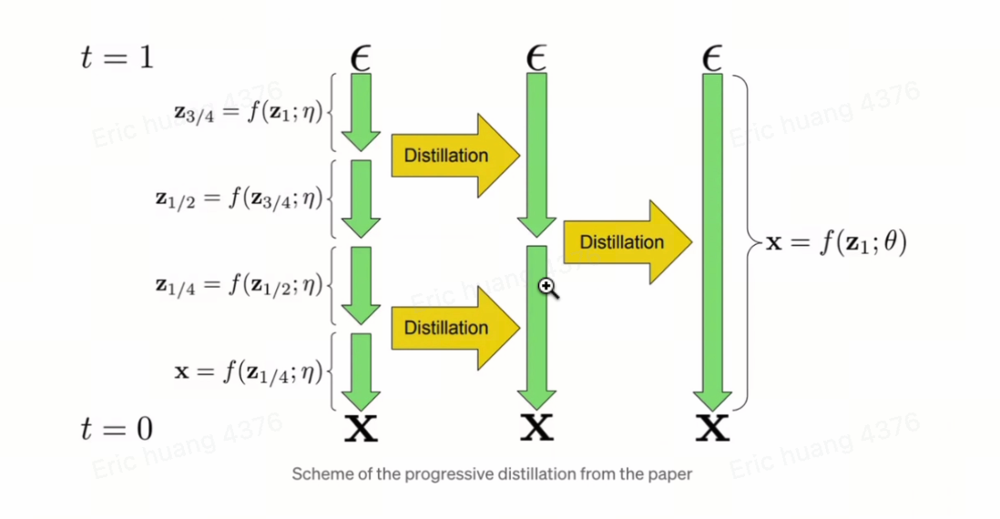

课程：大模型训练https://github.com/mst272/LLM-Dojo


#

# 1. 精度

https://www.bilibili.com/video/BV1mvyLYgEDp/?spm\_id\_from=333.1007.tianma.7-4-26.click\&vd\_source=7edf748383cf2774ace9f08c7aed1476


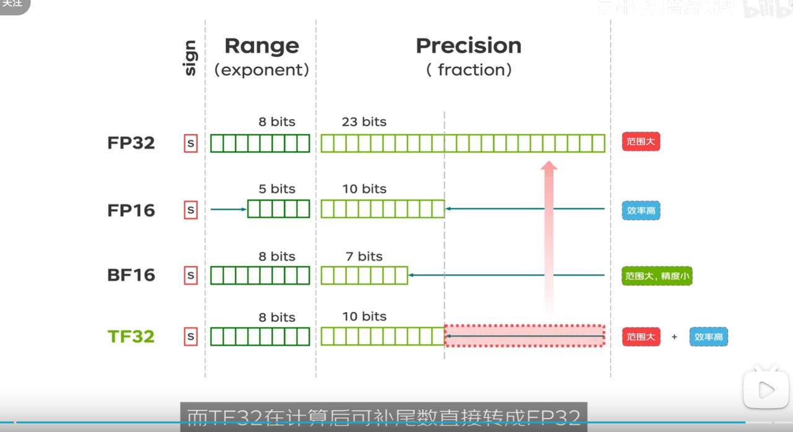

BF是折衷方案。 TF目前已经是torch和tf的默认float type

NVIDIA 定义的 **TF32** 不是一个新的 IEEE 浮点标准，而是 **FP32 截断后的近似表示**。
&#x20;它保留：

* **1 bit 符号位**（跟 FP32 一样）

* **8 bit 指数位**（跟 FP32 一样）

* **10 bit 尾数位**（把 FP32 的 23 位 mantissa 截断到 10 位）

也就是说：

* TF32 = 1 + 8 + 10 = **19 位有效信息**

* 剩下的 **23 - 10 = 13 位 mantissa** + **额外 padding** 直接被丢掉或置零

* 但是 **存储和计算时仍然用 32 位对齐**，因为 GPU 硬件里都是 FP32 通道，只是尾数精度不再完全使用。

常见 FP8 格式

| **格式**   | **Sign 位** | **Exponent 位** | **Fraction 位（mantissa）** | **偏移量（bias）** | **说明**                 | 例子                                                                                                                                                                               |
| -------- | ---------- | -------------- | ------------------------ | ------------- | ---------------------- | -------------------------------------------------------------------------------------------------------------------------------------------------------------------------------- |
| **E4M3** | 1          | 4              | **3**                    | 7             | 4 位指数，3 位尾数（精度更高，范围较小） | 1.000 (十进制 1.0)1.001 (十进制 1.125)1.010 (十进制 1.25)1.011 (十进制 1.375)1.100 (十进制 1.5)1.101 (十进制 1.625)1.110 (十进制 1.75)1.111 (十进制 1.875)在 1.0 到 2.0 之间，它只能表示这 8 个数，其他的小数都得四舍五入到最接近的一个。 |
| **E5M2** | 1          | 5              | **2**                    | 15            | 5 位指数，2 位尾数（范围更大，精度较低） | 1.00 (十进制 1.0)1.01 (十进制 1.25)1.10 (十进制 1.5)1.11 (十进制 1.75)**意思是：** 在 1.0 到 2.0 之间，它只能表示这 4 个数，精度比 E4M3 还差一倍。                                                                     |

bf8和int8之间的差异

1. bf8单纯的牺牲精度

2. 而int 8 则为映射，比如影视fp16的\[-65504- 66504]映射到8个bit上

一个端到端的小算例

设输入向量 `x_float = [1.511, -0.42]`，权重 `w_float = [0.31, 0.77]`
&#x20;选择：

* `scale_x = 0.3`（表示 **1 个 int8 单位 ≈ 0.3 浮点单位**。）&#x20;

* `scale_w = 0.01`&#x20;


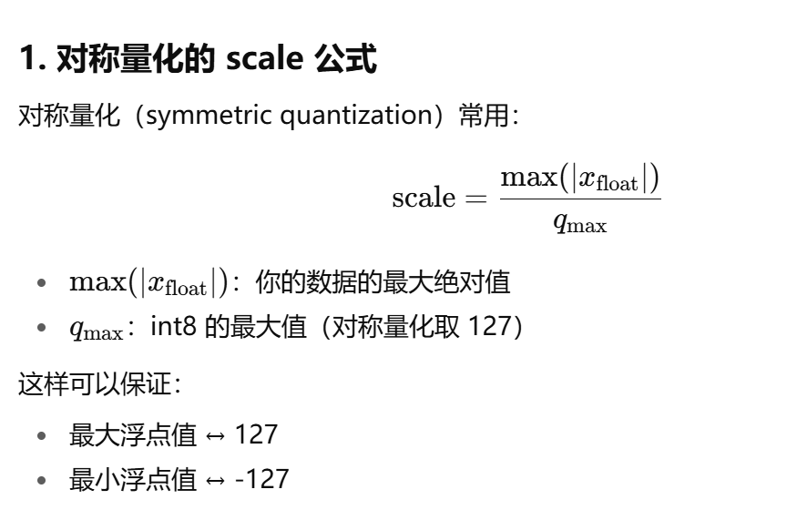

xfloat对于`[1.511, -0.42]`则为1.511

* `x_int = [round(1.511/0.3 = 5.036)=5, round(-0.42/0.3= -1.4)=-1]`

* `w_int = [31, 77]`

内核计算（int8→int32累加）：

* `dot_int = 5*31 + (-1)*77 = 155 - 77 = 78`
  &#x20;反量化（合并缩放）：

* `y_float ≈ dot_int * (scale_x * scale_w) = 78 * (0.3 * 0.01) = 78 * 0.003 = 0.234`

与你直接用浮点点积（1.511\*0.31 + (-0.42)\*0.77 ≈ 0.468 + (-0.3234) ≈ **0.1446**）相比，会有误差，这就来自量化逼近、四舍五入与刻度限制。通过**更好的 per-channel scale、校准、bias 在高精度里加**等方式，误差一般能控制到可接受范围。

# 2. 常见loss

https://zhuanlan.zhihu.com/p/668862356
实现的代码也有

## 2.1 Max-Margin Contrastive Loss

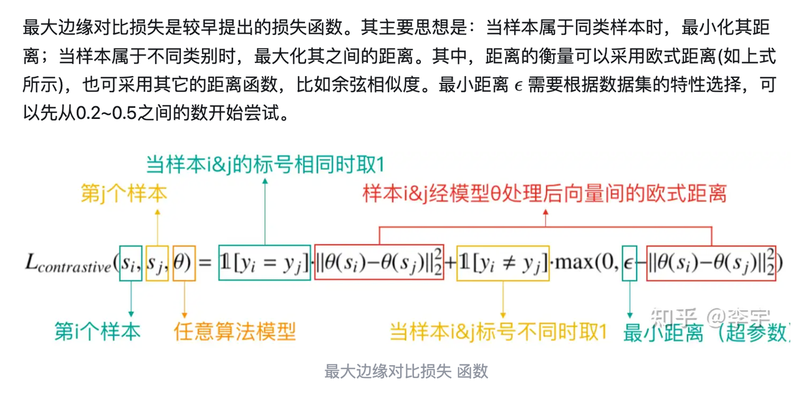

## 2.2 Triplet Loss

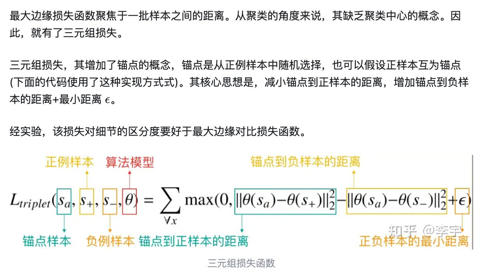

## 2.3 N对多分类损失（N-Pair Multi-Class Loss）

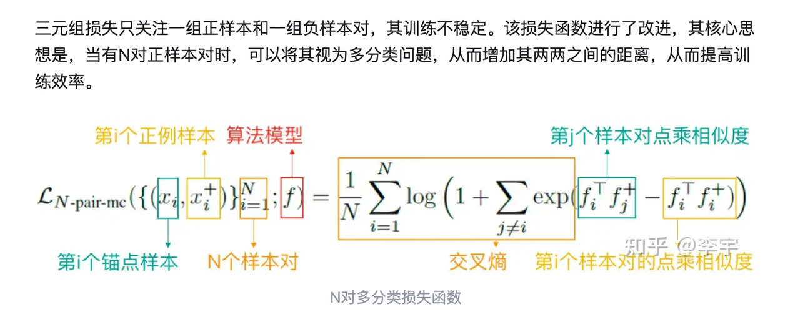

## 2.4 InfoNCE损失

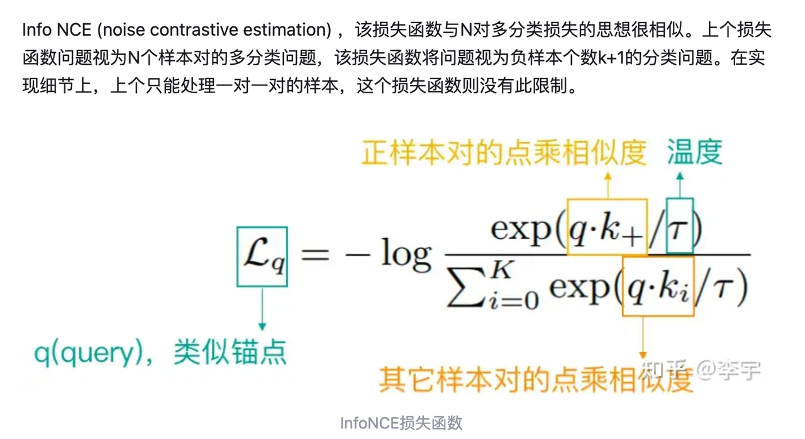

## 2.5 Facol loss

1. 首先是cross entropy

$$L=-\sum{y_ilog(p_i)}$$

* Facol loss

$$L=-\sum{y_ilog(p_i)}（1-p_i）^\lambda$$

\lambda是一个超参数，当模型对一个y=1的分类特别自信时，我们降低他的loss，如果不自信的话，我们增加（1-p）倍的loss。

# 3. 激活函数

## 3.1 Relu


## 3.2 SwiGLU

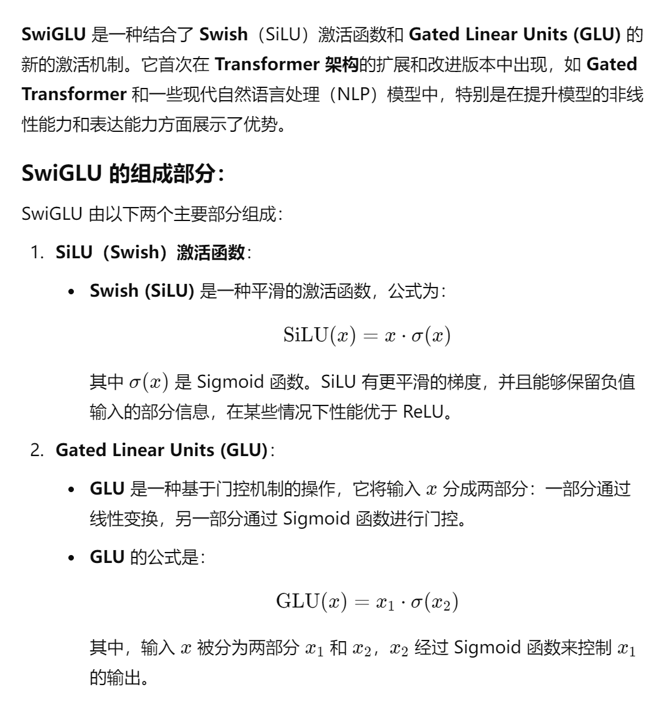

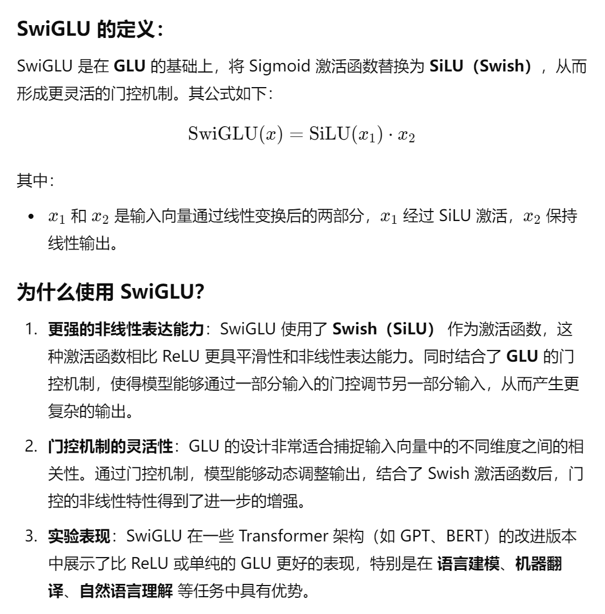

```plain&#x20;text
import torch
import torch.nn as nn

class SwiGLU(nn.Module):
    def __init__(self, input_dim, hidden_dim):
        super(SwiGLU, self).__init__()
        # Linear layers to split input into two parts
        self.fc1 = nn.Linear(input_dim, hidden_dim)
        self.fc2 = nn.Linear(input_dim, hidden_dim)

    def forward(self, x):
        # Apply the linear layers to split input
        x1 = self.fc1(x)
        x2 = self.fc2(x)
        
        # SiLU (Swish) activation on x1 and gate with x2
        return torch.nn.functional.silu(x1) * x2

# Example usage
input_tensor = torch.randn(16, 128)  # Batch size 16, input dim 128
swiglu_layer = SwiGLU(128, 256)  # Example: input 128, hidden size 256
output_tensor = swiglu_layer(input_tensor)
print(output_tensor.shape)

```

## 3.3 SiLU

SiLU(x) = sigmold(x) \* x = 1/(1+e^(-x)) \* x


# 4. 范数 norm

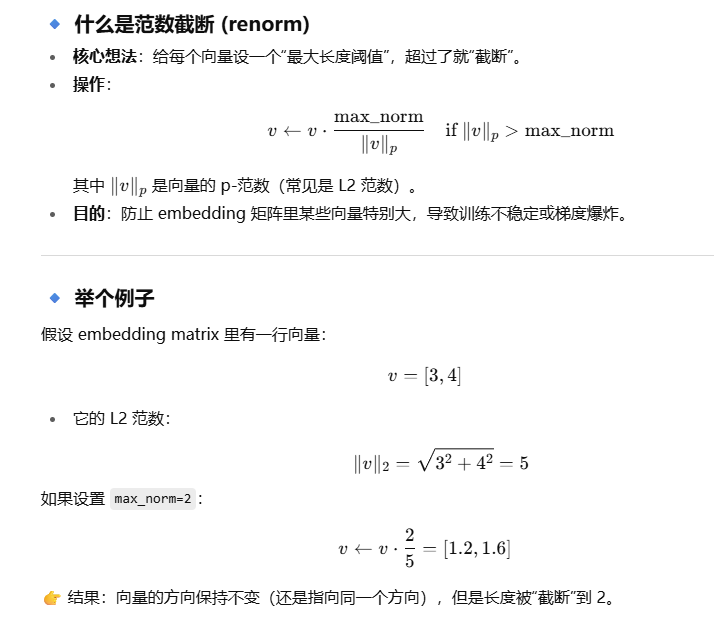

# 5. 均值，方差，归一化

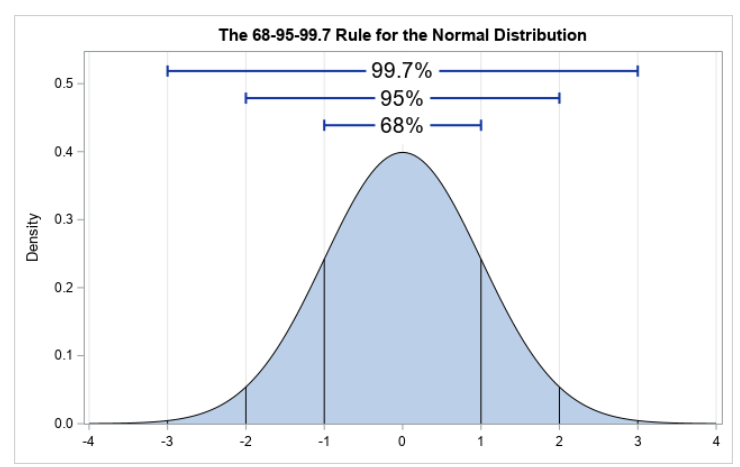

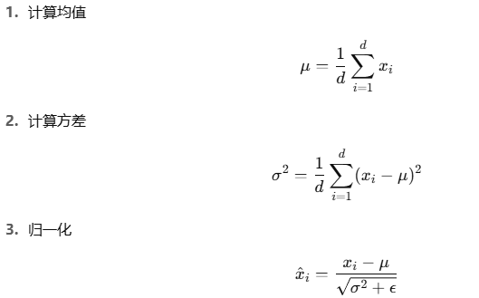

归一化均值0，方差1

# 6. Normalization + standardization


## 6.1 标准化 Standardization

1. 1\. **Standardization (Z-score 标准化)**

* **目标**：把数据调整为均值 = 0，标准差 = 1。

* **结果**：分布被重新拉伸/平移，但**向量长度（L2 范数）不会固定**。

* **作用范围**：通常在数据预处理阶段（整份数据集）。

* ✅ 关键词：**只管分布，不管长度**。

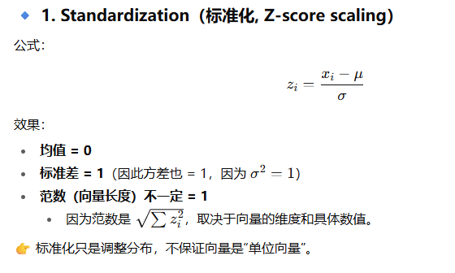

* 但并不是正态分布。

  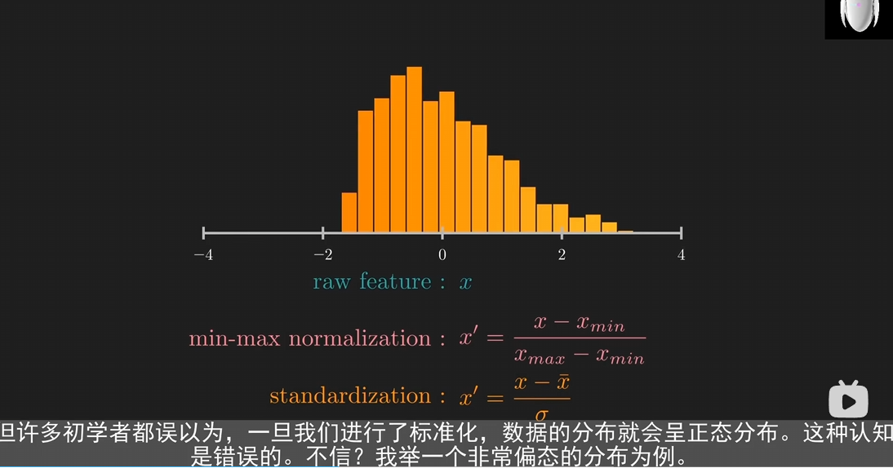

## 6.2 l2 Normalization

**不是保证范数=1**，而是保证：

* **均值** ≈ 0

* **方差** ≈ 1

和layernorm等不同

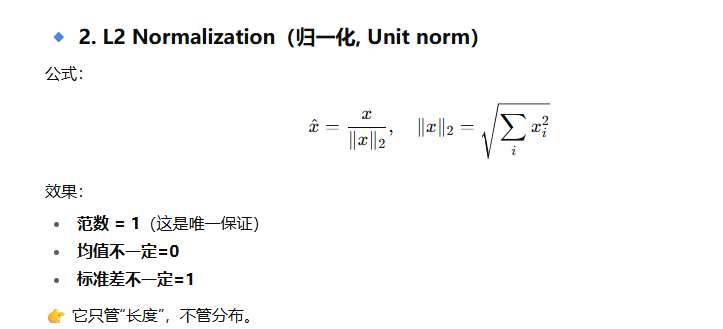


**L2 Normalization (向量归一化)**

* **目标**：把一个向量缩放到范数 = 1（unit vector）。

* **结果**：只改“长度”，不改“分布形状”（均值、方差随便）。

* **作用范围**：embedding 相似度（CLIP、检索）。

* ✅ 关键词：**只管长度，不管分布**。

Minmax **Normalization&#x20;**：

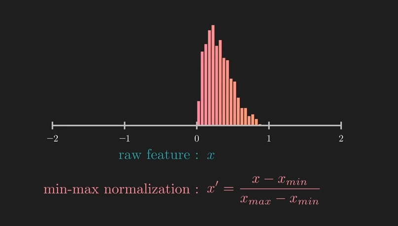

1. 如何使用？

   一般用于Embedding（比如 CLIP 的图像/文本向量、word2vec、句子向量）主要用来 **计算相似度**。

   * 相似度通常是 **余弦相似度 (cosine similarity)**

   * 如果 embedding 不做归一化，不同向量的**长度**会干扰相似度。

   * **L2 Normalization** 把每个 embedding 拉到单位长度（norm=1），这样余弦相似度就只看 **方向**，不受向量大小影响。

   * **Standardization (均值0, 方差1)** 并不能保证“长度一致”，所以用它来算相似度会不稳定。

   👉 所以：

   * **embedding → L2 normalization** ✅（适合比较相似度）

   * **embedding → standardization** ❌（没解决向量长度问题）

   例子：

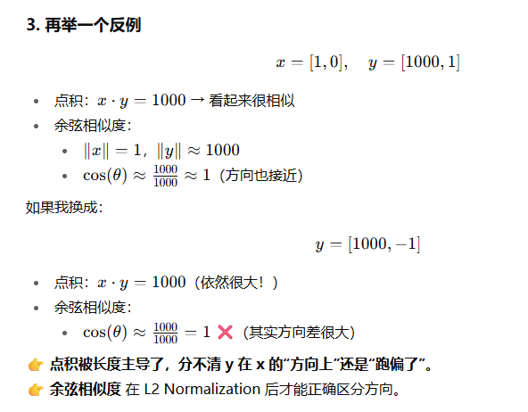

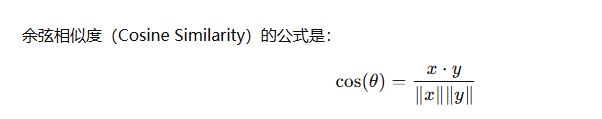

## 6.3 normalization和standardization的差距


🔹 为什么名字容易混？

* “Normalization” 在 **机器学习传统语境** = 把向量长度缩放（L1/L2 Norm）。

* “Normalization” 在 **深度学习层语境**（BatchNorm/LayerNorm） = 做分布标准化。

也就是说：

* **数据预处理**里，normalization 可能指 **Min-Max** 或 **L2 norm**；

* **网络层**里，normalization 几乎等同于 **standardization（均值0方差1）**。

他们有什么区别？

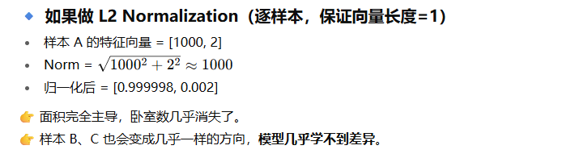

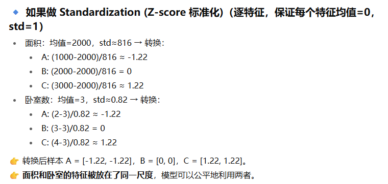

## 6.4 **BatchNorm / LayerNorm**

* 这类“Normalization”其实不是在说 L2 Norm，而是指 **分布标准化**。

* **BatchNorm**：对一个 mini-batch 的每个特征维度做均值=0、方差=1 的缩放。

* **LayerNorm**：对单个样本的所有维度做均值=0、方差=1 的缩放。

* 两者都属于 **standardization 的变体**，但加了可学习的 γ,β\gamma, \betaγ,β，所以分布能“伸缩”。

* ✅ 关键词：**改分布（均值0，方差1），不是改长度**。

## 6.5 **BatchNorm&#x20;**


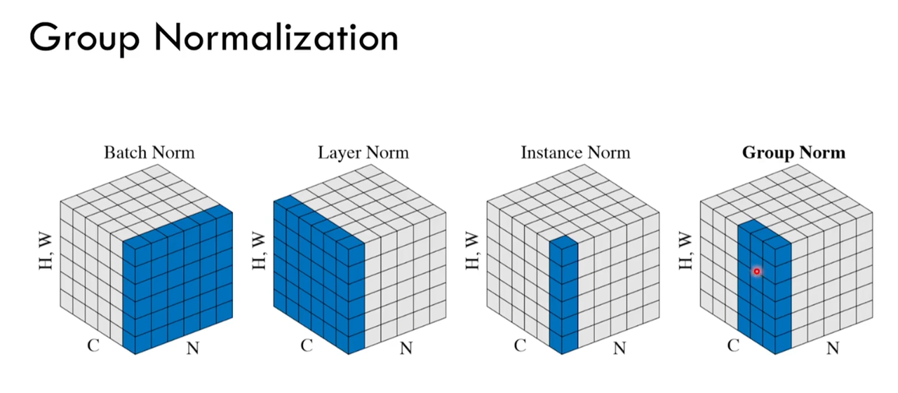


**图像分类、目标检测、语义分割**等任务中，Batch Normalization 非常常用。

在 CNN 中，特征通常是**二维卷积特征图**（例如 `(batch_size, channels, height, width)`），BN 对**每个通道**的特征进行归一化，计算每个通道在整个批次中的均值和方差。

这些任务通常使用大批次进行训练，BN 可以很好地利用每个批次的统计信息来平衡每个通道的特征值分布，保持均值和方差稳定，从而使得模型收敛更快。

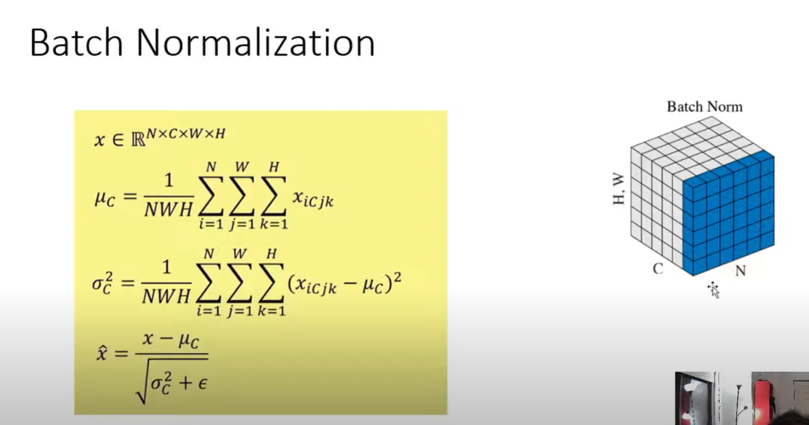

## 6.6 Layernorm

注意在nlp和image的情况下，normalize的维度是不一样的

处理句子时：**Layer Normalization** 在这里**只会在 `embedding_dim`（即特征维度）上做归一化**，与其他单词（即序列中的不同时间步）之间是没有关系的。

```sql
        >>> # NLP Example
        >>> batch, sentence_length, embedding_dim = 20, 5, 10
        >>> embedding = torch.randn(batch, sentence_length, embedding_dim)
        >>> layer_norm = nn.LayerNorm(embedding_dim)
        >>> # Activate module
        >>> layer_norm(embedding)
        >>>
        >>> # Image Example
        >>> N, C, H, W = 20, 5, 10, 10
        >>> input = torch.randn(N, C, H, W)
        >>> # Normalize over the last three dimensions (i.e. the channel and spatial dimensions)
        >>> # as shown in the image below
        >>> layer_norm = nn.LayerNorm([C, H, W])
        >>> output = layer_norm(input)

```

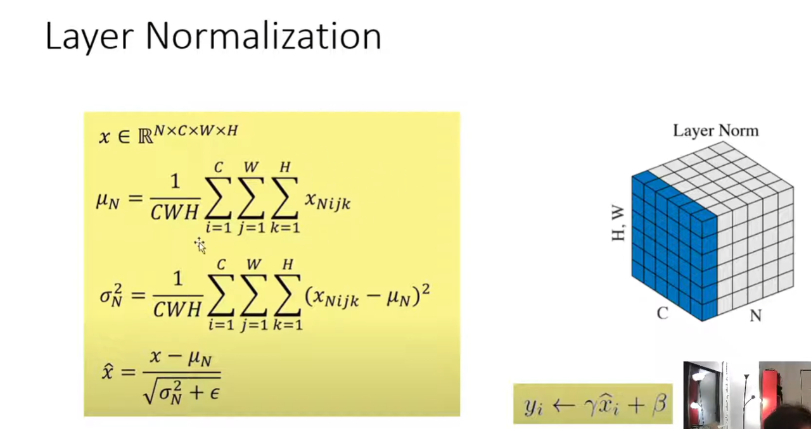

## 6.7 GroupNorm

一般只会在图像中使用，当group为1时，和layernorm在image中的表现是一样的

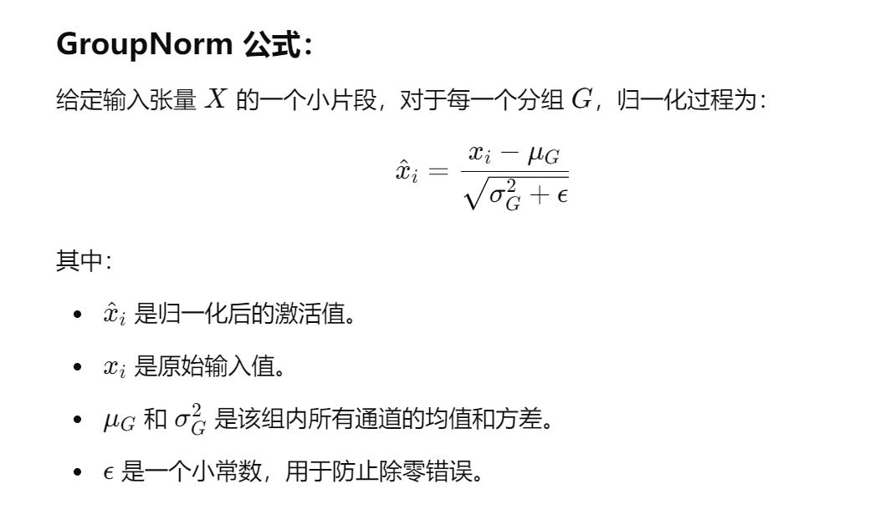

每一个组内的所有点计算均值和方差。或者说不同channel中的点全部加一起计算

```python
import torch
import torch.nn as nn

# GroupNorm with G groups (e.g., G=32), input has C channels
# Example: 32 groups for 128 channels
group_norm = nn.GroupNorm(num_groups=32, num_channels=128)

# Input tensor with shape (N, C, H, W), e.g., (16, 128, 32, 32)
x = torch.randn(16, 128, 32, 32)

# Apply Group Normalization
output = group_norm(x)
print(output.shape)

```

**关于通道维度的位置**

`nn.GroupNorm` 不能直接指定通道所在的维度，它默认认为**通道数位于输入张量的第二个维度**（即形状为 `(batch_size, num_channels, height, width)` 中的 `num_channels`）。

## 6.8 residual

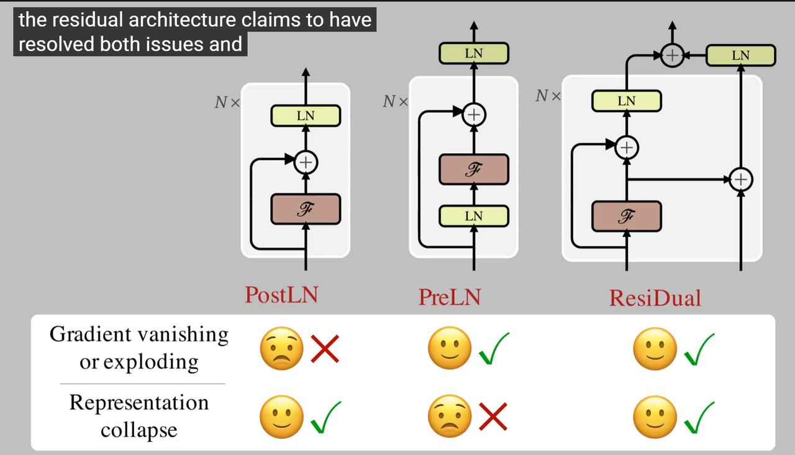

## 6.9 问题

### 6.9.1 为什么transformer用layernorm 不用batchnorm？

1. batchnorm主要用于CNN等视觉任务中。主要是用于每一批数据在每一个channel层面，对整个HW的点值计算normalization，会加速收敛。减轻内部协变量偏移（Internal Covariate Shift）。Batch Normalization 通过对每一层的输入进行归一化，使得每层的输入保持相对稳定的分布（即均值和方差不变）。这样可以减少层与层之间输入分布的变化，从而使得训练过程更加稳定。（隐藏层 2 的输入就是隐藏层 1 的输出。如果隐藏层 1 的输出分布不断变化，隐藏层 2 的输入分布也会不断变化。这样，隐藏层 2 在每次训练时，都要重新适应新的输入分布，导致它的学习变得更加困难。）
   Batch Normalization 可以有效地控制梯度的范围，防止梯度消失或爆炸现象。因为每一层的输入是经过归一化处理的，其分布保持稳定，所以在进行反向传播时，梯度的波动也会被控制在一定范围内。

2. batchnorm不适合处理长序列任务，或者每次token长度都会变化的情况。在 Transformer 的 Decoder 部分中，模型要逐步生成输出，这意味着在每一个生成步骤，输入序列长度会变化。Batch Normalization 无法很好地处理这种动态变化的序列长度。

3. 注意力中，我们计算的是这一个序列之中的相关性，如果计算了batchnorm，不同的sentence可能会对当前的attention造成影响

1) 为什么unet使用groupnorm

   在 U-Net 中，选择 **Group Normalization** 而不是 **Batch Normalization** 的主要原因有：

   1. **小批次训练的适应性**：Group Normalization 不依赖批次大小，因此适用于小批次甚至单样本训练的场景，而 Batch Normalization 依赖于较大的批次来计算均值和方差。

   2. **生成任务对稳定性的要求**：Group Normalization 提供了对每个样本独立的归一化，有助于生成过程的稳定性和一致性。

   3. **灵活性和适应性**：Group Normalization 能够通过调整组数，灵活适应不同层的特征分布。

### 6.9.2 prenorm和postnorm


随着 Transformer 模型的加深（例如 **BERT**、**GPT-3** 等大规模预训练模型，层数可能达到几十甚至上百），研究者们发现 PostNorm 的设计在非常深的网络中存在梯度消失或梯度爆炸的问题，使得训练过程变得更加不稳定。**PreNorm** 的设计则在深度网络中表现得更稳定，因为它将 Layer Normalization 移到变换模块之前，确保了每一层的输入具有更好的标准化特性，有利于梯度的流动。

因此，在现代大规模 Transformer 模型中，**PreNorm** 逐渐成为主流选择。例如，在 BERT 和 GPT 等模型中，Layer Normalization 通常会放在每个注意力模块或前馈网络的输入之前，而不是之后。

以下是原始 Transformer 中子层的计算步骤：

在 **PostNorm** 架构中，每层的计算步骤是：

* 首先，输入经过主变换模块：F(x)

* 然后，变换结果与输入相加（残差连接）：x+F(x)

* 最后，进行 Layer Normalization：LN(x+F(x))

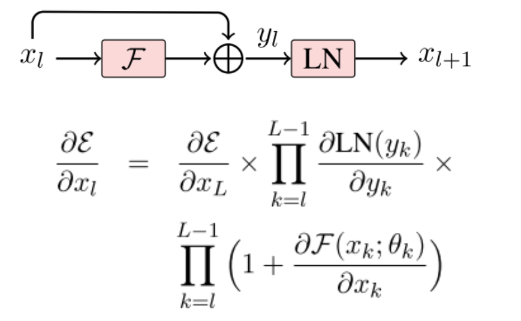

在 **PreNorm** 架构中，每层的计算步骤是：

* 首先，输入先经过 Layer Normalization：LN(x)

* 然后经过主变换模块：F(LN(x))

* 最后，进行残差连接：x+F(LN(x))

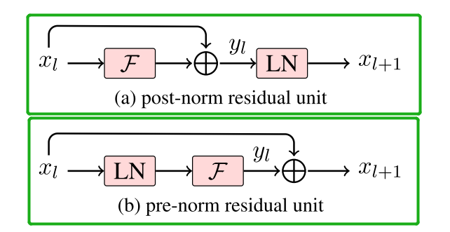


可以发现在反向传播的时候，如果是postnorm，可能一开始的梯度会很大，但是越往前，梯度可能更低。但是如下图，prenorm不管如何都会有一个1的梯度。

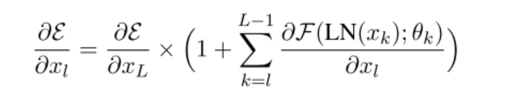

Prelayer norm Pros

1. No more exploding or vanishing gradients

2. No need for warm up stage

3. Fewer hyper parameter

Cons:

1. Representation collapse which lead to pool performance compare to post layernorm

### 6.9.3 为什么要normalization？


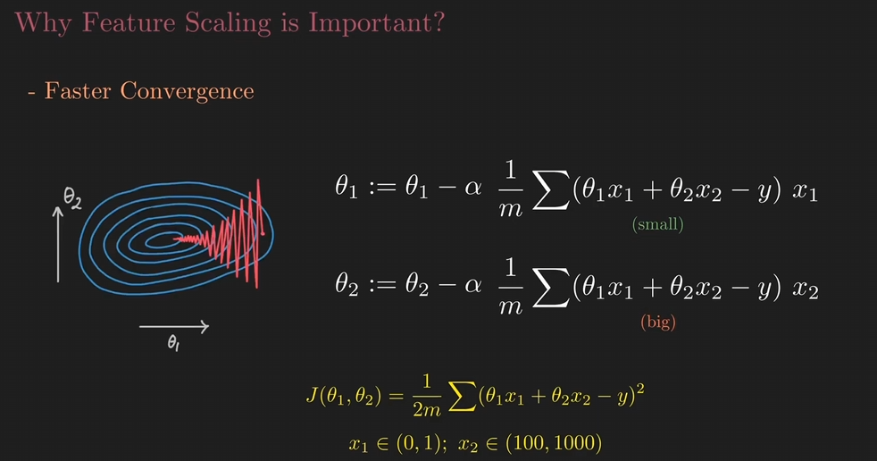

原因是如果x1和x2的差距过大，那么对于θ1和θ2的loss也是不一样的，所以会导致模型下降的震荡

包括knn等算法也是一样

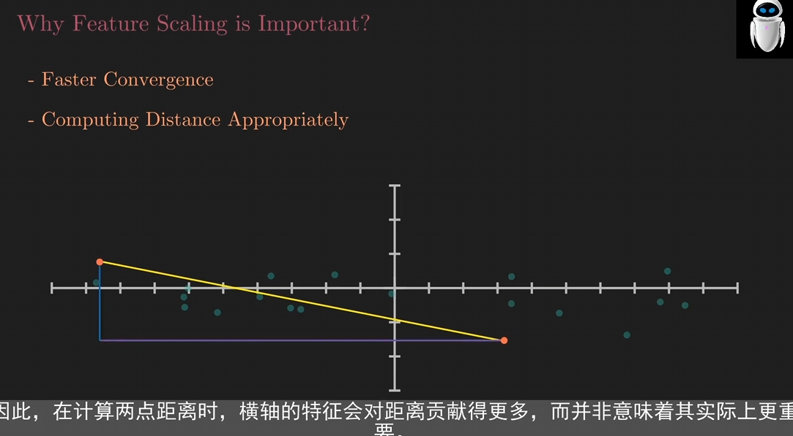

# 7. reshape


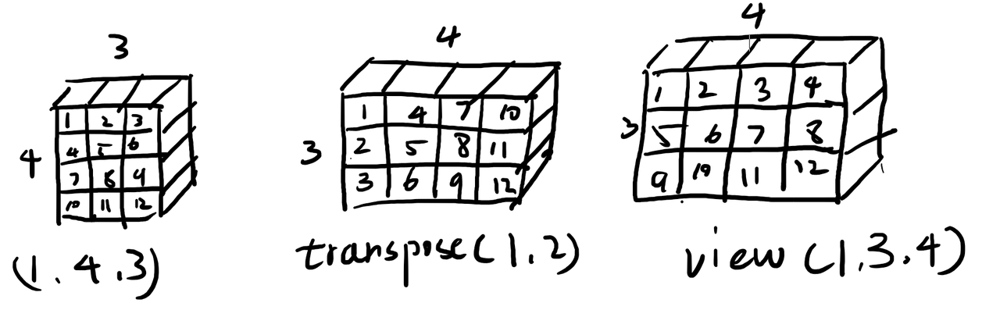

# 8. Convolution

1. Group convolution

[group convolution](https://zhida.zhihu.com/search?content_id=566203637\&content_type=Answer\&match_order=1\&q=group+convolution\&zhida_source=entity)，将feature map的通道进行分组，每个filter对各个分组进行操作即可，像上图这样分成两组，每个filter的参数减少为传统方式的二分之一（乘法操作也减少）。该种卷积应用于ShuffleNet。

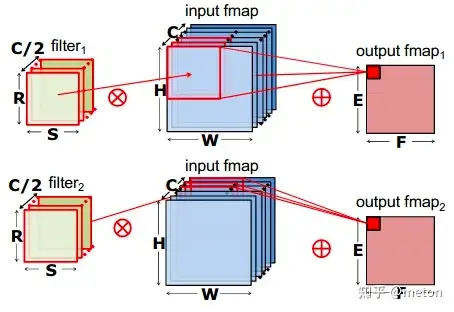

* depthwise convolution

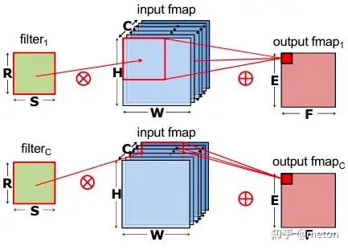

depthwise convolution，是组卷积的极端情况，每一个组只有一个通道，这样filters参数量进一步下降。

# 9. 优化器

https://zhuanlan.zhihu.com/p/208178763

## 9.1 SGD 和 mini SGD

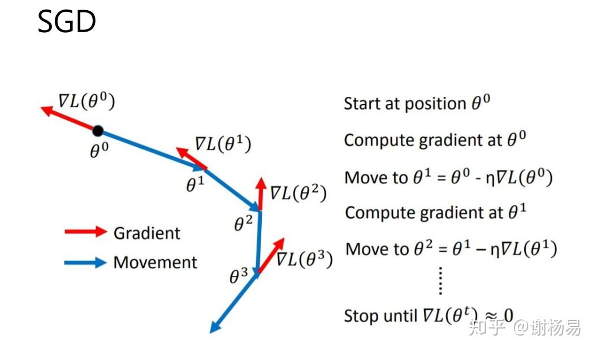

## 9.2 SGDM

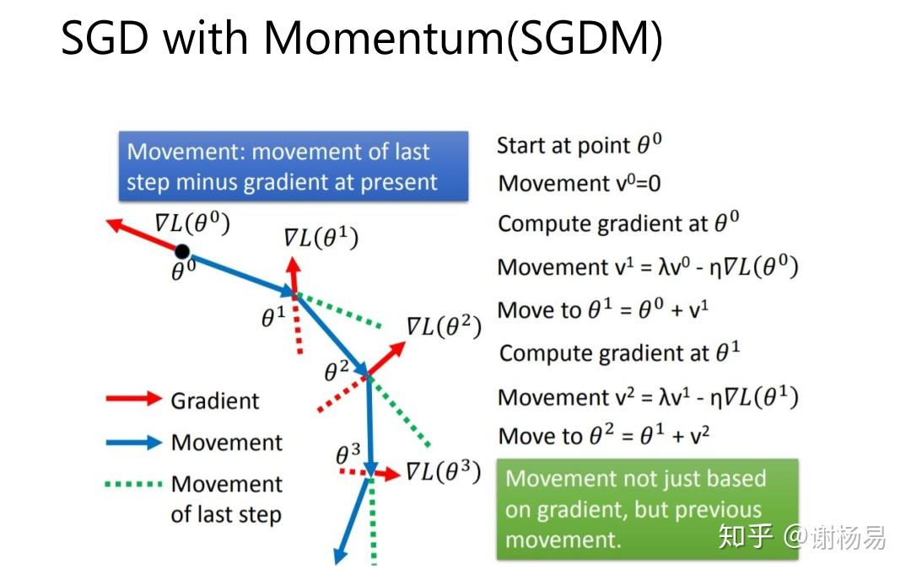

## 9.3 Adagrad

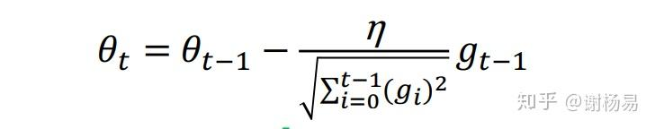

与SGD的区别在于，学习率除以 前t-1 迭代的梯度的[平方和](https://zhida.zhihu.com/search?content_id=134396393\&content_type=Article\&match_order=1\&q=%E5%B9%B3%E6%96%B9%E5%92%8C\&zhida_source=entity)。故称为自适应梯度下降。

Adagrad有个致命问题，就是没有考虑迭代衰减。极端情况，如果刚开始的梯度特别大，而后面的比较小，则学习率基本不会变化了，也就谈不上自适应学习率了。这个问题在RMSProp中得到了修正

## 9.4  RMSProp

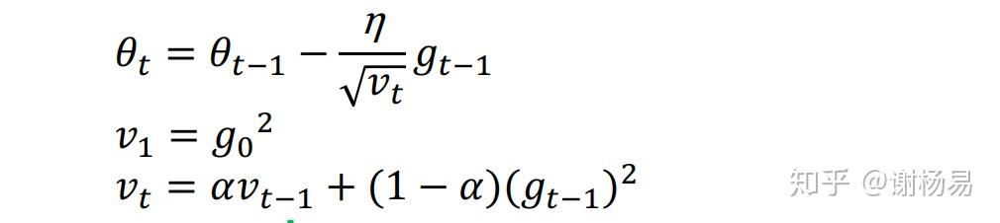

加入了衰减v

## 9.5 Adam


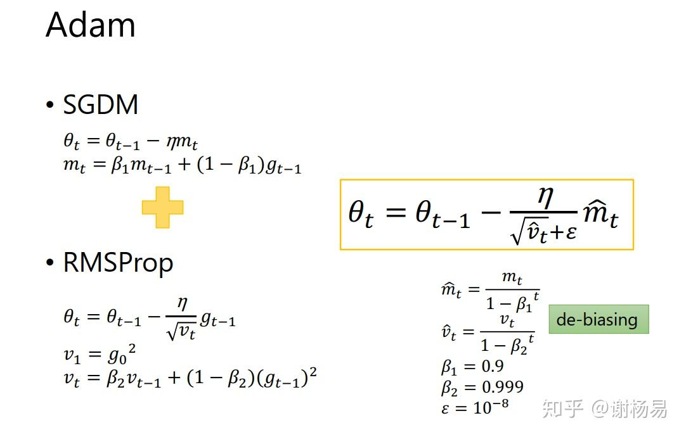

m：平滑的梯度方向，确保参数更新沿着合适的梯度方向。

v：平滑的梯度幅度，动态调整学习率，确保在梯度较大时步伐较小，梯度较小时步伐较大。

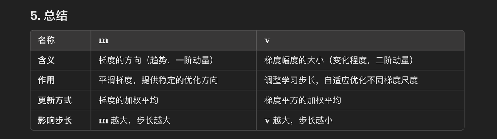

# 10. 生成模型基础

https://www.bilibili.com/video/BV1aE411o7qd/?p=162\&vd\_source=7edf748383cf2774ace9f08c7aed1476

右边前六个属于固定的结构化的生成模型。比如GMM，他不能增加新的层等等，并且只能处理特定问题


后面的采用的是分部表示，并且使用深度学习多一些。

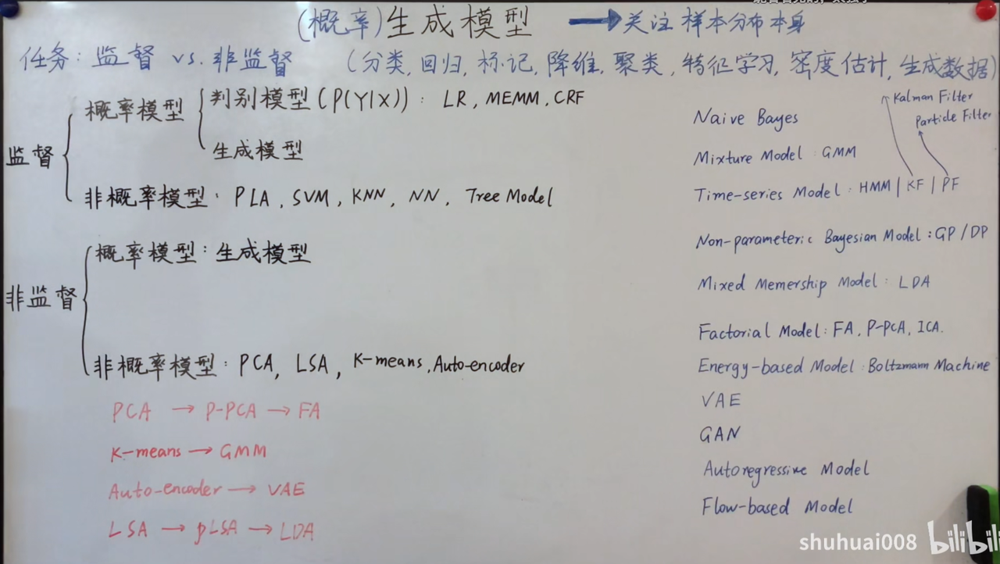

## 10.1 bayes

### 10.1.1 理解

随机试验（random experiment）：在相同条件下，对某[随机现象](https://zhida.zhihu.com/search?q=%E9%9A%8F%E6%9C%BA%E7%8E%B0%E8%B1%A1\&zhida_source=entity\&is_preview=1)进行的大量重复观测。例如抛骰子，观察其点数；抛硬币，看其哪一面向上。

现在有长度为n且按照时间分布的序列，x1,x2,...,xt−1,xt,...,xn

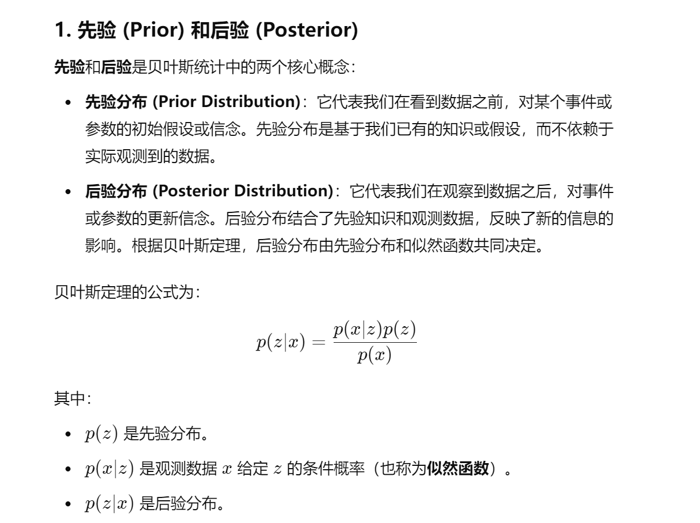

假如有一个动物园有很多动物，我要找马x，提前得知了马的数量比较多，并且我认为棕色z的动物为马的概率最高

1. [先验概率](https://zhida.zhihu.com/search?q=%E5%85%88%E9%AA%8C%E6%A6%82%E7%8E%87\&zhida_source=entity\&is_preview=1)（p(z)根据以往经验和分析得到的概率）：

   1. 我认为p(z)为70%，意味着棕色为马的概率是70%

   2. &#x20;diffusion中q(xt|xt−1)，给定前一时刻的xt−1预测当前时刻xt的概率

2. 似然函数p(x|z)

   1. 我们找了一些棕色的动物，实际查看马的数量，然后算一个总体的概率

3. 边缘概率p(x)

   1. 在所有动物园里面，马占了50%

4. [后验概率](https://zhida.zhihu.com/search?q=%E5%90%8E%E9%AA%8C%E6%A6%82%E7%8E%87\&zhida_source=entity\&is_preview=1)（p(z|x) 指在得到结果的信息后重新修正的概率）：

   1. 知道动物是棕色的情况下，这只动物是马的概率

   2. diffusion中 p(xt−1|xt)，给定当前时刻的xt预测当前时刻xt−1的概率


### 10.1.2 变换

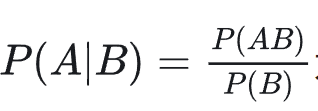


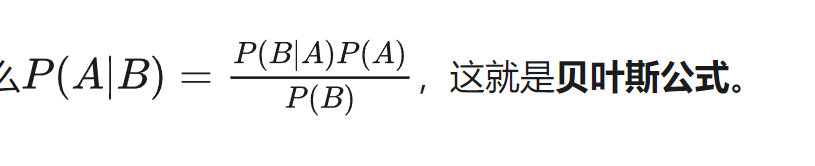

所以A里面发生B和B里面发生A的概率是一模一样的

P(A|B)P(B) = P(B|A)P(A)


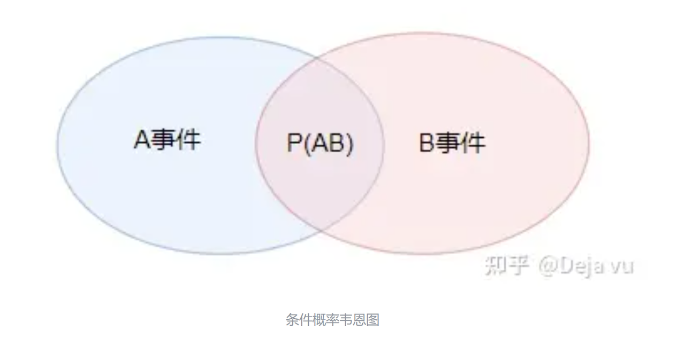

如果多一个C

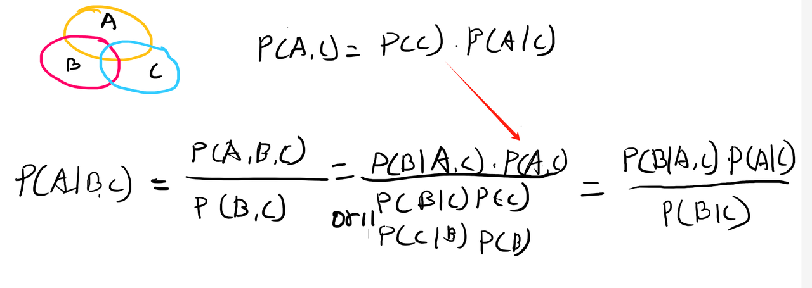

### 10.1.3 边缘化marginal likelihood/evidence：

为什么要边缘化？

边缘化的目的是为了简化问题，或者说，只关注那些我们感兴趣的变量。例如，在一些复杂的概率模型中，我们可能不关心所有变量的联合分布，而只需要知道某个特定变量的分布，这时我们就可以通过边缘化其他变量来简化问题。


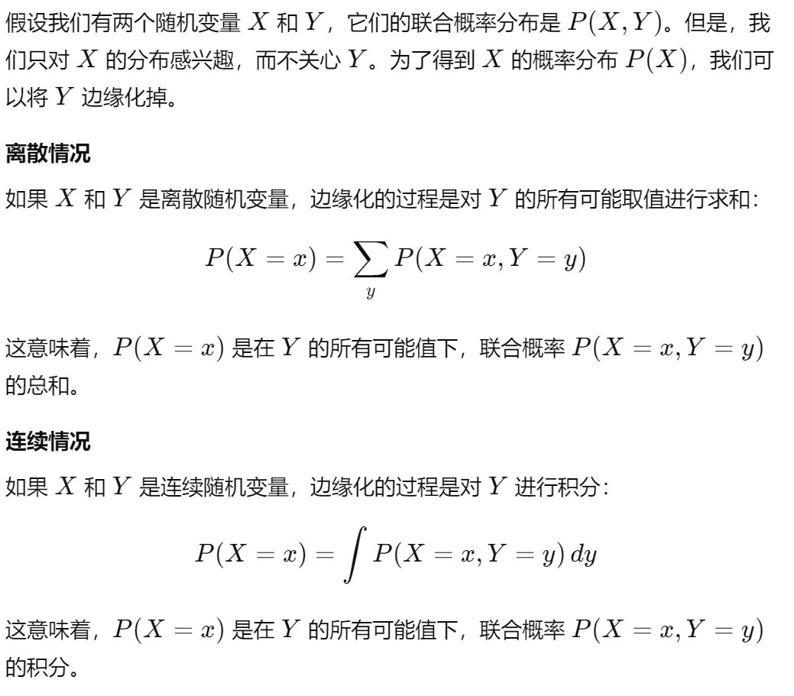

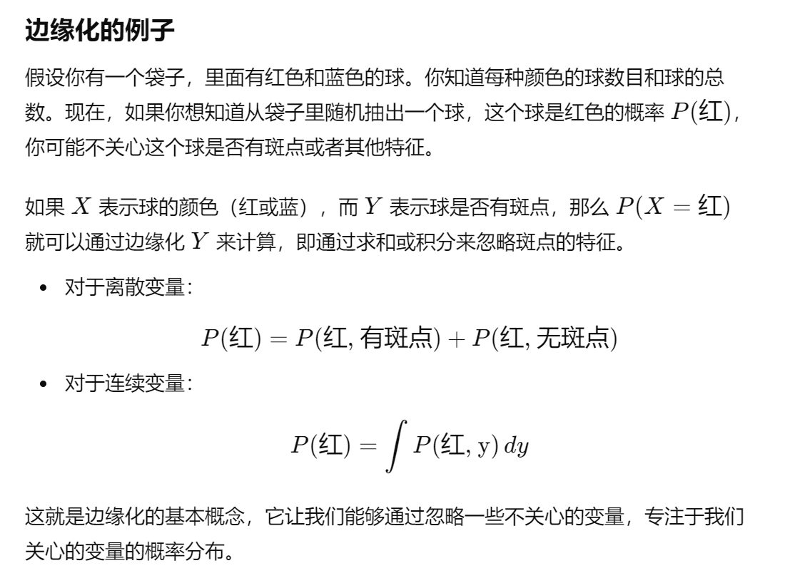


例子2

假如我们有一堆joint probability p(x,z)，假如

https://www.youtube.com/watch?v=qJeaCHQ1k2w

我们如果相求p(z=5)的概率的话，如下图所示，就是全部的p(x,5)的概率值相加，如果是连续的话，就是求积分

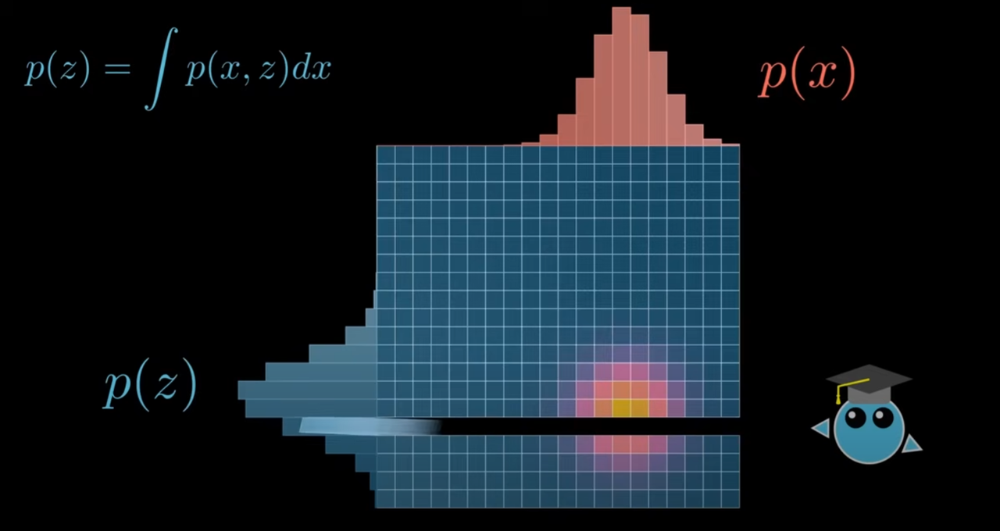

### 10.1.4 p(x)如何求？

1. 一个就是使用marginal likelihood求，但是一般无解，所以我们使用引入一个**变分分布/变分推断** **q(z|x)**，来逼近真实后验 **p(z|x)**

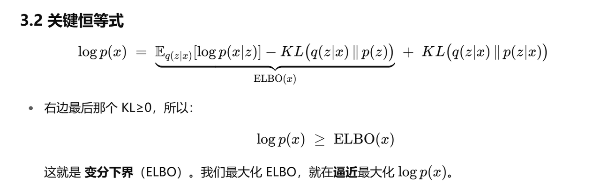

所以我们从求p(x)变成了求后面这一大串

### 10.1.5 实际解决方案/例子

#### 10.1.5.1 Grid search

##### 10.1.5.1.1 不训练更新

1. 问题定义

* 参数向量：θ=(θ1,θ2，。。。)=(kv\_cache\_block,max\_batch\_token)

* 性能指标：吞吐量 t，我们观测到的值带噪声。

* 模型假设：

p(θ∣t)∝p(t∣θ)p(θ)&#x20;

也就是求最大化p(θ∣t)，可以用argmax MAP来求

* map定义

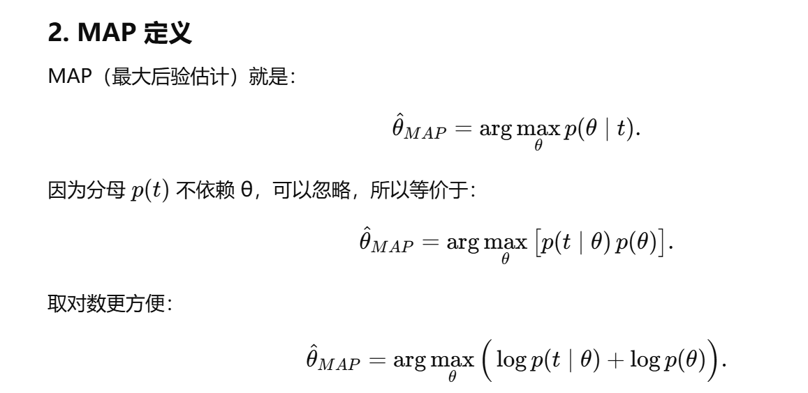

* map如何更新


* f(θ)如何选择

直接线性回归简单算一下


* 循环

当我们优化结束后，可以得到当前最优θ，然后再用这个θ跑一边推理，看看最新的throughput，然后在丢到模型里面算一遍得到θ+1

##### 10.1.5.1.2 一边训练一边更新


### 10.1.6 问题

1. 有没有可能我直接用一个q(x)来直接逼近p(x)不用elbo+kl呢？

   **可以**：如果你愿意，可以直接学 q(x)来近似 p(x)，这就变成“直接生成模型”，比如 PixelCNN、GPT。

   **但 VAE 不这样做**：因为 VAE 想要**潜变量表示 + 高效采样**，并且 decoder 的建模更简单。

   所以 ELBO+KL 不是数学上的必需，而是为了解决“带潜变量的边际似然不好算”。

2. 什么时候关注p(x) 边际似然?

   1. 训练/评估 **VAE**、**变分推断**、**生成模型**时：
      &#x20;我们必须以 log⁡p(x)为核心（即最大化似然，或它的下界 ELBO）。

   2. 做 **模型比较**：选哪个潜变量模型更好，需要比较谁的边际似然大。

   3. 做 **理论推导**：研究收敛性、KL 收敛、变分分布和真后验的差距。


## 10.2 概率密度函数pdf


## 10.3 期望

#### 10.3.1 定义


比如q可以是高斯概率密度函数，当u=0的时候，那么E\[x] = 0。我们从q中取z的概率，得到q(z)，由于总体概率为1，所以我们要计算的就是在不同z的情况下，z出现的概率 \* f (z)的值


q(z1) = 1/6， q(z2) = 1/6


q(z1) = 0.3， q(z2) = 0.7


#### 10.3.2 如何判断f(x)


#### 10.3.3 应用到vae


#### 10.3.4 方差


#### 10.3.5 行列式


可以用于判断当前矩阵A乘其他矩阵B，会平均放大到|A|倍。可以理解成全局的平均放大即可


那么总体就是放大2 \* 2 - 0\*0 = 4 倍


#### 10.3.6 协方差

$$Cov(X,Y)=E[(X−μX)(Y−μY)]$$

#### 10.3.7&#x20;

## 10.4 分布

1. p(θ)的含义

* **p(x∣θ)**：描述在参数为 θ时，观测到数据 xxx 的概率（由似然函数决定，比如高斯、伯努利等）。

* **p(θ)**：描述我们对参数 θ 本身的先验信念（即「θ会取哪些值，以及它们的可能性」）。


* &#x20;和隐变量 z 的区别

**z**：是数据的隐变量（例如 VAE 里的 latent code）。

**θ**：是模型的参数，通常固定在训练中学到的值，但在贝叶斯学习中，我们给它一个分布（先验 + 后验）。


* 高斯先验 vs Beta 先验

**高斯先验**（常见于连续参数）
&#x20;例如：

$$p(θ)=N(0.2,3^2)$$

→ 表示我们认为「θ的平均值在 0.2 左右，但可能在 \[−9,9]范围内波动」，概率由正态分布决定。

**Beta 先验**（专门用于概率参数 θ∈\[0,1]）
&#x20;例如：

$$p(θ)=Beta(3,8)$$

→ 表示「我们认为抛硬币正面的概率更可能接近 3/(3+8)=0.27，但也允许它在 \[0,1]区间变化」。


* 如何使用

- 如果 θ 是「概率（0–1 区间）比如只有两类」 → 用 **Beta**

- 如果 θ 是「类别概率向量」 → 用 **Dirichlet**

- 如果 θ 是「连续实数」 → 用 **高斯分布**


#### 10.4.1 Bernoulli 分布

1. 定义

伯努利分布描述 **一次只有两种结果的随机实验**（0 或 1）。

$$X∼Bernoulli(θ)$$

其中：

* P(X=1)=θ

* P(X=0)=1−θ

* 参数：θ（成功的概率）。

👉 举例：

* 抛硬币：正面 = 1，反面 = 0

* 打疫苗：成功 = 1，失败 = 0

* 开关：开 = 1，关 = 0


* 概率质量函数 (PMF)

$$p(x∣θ)=θ^x(1−θ)^{1−x},x∈{0,1}$$

* 如果 x=1：结果是“正面”，概率 = θ

* 如果 x=0：结果是“反面”，概率 = 1−θ


* 参数和期望

- 参数：θ（成功的概率）。

- 期望：E\[X]=θ

- 方差：Var(X)=θ(1−θ)

👉 直观：平均值就是“成功的概率”。


* 和 Beta 的关系

- **伯努利分布**：描述观测结果 x（0 或 1）。

- **Beta 分布**：描述参数 θ（成功的概率）的不确定性。

在贝叶斯框架里：

* 先验：θ∼Beta(α,β)

* 数据：x∼Bernoulli(θ)

* 后验：θ∣x∼Beta(α+x,β+1−x)

👉 这就是「Beta 是 Bernoulli 的共轭先验」。

直观比喻

* 伯努利：一次试验的结果（0 或 1）。

* Beta：我们对「0/1 发生概率」的信念分布。


#### 10.4.2 beta分布

1. Beta 分布的直观含义

* **Beta(α, β)** 可以看成：在看到真实数据之前，我们“假想”已经看过了：

  * α−1次正面

  * β−1次反面

👉 所以它像是 **“虚拟样本”**，表达我们对硬币概率的先验信念。

***

* 举例说明

- **Beta(1,1)**：相当于“我没看到过任何硬币结果”。完全均匀，不偏不倚。

- **Beta(2,1)**：相当于“我假装之前看过 1 次正面，0 次反面”，所以更偏向正面。

- **Beta(8,4)**：相当于“我假装之前看过 7 次正面，3 次反面”，所以更相信正面概率 ≈ 0.7。


**Beta(1,1)** → 蓝色直线，均匀分布（完全不知道 θ，所有值等可能）。「我对 θ 没有任何偏好」。

**Beta(2,2)** → 橙色弧线，中间（0.5）概率大，代表“更相信硬币接近公平”。「我认为 θ 接近 0.5 更可能，但 0.2、0.8 也不是不可能」。

**Beta(1,2)** → 绿色直线，往 0 偏，说明“更相信 θ 小”，也就是更可能反面。「我认为 θ 更可能在 0.2-0.3 区间」。


* 应用到*Bayes*


当我们继续抛了几次硬币得到了3次正面，2次下面，那么就是p（θ）为beta(3,2)


## 10.5 极大似然估计 MLE&#x20;

[(系列二) 数学基础-概率-高斯分布1-极大似然估计\_哔哩哔哩\_bilibili](https://www.bilibili.com/video/BV1aE411o7qd/?p=3\&vd_source=7edf748383cf2774ace9f08c7aed1476)


这个**μ**和**Σ就是我们需要求的参数，**&#x6211;们找到一个u和σ，然后在这个mean和standardized deviation基础上，p(x)出现的概率最大。但是这里的σ是有偏估计，需要修正（暂时不懂，也不需要花时间弄懂其实）


1. **什么是无偏估计量？**

无偏估计量是指估计值在很多次重复抽样中的平均值（即期望值）等于总体的真实值。换句话说，无偏估计量在长期来看不会系统性地高估或低估总体参数。

**简单例子：**

* 假设我们要估计一个班级中所有学生的平均身高（真实的总体均值是 μ）。

* 我们随机抽取10名学生，测量他们的身高，然后计算样本均值 μ^hat。

* 如果我们重复多次抽取10名学生，每次都计算样本均值 μ^hat，那么这些样本均值的平均值就应该接近于班级所有学生的真实平均身高 μ\muμ。

* 这个样本均值 μ^hat 就是一个**无偏估计量**，因为在多次抽样中的平均值等于真实值。

- **什么是有偏估计量？**

有偏估计量是指估计值在很多次重复抽样中的平均值不等于总体的真实值。也就是说，有偏估计量会系统性地高估或低估总体参数。

**简单例子：**

* 假设我们要估计一个班级中所有学生的平均身高，但这次我们使用了一种有偏的抽样方法，比如只选择较高的学生来计算样本均值 μ^biased。

* 如果我们重复多次抽取较高的学生，每次都计算样本均值，那么这些样本均值的平均值会高于班级所有学生的真实平均身高 μ

* 这个样本均值 μ^biased就是一个**有偏估计量**，因为在多次抽样中的平均值系统性地高于真实值。

- **直观理解：**

* **无偏估计量**：在长期来看，估计值不会系统性地偏离总体的真实值。每次抽样都可能高于或低于真实值，但平均来看，它们正好等于真实值。

* **有偏估计量**：在长期来看，估计值系统性地偏离总体的真实值。每次抽样的结果可能都倾向于高估或低估真实值，因此它们的平均值与真实值不相等。


#### 1. 求解过程


#### 10.5.2 极大似然到KL


并且求导时，常数项为0


#### 10.5.3 KL 从entropy的角度出发

Entropy, Cross-Entropy, KL-Divergence：https://zhuanlan.zhihu.com/p/148581287


1. 公式

| 名称                | 公式                                                                                |
| ----------------- | --------------------------------------------------------------------------------- |
| **数据自身的香农熵**      |                                                                                   |
| **模型词表分布熵**       | 只是模型“自信度”侧指标；\<br>可能 ↑ 也可能 ↓。它不是被直接优化，只是随参数变化被动改变。                                |
| **交叉熵 / 负对数似然**   | 目标函数。\<br>MLE/EM 每一步都在让它 \*\*↓\*\*；等效于在减小 KL 散度。\<br>因为  恒定，所以实际就是让 \*\*KL ↓\*\*。 |


* 解释：


Y就是bit的数量


总结：

1. entropy越大，平均信息越少，但是总量信息是不变的，有用的信息会随着entropy增大而减小。

2. KL越接近0，说明两个信息的提供方提供的平均信息量是一样的（就是抛色子，一共六个面，就是softmax后的结果最终维度为6，然后这6个面的每一个面的熵的合 再除以平均值）

## 10.6 极大后验估计 MAP


如果说极大似然估计是估计 argmax p(x|θ)的话。那么极大后验估计就是最大化p(x|θ)p(θ)


### 10.6.1 p(X|θ)p(θ)都是高斯分布

1. 先验p(θ)

   

2. 似然p(X|θ)


* 合并并计算


* 求导


注意这里的u0，&#x3C4;**^2**为先验 是已知的

### 10.6.2 p(θ)都是高斯分布p(X|θ)线性回归

这里y为观测数据，所以理论上是p(Y|θ,x)p(θ)

1. 似然


* 先验

  1. 和上面一样，如果是高斯的话，就是l2正则。拉普拉斯先验为l1

     

     这个形式就是l2正则

  2. 损失

     

## 10.7 概率图VS神经网络

概率图中的每一个节点都是可以被解释的。深度学习的计算图，单纯是为了计算


## 10.8 Stochastic back propagation(SBP)/Reparametrization Trick


我们使用神经网络来逼近这些概率分布，不管是条件概率还是概率分布都可以逼近。

我们可以直接逼近y本身。或者逼近一些组成y的基本元素。比如VAE的encoder。我们使用网络求出u，σ，然后再用z加上去得到y，而不用直接一个神经网络逼近y本身


## 10.9 EM算法

https://github.com/ws13685555932/machine\_learning\_derivation/blob/master/12%20%E5%8F%98%E5%88%86%E6%8E%A8%E6%96%AD.pdf

这里用GMM举例子，但是EM可以求除了GMM外其他的优化问题。这里只拿GMM举例子，可以看到GMM中需要求解的参数中有\[p1,p2,p3,...u1,u2,u3....σ1，σ2，σ3....

训练过程：

如何才能找到以上这些值呢？

首先我们随便初始化p1,p2,p3..这些值。注意：不同的初始化的值，会对模型有着不同的影响，所以初始化的方法很重要


比如p1 = p（z1） = 0.5 或者0.7等等都可以 然后p2 = 0.2, p3 = 0.1 注意p1+p2+p3 = 1

然后随机初始化u1,u2,u3...

这个时候我们可能会有


### 1. E：Expectation Step，期望步骤

这个时候我们根据高斯概率密度函数来求每一个点可能的颜色的概率，根据上图所示，就是计算每一个点属于p1,p2,p3的概率值。比如x1有70%的概率属于p1,20%属于p2,10%属于p3。


细节一点的公式：


上面计算λ，等价于这一步


### 10.9.2 M：Maximization Step，最大化步骤

当我们计算完了每一个点的概率值之后，我们就可以更新这些点对于每一个分布的均值和方差了


u1的计算方式是，

每一个点 \* 当前分布的对于这个点的概率值 / 全部的概率总值


γ21表示 第二个x2值在第一个分布的概率


还有一个p(z)= Π的权重更新，在下图中的c部分


最终直到没有更新为止


### 10.9.3 问题的核心：

假设你的数据集中有三个主要的高斯分布（簇），而你也使用了三个分量来拟合模型。那么理论上，每个分量应该分别“捕捉”一个数据簇，最终使得每个分量的均值和方差能够正确描述对应的数据簇。

然而，如果由于初始化、数据分布的形状或模型的复杂度问题，某些分量在责任度计算时比其他分量更有优势，可能会导致**多个分布去争抢同一个数据簇**，而其他数据簇可能会被忽视或者被多个分量误导。这种情况的后果是：

* **分布重叠**：多个高斯分量的均值和方差可能都收敛到同一个数据簇，表现为这些分布在同一区域重叠。

* **忽略某些簇**：某些簇可能被多个分量过度拟合，而另外一些簇可能没有分量能够正确描述它们。

* **模型崩溃或过拟合**：最终模型的对数似然虽然收敛了，但却并没有正确反映数据的真实分布。


### 10.9.4 如何避免这个问题？

1. **使用更好的初始化**：

   * **K-means 初始化**：K-means 聚类算法可以有效将数据划分为不同簇，使用 K-means 结果的中心点作为 GMM 的初始均值可以显著减少分量“争抢”同一个簇的现象。

   * **随机初始化多次运行**：通过多次随机初始化 GMM 模型，可以选择对数似然值最高的模型，避免陷入局部最优解。

2. **调整分量的数量**：

   * 确保分量的数量与数据的真实簇数量一致。如果数据有 3 个簇，就应该使用 3 个分量。如果分量数目过多，可能导致多个分量去拟合同一个簇。

   * 如果分量数目过少，可能导致某些分量无法捕捉到复杂簇中的变化，多个分量会聚集在一起试图拟合同一个复杂簇。

3. **修改模型的先验概率**：

   * 在某些应用中，可以对混合权重 P(γj) 施加先验限制，使得每个分量的权重更加均匀，避免多个分量在早期阶段过度拟合同一个簇。但一般而言u和σ影响会更大一些，所以优先想办法让u和sigma分布更加均匀一些。

4. **增加初始化时方差的差异**：

   * 如果初始化时均值较为接近，可以通过为每个分量设置不同的初始方差，使得分布的覆盖范围有所差异，这样可以帮助每个分量探索不同的区域。

5. **正则化处理**：

   * 在 M 步中，可以使用正则化项来对分布参数施加约束，防止分布完全重叠。例如，通过约束分量之间的距离，使得每个分量不能过度靠近。


####

### 10.9.5 例子

* 简单梳理一下E，M的过程。如下

这里解释一下这个Qi(zi)的含义，zi的取值为1到k一共有k个隐变量。可以看到右图，在计算每一个点的对于不同分布的所属概率时，每一个点的γ说白了都是不一样的。所以这个Qi代表的就是对于每一个x对于不同分布zi的概率。每一个xi都会有这个γi1，γi2，γi3，γi4。Q的i代表xi，z的i代表在那个分布


细节一点的公式：


**zi**：这里的 i 通常是观测数据的索引，表示第 i 个数据点的潜在变量。例如，zi 表示与数据点 xi 相关的潜在变量。

**zj**：当你看到 zj 时，可能指的是不同的潜在维度。例如，如果 z1 表示颜色，z2 表示光照，那么 zj 就是第 j 个维度的潜在变量。


2. 推理

白板推导https://www.bilibili.com/video/BV1qW411k7ao/?spm\_id\_from=333.999.0.0\&vd\_source=7edf748383cf2774ace9f08c7aed1476

一个通俗易懂一点的推导https://www.bilibili.com/video/BV19a411N72s/?spm\_id\_from=333.337.search-card.all.click\&vd\_source=7edf748383cf2774ace9f08c7aed1476

### 10.9.6 理论证明

#### 10.9.6.1 开始推理

或者看这个公式推导也行：

https://www.youtube.com/watch?v=qMgwKIXTJKI

https://github.com/ws13685555932/machine\_learning\_derivation/blob/master/10%20EM%E7%AE%97%E6%B3%95.pdf


##### 10.9.6.1.1 收敛性证明

我们只要证明θt+1 > θt


##### 10.9.6.1.2 ELBO + KL

我们首先需要去找到一个q(z；Φ)，但是我们一开始是不知道q=p(z|x；θ)的需要推导，并且p本身没有办法求，所以我们只能近似


Q(z)和P(z|x, θt)是kl的q||p，这里我们可以固定一个参数θ，然后计算另外一个最优，所以就有了两部


与θ无关是指优化问题中，常数项一般不用考虑

##### 10.9.6.1.3 ELBO + Jenson


1. 我们主要需要希望p(xi|θ)最大。但是这个里面的这个参数可能不太好找，我们就利用潜变量z来估计他。然后在对所有的z做x的积分，说白了就是(x,z1) (x,z2)对于所有可能出现x的情况做积分。

2. 我们给上下都加上一个q(zi)，q(zi)代表了每一个zi出现的概率。那么给log p(xi|θ)上下都加一个q(zi)的话，就是1，没啥变化。现在我们的目标就是要求解这个方程而已


* 这里我们利用Jenson不等式来得到一个下界。说白了就是，原式子是原本我们要求的式子，但是原式不好求，现在变成了我们想让那个下界这个数值越大越好


资料补充，如果上面这个看不懂有点乱的话，可以看左下这个图


* 总结一下，这个过程就是


* 但是假如说以下界来看的，他永远小于等于真正的这个p（x，z|θ）那么他什么时候等于呢？是不是就是f(x)变成一个常数的时候


https://zhuanlan.zhihu.com/p/78311644

重点来了，我们目前有了下界J(z, Q)和L(θ)。Q(z)就是一个函数，可以得出给定z的概率（比如在VAE中，就是一个神经网络，而这里不是，这里使用全部的数据基于p(x|z)的这个θ分布，θ为u和variance）。那么EM算法的核心来了。就是固定住θ的参数，也就是全部的z的u和σ，调整Q(z)来优化J(θ, Q)这个下界，使得J(θ, Q)和L（θ）相等。然后固定住Q(z)，通过MLE调整θ来使得J(z, Q)达到最大值。然后得到新的θ，再固定θ，求Q(z)使得J(θ, Q)相等。以此类推


* 于是我们可以得到


得到了E部：


* 这里我们得到了一个p(xi,zi|θ)=CQi(zi)的这么一个东西。在积分上面，如果都是对z做积分，并且区域都是一样的话和f(x)=g(x)的话，那么在这个基础上求积分，他们就是相等的。所以我们对p(xi,zi|θ)求积分。最终我们得到了p(zi|xi,θ)这个后验分布。


* M部求解：这里我们通过了上个式子得到了q(zi)，并且θ是已知的，然后我们利用q(zi）去计算下面这个M。在M中θ又变回成了参数，重新计算新的θ。


其中p(zi|xi, θ)和p(xi,zi|θ)的计算方式


注意这里的pz其实等于pk，只是为了写出这个公式而已，就是pz属于Pk之中的一个


* 在这里的M部其实就已经算是结束了。我们需要去优化这个θ，比如在GMM中，θ其中包括了概率pz，u，和Σ。也就是下图中的p（γ）u和方差。


具体的推导如下（这里只推了p的求解方法，使用拉格朗日乘子法，详情请查看GMM部分）

https://www.bilibili.com/video/BV13b411w7Xj?p=4\&vd\_source=7edf748383cf2774ace9f08c7aed1476


#####


### 10.9.7 自己手推

#### 10.9.7.1 解法 ELBO + KL：


“KL=0”只说明**在当前 θt** 下，下界与 $$ log p_{\theta^{(t)}}(x)$$ **贴紧**；它**不**意味着 θ**t**已经让 $$p_\theta(X)$$取得全局/局部最大。


#### 10.9.7.2 思想

* E 步：用当前 $$\theta^{(t)}$$给每个样本分配**软标签/后验**，让界限**贴紧**当前点；

* M 步：在这份“解释”下，调整 θ让**完全数据对数似然logp(x,z)的期望**更大；

* 变大后，gap 可能又>0，但下一轮再用新的 $$\theta^{(t+1)}$$ 重新做 E 步把 gap(KL) 拉到 0，如此迭代。

所以，“KL=0 ⇒ 用同一个 θ”这个想法只对 **E 步那一刻** 成立；但 **为了前进**，M 步必须把 θ 当作**新的变量**去优化，否则算法不会更新。

#### 10.9.7.3 问题

##### 10.9.7.3.1 Q(z)和P\_θ怎么解？

注意 后验Q(z) 和Pθ 是不同的参数，所以是一个二元函数，求解比较难


如何才能把Q（z）化简掉就是问题。所以引入E，M步，E部我们固定θ，优化Q(z)的参数，然后在M固定Q(z)优化θ

##### 10.9.7.3.2 什么时候用EM？

```markdown
什么时候后验能解？什么时候不能解？
可以：
1. z 是离散有限集合
   - 例子：
     * 简单例子：z ∈ {1,2,3}，后验就是
       p(z=k|x) = p(x|z=k)p(z=k) / Σ_j p(x|z=j)p(z=j)，可直接算
     * 高斯混合模型 (GMM)：z 表示簇标签，后验是责任度公式
     * 隐马尔可夫模型 (HMM)：z 表示隐藏状态，后验用前向-后向算法算
   - 特点：后验是有限求和，可解
   - 方法：EM（责任度 / Baum-Welch）

2. z 是连续 + 线性高斯模型
   - 例子：
     * 因子分析 (FA) / PPCA：z 是潜变量，x|z 是高斯，线性关系
     * 线性高斯状态空间模型 (Kalman)：后验用 Kalman smoother 算
   - 特点：先验和似然共轭，后验仍是高斯，可解
   - 方法：EM / Kalman

不可以：
3. z 是连续 + 非共轭分布
   - 例子：
     * 贝叶斯逻辑回归：z 高斯先验，x|z 是 Bernoulli(sigmoid)，不共轭
     * Poisson 回归（log 链接）：z 高斯先验，x|z 是 Poisson(exp)，不共轭
   - 特点：后验没有闭式
   - 方法：近似 (Laplace / VI / MCMC)

4. z 是连续 + 非线性生成模型
   - 例子：
     * VAE：z 高斯先验，x|z 是高斯/Bernoulli，但均值由神经网络输出
     * 深度状态空间模型 (Deep Kalman Filter)：状态转移/观测都是非线性
   - 特点：积分无闭式，后验不可解
   - 方法：近似 (VAE, Variational EM, IWAE, MCMC)

```


### 10.9.8 优劣势

优点：

1. 简单。

缺点

1. 对初始值敏感:需要初始化参数0，直接影响收敛效率以及能否得到全局最优解

2. 非凸分布难以优化，迭代次数多，容易陷入局部最优。

## 10.10 KL convergence

如何使得我们训练出来的这个模型q预测的和数据p的概率分布越相似越好呢？我们可以利用KL convergence


## 10.11 Jensen不等式

白板推导：https://www.bilibili.com/video/BV1qW411k7ao?p=3\&vd\_source=7edf748383cf2774ace9f08c7aed1476

通俗理解视频：https://www.bilibili.com/video/BV19a411N72s/?spm\_id\_from=333.337.search-card.all.click\&vd\_source=7edf748383cf2774ace9f08c7aed1476


凸函数和凹函数都会遵循 Jensen 不等式，只是方向相反。


凹和凸函数的jensen不等式，符合会反转


根据Jensen不等式的等号成立条件，E\[f(X)]≥f(E\[X])中的随机变量X必须恒等于常数


如何继续化简？


### jenson不等式的GMM推导


1. 手推：


## 10.12 最大化ELBO

* **下界（Lower Bound）是什么？**

下界是对一个难以直接优化的目标函数的近似。通常我们通过构造一个易于优化的目标函数来代替难以直接优化的目标函数。下界给了我们一个保证：通过优化这个下界，我们至少能够确保目标函数不会下降。

在 **EM 算法** 或 **变分推断** 中，我们通常需要最大化观测数据的**对数似然函数** log⁡P(x∣θ)，这通常是一个复杂的积分难以直接求解。于是我们引入一个下界，通过最大化这个下界，间接地优化对数似然。


* ELBO (Evidence Lower Bound) 是什么？


## 10.13 GMM

[机器学习-白板推导系列(十一)-高斯混合模型GMM（Gaussian Mixture Model）\_哔哩哔哩\_bilibili](https://www.bilibili.com/video/BV13b411w7Xj/?spm_id_from=333.999.0.0\&vd_source=7edf748383cf2774ace9f08c7aed1476)


对于mle来说，数据是单一分布的，他只能有一个聚类中心，如果数据分的特别开的话，一个mle肯定解决不了问题，所以这里引入GMM。对于GMM来说，我们需要找到多个σ和多个u即可，当然也可能是连续的（GMM只能解决离散的）。假如x有两个比如很多身高，一些为180，一些为160，那么我们用两个z表示，z1为女生，z2为男生。假如x有三个（比如embedding变量），x1是身高，x2是学历，x3为长相，latent可能就是z1年龄z2饮食z3基因等。我们需要找到每一个zi对于x的影响情况，就是当年龄等于39岁的时候，x1,x2,x3的u和σ是多少。这里就引出了p(x|z) 这个就是我们神经网络/EM算法要做的事情了

MLE，就相当于k=1，所以P（x|z）的权重就是1. 当k>1时，也就是说，模型可以去使用除了年龄之外的latent feature了，但是具体年龄这个feature我能使用多少比例来判断x1,x2,x3呢？所以这里引入了Π/权重的概念，公式变成了


当然细心如我可以发现上面那个图中，除了高斯中心的数据很多之外，还有很多零散的点在周围，可能就是latent1聚合了一部分，latent2聚合了一部分。他可以把数据集分的更开了。但是权重的话是不一样的，比如第二个latent2聚合的点非常非常的多，那么权重就会高些


1. **高斯混合模型中的&#x20;**&#x4B;K&#x4B;**&#x20;是超参数，也可以自动学习，从而不用设置，变为无线**

在高斯混合模型（GMM）中，KKK 确实是一个超参数，它表示我们假设数据由 KKK 个高斯分布的混合来生成。通常在实际应用中，我们需要预先设置 KKK 的值，然后通过训练来学习每个高斯成分的参数。

* **有限 K**：当 K 是一个有限的值时，每个数据点 x 都是由 K 个高斯分布中的某一个生成的。模型通过学习来确定每个成分的均值、方差和混合系数 P(zi)P(z\_i)P(zi)。

* **无限 K**：在某些高级模型（如无限混合模型或狄利克雷过程混合模型，DPMM）中，可以考虑 K 是无限的。这意味着模型可以自动选择所需的高斯成分数目，而不需要人为指定 K。这些模型通过让 K 无限趋近来实现这一点，但这超出了经典 GMM 的范围。


#### 10.13.1 求解过程 1维

假如我的一个模型是由两个高斯模型组成的，那么推导公式是什么样子的？

由于会发现最后我们得到一个1加到N的log（a+b+c+..+...）的形式。这个形式是无法求解的


理论证明：

https://www.bilibili.com/video/BV13b411w7Xj?p=4\&vd\_source=7edf748383cf2774ace9f08c7aed1476

1. E-step


* M-step


这里只求了每一个的分布pk应该如何迭代。u和方差没有求


## 10.14 变分推断

这玩意就是一个坐标下降算法。假如说我们的Z有m个维度，记住这里说的是维度。那么z1，z2可以是其中前两个维度。我们把这个记作q，也就是q1代表了z1，z2，q2代表z3，z4


最终我们为了用q拟合p(z|x;θ)的得到的式子如下


我们对于每一个z的维度都求积分，来计算最终的log(Q(Z))，于是便有了q1(z1), q2(z2)的求解方法。每次固定其他维度的q，来求当前维度的q，也就是固定了其他维度的z，来求当前维度的z。这不就是坐标下降法吗？


## 10.15 VAE：

为什么需要VAE？因为普通的encoder-decoder的中间结果code/latent feature可能不具备足够的平滑性，连续性，和覆盖性

笔记：https://www.gwylab.com/note-vae.html

Youtube动画: https://www.youtube.com/watch?v=qJeaCHQ1k2w

公式推导：https://www.bilibili.com/video/BV15E411w7Pz?p=1\&vd\_source=7edf748383cf2774ace9f08c7aed1476

视频https://www.bilibili.com/video/BV1Gx411E7Ha?p=35\&vd\_source=7edf748383cf2774ace9f08c7aed1476

chatgpt：在后半段https://chatgpt.com/c/66f52ab2-8930-8002-9d15-fa2f119572ba?model=gpt-4o


### 1. Why vae? And m-vae?

### 10.15.2 **用 VAE 模型的场景**：


要时时刻刻的这么想这个，想象地图和真实地理的映射关系，想象一个平面，然后平面坑坑洼洼的，每一个山峰处就是一个zi。采样的时候在这些山峰处采就可以了。当然山峰处被采样的概率也高一些，毕竟咱们是先从正态分布随机弄一个zi，然后根据地图去查这个zi是在这个平面上的哪一个地方/山峰，然后在这个附近采样就可以了。z1上图中p(z)是概率最大的，所以很有可能z1的p(x|z)的方差就是最大的，因为最具有代表性

z符合正太分布，符合N（0，1）的，是latent vector，假如x1是身高，x2是学历，x3为长相，z可以是人类的年龄，也可以是头发的长度，肚子大小等。这里假如说zi是类似于年龄的latent feature，为什么说是类似呢，因为他完全可以是其他的feature，比如肚子大小等，比较抽象的feature，这里说年龄可以代表z是因为学历和长相都可以隐晦出年龄大小，所以我猜zi是年龄，当然也可以是其他乱七八糟的东西。事实上我们最好不要把他强硬的理解成年龄，它只是模型用来表示某种特征的编码，可能隐含了与年龄和基因等等很多相关的信息，用来表示数据中的“年龄”特征。你可以理解为，z1的值对年龄具有某种关系：例如，绿线z1，可能表示年龄越大，反之则表示年龄较小。但 z1=0 并不代表某个特定的年龄，而只是模型学习到的一种表示。这个东西越大，可能学历越高，身高越高等等，z1也可以是年龄，基因，饮食，宇宙射线的融合体，包含了一切，他在空间上是连续的。当然，这个影响只对x的部分数据影响大，上图可以看到有三类数据，所以其他两类中，可能就是基因影响力会大一些。这个就是p(z) ,只代表概率密度/权重，最终p(x)的大小是由权重和分布情况决定的。因为有些时候可能宇宙射线这种，p(x)比较小，虽然“宇宙射线”的方差可能很大，表示当它出现时数据 x的波动性会很大，但由于它的**概率密度** p(z)很小，它在生成数据时的**实际影响**仍然会很小。也就是说，宇宙射线虽然可能导致数据有较大的波动，但它出现的概率非常低，导致它在总体上并不能主导生成的数据。宽，意味着每一个数据都有，但不意味着影响会大。而年龄这种，在这个场景下，方差小，均值高，且p(z)也高说明对数据影响力很大。可以把**z理解成在整体数据中所占的比重**，即表示某个潜在变量 z 的出现概率或重要性。这是对潜在空间中不同特征或属性对数据生成的贡献度的度量。


这里还需要计算P(x|z)，含义就是我们找到了这个x分布之后，让这些x数据出现的概率最大。这里的绿色线表示年龄在这部分x的数据中，起主导权，也就是说年龄的变化最会影响这里面的数据。目前你可以看到三条线，也就是说主要有三类数据。当然数据类别这种是非常抽象的，也是连续的，比如当我们生成视频的时候，不同的动作，韵味等等都可以是一类，或者是不同的时间t也可能是他的latent feature，z可以有无限种类别当然如果是连续的话，就不是MLE和GMM了，则是VAE，这里就是VAE和GMM的区别，一个是有限p(x|z)一个无线，但是他们都有概率密度p(z)，GMM为权重Π

训练的过程就是我们希望p(x)出现的概率越大越好，也就是积分p(z)p(x|z)dz的面积越大越好，对此我们才有了encoder，decoder来解决这个问题。

推理的过程，我们可以在z这个高斯曲线上面随意来取值了，毕竟是生成模型嘛。所以我们可以给定z，得到

**μ(z)**：表示给定 z 时，生成的 x 的均值。

**Σ(z)**：表示给定 z 时，生成的 x 的方差（可以是一个协方差矩阵，表示多维情况）。

对应的部分就是上图中，紫色的u(zi),σ(zi)，然后我们利用这个u和σ随意取值，就是x，这个就是生成了一个新的x。比如我们生成了m1,m2,m3，mi就是一个Z。所以我们需要取三次样。但是由于我们默认Z符合正态分布，所以我们直接从N(0,1)取就可以了


为什么 VAE 可以在这个场景下有效？

* **规则性**：如果在你的数据中，学历、身高、长相这三者之间确实有规律或相关性，例如年龄越大的人学历越高，或者随着年龄变化，人的身高、学历和长相有一定规律，那么 VAE 的假设（潜在空间是连续的正态分布）是合理的。

* **M VAE**：如果学历、长相和身高这些特征可以通过年龄（潜在变量）较好地解释和生成出来，并且没有明显的异常情况，比如“婴儿学历是博士”这种不合理的组合，那么 VAE 是合适的选择。因为 VAE 可以通过正态分布对这种有规律的数据进行建模。

  但是“婴儿学历是博士”这种情况发生的时候，那么数据集的分布就会有一些变化，你得到的p(z)的高斯函数也会有变化，如下图，z1可能就不是主导地位了，会被换成其他的。但是事实上年龄依旧是影响x最主要的原因，那么这个时候为了满足这种复杂的情况就需要使用m-vae，下图中p(z)不再是正态分布了，而是一个GMM。

  

**例子**：假设你有一个包含18-30岁年轻人的数据集，大部分人学历适中，长相在一定范围内浮动。VAE 可以通过学习潜在变量 z（年龄）来重构这些数据，并生成新的样本，因为这些数据呈现出单一的模式（没有极端异常的模式）。

* **为什么P(z)大部分情况是高斯分布？**

  1. 你的身高最大概率是由你的年龄决定的，当然也可能是其他因素决定的，那么类似于年龄zi的占比就会非常高，其他比如学历长相等占比就比较轻。所有的属性权重比弄在一块，他就是一个类似于正太分布的Z，zi为年龄，或者为年龄+学历等等的混合体，因为他不特指为一类特征，他是抽象的，然后zi-1为长相+基因等等，zi+1为学历，然后zi-100比如天气，zi+100000可以是宇宙射线。。最终组成一个latent Z表达的是这些的集合。这么理解对吗？

* **用 M-VAE 的场景（多模式或复杂分布的情况）**：

  你提到了一种特殊情况：“**长相像婴儿但是学历是博士**”。这其实是一种**异常组合**，是标准 VAE 可能无法很好处理的情况。因为 VAE 假设潜在空间 z 是一个正态分布，但数据本身可能有多种模式，甚至有一些非常极端的组合。这就是 **M-VAE** 可能会更合适的场景。

  为什么 M-VAE 在这种场景下更合适？

  * **多峰分布（多模式）**：如果数据有多种不同的组合模式，并且这些模式在潜在空间上不符合单一正态分布的假设，例如同时存在多种不同的年龄、学历和长相组合，那么使用多个高斯分布来捕捉这些不同的模式可能更合适。

  * **极端情况的处理**：例如，“婴儿长相+博士学历”这种组合虽然很少见，但它的出现可能属于数据中的一个异常模式。如果这些不同模式的数据分布难以通过一个正态分布来描述，M-VAE 的高斯混合模型（GMM）可以用多个高斯分布来表示不同的模式，每个模式（或成分）分别捕捉不同的数据分布。

  **例子**：

  * **多种学历组合**：比如一部分人学历很高（博士），而另一部分人的学历很低（小学），同时这些人可能都有不同的外貌和身高组合，这时候数据在潜在空间中的分布是多模态的，可能会呈现多个峰值。

  * **多样化的模式**：例如某些极端情况：有些人是天才儿童（年龄很小但学历很高），或者有些人外貌显得非常年轻但年龄较大。这些情况是标准正态分布无法很好建模的，而 M-VAE 的多个高斯成分能够捕捉这些不同的模式。

* **进一步理解：VAE vs M-VAE 适用的场景**

- **VAE** 更适合处理**单一模式**或**连续规则分布**的数据。也就是说，VAE 假设数据的变化是平滑的和单峰的，例如“年龄越大，学历越高”这种线性或有规律的分布。如果数据是相对连续和单调的，VAE 通常可以很好地工作。

- **M-VAE** 更适合处理**多模态**或**非规则分布**的数据。M-VAE 的高斯混合模型允许潜在空间中有多个高斯成分来捕捉不同的数据模式。因此，如果数据有明显的不同模式，或者存在异常、极端情况，M-VAE 会更合适。

* **具体到你的例子：**

- **VAE**：假如数据大致有规律，学历、长相、身高随年龄变化呈现出一个较为一致的模式（例如，年龄越大，学历越高，身高趋于稳定），VAE 就能捕捉并生成这些模式。

- **M-VAE**：假如你的数据中出现了多种明显不同的模式，比如“婴儿长相+博士学历”这样的极端组合，M-VAE 可以通过多个高斯成分来分别捕捉这些模式。它允许数据在潜在空间中有多个聚类中心，分别对应不同的模式。

* **总结：**

- 当数据表现出多个极端情况（如“婴儿长相+博士学历”），VAE 可能不足以捕捉数据的复杂性，因为它假设潜在空间是单一的正态分布。在这种情况下，M-VAE 可以通过多个高斯成分来更好地建模这些多种模式。

- **补充**：并不是说“长相是婴儿但学历是博士”就必须用 M-VAE，而是当数据中有明显的多个模式或极端情况时，M-VAE 才能更有效地处理这些情况。


### 10.15.3 设计思想


上面这张图就是VAE的模型架构，我们先粗略地领会一下这个模型的设计思想。

在auto-encoder中，编码器是直接产生一个编码的，但是在VAE中，为了给编码添加合适的噪音，编码器会输出两个编码，一个是原有编码(m1,m2,m3)（注意这里他是被压缩的特征数量，可以为任意指定值，就像是pca压成了维度为2或者3的特征向量一样，每一个维度都somehow控制着一些东西，在图像领域的话，他第一个维度可能控制着颜色，第二个维度控制着动作等等，把信息压缩了），另外一个是控制噪音干扰程度的编码(σ1，σ2，σ3)，第二个编码其实很好理解，就是为随机噪音码(e1，e2，e3)分配权重，然后加上exp(σi)的目的是为了保证这个分配的权重是个正值，最后将原编码与噪音编码相加，就得到了VAE在code层的输出结果(c1,c2,c3)这个就是所谓的latent feature。其它网络架构都与Deep Auto-encoder无异。

### 10.15.4 生成步骤

1. **采样潜在变量 z**

2. **例如**，如果 z 是多维的，你可能会从每个维度中独立采样一个 z，但在这个例子中我们假设 z 是一维的。

3. 通过解码器计算 p(x∣z)**你将采样的 z=0.6 输入到解码器中**，解码器将输出该 z 值对应的条件分布 p(x∣z)的**均值 μ**和**标准差 σ**

4. 现在你已经知道了在给定 z=0.6的情况下，x 服从 N(5,1)即 p(x∣z=0.6)是均值为 5、标准差为 1 的正态分布。接下来，**你可以从这个正态分布 N(5,1)中采样得到 x**。这意味着生成的 x 是一个数值，它是从这个正态分布中随机采样得到的：**例如**：你可能采到 x=4.8 或 x=5.3，这个 x 值就是生成的样本。

### 10.15.5 理论

#### 10.15.5.1 快捷版

1. 路线 A：只从 p(x)出发（Jensen 下界法）


* 路线 B：用 Bayes 恒等式拆分（ELBO + 残差 KL）


第三步是把Eq和左边的KL换了个位置后，Eq变负，然后

#### 10.15.5.2 详细版

其实我们最终还是要求一个P（x），于是我们引出z。所以我们就有了


开始推：


Jensen的应用


于是我们的优化目标变成了优化这个argmax lower bound


继续计算这个ELBO


熵:


##### 10.15.5.2.1 损失函数与ELBO（Evidence Lower Bound）：

变分自编码器（VAE）中的损失函数实际上是 **ELBO**，即证据下界。它由两部分组成：

* Eqϕ(z∣x)\[log⁡pθ(x∣z)]

* KL\[qϕ(z∣x)∣∣p(z)]


##### 10.15.5.2.2 **重构误差（Reconstruction Error）**

在 VAE 中，给定潜在变量 z，我们希望解码器能够生成尽可能接近原始输入数据 x\_real 的数据 x\_gen。因此，重构误差的计算就是**比较原始图像和生成图像之间的差距**。

通常有两种方法来计算这个差距：

* **基于概率密度**

  

  

  我们希望用这个z生成出来的分布，然后传入x原图，终于的概率越大越好

* **基于直接差值**，例如通过均方误差（MSE）或交叉熵等。


##### 10.15.5.2.3 KL损失

这一步其实就是正则项，为了使得我们latent space p（z）更加遵守一个正态分布。理想状态：使 q(z∣x)接近标准正态分布 N(0,1)

**理想情况下**，我们希望编码器网络输出的 z 分布（由 fμ(x)和 fσ(x)控制）与标准正态分布 N(0,1)尽可能接近。

为此，VAE 会通过最小化 KL 散度 KL(q(z∣x)∥p(z))来约束 q(z∣x)使得均值 μ(x)接近 0，方差 σ(x)接近 1,  p(z)=N(0,1)。这样，在训练的理想状态下：

* **μ(x)** 应该尽可能接近 0。

* **σ(x)**&#x5E94;该尽可能接近 1。

我们使用**μ(x)** 和**σ(x)**&#x8FDB;行**z**的采样


##### 10.15.5.2.4 reparameterization

由于当encoder计算出来u和σ之后，这里的采样是不可导的，所以我们利用这种方式来让他可导。u+σ\*01噪声


* 真实损失场景


σ是标准差

损失函数方面，除了必要的重构损失外，VAE还增添了一个损失函数（见上图Minimize2内容），这同样是必要的部分，因为如果不加的话，整个模型就会出现问题：为了保证生成图片的质量越高，编码器肯定希望噪音对自身生成图片的干扰越小，于是分配给噪音的权重/σ/标准差越小。所以如果不做限制的话，只需要将((σ1，σ2，σ3)赋为接近负无穷大的值就好了。蓝色线是第一项，红色为第二项，这里没有紫色。绿色为蓝色减去红色，你发现最低就是0。然后当σ等于0的时候，ci=exp(σ)\*e+m中exp(σ)=1，所以这一项不管他怎么这折腾，loss最小的话，他就得是close to 1，因为这里本质上是加了一个噪声上去，模型当然希望噪声越小越好，于是我们用这个第二项来规定他的标准差/权重/σ不能太小，如果标准差为1，那么方差也是1（σ^2）。第三项就是一个regularization，防止mi过大，防止过拟合

##### 10.15.5.2.5 损失函数

1. 我们的目标

   $$ELBO(x)=E_{q(z∣x)}[logp(x∣z)]−KL(q(z∣x)∥p(z))$$

   训练目标：

   $$θ^{*},ϕ^{*}=argmax_{θ,ϕ} ∑_{i=1}^NELBO_{θϕ}(x(i))= argmin_{θ,ϕ} -∑_{i=1}^NELBO_{θϕ}(x(i))$$

   就也是最终： $$L(x;θ,ϕ)=−E_{q_ϕ(z∣x)}[logp_θ(x∣z)]+KL({q_ϕ(z∣x)}∥p(z))$$

   * $$θ：decoder（重构分布 )p_\theta(x|z)的参数$$，就是神经网络的参数

   * $$\phi：encoder（近似分布 q_\phi(z|x)的参数其中\mu_\phi(x)、\sigma_\phi(x)是 encoder 的输出。$$μ\_ϕ(x)、σ\_ϕ(x)本身是通过一个神经网络算出来的，这个网络有参数 ϕ

2. KL 损失（Regularization Term）

   1. 高斯情形下，KL 有解析式：（b，c为解释部分）

   $$KL=\frac{1}{2} ∑_j(μ_j^2+σ_j^2−logσ_j^2−1)$$j 就是潜变量 z的维度索引


   * 1维情况，如何变化

     

     

   * 矩阵解释

     

     2d高斯

     

     


3. 重构损失（Reconstruction Loss）

   1. $$−E_{q_ϕ(z∣x)}[logp_θ(x∣z)]$$

   * 如果x是图像，常用 **BCE loss**（二元交叉熵）或 **MSE loss**。

   * 如果x是文本，通常就是 **交叉熵**。


### 10.15.6 训练时的latent space表现

https://www.youtube.com/watch?v=qJeaCHQ1k2w


训练好后，其特征符合与3d的正态分布


### 10.15.7 问题


#### 10.15.7.1 为什么没有Gan的效果好

VAE 在生成样本时，必须在**重构损失**和**KL 散度**之间进行平衡，这就是为什么 VAE 生成的样本质量通常不如 GAN 高的原因之一。这个现象可以从以下几点来解释：

###### **（1）重构损失 vs. KL 散度的平衡**

* **重构损失**：VAE 希望生成器能够尽可能精确地重构输入数据，这意味着模型需要尽量减小重构损失，生成与输入数据几乎相同的样本。

* **KL 散度**：VAE 同时还要最小化 KL 散度，强制生成出来的图片的潜在空间中z 接近标准正态分布。这会限制模型在生成数据时的自由度，因为模型不能仅仅记住特定的输入，而是必须学会生成具有某种随机性的样本。

为了使潜在空间保持标准正态分布的约束，VAE 解码器在生成样本时往往会产生较大的不确定性（随机性），这导致生成的样本不像 GAN 那样锐利，可能显得比较模糊。

###### **（2）生成器的权衡**

VAE 的解码器在生成新样本时必须处理这两个不同的目标：

* 一方面，它希望**重构损失尽可能小**，即生成与输入数据非常相似的样本；

* 另一方面，它受到 KL 散度的约束，迫使潜在空间具有随机性。这种随机性引入了一些模糊性，因为解码器从潜在空间采样时不可能总是准确地生成与输入数据完全相同的样本。

因此，**KL 散度的约束**导致生成器无法像 GAN 那样任意“记住”或“复制”输入数据，而是必须在潜在空间中进行采样，这使得生成的样本带有一定的模糊性和不确定性。

###### **（3）VAE 的正则化影响生成质量**

VAE 的 KL 散度部分其实起到了**正则化**的作用，它希望编码器输出的潜在表示分布接近标准正态分布。这一约束是为了确保生成器能够从标准正态分布中采样来生成新样本（而不仅仅是记住输入数据）。

然而，这种正则化也限制了 VAE 的生成器不能完全重构精确的样本，特别是在处理复杂高维数据（如图像）时，VAE 会有较大的模糊性。

#### 10.15.7.2 **为什么 GAN 生成的数据更清晰？**

相比之下，**GAN** 的生成器通过一个完全不同的机制来生成样本。GAN 的生成器没有像 VAE 那样受到 KL 散度的强制约束，它只关心能否**欺骗判别器**。因此，GAN 生成器只需要优化生成的假样本是否逼真，不需要在潜在空间中引入额外的正则化约束，这使得它可以生成更清晰、更锐利的样本。

具体来说：

* GAN 的生成器**直接通过对抗训练**生成尽可能逼真的数据，而不需要考虑 KL 散度这种限制，生成的样本不必遵循某种特定的分布，只要能够欺骗判别器即可。

* 因此，GAN 的生成器可以在训练过程中自由生成高质量的样本，导致其生成的数据通常比 VAE 的样本更清晰、更接近真实数据。

#### 10.15.7.3 z的维度1和维度0是不是有时候会有关系？这样每一个点都是随机取，会不会有问题？

尽管理论上我们假设 zzz 的每个维度是独立的，但在实际训练过程中，编码器学到的**后验分布 qϕ(z∣x)** 可能会隐式捕捉到潜在维度之间的关系。

**编码器学习到的分布**

* 在实际操作中，编码器将输入数据 x 映射到潜在空间 z，生成每个维度的均值 μϕ(x)和方差 σϕ(x)。这意味着，**给定数据 x** 时，潜在空间中的每个维度可能并非完全独立。

* 编码器学习到的潜在分布 qϕ(z∣x)可能会将数据的某些相关特征编码到不同的维度中。例如，图片的某些特征（如颜色和形状）可能会在潜在空间中有某种耦合。

**相关性示例**

* 假设我们正在处理手写数字图片。在潜在空间中，某个维度 z0 可能捕捉到数字的粗略形状，而另一个维度 z1 可能捕捉到数字的大小。这两个维度之间可能存在某种隐式的相关性。例如，较大的数字可能会与某种特定形状相关联。然后decoder在根据这个 可能没有完全独立的Z来进行训练。所以他会自己找到相关关系


* **总结**

- **VAE 生成的样本模糊的原因**在于：VAE 的损失函数由两部分组成：**重构损失**（希望生成的数据尽量与原始数据相似）和 **KL 散度**（希望潜在空间的表示接近标准正态分布）。这种正则化的约束导致解码器在生成样本时无法完全“记住”输入数据，而是必须从潜在空间中采样，这会引入一定的随机性和模糊性。

- **GAN 生成的样本更清晰的原因**在于：GAN 的生成器只需要生成能够欺骗判别器的样本，不受像 VAE 那样的正则化约束，因此能够生成高质量的、锐利的样本。

因此，VAE 的生成质量较低通常是因为它必须在生成高质量样本和潜在空间正则化之间进行平衡，而 GAN 可以专注于生成尽量逼真的样本。

## 10.16 GAN（Generative Adversarial Network）

通俗理解GAN（一）：把GAN给你讲得明明白白https://zhuanlan.zhihu.com/p/266677860

[(系列三十一)生成式对抗网络3-全局最优解\_哔哩哔哩\_bilibili](https://www.bilibili.com/video/BV1aE411o7qd?p=169\&vd_source=7edf748383cf2774ace9f08c7aed1476)


Gan是implicit density model隐式密度模型。一般模型会直面这个P(x,θ)，解这个部分，而gan恰恰绕开了这一点。用了一个网络来逼近这个p(x,θ)

1. **隐式密度模型（Implicit Density Model）是什么意思？**

隐式密度模型的关键在于**我们无法直接显式地获得数据分布的概率密度函数（PDF）**。换句话说，GAN 生成的数据遵循某个数据分布，但我们**没有显示地表达出这个分布的形式**。

**传统生成模型 vs. 隐式密度模型：**

* **显式密度模型（Explicit Density Models）**：这些模型直接对数据分布进行建模，通常可以明确地给出数据的概率密度函数（PDF）。例如：

  * **VAE（Variational Autoencoder）**：通过推断潜在变量的分布 p(z) 和数据条件分布 p(x∣z)，我们可以近似地计算出数据 xxx 的概率分布 p(x)。

  * **自回归模型（如 PixelCNN）**：直接通过链式法则对 p(x)进行建模，计算每个像素的条件概率 p(xi∣x1:i−1)。

* **隐式密度模型（Implicit Density Models）**：这些模型不会直接建模数据的概率密度函数。GAN 就是其中一个典型例子。GAN 中，我们并不明确给出一个 p(x)的表达式，而是通过一个**生成器网络**，从噪声 z 中生成数据样本。虽然这些生成的数据隐含地遵循某个分布，但我们**并不知道这个分布的显式形式**。


这里比较形象：

#### 1. 名词解释

国宝代表X，原始数据，来自于收藏库。我们用P data来表示这个收藏库

工作室代表encoder，生成x，这里是工艺品，这个x来自于G(z,θ)，这个G就是一个神经网络，随便给一个z，神经网络会帮忙找到给定z，x的分布/图像/结果。

#### 10.16.2 目标函数

1. 高专家decoder

   我们希望来自于源数据集的数据为国宝的概率高，相反来自于encoder的工艺品G(z)的概率低。这里我们用D(x)表示国宝的概率，D(G(z))表示工艺品是国宝的概率，1-D(G(z))表示工艺品不是国宝的概率。所以我们会有如下表示，希望优化这个D，也就是我的分类器，使得这个概率最大

   

2. 高大师 encoder

   我们希望来自于工作室的G(z)的D(G(z)) 工艺品是国宝的概率更高，也就是说1-D(G(z)) 工艺品不是国宝的概率更小。所以有如下

3. 合并在一起


#### 10.16.3 优化


1. 固定G，优化D

注意 这里的积分代表的是x，全部的x的情况下，对D的θ求导


注意，这里我们是对log(D(x))和log(1- D(G(x)))进行求导。

* **log⁡D(x)**&#x662F;一个凹函数（concave function），因为对数函数在 0\<D(x)<1 范围内是凹的。因此，我们知道判别器的目标是最大化 log⁡D(x)

* **log⁡(1−D(x))** 也是一个凹函数。因此，当我们对 D(x)求导时，我们在优化判别器的最大化问题。

所以，求导后，我们得到的就是D的最大化，也就是样本（国宝）出现的概率最大，因为1-D(G(x))其实也就是国宝的概率

* 固定D，求G

我们可以把D\*带入 minG V(D,G)这个函数中，也就是求minG V(D\*,G)。这里依旧是log函数，所以，求导的话，就是求最大值，然而，对于生成器来说，1-D(G(x))最大，就意味着我们欺骗的好，反之亦然。


为什么这个可以成立呢？


我们希望KL越小越好，最好趋近于0

最终如果完美训练结束的话，那么Pg=Pd，那么D(x) = 1/2，就是说明我们给10个样本，其中5个为真，5个为假，但最终的概率为50%，说明以假乱真。


#### 10.16.4 训练过程

https://zhuanlan.zhihu.com/p/266677860


#### 10.16.5 和VAE等模型的区别

**VAE 的特点：**

**显式建模**：VAE 是基于概率图模型的，它明确地建模了数据的概率分布 p(x∣z)和潜在分布 p(z)。

**可解释性好**：由于使用了潜在空间和正态分布，VAE 的生成过程有一定的解释性。

**生成数据质量**：VAE 生成的样本质量通常没有 GAN 那么高，生成的数据可能会模糊，因为解码器在生成时需要平衡重构损失和 KL 散度。

**GAN 的特点：**

* **隐式建模**：GAN 并不显式建模数据的概率分布，而是通过生成器生成数据来逼近真实数据分布。所以我们无法使用概率密度函数直接表示这个生成出来的图像

* **生成数据质量高**：由于对抗训练的机制，GAN 通常能生成非常逼真的数据，尤其是在图像生成方面。

* **训练不稳定**：GAN 的训练过程容易出现不稳定的情况，如**模式崩溃**（生成器只生成少数类型的样本）或梯度消失问题（生成器的梯度更新很小，难以学习）。

## 10.17 DDPM

为什么我们能从一个高斯分布，通过diffusion model 还原出clear image，甚至是segmentation mask，depth等等表达，都是因为我们的源头是一个包含了所有可能分布的总和啊！

一文带你看懂 DDPM原理：https://zhuanlan.zhihu.com/p/650394311

讲解视频看这个，比较清楚：https://www.bilibili.com/video/BV19H4y1G73r/?spm\_id\_from=333.337.search-card.all.click\&vd\_source=7edf748383cf2774ace9f08c7aed1476

https://www.bilibili.com/video/BV14c411J7f2?p=3\&spm\_id\_from=pageDriver\&vd\_source=ff13a721125f5be3d129b3002710344d

paper：https://arxiv.org/pdf/2208.11970

Diffusion Model实战 - 吴恩达课程

课程链接：https://www.deeplearning.ai/short-courses/how-diffusion-models-work/

小白也可以清晰理解diffusion原理: DDPMhttps://zhuanlan.zhihu.com/p/693535104


#### 1. 优化目标

https://zhuanlan.zhihu.com/p/650394311


中间有一部是由积分转换成了期望。两个是一样的

积分的含意思：我取一个图片x，Pθ(x)就是我们学习后的分布，这个图片是高斯或者其他分布，x是其中一个取值，它属于那个分布罢了。P data(x)是这个图片出现在**真实分布**的概率（这个一般可以通过一些核密度估计（Kernel Density Estimation, KDE）来计算），这里的真实分布和模型分布是两个分布


现在我们发现了x是数据，但是我们是无法获取到足够数量的数据，也就是趋近于无穷的数据的（比如我们要一个分布下的全部图片，那么每一像素点都可以从1，1.1，1.11.。。等等开始组成，所以是无限的），所以，我们没有办法做积分。取而代之，我们把它换成小样本的图片来近似。


经过这一番转换，我们的优化目标从直觉上的“令模型输出的分布逼近真实图片分布”转变为


，我们也可以把这个新的目标函数通俗理解成“使得模型产生真实图片的概率最大”。如果一上来就直接把式（1.2）作为优化目标，可能会令很多朋友感到困惑。因此在这一步中，我们解释了为什么要用式（1.2）作为优化目标。


最终说白了我们就是要优化log(pθ(x))让每一项xi都最大

####


#### 10.17.2 前向加噪

从x0到xT的过程就是前向加噪过程，我们可以看到加噪过程顾名思义就是对原始图片x0进行了一系列操作，使其变得"模糊"起来，而与之相对应的去噪过程就特别像还原过程，使得图片变得清晰。


x0是原始图片，其满足初始分布q(x0)，即x0∼q(x0)

对于t∈\[1,T]时刻，xt和xt−1满足


令αt=1−βt，则公式变形为


其中的βt是固定常数，其随着t的增加而增加，代码形式

```python
self.register_buffer('betas', torch.linspace(beta_1, beta_T, T).double()) # \beta_t
alphas = 1. - self.betas # \alpha
```

继续进行推导


```python
alphas_bar = torch.cumprod(alphas, dim=0)
self.register_buffer('sqrt_recip_alphas_bar', torch.sqrt(1. / alphas_bar))
self.register_buffer('sqrt_recipm1_alphas_bar', torch.sqrt(1. / alphas_bar - 1))
```

由于βt一直在变大，则αt一直在变小，则当t→T，αT¯→0，则xT→ϵ

所以我们认为在前向加噪的过程，进行非常多的步骤的时候(例如T=1000)，最终产生的图片xT 接近于高斯分布


```python
# 根据时间t来取对应的系数
def extract(v, t, x_shape):
    # v[T]
    # t[B] x_shape = [B,C,H,W]
    out = torch.gather(v, index=t, dim=0).float()
    # [B,1,1,1],分别代表batch_size,通道数,长,宽
    return out.view([t.shape[0]] + [1] * (len(x_shape) - 1))
    
# eps代表正态分布噪声,函数目标是计算x_0
def predict_xstart_from_eps(self, x_t, t, eps):
    return (extract(self.sqrt_recip_alphas_bar, t, x_t.shape) * x_t -extract(self.sqrt_recipm1_alphas_bar, t, x_t.shape) * eps)
```

通过xt=αt¯x0+1−αt¯ϵ和xt=αtxt−1+1−αtϵ比较，我们可以发现最终推导公式是如此简洁，可以由x0一步得到，无需多次迭代的过程，这一点非常令人欣喜。

由于βt一直在变大，则αt一直在变小，则当t→T，αT¯→0，则xT→ϵ

所以我们认为在前向加噪的过程，进行非常多的步骤的时候(例如T=1000)，最终产生的图片xT 接近于高斯分布


这个是一个简单的加噪过程

```python
import torch
from torchvision.utils import make_grid, save_image
from torchvision import transforms
from PIL import Image

betas = torch.linspace(0.02, 0.1, 1000).double()
alphas = 1. - betas
alphas_bar = torch.cumprod(alphas, dim=0)
sqrt_alphas_bar = torch.sqrt(alphas_bar)
sqrt_m1_alphas_bar = torch.sqrt(1 - alphas_bar)

img = Image.open('car.jpeg')  # 读取图片
trans = transforms.Compose([
    transforms.Resize(224),
    transforms.ToTensor()  # 转换为tensor
])
x_0 = trans(img)
img_list = [x_0]
noise = torch.randn_like(x_0)
for i in range(15):
    x_t = sqrt_alphas_bar[i] * x_0 + sqrt_m1_alphas_bar[i] * noise
    img_list.append(x_t)
all_img = torch.stack(img_list, dim=0)
all_img = make_grid(all_img)
save_image(all_img, 'car_noise.jpeg')

```

#### 10.17.3 反向去噪reverse

高斯分布在u=x，σ^2=y的情况下等于N\~（0，1） \* y+ x


我们去噪过程最开始的图片xT本身来自高斯分布，写作代码

```python
x_T = torch.randn(sample_size, 3, img_size, img_size) 
# sample_size代表测试图片个数
# 3代表通道数,意味着这是一张RGB图片
# img_size代表图片大小
```

在去噪过程中，我们并不知道上一时刻xt−1的值，是需要用xt进行预测，所以我们只能用概率的形式，采用贝叶斯公式去计算后验概率P(xt−1|xt)


进一步在已知原图x0的情况下，进行公式改写


等式右边部分都变成先验概率，我们由前向加噪过程即可对公式进行改写

**高斯过程假设**：如果前向过程假设为高斯噪声叠加，那么 P(xt)也通常是高斯分布，可以通过前向过程的参数来直接计算。


展开的时候注意xt和xt−1的区别，在|前的变量才是概率密度函数f(x)里的x，∝代表成正比，即我们不关心前面的系数


此时由于xt−1是我们关注的变量，所以整理成关于xt−1的形式


```python
alphas_bar_prev = F.pad(alphas_bar, [1, 0], value=1)[:T] # 在左侧补充1 alpha_0 = 1
self.register_buffer('posterior_mean_coef1', torch.sqrt(alphas_bar_prev) * self.betas / (1. - alphas_bar))
self.register_buffer('posterior_mean_coef2', torch.sqrt(alphas) * (1. - alphas_bar_prev) / (1. - alphas_bar))

# \mu
posterior_mean = (
        extract(self.posterior_mean_coef1, t, x_t.shape) * x_0 +
        extract(self.posterior_mean_coef2, t, x_t.shape) * x_t
)

# \ln \sigma^2
self.register_buffer('posterior_var', self.betas * (1. - alphas_bar_prev) / (1. - alphas_bar))
self.register_buffer('posterior_log_var_clipped',torch.log(torch.cat([self.posterior_var[1:2], self.posterior_var[1:]])))
posterior_log_var_clipped = extract(self.posterior_log_var_clipped, t, x_t.shape)
```

又因为xt=αt¯x0+1−αt¯ϵ，则可以将上式的x0全部换掉


对于上述公式来说，似乎一切都很完美，但是ϵ具体的值我们并不知道，我们只知道其服从正态分布，如何去解决这个问题？采用暴力美学，没法计算出来的，就靠神经网络去解决！


## 10.18 Diffusion


首先是文字的encoder：


FID越高，图片越好


#### 训练过程：

训练过程有三部：


x0是原始图片

t为步数

epsilon为噪声

epsilon 塞塔为预测噪声的函数


这个小a是比例，a越小 加的噪声的比例越大。并且这里需要注意的是，比如t=3，这里simple出来一个噪声，然后加到原图上，然后直接预测全部噪声也就是t=3的噪声，而不是预测t=2的噪声


为什么噪声可以简化？因为两个独立高斯分布是可以合并为一个高斯分布的


现在给你xt和x0让你计算xt-1的分布


q是diffusion的过程，p是你的预测模型。红框内+第一个那个log项就是咱们需要去minimize的东西


但是事实上你发现需要去minimize的式子压根就不需要知道xt-1，这也是为什么我们可以直接预测xt的noise的原因详解：[【生成式AI】Diffusion Model 原理剖析 (3/4)\_哔哩哔哩\_bilibili](https://www.bilibili.com/video/BV14c411J7f2?p=5\&vd_source=7edf748383cf2774ace9f08c7aed1476) 21分钟

然后x0又和xt有关系，所以可以进行化简


也就是如下操作:https://learn.deeplearning.ai/courses/diffusion-models/lesson/5/training

```python
# helper function: perturbs an image to a specified noise level
def perturb_input(x, t, noise):
    return ab_t.sqrt()[t, None, None, None] * x + (1 - ab_t[t, None, None, None]) * noise
    
```

训练部分：

```python
from typing import Dict, Tuple
from tqdm import tqdm
import torch
import torch.nn as nn
import torch.nn.functional as F
from torch.utils.data import DataLoader
from torchvision import models, transforms
from torchvision.utils import save_image, make_grid
import matplotlib.pyplot as plt
from matplotlib.animation import FuncAnimation, PillowWriter
import numpy as np
from IPython.display import HTML
from diffusion_utilities import *

# hyperparameters

# diffusion hyperparameters
timesteps = 500
beta1 = 1e-4
beta2 = 0.02

# network hyperparameters
device = torch.device("cuda:0" if torch.cuda.is_available() else torch.device('cpu'))
n_feat = 64 # 64 hidden dimension feature
n_cfeat = 5 # context vector is of size 5
height = 16 # 16x16 image
save_dir = './weights/'

# training hyperparameters
batch_size = 100
n_epoch = 32
lrate=1e-3
# construct DDPM noise schedule
b_t = (beta2 - beta1) * torch.linspace(0, 1, timesteps + 1, device=device) + beta1
a_t = 1 - b_t
ab_t = torch.cumsum(a_t.log(), dim=0).exp()    
ab_t[0] = 1


# construct model
nn_model = ContextUnet(in_channels=3, n_feat=n_feat, n_cfeat=n_cfeat, height=height).to(device)

# load dataset and construct optimizer
dataset = CustomDataset("./sprites_1788_16x16.npy", "./sprite_labels_nc_1788_16x16.npy", transform, null_context=False)
dataloader = DataLoader(dataset, batch_size=batch_size, shuffle=True, num_workers=1)
optim = torch.optim.Adam(nn_model.parameters(), lr=lrate)

nn_model.train()

for ep in range(n_epoch):
    print(f'epoch {ep}')
    
    # linearly decay learning rate
    optim.param_groups[0]['lr'] = lrate*(1-ep/n_epoch)
    
    pbar = tqdm(dataloader, mininterval=2 )
    for x, _ in pbar:   # x: images
        optim.zero_grad()
        x = x.to(device)
        
        # perturb data
        noise = torch.randn_like(x)
        t = torch.randint(1, timesteps + 1, (x.shape[0],)).to(device) 
        x_pert = perturb_input(x, t, noise)
        
        # use network to recover noise
        pred_noise = nn_model(x_pert, t / timesteps)
        
        # loss is mean squared error between the predicted and true noise
        loss = F.mse_loss(pred_noise, noise)
        loss.backward()
        
        optim.step()

    # save model periodically
    if ep%4==0 or ep == int(n_epoch-1):
        if not os.path.exists(save_dir):
            os.mkdir(save_dir)
        torch.save(nn_model.state_dict(), save_dir + f"model_{ep}.pth")
        print('saved model at ' + save_dir + f"model_{ep}.pth")
        
 class ContextUnet(nn.Module):
    def __init__(self, in_channels, n_feat=256, n_cfeat=10, height=28):  # cfeat - context features
        super(ContextUnet, self).__init__()

        # number of input channels, number of intermediate feature maps and number of classes
        self.in_channels = in_channels
        self.n_feat = n_feat
        self.n_cfeat = n_cfeat
        self.h = height  #assume h == w. must be divisible by 4, so 28,24,20,16...

        # Initialize the initial convolutional layer
        self.init_conv = ResidualConvBlock(in_channels, n_feat, is_res=True)

        # Initialize the down-sampling path of the U-Net with two levels
        self.down1 = UnetDown(n_feat, n_feat)        # down1 #[10, 256, 8, 8]
        self.down2 = UnetDown(n_feat, 2 * n_feat)    # down2 #[10, 256, 4,  4]
        
         # original: self.to_vec = nn.Sequential(nn.AvgPool2d(7), nn.GELU())
        self.to_vec = nn.Sequential(nn.AvgPool2d((4)), nn.GELU())

        # Embed the timestep and context labels with a one-layer fully connected neural network
        self.timeembed1 = EmbedFC(1, 2*n_feat)
        self.timeembed2 = EmbedFC(1, 1*n_feat)
        self.contextembed1 = EmbedFC(n_cfeat, 2*n_feat)
        self.contextembed2 = EmbedFC(n_cfeat, 1*n_feat)

        # Initialize the up-sampling path of the U-Net with three levels
        self.up0 = nn.Sequential(
            nn.ConvTranspose2d(2 * n_feat, 2 * n_feat, self.h//4, self.h//4), # up-sample 
            nn.GroupNorm(8, 2 * n_feat), # normalize                        
            nn.ReLU(),
        )
        self.up1 = UnetUp(4 * n_feat, n_feat)
        self.up2 = UnetUp(2 * n_feat, n_feat)

        # Initialize the final convolutional layers to map to the same number of channels as the input image
        self.out = nn.Sequential(
            nn.Conv2d(2 * n_feat, n_feat, 3, 1, 1), # reduce number of feature maps   #in_channels, out_channels, kernel_size, stride=1, padding=0
            nn.GroupNorm(8, n_feat), # normalize
            nn.ReLU(),
            nn.Conv2d(n_feat, self.in_channels, 3, 1, 1), # map to same number of channels as input
        )

    def forward(self, x, t, c=None):
        """
        x : (batch, n_feat, h, w) : input image
        t : (batch, n_cfeat)      : time step
        c : (batch, n_classes)    : context label
        """
        # x is the input image, c is the context label, t is the timestep, context_mask says which samples to block the context on

        # pass the input image through the initial convolutional layer
        x = self.init_conv(x)
        # pass the result through the down-sampling path
        down1 = self.down1(x)       #[10, 256, 8, 8]
        down2 = self.down2(down1)   #[10, 256, 4, 4]
        
        # convert the feature maps to a vector and apply an activation
        hiddenvec = self.to_vec(down2)
        
        # mask out context if context_mask == 1
        if c is None:
            c = torch.zeros(x.shape[0], self.n_cfeat).to(x)
            
        # embed context and timestep
        cemb1 = self.contextembed1(c).view(-1, self.n_feat * 2, 1, 1)     # (batch, 2*n_feat, 1,1)
        temb1 = self.timeembed1(t).view(-1, self.n_feat * 2, 1, 1)
        cemb2 = self.contextembed2(c).view(-1, self.n_feat, 1, 1)
        temb2 = self.timeembed2(t).view(-1, self.n_feat, 1, 1)
        #print(f"uunet forward: cemb1 {cemb1.shape}. temb1 {temb1.shape}, cemb2 {cemb2.shape}. temb2 {temb2.shape}")


        up1 = self.up0(hiddenvec)
        up2 = self.up1(cemb1*up1 + temb1, down2)  # add and multiply embeddings
        up3 = self.up2(cemb2*up2 + temb2, down1)
        out = self.out(torch.cat((up3, x), 1))
        return out

```

#### 推理部分：


代码：

```python
# helper function; removes the predicted noise (but adds some noise back in to avoid collapse)
def denoise_add_noise(x, t, pred_noise, z=None):
    if z is None:
        z = torch.randn_like(x)
    noise = b_t.sqrt()[t] * z
    mean = (x - pred_noise * ((1 - a_t[t]) / (1 - ab_t[t]).sqrt())) / a_t[t].sqrt()
    return mean + noise
# sample using standard algorithm
@torch.no_grad()
def sample_ddpm(n_sample, save_rate=20):
    # x_T ~ N(0, 1), sample initial noise
    samples = torch.randn(n_sample, 3, height, height).to(device)  

    # array to keep track of generated steps for plotting
    intermediate = [] 
    for i in range(timesteps, 0, -1):
        print(f'sampling timestep {i:3d}', end='\r')

        # reshape time tensor
        t = torch.tensor([i / timesteps])[:, None, None, None].to(device)

        # sample some random noise to inject back in. For i = 1, don't add back in noise
        z = torch.randn_like(samples) if i > 1 else 0

        eps = nn_model(samples, t)    # predict noise e_(x_t,t)
        samples = denoise_add_noise(samples, i, eps, z)
        if i % save_rate ==0 or i==timesteps or i<8:
            intermediate.append(samples.detach().cpu().numpy())

    intermediate = np.stack(intermediate)
    return samples, intermediate
    
    
# View Epoch 0
# load in model weights and set to eval mode
nn_model.load_state_dict(torch.load(f"{save_dir}/model_0.pth", map_location=device))
nn_model.eval()
print("Loaded in Model")

# visualize samples
plt.clf()
samples, intermediate_ddpm = sample_ddpm(32)
animation_ddpm = plot_sample(intermediate_ddpm,32,4,save_dir, "ani_run", None, save=False)
HTML(animation_ddpm.to_jshtml())


# View Epoch 4
# load in model weights and set to eval mode
nn_model.load_state_dict(torch.load(f"{save_dir}/model_4.pth", map_location=device))
nn_model.eval()
print("Loaded in Model")


# visualize samples
plt.clf()
samples, intermediate_ddpm = sample_ddpm(32)
animation_ddpm = plot_sample(intermediate_ddpm,32,4,save_dir, "ani_run", None, save=False)
HTML(animation_ddpm.to_jshtml())

```


1. 训练text encoder


* 训练docoder

如果中间产物是小图，然后只要把当前图片downsample就可以了，downsample完就是x，然后原本为y


但如果不是小图

那么就要训练一个图片encoder和一个decoder，然后之后只用decoder

* Generation model


1. 输入图给encoder，得到压缩的特征

2. 给特征添加噪声

3. 继续添加当前t=1

4. 继续添加当前t=2

5. 。。。


接下来还需要吧text的feature和t给输入到noise predicter 去predict当前的noise，然后和之前给这个图片压缩的noise差距做损失


先拿一张图，然后随机的生成噪声（高斯什么的），然后放到当前这个图上去，然后对于noise predicter来说，这个图就是输入图，然后去预测噪声，然后再拿这个噪声和刚刚生成的噪声进行loss计算，然后更新noise predicter的参数


#### VAE

[【公式推导】还在头疼Diffusion模型公式吗？Diffusion理论公式喂饭式超详细逐步推导来了！\_哔哩哔哩\_bilibili](https://www.bilibili.com/video/BV1Ax4y1v7CY/?spm_id_from=333.788.recommend_more_video.3\&vd_source=7edf748383cf2774ace9f08c7aed1476)


#### 分布


https://www.bilibili.com/video/BV19H4y1G73r/?spm\_id\_from=333.337.search-card.all.click\&vd\_source=7edf748383cf2774ace9f08c7aed1476


KL divergence越大表示两个分布差距越大


因为分布是independent，所以可以合并成一个分布，最终变成如下


我们主要是需要找到一个P参数让最下面这个式子的最小即可


KL divergent有两个，中间这个由于和参数没关系，所以我们直接忽略。我们先看右边这个


现在mean可以动，但是方差不能动，现在要把P的概率分布的mean 接近q的概率分布


Target mean是左边，模型的mean是这个G（xt）


最终推出来就是这个sampling的公式


推理过程:


##### 问题

###### 1. 能否说扩散模型学习的是噪声分布？

可以部分这么理解，但更准确地说，**扩散模型学习的是从噪声中恢复数据的分布**。它通过学习如何从纯噪声中逐步去噪，从而生成与训练数据相似的图像。因此，它学习的实际上是一个噪声到数据的转化过程。

* **GANs** 学习的是从噪声分布直接生成数据分布，它的生成器直接从随机噪声中生成逼真的图像。

* **扩散模型** 学习的是如何从噪声中逐步恢复数据分布，它通过逐步去噪的过程生成图像。

###### 10.18.2  这个q和p应该是过程把，而不是分布把？&#x20;

可以把q(xt-1|xt)理解为，一堆苹果中（x），还未成熟的苹果(xt-1)的分布


###### 10.18.3 为什么在最后要加一个noise


首先假设我们已经有了模型，那么在推理过程中我们会使用trained\_nn进行推理下一步得出的noise，但是为了增加随性行，防止过拟合，所以会添加额外的noise，且使得xt符合正态分布

```python
# helper function; removes the predicted noise (but adds some noise back in to avoid collapse)
def denoise_add_noise(x, t, pred_noise, z=None):
    if z is None:
        z = torch.randn_like(x)
    noise = b_t.sqrt()[t] * z
    mean = (x - pred_noise * ((1 - a_t[t]) / (1 - ab_t[t]).sqrt())) / a_t[t].sqrt()
    return mean + noise
```

###### 10.18.4 为什么要一步一步的预测噪声？


一次性预测噪声的效果不好，我们一点一点来的效果可以好一些

## 10.19 Stable Diffusion

#### 1. SD1.5

https://www.bilibili.com/video/BV1KStDeSENA/?spm\_id\_from=333.1007.tianma.1-2-2.click\&vd\_source=7edf748383cf2774ace9f08c7aed1476


##### 10.19.1.1 Classifier guidance


也就是说最终得到了一个正常的基于xt的分布（unconditioned）+一个分类器的梯度，去迫使这个xt-1更加偏向于这个分类的结果，因为有了分类的梯度。


训练：


训练分为3步：

1. 训练VAE

2. 训练diffusion unconditional的部分，只用图片，不用y

3. 训练分类器，这里的分类器可以根据不同的分类类型随意插入


推理：


缺点：

1. Classifier guidance需要单独训练一个分类器模块。

2. 分类器 使用xt（带噪声的）的分类效果不好

##### 10.19.1.2 Classifier free


**训练：**


我们想办法把y加进去就好了，我们把类别的embedding和时间t的embedding加到一起。


**采样：**

在无分类器引导的采样过程中，**在每个时间步我们需要对模型进行两次前向传递（forward pass）**：一次是有条件的（给定条件 yyy），一次是无条件的（不提供条件）。然后，我们结合这两次预测，得到引导后的结果。因此，尽管训练只需要一次，但在采样时，每个时间步需要两次模型计算。

因为xt-1 需要 u(xt, t)+ γ(u(xt, t, y) - u(xt, t)) + σ\*新噪声


##### 10.19.1.3 Text Guidance


##### 10.19.1.4 训练


在ddpm中 resblock如下，后面那个attention是self attention


但在sd15中为cross attention


k和v为文本输入，q为图片输入


##### 10.19.1.5 总结


##### 10.19.1.6 I2I


我们依旧需要对图像+噪声，但是这个噪声的多少取决于我们想要改变图片它本身多少。比如我们想要prompt 轻微的出现在我们的模型上，那么这个噪声的比例可以加少一些。&#x20;

**噪声量与时间步 t的关系**：噪声的多少直接由扩散过程中的时间步 t 决定。时间步 t越大，添加的噪声越多，生成图像的变化也越大。相反，较小的 t 值对应较少的噪声添加，生成的图像与原始图像更接近。


##### 10.19.1.7 简单的参数解释

1. CFG就是γ，越大，condition的影响越大

2. Negative prompt

   这里是一个positive prompt的情况

   

就是在计算xt-1的时候减去一个negative prompt的分类器梯度。其实就是移动了向量而已。比如上面这个公式是说我们有了一个AB向量（unconditional），现在需要加上condition。所以是ab+bc = ac最终往正向移动了。


但是如果添加了negative呢？有两个办法

1. 在negative的基础上往positive方向移动

2. 在unconditional的基础上往positive方向移动，同时远离negative

细节和例子如下：


##### 10.19.1.8 VAE


##### 10.19.1.9 U\_net


#### 10.19.2 SDXL

入浅出完整解析Stable Diffusion XL（SDXL）核心基础知识https://zhuanlan.zhihu.com/p/643420260


##### 10.19.2.1 参数介绍

1. Offset Noise


#### 10.19.3 Inpaint


输入有原图x，和mask&#x20;

1. 原图input经过加噪得到x\_t，就是左下那个图

2. For t:0:&#x20;

3. x\_t 经过unet得到x\_t-1\_with\_mask，x\_t-1\_with\_mask抠出mask的部分=x\_t-1\_mask\_only&#x20;

4. input加上x\_t-1的噪声得到x\_t-1\_input，然后更具mask的部分扣掉mask，留下非mask的区域x\_t-1\_input\_no\_mask

5. 最终x\_t-1\_input\_no\_mask + x\_t-1\_mask\_only = x\_t-1

说白了就是每次使用x\_t时刻的VAE latent feature作为没有被mask的部分的特征，用这个当作输入就代表每次我都是用的是原图的特征，而不是被diffusion过的特征。因为我们只想inpaint mask的部分

### 10.19.1 Text Inversion


这个是chatgpt生成，仅供帮忙理解，如果要真实跑起来，需要使用huggingface API

```python
# 导入必要的库
import os
import torch
from torch import nn, optim
from torchvision import transforms
from PIL import Image
from transformers import CLIPTokenizer, CLIPTextModel
from diffusers import StableDiffusionPipeline
import subprocess

# 假设有一个函数来加载训练用的图像
def load_images(folder_path):
    images = []
    for filename in os.listdir(folder_path):
        if filename.endswith(".png") or filename.endswith(".jpg") or filename.endswith(".jpeg"):
            image_path = os.path.join(folder_path, filename)
            image = Image.open(image_path).convert("RGB")
            images.append(image)
    return images

def preprocess_image(image):
    preprocess = transforms.Compose([
        transforms.Resize((512, 512)),  # 调整图像大小
        transforms.ToTensor(),  # 转换为张量
        transforms.Normalize([0.5, 0.5, 0.5], [0.5, 0.5, 0.5])  # 归一化
    ])
    return preprocess(image)

# 示例：训练一个简单的神经网络并使用 AdamW 优化器
# 定义一个简单的神经网络
class SimpleNN(nn.Module):
    def __init__(self):
        super(SimpleNN, self).__init__()
        self.fc1 = nn.Linear(10, 50)
        self.fc2 = nn.Linear(50, 1)
    
    def forward(self, x):
        x = torch.relu(self.fc1(x))
        x = self.fc2(x)
        return x

# 实例化模型和定义损失函数、优化器
model = SimpleNN()
criterion = nn.MSELoss()
optimizer = optim.AdamW(model.parameters(), lr=0.001)

# 模拟一些输入数据和标签
data = torch.randn(100, 10)  # 100 个样本，每个有 10 个特征
labels = torch.randn(100, 1)  # 100 个标签

# 简单的训练循环
num_epochs = 20
for epoch in range(num_epochs):
    for i in range(len(data)):
        input_data = data[i].unsqueeze(0)
        target = labels[i].unsqueeze(0)
        
        # 前向传播
        output = model(input_data)
        loss = criterion(output, target)
        
        # 反向传播和优化
        optimizer.zero_grad()
        loss.backward()
        optimizer.step()
    
    print(f"Epoch [{epoch+1}/{num_epochs}], Loss: {loss.item()}")

# 原有的代码部分

# 1. 加载预训练的模型 (CLIP 和 Stable Diffusion)
tokenizer = CLIPTokenizer.from_pretrained("openai/clip-vit-base-patch32")
text_encoder = CLIPTextModel.from_pretrained("openai/clip-vit-base-patch32")
pipeline = StableDiffusionPipeline.from_pretrained("CompVis/stable-diffusion-v1-4").to("cuda")

# 2. 假设有一组图像作为训练集
train_images = load_images("path/to/your/image/folder")  # 用户数据的加载

# 3. 定义要训练的新嵌入
new_token = "<*my_dog*>"
tokenizer.add_tokens([new_token])  # 在tokenizer中加入新的词

# 扩展文本编码器的词嵌入矩阵以包含新token
text_encoder.resize_token_embeddings(len(tokenizer))

# 获取新添加的 token 的 ID
new_token_id = tokenizer.convert_tokens_to_ids(new_token)

# 获取嵌入矩阵并初始化新 token 的嵌入
token_embeddings = text_encoder.get_input_embeddings()  # 获取CLIP的嵌入层
new_embedding = torch.randn(1, text_encoder.config.hidden_size, requires_grad=True, device="cuda")

# 使用新 token 的 ID 来初始化相应的嵌入位置
with torch.no_grad():  # 使用 no_grad 以避免影响计算图
    token_embeddings.weight[new_token_id] = new_embedding.squeeze()

# 4. 训练流程：定义损失函数和优化器
# 将整个 text_encoder 的参数也设置为 requires_grad=True 以启用微调
for param in text_encoder.parameters():
    param.requires_grad = True

# 将 text_encoder 的参数和 new_embedding 一起传递给优化器
optimizer = optim.AdamW([{'params': text_encoder.parameters()}, {'params': new_embedding}], lr=5e-5)
criterion = nn.MSELoss()  # 或者其他适用于生成模型的损失函数

# 训练步骤
num_epochs = 10  # 设置训练的轮数
for epoch in range(num_epochs):
    for img in train_images:
        optimizer.zero_grad()

        # 文本提示, 比如 "<*my_dog*> on the couch"
        input_text = f"{new_token} on the couch"
        inputs = tokenizer(input_text, return_tensors="pt").to("cuda")

        # 获取文本的嵌入表示
        text_embeddings = text_encoder(**inputs).last_hidden_state

        # 使用扩散模型生成图像
        generated_images = pipeline(
            prompt_embeds=text_embeddings, 
            num_inference_steps=50
        ).images
        
        # 计算生成图像和训练图像的差异（损失）
        target_image = preprocess_image(img).to("cuda")
        # 在训练代码中我们需要处理图像格式的一致性
        generated_image_tensor = preprocess_image(generated_images[0]).to("cuda")
        loss = criterion(generated_image_tensor, target_image)
        
        # 反向传播并更新嵌入
        loss.backward()
        optimizer.step()

        print(f"Epoch [{epoch+1}/{num_epochs}], Loss: {loss.item()}")

# 5. 生成新图像
# 当训练结束后，输入带有 "<*my_dog*>" 的文本生成图像
prompt = "<*my_dog*> sitting on a beach"
inputs = tokenizer(prompt, return_tensors="pt").to("cuda")
text_embeddings = text_encoder(**inputs).last_hidden_state
generated_image = pipeline(prompt_embeds=text_embeddings, num_inference_steps=50).images[0]

# 显示生成图像
generated_image.show()

# 设置远程分支为git@code.byted.org:eric.huang/acc.git
subprocess.run(["git", "remote", "add", "origin", "git@code.byted.org:eric.huang/acc.git"])

```

### 10.19.2 Controlnet

https://zhuanlan.zhihu.com/p/673912582


主要思路

1、数据集较小的时候避免过拟合，保持原有大模型的生成能力，锁定原始全部参数称作locked copy，复制副本称作trainable copy。 2、使用零卷积，零卷积为权重和偏置都初始化为0的1∗1卷积层。


1. 零卷积work的原因？常规网络初始化时通常不会全0，因为全部初始化为0会导致梯度无法更新，而此处，零卷积只在最开始和最后一层，因此参数可以正常更新。

2. ControlNet和Unet输出如何结合？直接相加。

3. 输入输出是什么？训练的时候输入为原图，条件图以及prompt，训练和SD损失函数相同，推理的时候输入为Condition图，可以包含多种形式。


### 10.19.3 Unet


可以做到如下事情

1. 特征抽象层次的增加

增加深度的同时，可以让模型学习到更多深度的特征，比如一开始模型对于边缘，角等，轮廓可能比较敏感，如果。只用浅层的网络进行训练，那么同样形状但是不同颜色，或者表达的含义不同的图片，可能识别出来的效果是一样的。而深度越来越深，模块可能会更加关注于颜色，纹理的一些影响，形状的意义等等，

* 计算量减少

例如，假设我们有一个 100×100100×100 的特征图，经过下采样后变为 50×5050×50，同时通道数从 10 增加到 20。尽管每个卷积操作的通道数增加了，但特征图的总面积减少了 4 倍。因此，即使通道数翻倍，总体计算量也可能减少，因为每个卷积操作作用于更小的特征图上。

计算量（即卷积操作中的乘加操作数量）可以大致通过以下公式估算：

计算量=特征图宽度×特征图高度×卷积核宽度×卷积核高度×输入通道数×输出通道数

* 增加感受野

  下采样可以增加感受野的范围，比如池化层，每一个下采样的特征，可以感受更大的区域，从而关注更多的特征。

* 增加特征通道允许更多的信息表示：

  由于unet在每一层中都会增加特征通道数量，从64再到128，再到256，意味着可以学习更多不同纬度的特征，学习到更多更深层次的特征


代码：

1. Import

   ```python
   from typing import Dict, Tuple
   from tqdm import tqdm
   import torch
   import torch.nn as nn
   import torch.nn.functional as F
   from torch.utils.data import DataLoader
   from torchvision import models, transforms
   from torchvision.datasets import MNIST
   from torchvision.utils import save_image, make_grid
   import matplotlib.pyplot as plt
   from matplotlib.animation import FuncAnimation, PillowWriter
   import numpy as np
   ```

2. EmbedFC

   ```python
   from typing import Dict, Tuple
   from tqdm import tqdm
   import torch
   import torch.nn as nn
   import torch.nn.functional as F
   from torch.utils.data import DataLoader
   from torchvision import models, transforms
   from torchvision.datasets import MNIST
   from torchvision.utils import save_image, make_grid
   import matplotlib.pyplot as plt
   from matplotlib.animation import FuncAnimation, PillowWriter
   import numpy as np

   class EmbedFC(nn.Module):
       def __init__(self, input_dim, emb_dim):
           super(EmbedFC, self).__init__()
           '''
           generic one layer FC NN for embedding things  
           '''
           self.input_dim = input_dim
           layers = [
               nn.Linear(input_dim, emb_dim),
               nn.GELU(),
               nn.Linear(emb_dim, emb_dim),
           ]
           self.model = nn.Sequential(*layers)

       def forward(self, x):
           x = x.view(-1, self.input_dim)
           return self.model(x)

   ```

3. Resnet

   ```python
   class ResidualConvBlock(nn.Module):
       def __init__(
           self, in_channels: int, out_channels: int, is_res: bool = False
       ) -> None:
           super().__init__()
           '''
           standard ResNet style convolutional block
           '''
           self.same_channels = in_channels==out_channels
           self.is_res = is_res
           self.conv1 = nn.Sequential(
               nn.Conv2d(in_channels, out_channels, 3, 1, 1),
               nn.BatchNorm2d(out_channels),
               nn.GELU(),
           )
           self.conv2 = nn.Sequential(
               nn.Conv2d(out_channels, out_channels, 3, 1, 1),
               nn.BatchNorm2d(out_channels),
               nn.GELU(),
           )

       def forward(self, x: torch.Tensor) -> torch.Tensor:
           if self.is_res:
               x1 = self.conv1(x)
               x2 = self.conv2(x1)
               # this adds on correct residual in case channels have increased
               if self.same_channels:
                   out = x + x2
               else:
                   out = x1 + x2 
               return out / 1.414
           else:
               x1 = self.conv1(x)
               x2 = self.conv2(x1)
               return x2


   ```

4. Unet

   ```python

   class UnetDown(nn.Module):
       def __init__(self, in_channels, out_channels):
           super(UnetDown, self).__init__()
           '''
           process and downscale the image feature maps
           '''
           layers = [ResidualConvBlock(in_channels, out_channels), nn.MaxPool2d(2)]
           self.model = nn.Sequential(*layers)

       def forward(self, x):
           return self.model(x)


   class UnetUp(nn.Module):
       def __init__(self, in_channels, out_channels):
           super(UnetUp, self).__init__()
           '''
           process and upscale the image feature maps
           '''
           layers = [
               nn.ConvTranspose2d(in_channels, out_channels, 2, 2),
               ResidualConvBlock(out_channels, out_channels),
               ResidualConvBlock(out_channels, out_channels),
           ]
           self.model = nn.Sequential(*layers)

       def forward(self, x, skip):
           x = torch.cat((x, skip), 1)
           x = self.model(x)
           return x
          
    
   class Unet(nn.Module):
       def __init__(self, in_channels, n_feat = 256, n_classes=10):
           super(Unet, self).__init__()

           self.in_channels = in_channels
           self.n_feat = n_feat
           self.n_classes = n_classes

           self.init_conv = ResidualConvBlock(in_channels, n_feat, is_res=True)

           self.down1 = UnetDown(n_feat, n_feat)
           self.down2 = UnetDown(n_feat, 2 * n_feat)

           self.to_vec = nn.Sequential(nn.AvgPool2d(7), nn.GELU())

           self.timeembed1 = EmbedFC(1, 2*n_feat)
           self.timeembed2 = EmbedFC(1, 1*n_feat)
         
           self.up0 = nn.Sequential(
               # nn.ConvTranspose2d(6 * n_feat, 2 * n_feat, 7, 7), # when concat temb and cemb end up w 6*n_feat
               nn.ConvTranspose2d(2 * n_feat, 2 * n_feat, 7, 7), # otherwise just have 2*n_feat
               nn.GroupNorm(8, 2 * n_feat),
               nn.ReLU(),
           )

           self.up1 = UnetUp(4 * n_feat, n_feat)
           self.up2 = UnetUp(2 * n_feat, n_feat)
           self.out = nn.Sequential(
               nn.Conv2d(2 * n_feat, n_feat, 3, 1, 1),
               nn.GroupNorm(8, n_feat),
               nn.ReLU(),
               nn.Conv2d(n_feat, self.in_channels, 3, 1, 1),
           )

       def forward(self, x,t):


           x = self.init_conv(x)
           down1 = self.down1(x)
           down2 = self.down2(down1)
           hiddenvec = self.to_vec(down2)
           print(t)
           temb1 = self.timeembed1(t).view(-1, self.n_feat * 2, 1, 1)
           
           temb2 = self.timeembed2(t).view(-1, self.n_feat, 1, 1)

           up1 = self.up0(hiddenvec)
           # up2 = self.up1(up1, down2) # if want to avoid add and multiply embeddings
           up2 = self.up1(up1+ temb1, down2)  # add and multiply embeddings
           up3 = self.up2(up2+ temb2, down1)
           out = self.out(torch.cat((up3, x), 1))
           return out
          
    if __name__ == "__main__":
       x = torch.rand(1,1,28,28)

       t = torch.tensor([80/400])
       model = Unet(in_channels=1,n_feat=128)
       y = model(x,t)
       print(y.shape)

   ```

#### 10.19.3.1 Diffusers

https://www.bilibili.com/video/BV1s1421r7Zg/?spm\_id\_from=333.788\&vd\_source=7edf748383cf2774ace9f08c7aed1476


2. scheduler和models


# 11. 反卷积，转置卷积

https://zhuanlan.zhihu.com/p/158933003

我们想要把一个2x2的图像上采样到4x4的图像时，我们需要做一些类似于差值的方式。

我们可以把一个kernel这么表示（虽然像是kernel矩阵的转置，但其实我们完全可以定义一个维度16x4的矩阵专门做这个“转置”的事情，这样模型也还可以学习如何插值），然后一个2x2的矩阵表示成一个4x1的矩阵，相乘后得到咱们的4x4矩阵


最终整体的操作就类似于：也就是kernel 越大，最终的图像越大


也就是说这个矩阵，会随着kernel size的增大，而变长


# 12. Transformer


### 12.1 Activation

一般用的都是SwiGLU作为激活函数。在上面笔记里面有列出

### 12.2 Attention

视频动态讲解：https://www.bilibili.com/video/BV1TZ421j7Ke/?spm\_id\_from=333.788.recommend\_more\_video.-1\&vd\_source=7edf748383cf2774ace9f08c7aed1476

换一个角度理解qkvhttps://www.bilibili.com/video/BV1vi421o7Qd/?share\_source=copy\_web\&vd\_source=c269dd857400e378105d6f1d915827c2


QKV中的Q和K，类似于把之前的单词，这里为creature和fluffy，从原本的投影空间，换到了另外一个空间上面去。对于Q，就是类似于投到了一个“在我之前的形容词？”的空间上面去。而K则投到了一个“我就是那个形容词”空间上面去，并且如下图，右上，投上去之后的两个向量十分相似。

计算两个词分别在QK空间上的投影的相似度，因为如果不这么做，那么两个一样的词永远最相似


越相似，值越大


在这里你可以看到其实transformer的注意力大小和contextsize成n^2关系，虽然x为词数\* embedding，kw的大小可能为imbedding 长度\*h，但q\*k之后都是等于 词数 \* h，然而v也是一样，v的weight为embedding \* h，得到词数 \* h，最终发现qk \* v的矩阵大小取决于句子的长度，也就是词数


所有会有这些优化，scalable的方式


接下来是v向量


在 Transformer 模型中的注意力机制中，计算注意力分数时，`QK^T`（即查询（Query）和键（Key）之间的点积）的结果除以 dk\sqrt{d\_k}dk 的原因是为了防止点积结果在维度很大时变得过大，这种情况下点积结果的分布会变得很宽，具体来说，其方差随着维度 dkd\_kdk 的增大而线性增加。

1. **控制梯度**：

   * 在高维空间中，当向量的维度 dkd\_kdk 很大时，向量间的点积 QKTQK^TQKT 的值通常会很大。这种大的值会使得 softmax 函数的输出变得非常尖锐，即大部分的概率质量都集中在具有最大点积值的位置，而其他位置的概率几乎为零。这会导致梯度变得非常小，因为 softmax 函数在极端输入值下的梯度接近于零，从而使得梯度传递（反向传播时）变得困难。

2. **数值稳定性**：

   * 除以 dk\sqrt{d\_k}dk 帮助避免因点积值过大而造成的数值稳定性问题，如浮点数溢出。这种规模调整能够让 softmax 函数的输入范围维持在一个较为合理的区间内。

3. **保持尺度不变**：

   * 随着维度的增加，向量的点积在数学上会随之线性增大。为了使得学习的过程不受向量维度的影响，通过除以 dk\sqrt{d\_k}dk 可以在一定程度上抵消这种维度效应，从而保持模型在不同维度规模下的表现一致。

   

   

### 12.3 Pyramid attention

1. 为什么Dit so slow？

   1. Model size is small: 720M, 1.3B

   2. 但是token太多了。 Token num is much much larger: A video of 10s 720p, token num\~ lM

   3. Time for generating a 10s 720p video: 6 min

2. 如何加速？


在中间百分之70%的部分进行加速

1. Spatial attention 每一帧的attention

2. Temporal attention每一个像素点在时序t上的attention

3. cross attnetion 视频内容和文本进行attention？


2. Within the stable middle segment, the differences varies among attention types:spatial>temporal> cross.

   1. Spatial关注高频信息，人物细节，边缘等，信息变化块

   2. temporal关注移动，移动这种变化一般比较小

   3. cross变化少，文本输入是固定的，模型一开始就可以学习到这些特征


所以得到两点

1. Attention differences across time steps exhibit a U-shaped pattern, with themiddle 70% of steps are very stable with minor differences.

2. Within the stable middle segment, the differences varies among attention types.

spatial>temporal> cross.


现在问题是：Problem: how to take advantage of these observations?


那么broadcast什么呢？attention score还是output V？选择V


如果被跳过了，那么也不用进行通信了。


问题

1. 但是尽管这次跳过了，但是下次t还是需要计算当前t的Q,kv的把，难道只用算过的QKV进行下次Q的计算嘛

缺点和改进方向


1. 因为要缓存东西，所以内存需要高一些

2. 速度快的视频，生成速度会慢一些，可以broadcast少一些


Future works:

More fine-grained broadcast strategy 。

比如attentionoutput差距大就broadcast少一些等的策略提高。或者探索除了中间70%外的区域

Explore redundancy for mlp and diffusion steps

看看mlp是否也可以用这个pab。看看attention是否有冗余的attention

Combined with distillation models这个是指

不知道对于这个蒸馏模型是否还有效，比如减少diffusion的step减少一些。


### 12.4 Sparse attention


### 12.5&#x20;


# 13. Diffusion Transformer

https://github.com/owenliang/mnist-dits


DiT模型本质上是diffusion扩散模型，只是将图像部分的unet卷积网络换成了vits网络，而vits网络则基于transformer处理图像。

在diffusion复现模型中，我也已经尝试过使用cross-attention结构引导图像生成的数字，而在DiT模型中我采用adaLN-Zero方式引导图像生成，这是DiT模型与此前3个模型之间的关系。

重要的超参数如下，参数规模必须到达一定量级才能收敛：

* embedding采用64位

* DiT Block采用3头注意力，堆叠3层

# 14. 大模型

## 14.1 基本介绍

课程：https://github.com/mst272/LLM-Dojo

大模型分为两种：

1. GLM（General Language Model）

2. GPT（Generative Pre-trained Transformer）

GLM大模型和GPT大模型都是人工智能领域的重要模型，它们在自然语言处理、计算机视觉等领域都有广泛的应用。GLM大模型主要基于生成式对抗网络，具有强大的生成能力；而GPT大模型主要基于变换器，具有强大的语言理解能力。它们在训练方式、应用领域和优缺点等方面存在一定的区别。随着人工智能技术的不断发展，GLM大模型和GPT大模型将会在更多的领域得到应用，为人类社会带来更多的便利和创新。

大模型训练分成三个步骤：

1. Pretraining。给模型海量的文本进行训练，99%的计算量花费在这个阶段，输出的模型叫做base model，能做的事情就是像成语接龙一样不断的完成一段话。

2. Supervised Finetuning。人工介入，给出高质量的文本问答例子。经过问答式训练的Model叫做SFT model，就可以正常回答人的问题了。

3. Reinforcement Learning from Human Feedback。人工先介入，通过对同一个Prompt生成答案的排序来训练一个Reward Model。再用Reward Model去反馈给SFT Model，通过评价生成结果的好坏，让模型更倾向于生成人们喜好的结果。最终生成的Model叫做RLHF model。

## 14.2 Tokenizer

chatgpt使用：https://chatgpt.com/c/68854a00-0dec-8328-8563-6ef10774d82f

```plain&#x20;text
tokenizer = AutoTokenizer.from_pretrained(model_name)
```


基本字符不会被删除，以确保任何单词都能被成功分词。


#### 14.2.1 **Byte-level BPE（Byte Pair Encoding）** 分词器


🔄 完整流程是：

`原始文本（Unicode） 
→ UTF-8 字节流（爱 → UTF-8 → e7 88 b1   (三个字节)）
→ Tokenizer（BPE、Unigram 等）进行分词匹配
→ 得到 token id 序列
→ 输入模型（如 GPT、ChatGLM）`

> ⚠️ 所以 **subword token 是作用在字节层（Byte-level）或字符层（Char-level）**，而不是先把文字断词成 “词”。


##### 例子

1. 训练阶段：

数据：I have a banana。。。

词库：256个，目标32000个（“256” 是指：在 Byte-Level BPE 分词器中，初始词表只包含所有 1-byte 可能的值，即 0\~255 的 256 个单字节。）

一共有255个表示一切可能性，哪怕中文也是一样。因为utf之后的字节码就是多个byte组成的。比如香会被分解成（0x23，0x25, 0x67，反正都是255之中的一个16进制的值）


* 首先，文本会被编码为 UTF-8 字节串：

`"I have a banana"
↓
0x49 0x20 0x68 0x61 0x76 0x65 0x20 0x61 0x20 0x62 0x61 0x6e 0x61 0x6e 0x61`

对应字符：

* 统计所有相邻pair，还有出现次数，window大小为2，这个过程只做一次。

* 🔁 然后才会**逐步合并常见的组合**：

在获取到上一步的结果：{相邻对：次数}之后，我们可以得到最多次数的相邻对，然后进行合并

I 3

Ha 4

Av 7

Ve 3

Ba 3

An 56

Na 44

。。。


I have a b(an)ana

He uses the(an)aconda


比如：`"a"+"n"`出现次数最多（注意这里不是a或者n单独的次数）

`"a"+"n"` → “0x22” + "0x44" -> `"an"` \[0x22, 0x44]

对于每一个an出现的地方，比如I have a b(an)ana。对于ba 需要减1，na需要减1。对于He uses the(an)aconda，ea和na需要减1。最终把an添加到token中，并统计次数


`"an"+"a"` → `"ana"`

`"banana"` → 最终可能作为单个 token 出现（如果频率高）

最终模型看到的可能是：

`['I', ' ', 'have', ' ', 'a', ' ', 'banana']`

并不断的增加词表，最终达到目标词表数量32000个token。

Note：这里每次迭代都是一对一对的进行，比如数据中次数最多的为h+a或者为a+v，最终组成av或者ha

最终得到了词表


1. 推理阶段

BPE 使用的是 **“从左到右，最长优先匹配”的贪心策略**：

* 每次从当前位置开始，

* 在词表中找出 **最长的匹配 token**（通常借助 Trie 前缀树加速），

  * 当我们对输入 `"lower"` 进行分词时，词表是：\["l", "lo", "low", "er", "w", "e", "r"]

  * 先会找到最长的进行分词，这里为low

  * 然后继续分er，然后从头词表开始找

* 找到后就将该 token 固定下来，继续往后匹配。


#### 14.2.2 Word piece


我这个词可能会出现再很多语句中，比如我吃，我喝，我去。。这些在word piece不会成词，因为“我”的概率太高了，他是基于“我”，“吃”，“我吃”的概率共同决定合并不合并的。只有当“我吃”的概率大于“我”和“吃”的概率和时，并且还要足够大，才能进行这一轮的合并

##### 例子

🔁 是否确定"ed"最终合并？如何计算值？具体流程如下：

* **统计语料中所有 token（子词）的出现频率：**

  * `P(e)`：子词 `"e"` 的出现概率，例如 `e` 出现 100 次，`d` 出现 50 次，语料里总共 1000 个子词那么p(e)=100/100+50

  * `P(d)`：子词 `"d"` 的出现概率

  * `P(ed)`：合并子词 `"ed"` 的出现概率

* **代入公式计算 PMI (Pointwise Mutual Information) （互信息值）：**

$$PMI(e,d)=\log \left( \frac{P(ed)}{P(e) \cdot P(d)} \right)$$

* **遍历所有的pair，选择 PMI 最大的pair进行合并：**

  * 如果 `"ed"` 的 PMI 高，说明 `"e"` 和 `"d"` 在语料中经常**紧邻**出现，强相关

  * → **值得合并成一个新 token `"ed"`**

* **更新 token 表，继续迭代：**

  * 替换所有 `"e d"` 为 `"ed"`

  * 重新统计新组合的频率，重复步骤

#### 14.2.3 Unigram

[HuggingFace Unigram分词算法教程](https://zhuanlan.zhihu.com/p/716907570)


开始有很多字词，然后慢慢剔除。根据损失值选择保留loss低的subword/token，逐步构建最终的词汇表。当我们。**每个子词都是压缩信息的单元**，删除它后必须用**更“啰嗦”的方式**表达原本的信息 ⇒ 造成模型的信息熵上升、Loss 增大。当然也有可能是他本身就是比较啰嗦的表达模式，所以删除原本的信息 ⇒ 造成模型的信息熵降低、Loss 减少。模型的熵和数据熵是不一样的，我们希望模型的熵>=数据熵，最好等于


##### 14.2.3.1 公式解释

上面的那个公式说白了就是一个mle，我们找到一个p(x)，然后可以让loss最低，p可以是EM，或者直接使用频率计算x的概率，或者是其他优化方法都行，哪怕直接使用一个网络来预测每一个x的概率也行

1. 注意这个公式和上面的公式是等价的。


* 为什么为等价？


* 手写


* 公式汇总


* 如何简化？


Reference: https://zhuanlan.zhihu.com/p/21062260659

x：{x1,x2,x3} 例如：\["p", "u", "g"] = p（p） \* p(u) \* p(g) = 0.5

x：{x1,x2} 例如：\["p", "ug"] = 0.01

x：{x1,x2} 例如：\["pu", "g"] = 0.03

然后 0.5 + 0.01 + 0.03就是这个句子/单词的概率。

这个公式的意义是:

我们希望找到一组最优的subword和它们的概率分布。我们选一套 token 概率 p(token)，使得“用这些 token 切分并编码全部数据”所需的 bit 总和最小(模型信息墒)。使得在这个概率分布下,训练语料中所有句子的近似最大似然估计最大，不是边际似然，所以我们不会0.5 + 0.01 + 0.03而是直接选择0.5.那么公式会变成。

所以最终简化后的公式：


**注意：在最原始公式里（语料层面）**

* w∈D 指的是语料里的“词项”（可以是 word，也可以是一整个句子/片段，取决于语料怎么组织）。

* 在那个公式里写的 **count(w)**，就是“这个词项在语料中出现了几次”。

  * 例如语料是：

  > - "I have banana", "and I banana"
  >
  >   * count("I") = 2
  >
  >   * count("banana") = 2
  >
  >   * count("have") = 1
  >
  >   * count("and") = 1

* 这里确实是“没有切分之前的原始 token 出现次数”。

👉 但是正如你说的，如果整句 `"I have banana"` 被当成一个 w，那它的 count 就是 1，没啥用处。所以在实践里，语料通常先经过基本切词/空格切分，保证 w 至少是个粗粒度的单词。

##### 14.2.3.2 信息量角度理解

| 名称                | 公式                                                                                | 在 Unigram 训练中的地位                    |
| ----------------- | --------------------------------------------------------------------------------- | ----------------------------------- |
| **数据自身的香农熵**      |                                                                                   | **常数**。数据已经写死，优化过程中不动，无法靠删词表去“降低”它。 |
| **交叉熵 / 负对数似然**   | 目标函数。\<br>MLE/EM 每一步都在让它 \*\*↓\*\*；等效于在减小 KL 散度。\<br>因为  恒定，所以实际就是让 \*\*KL ↓\*\*。 |                                     |
| **模型词表分布熵**       | 只是模型“自信度”侧指标；\<br>可能 ↑ 也可能 ↓。它不是被直接优化，只是随参数变化被动改变。                                |                                     |

在数据准备好的一瞬间，熵就已经确定了，我们要做的就是让模型的q(x)接近数据p(x)，让loss接近熵。如果 tokenizer 特别大（比如 32k → 100k）更容易直接覆盖长词 → 模型 q(x) 更接近 p(x) → KL 散度减小 → loss 更接近熵。如果 tokenizer 太小（比如 1k），需要更多组合来覆盖真实分布 → KL 散度更大 → loss 明显高于熵。


##### 14.2.3.3 细节过程

###### 1. **训练阶段：词表压缩迭代**

目标：从初始大词表（如全部字符）开始，**逐步删除 token 直到词表达到目标大小**，同时最小化整个语料的 loss。


每一轮迭代的流程如下：


* 推理阶段(使用维特比算法进行subword分割):

  1. 输入: 一个完整的句子

  2. 过程: 使用已经训练好的subtoken集,对新句子进行最优切分

  3. 对每个句子独立进行处理

  4. 不需要重新计算概率,直接使用训练阶段得到的{subtoken, probilities}，得到概率最高的subtokens，比如

```sql
tokenize("This is the Hugging Face course.", model)
['▁This', '▁is', '▁the', '▁Hugging', '▁Face', '▁', 'c', 'ou', 'r', 's', 'e', '.']
["this"] 0.91
["th" "is"] 0.11
...所以我们选择this 而不是后者
```


1. 初始化分词库和概率

&#x20;初始的 `p(x)`（每个子词的概率 X为句子，x为子词）是如何来的？**基于出现频率初始化（最常见 ✅），也可以通过EM来计算出来每一个p(xi)的概率也就是每一个subtoken的概率。这里以频率为例**

**过程：**

* 从训练语料中抽取所有可能的子词（例如，所有长度 ≤ 10 ）

* 统计每个子词在整个语料中的**出现次数（count）**

* 然后用归一化的频率作为初始概率：

$$p(x)= \frac{\text{count}(x)}{\sum_{x'} \text{count}(x')}$$

```plain&#x20;text
("h", 15) ("u", 36) ("g", 20) ("hu", 15) ("ug", 20) ("p", 5) 
("pu", 17) ("n", 16)("un", 16) ("b", 4) ("bu", 4) ("s", 5) 
("hug", 15) ("gs", 5) ("ugs", 5)
```

一共是210

| **子词** | **count** | **初始 p(xi)** |
| ------ | --------- | ------------ |
| "p"    | 5         | 5/210        |
| "u"    | 36        | 36/210       |
| "g"    | 20        | 20/210       |
| "pu"   | 5         | 5/210        |

* 进行frequency计算
  咱们input可能是\[”hug pug pun“, "pun bun hugs"]

```plain&#x20;text
("hug", 10), ("pug", 5), ("pun", 12), ("bun", 4), ("hugs", 5) 
```

* 计算p(x)


目前我们计算i = 1时，也就是第一个句子的


比如我们这个句子就是”hug“，虽然是一个单词，但也可以是一个句子
那么可以得到

```plain&#x20;text
["p", "u", "g"] : = 5/210 * 36/210 * 20/210 = 0.000389
["p", "ug"] : 0.0022676
["pu", "g"] : 0.0022676
```

Viterbi（近似）p(pug)就是0.0022676

Full EM（精确）p(pug)就是 0.000389 + 0.0022676 + 0.0022676

* 计算loss

我们终于得到了pug的概率，我们计算全部words的高概率

```plain&#x20;text
"hug": ["hug"] (得分 0.071428) 
"pug": ["pu", "g"] (得分 0.0022676)
"pun": ["pu", "n"] (得分 0.006168)
。。。
"bun": ["bu", "n"] (得分 0.001451)
"hugs": ["hug", "s"] (得分 0.001701)
```

所以损失值的计算如下：

```plain&#x20;text
175.92 = 10 * (-log(0.071428)) + 5 * (-log(0.0022676)) + 12 * (-log(0.006168)) + 4 * (-log(0.001451)) + 5 * (-log(0.001701)) 
```

我们的目标就是删除一些分词，让loss增加多一些，比如我们删除了hug分词，注意这里是分词，不是word本身，这里只是单纯word和subword名字一样了，那么hug会被分为b ug。

所以这两个部分会有变化（0.001701没变化是因为score最终计算出来"hug" "s"和"hu", "gs"是一样的）

10 \* (-log(0.006802)) + 5 \* (-log(0.0022676)) + 12 \* (-log(0.006168)) + 4 \* (-log(0.001451)) + 5 \* (-log(0.001701)) = 199.44

这里假如我们计算出来为100.44，我们会发现这一次计算loss 反而变小的，那么我们尝试把hug加回来，并删除”ug“这个分词，然后重新计算loss，最终我们可能会得到一个list(这个数据是我随便举例子的)
"gs": 178
"bug": 143

...
"hu": 96
我们经过sort 最后的分数，得到最低得分为”hu“，那么我们就应该删除hu。最终我们token的数量就会有所减少。

至此，我们的训练部分结束，并得到了一个token subset。


###### 14.2.3.3.2 推理部分

我们传入一个句子，比如hug，依旧还是一样，用我现有的subtoken进行切割，需要注意的是，这里我们在训练阶段还有着ug但是已经被我们删除掉了，所以这里我们也许会获得很多结果，我们需要在这里面取概率最大值的结果即可，不用计算后续的loss。比如\["hu", "g"] : 0.0022676

\["h", "u", "g"] : = 5/210 \* 36/210 \* 20/210 = 0.000389
\["hu", "g"] : 0.0022676


###### 14.2.3.3.3 如何使用EM

| **步骤**         | **公式**                    |
| -------------- | ------------------------- |
| 数据似然           |                           |
| 句子边际化（对所有切分求和） |                           |
| 切分概率（子词独立乘积）   |                           |
| 后验（E 步所用权重）    |  |
| Q 函数（期望对数似然）   |                           |
| 展开对数           |                           |
| 定义期望计数（注意格式）   |                           |
| 将 Q 函数按子词聚合    |                           |
| 损失（最小化负对数似然）   |                           |
| M 步更新（带归一化约束）  |                           |


例子2


##### 14.2.3.4 代码实现：&#x20;

D:\coding\code\tokenizer\unigram.ipynb
https://zhuanlan.zhihu.com/p/716907570

#### 14.2.4 分词密度

分词密度 = 单词数量/token数量，比如100个中文能用32个token表示。那么分词密度就是100/32

不断合成，就是在不断提高分词的密度

#### 14.2.5 如何使用

1. Seq2Seq ：拼接 **源句 + 目标句**

**任务示例**：中文→英文翻译
**框架**：用 Causal LM 方式微调（源和目标拼在一条序列里，对目标部分算 loss）

```plain&#x20;text
# 原始
源句: 你好，世界！
目标: Hello, world!

# Tokenized（加 special_tokens=True）
<s> 你好 ， 世界 ！ </s> Hello , world ! </s>

```

Loss-mask

```plain&#x20;text
[-100, …, -100,   H,  e,  l,  l,  o,  …, <EOS>]
```

前半段（源句）置 -100，只训练后半段（目标）。

```python
from transformers import AutoTokenizer

tok = AutoTokenizer.from_pretrained("huggingface/llama-7b")  # Causal LM

src = "你好，世界！"
tgt = "Hello, world!"

# ① 源句（带 BOS/EOS）
src_ids = tok.encode(src, add_special_tokens=True, truncation=True)
# ② 目标句（去特殊符号）
tgt_ids = tok.encode(tgt, add_special_tokens=False, truncation=True)

# ③ 拼接 + 最后补 EOS
input_ids = src_ids + tgt_ids + [tok.eos_token_id]

# ④ 只对目标部分算损失
labels = [-100] * len(src_ids) + tgt_ids + [tok.eos_token_id]

```

* 多轮对话 SFT（Supervised Fine-Tuning）

**任务示例**：ChatGPT 式助手
**约定**：`<user>` / `<assistant>` 是 role-token；每轮结束插 `<eos>`；仅对 assistant 侧算 loss

```xml
# 原始
(User) 你好，可以帮我写首诗吗？
(Assistant) 当然可以。题材有什么要求？
(User) 写首关于春天的五言绝句。
(Assistant) 春雨润桃李，柳风拂翠堤。燕归花下语，晨露染新畦。

# Tokenized（加 special_tokens=True）
<s> <user> 你好 ， 可以 帮 我 写 首 诗 吗 ？ </eos>
<assistant> 当然 可以 。 题材 有 什么 要求 ？ </eos>
<user> 写 首 关于 春天 的 五言 绝句 。 </eos>
<assistant> 春雨 润 桃李 ， 柳风 拂 翠堤 。 燕归 花下 语 ， 晨露 染 新畦 。 </eos>
```

**Loss-mask**

* 把 `<assistant>` 段落全部保留 label；

* `<user>` 段落及对应 `<eos>` 全部 -100。

```python
tok = AutoTokenizer.from_pretrained("qwen/qwen1.5-7b-chat")

dialog = [
    ("<user>",      "你好，可以帮我写首诗吗？"),
    ("<assistant>", "当然可以。题材有什么要求？"),
    ("<user>",      "写首关于春天的五言绝句。"),
    ("<assistant>", "春雨润桃李，柳风拂翠堤。燕归花下语，晨露染新畦。"),
]

input_ids, labels = [], []
for role, text in dialog:
    role_ids   = tok.encode(role, add_special_tokens=False)
    text_ids   = tok.encode(text, add_special_tokens=False)
    seg        = role_ids + text_ids + [tok.eos_token_id]

    # mask user 侧
    mask = [-100] * len(seg) if role == "<user>" else seg

    input_ids += seg
    labels    += mask

```

* 多段文档 → 摘要 / 标题

> **任务示例**：输入两段正文，生成一行摘要
> **策略**：用 `</s>` 作为段落分隔符；最后再跟一段「摘要」

```plain&#x20;text
# 原始
段落1: 新冠疫情对全球航空业造成了严重冲击。
段落2: 然而，货运业务帮助部分航空公司维持了现金流。
摘要: 货运业务缓解航空业疫情冲击

# Tokenized
<s> 新冠 疫情 对 全球 航空业 造成 了 严重 冲击 。 </s>
货运 业务 帮助 部分 航空 公司 维持 了 现金流 。 </s>
货运 业务 缓解 航空业 疫情 冲击 </s>

```

模型学会在每个 `</s>` 处分段注意；

Loss 只对最后一段（摘要）计算。

```python
tok = AutoTokenizer.from_pretrained("baichuan-inc/Baichuan2-13B")

para1 = "新冠疫情对全球航空业造成了严重冲击。"
para2 = "然而，货运业务帮助部分航空公司维持了现金流。"
summary = "货运业务缓解航空业疫情冲击"

p1 = tok.encode(para1, add_special_tokens=False)
p2 = tok.encode(para2, add_special_tokens=False)
sum_ids = tok.encode(summary, add_special_tokens=False)

input_ids = [tok.bos_token_id] + p1 + [tok.eos_token_id] \
            + p2 + [tok.eos_token_id] \
            + sum_ids + [tok.eos_token_id]

labels = [-100] * (len(p1) + len(p2) + 2) \
         + sum_ids + [tok.eos_token_id]

```

* T5 / BART “多 EOS” 习惯

> **任务示例**：T5 原生翻译指令
> **特点**：T5 把 `</s>` 同时当 BOS 与 EOS，用双 EOS 做「\<task>-prefix / 源 / 目标」分段。

```plain&#x20;text
# 原始
“translate Chinese to English: 你好，世界！”

# Tokenized（T5 自带前缀）
</s> translate   Chinese   to   English : </s>
你好 ， 世界 ！ </s>
Hello , world ! </s>

```

* 第 1 个 `</s>`＝BOS

* 第 2 个 `</s>`＝分隔源句

* 第 3 个 `</s>`＝目标句终止

训练时依旧只对目标句段落算 loss；推理时遇到 **第 1 个生成的 `</s>`** 就停止。

```python
from transformers import T5Tokenizer

tok = T5Tokenizer.from_pretrained("t5-base")

prefix = "translate Chinese to English:"
src    = "你好，世界！"
tgt    = "Hello, world!"

ids = tok.encode(
    f"</s> {prefix} </s> {src} </s> {tgt} </s>",
    add_special_tokens=False
)

# T5 默认把第一个 </s> 当 BOS，
# 只对最后一段 (tgt) 做 labels：
split = ids.index(tok.eos_token_id, 2)          # 找到 src 末尾 EOS
labels = [-100] * (split + 1) + ids[split + 1:]

```


#### 14.2.6 问题：

##### 14.2.6.1 （unigram）比如我训练的场景极度垂直，我是否需要自己训练子词词表 ，分词器

需要训练：

会生成新的子词&#x20;

a.完全替换以前的词表（从基础模型开始，整个模型全部重新训练）

b.补充以前的词表（只需要训练新的子词对应的embeding）

2.不训练词表：

专业词汇 通过模型本身学习（建议：成本低，微调）

##### 14.2.6.2 （unigram）每次我们不是要删除 loss 最低的子词吗？但为什么 loss 反而会上升？

在 Subword Tokenization（特别是 Unigram Language Model，如 SentencePiece）中，每次迭代 **不是** 删除“某个子词的 loss 最低”，而是**尝试删除每个子词中的一个，观察 loss 是否变小，然后选择让整体 loss 增加最少的那个来删除**。

&#x20;为什么删除一个子词会让 Loss 增加？

这是因为：

每个子词是构造句子概率的一部分，删除后必须用 **其它子词组合**来表示原来句子。

替代组合的概率**通常更小**，因为可能要用更长的子词序列拼出相同内容 → **联合概率更低**。熵增加了

更加通俗的讲法

**每个子词都是压缩信息的单元**，删除它后必须用**更“啰嗦”的方式**表达原本的信息 ⇒ 造成信息熵上升、Loss 增大。当然如果可以删除一个字词，总体熵变小这是最好的

##### 14.2.6.3 为什么有的训练方法只取“概率最大的分词方式”，而不是所有分词方式的加权和？

这其实取决于 **训练过程使用的是精确边际似然（marginal likelihood）** 还是 **近似最大似然估计（Viterbi approximation）**。


##### 14.2.6.4 词表太大会有什么问题

1. 容易出现罕见的组合（无语义）

2. 每个token出现的平均次数小(更难训练)

3. 推理和训练都会慢

4. 有些公司说他们的词表比较大，说明有钱，有数据有机器


## 14.3 Position encoding

假如没有position encoding的话，最终对于每一个token的attention score都是一样的。但是加了之后才会不一样。

例如

I have a green banana 和 banana have green I a 的每一个字的attention result是一样的。假如hidden\_dim = 1
比如最终对于I的softmax结果是：I = 0.4I + 0.1have + 0.2a + 0.2green + 0.1banana 和 0.1banana + 0.1have + 0.2green + 0.4I + 0.2a。所以结果是一样的


有两个解决方案：

#### 14.3.1 Attention window

在attention的时候使用一个window，window进行attention，window外就不管了。只计算window内的attention


#### 14.3.2 使用位置编码


##### 14.3.2.1 绝对位置编码

###### 14.3.2.1.1 直接加position i

1. 问题：

   1. 影响x本身，比如x本身就是0.3，0.4小数，现在加了一个position encoding的数字1000，会影响x本身。

   2. 比如中国男足是废物  和  大家都知道，中国男足是废物  相比，结果会变化很大，但是我们不希望他变化很大，因为语义几乎一样，我们希望position可以代表的是相对位置，而不是绝对位置

      * **绝对位置**：同一个 token **索引**(3→0) 变了，Q/K/V 向量里包含的 $p\_i$ 也完全不同 → 注意力分数、层输出都会显著变化。

      * **相对位置**：模型关注“我离你 3 格”而不是“我在第 15 格、你在第 12 格”。对模型而言重要的是“男足距离中国 1 个 token，废物距离男足 2 个 token”这类 **距离关系**——插入前缀不会破坏这些距离，于是表示变化更小，语义保持一致。

   3. 拓展性不好，比如我现在想要输入一个129k的输入，但是模型只支持128k

   4. 可能短文本训练支持的好，长的就不行了，比如x + 1， x+2比较常见，但是x+123211就不常见了

###### 14.3.2.1.2 sinCos position encoding 或者直接学习


1. 解决了过度影响x本身的问题（x+1, ...x+ 100000），其他在1中直接加position问题依旧存在

2. 这张图解释了直接学习的encoding和sinusoidal方式的区别，直接学习的话，如果position vector的长度是512的话，那么如果513长度的input来了就没有办法处理了

##### 14.3.2.2 相对位置编码

###### 1. 旋转位置编码 rotary position encoding

公式


需要注意的是，如果用q, R(θ\_j- θ\_i)k的形式表达的话，最终再进行attention计算（单个q和单个k相乘）会把sin消掉


思想

给单词向量添加角度后，相对位置不变


旋转矩阵


θ为角度，m为token下标i


和sin cos的position一样，单词的embedding 越长，到了后面的θ越小


**高频 → 波动快 → 在短距离上变化大 → 捕捉短程变化**
**低频 → 波动慢 → 在长距离上变化明显 → 捕捉长程趋势**

比如我们有512维度，那么前面的\[0:10]维度，在不同的单词token之间变化非常剧烈，但是在\[300:512]之间的变化就不是那么激烈了，而后面这些变化不激烈的维度，主要是用于远距离token之间的关系


下图为R(θ\_m-θ\_n)


旋转矩阵的公式优化和代码优化

我们不直接进行如下第一个矩阵的矩阵运算，因为太sparse了。所以我们进行第二种变化


如图，上面是公式（第一个矩阵），下面是代码跑的公式，他们把基数位置（后面的x没有负号的）放到了前面（第二个矩阵）方便计算，但是为什么x没有换顺序呢？是因为x这些inbedding都是呗训练出来的

距离相关性

可以发现relative distance越小，两个单词的attention score就会越大，他和t和底数base有关，目前的base显示都是10000，增加他就可以增加周期所需要的token的数量。具体证明可以参考：https://www.bilibili.com/video/BV1iuoYYNEcZ?spm\_id\_from=333.788.videopod.sections\&vd\_source=7edf748383cf2774ace9f08c7aed1476


Hidden dimension上面的表现

可以发现sinusoidal或者rope中的sin和cos会有一个问题，sin(θ)和cos(θ)会在 $$pos/10000^{2t/d} = 2\pi$$时变成1或者0，也就是从头开始，会导致之后的一些token的position比如第1000token和第2000token的position值一样。


当然旋转也可能会碰撞，如下图。对于0，1维度（一共512的hidden embedding）每2π个token的前1，2维度就会重复，也就是6.28个token就会重复，但是需要注意的是，这里只是前两维重复了，后面的510维度并没有在6.28个token就重复。并且可以看到后面，随着总体embedding维度增加，t增加，可能几万个或者十几万个才会重复一次。NOTE：为什么这里说2Π个token转一圈是指，sin（6.28/10000^0） = sin（6.28 \* m /10000^0）或者用公式表达就是 $$θ_i^{t}=10000^{2t/d} $$-> $$i=2π⇒i=2π⋅10000^{2t/d}$$也就是当我们的i也就是token的index i等于后面这个表达式时，就代表一圈了，就可能会和前重复


和sinusoIdal相比


也可以写作这个，n是一个token  index，m是另外一个token index


拓展性

拓展的问题


但是长度一长，前面dimension 可能会有重复，为了解决这个问题，所以会有如下解决方案

内插法

除此之外，还可以对m和n进行压缩处理，比如我们的训练数据集大多是1000长度的数据，那么我们推理的时候假如是2000，那么我们可以对i本身进行压缩，比如我们的index一般都为1，2，3，4，5，这时我们变为0.5，1，1.5 。。。


**用 Position Interpolation (PI)** 插值后，虽然位置 4096 被「压回」到 2048 范围内的角度区间，但**频率其实仍然和原训练的不完全一致**，尤其是对**高频维度（即低维 index）影响特别大**！

* **高频维度丢信息（比如 token 之间局部顺序、词法信息）**

* **长距离依赖建模更好**（因为低频维度影响小，周期长，看下面的绿线，到了60以后的hidden就没什么影响了）

压缩造成的影响

对于每一个token的attention score影响，y是影响力度，x为token hidden dimension


得到结论：

1. 高频会影响很大

2. 低频影响很小&#x20;


外推

&#x20;外推的含义总结：

* 对于「低频维度」，我们**保留原始频率 θi**，不对其缩放，也不插值；

* 原因是：低频本身可以支持更长的周期、在上下文长度扩展时不容易碰撞、具有天然的泛化能力；

* 这个过程称为 **“外推”**，也就是将训练时没见过的 context 长度推理出去，而**不修改频率本身**。


NTK aware interpolation


https://app4tvrkyjd6910.xet.citv.cn/p/course/video/v\_688b97afe4b0694ca0f2ffb9?product\_id=p\_649bb2b3e4b0cf39e6dd99f3


如何计算S？


效果


NTK-by-parts

公式解释


2pi/θ：周期长度，或者多少个单词转一圈


所以最终的θi=h(θi) 就是把这个角度给缩放了一波

优点

✅ 这样做的优点：

* **不完全牺牲高频或低频的效果**

* **让低频维度保留长距离泛化能力**

* **避免高频维度频率过快导致周期重复**

Yarn（qwen3）


基础概念回顾：

* **RoPE（旋转位置编码）**：通过二维旋转矩阵注入位置信息，但**高频维度容易在长上下文中重复**，导致注意力退化。

* **NTK-aware 插值**：在 RoPE 的基础上，重新定义位置的频率，使得模型更能泛化到训练长度之外的上下文。

* **NTK-by-parts**：进一步提出「分段函数 γ(r)」，对不同频率维度进行「内插（插值）或外推」，防止低频受损、高频重复。

* **YaRN = NTK-aware + NTK-by-parts + 动态温度（Dynamic Temperature）**


问题

公式里面只选转了k就行了，为什么我们在代码中旋转q和k呢？


为什么说 **Sinusoidal Position Encoding** 不适合外推长序列？


&#x20;举个例子：周期重叠问题

假设某一维的周期是 2000，那么：

* 第 1000 个 token 的该维位置编码是 $$sin⁡(1000/2000⋅2π)=sin⁡(π)=0
  $$

* 第 3000 个 token 的该维位置编码也是： $$sin⁡(3000/2000⋅2π)=sin⁡(3π)=0$$


###### 14.3.2.2.2 2d rope

1. 2d rope一般用于图像

2. 比如我有一个图像1000 \* 1000 \* 3经过了patch之后得到10个100 \* 100 \* 3的图像。

3. 然后对于每一个patch进行vit的embedding提取得到一个比如10 \* 1024维度的向量。每一个代码一个patch的embedding。

4. 添加2drope

   

   1. 对于每一个patch我们都记录着一个（i，j或者x，y）代表当前patch的左边

   2. 一共维度为1024的话，那我们就分512给x，512给y，对于1024维度的每1，2，5，6，8，9。。1022维度都注入x信息，3，4，6，7，9，10。。1024都注入y信息。所以可以看到公式为x为0-d/4，y为d/4-d/2

   3. 下一个patch 做同样的事情，只不过是x，y会有变化


所以当x=y的时候，就是1d rope


###### 14.3.2.2.3 3d rope

1. 对于3d也是一样。比如视频数据，那么就是1，2代表x，3，4代表y，5，6代表时间轴


* 对于文字也是一样，如果是混合数据的话，那么文字也同样需要使用3d rope

* 并且当x=y=t的时候，也就是1d rope

###### 14.3.2.2.4 M-RoPE（Multimodal Rotary Position Embedding）


**视觉 token (video frame patches)**

* 每个 patch 不只是有二维坐标 (x,y)(x,y)(x,y)，还多了一个 **时间维 t**。也就是3d rope

* 所以它的 position id 是 (t,x,y)(t, x, y)(t,x,y)。

* 图里每一帧（time 轴）是一个 2D 网格，patch 的 position id = (t, row, col)。

**文本 token**

* 在视觉 token 后面接上文本序列。

* 文本 token 的 position id 从 **前面所有视觉 token 的最大 id +1** 开始。

* 所以你看到文字 “This video features a dog …” 上方也标了 (6,6,6)、(7,7,7)… 这种“统一的序列位置”。

* 这样视觉和文本 token 可以排到同一个序列里，统一进入 Transformer。

视频+文本+图片的输入

1. 对于视频就是3d rope

2. 对于文字，可以变成x=y=t这种形式， (6,6,6)、(7,7,7)

3. 对于视频可以在前一个最大的

对于下一个模块的输入，如何编号？视频end 图片start

**方式 A：独立轴编码 (常见于文献中的 2D/3D RoPE)**

* x 用自己的一套频率

* y 用自己的一套频率

* t 用自己的一套频率

* 每个轴上都可以从 0 开始，不必连续编号。
  &#x20;👉 这种方式只保证在注意力里 RoPE 能区分相对位置，但不同模态之间怎么拼接，需要再额外加个“模态偏移”。

**方式 B：映射成统一的「序列 id」 (Qwen2.5 采用)**

* 先给每个视觉 patch 一个三元坐标 (t,x,y)。

* **再把它映射成一个全局序列位置 index**，比如

* global\_id=t⋅(H×W)+y⋅W+x

* 这样就能把所有视觉 patch 排成一个「一维顺序」。

* 文本 token 就接在这个 global\_id 最大值 +1 的位置。

👉 所以 **“上一个模态的最大 ID+1” 实际上是指 global\_id（全局一维编号）**，而不是单独对 x/y/t 加 1。

例子：

4d如何处理？

多出来的第一维 m，可以表示 **模态/段落/批次**，比如：

* m=0：视频 token

* m=1：图像 token

* m=2：另一段视频 token

* m=3：后续文本（如果也映射到这个体系里，可以给它专门的 m 值）

那么 global\_id 变成：

global\_id=m⋅(T×H×W)+t⋅(H×W)+y⋅W+x

1. 关键点

   * **外层的 m 轴**：只要你切换了模态（比如视频 → 图像 → 文本），m 就会 +1。

   * **内层 (t,x,y)**：每个模态内部都是从 0 开始重新编号。

   * 这样既能保证 **模态之间不冲突**，又能保证 **模态内部的位置关系正确**。


## 14.4 qwen2.5 lm


文字，图片，视频 用统一的框架进行表述

1. 视频

   1. 用3d position encoder + 时序信息 + 图片frames

2. 文字

   

   直接做next token的训练

3. Vision encoder

   

   分为两块，一个就是vit 用于提取特征，第二块用于转换成文字特征

   * 就是vit的encoder

     1. 如何进行原图到patch的分块呢？

        1. 固定分辨率分块 比如50\*50分块

        2. 固定数量分块

   * 减少图片的token的数量

     1. 在输入merger的sequential之前，会以四个一组的图像特征进行concatenate，变成了5120。最终映射到了3584的尺寸，也是一种pooling的思想。比如本来是1000\*1000 以50 \* 50 = 4000个token，但是如果四个合成一个，则是1000个token

     

   * 3d rope详见position encoding部分

4. vit

   1. Window attention

      1. 可以显著降低计算量

      2. 原本是n^2变成了n\*m^2 &#x20;

         

      3. &#x20; 稀疏注意力

         window attention有很多变体

         1. 比如可以和前两个token 做完全attetnion，之后的可以随机进行attention等

         2. 只要我们的attention layer数量够多，其实效果也不差，说明full attention会有很多信息冗余

5. 如何训练

   

   

   1. 先训练vision encoder，单独训练（不包括patchmerger）

      使用clip的模式进行训练

      1. **输入：图文对数据**（image + caption / interleaved text-image）。

      2. **ViT (frozen or partially frozen)** → 输出 1280d 的 patch tokens。

      3. **PatchMerger (trainable MLP)** → 投影到 3584d，和 text tokens 在同一 embedding space。

      4. **送入 LLM**，做下游目标（下一词预测 / captioning / VQA）。

      5. **Loss 反传**，更新 **PatchMerger 参数**，ViT 也可以逐步解冻。

   2. 训练decoder

   3. 最终一起训练

6. 数据

   1. In-context learning

      1. 大语言模型（LLM）能够仅凭 **输入上下文里的示例或说明**，就学习并执行一个新的任务，而不需要额外的参数更新或重新训练。

         1 + 1 = 3

         2 + 2 = 5

         3 + 3 = 7

         4 + 4 = ？

         模型可以根据之前的例子推测出4+4的答案，这个就是incontext learning的能力

   2. 图文交错数据

      图文交错数据是多模态模型训练的重点之一，有了图文交错理解的能力，模型就能进行多模态的 in-context learning 了。并且，模型的纯文本能力能更好地保留。然而，目前的开源图文交错数据很多都质量很差，图片和文本之间的关联性不强，对于提升模型的复杂推理和创意生成能力的提升很有限。

      

   3. 清洗pipeline

      为了保证图文交错训练数据的质量，Qwen2.5 VL 搭建了一个数据清洗 pipeline，首先进行常规的标准数据清洗（参考 OmniCorpus），然后使用自有的打分模型对图文交错数据从四个维度进行打分：1）文本本身的质量；2）图文相关性；3）图文互补性；4）图文信息密度均衡性。其中后三者是针对图文内容之间的打分标准：

      1. 图文相关性：期望图片和文本之间具有较强的相关性，图片应该对文本是有意义地补充、解释或者扩展，而非仅是修饰作用；

      2. 图文互补性：期望图片和文本之间有更好的信息互补性，图片和文本应当各自提供一些独特的信息，整体形成一个完整的表述；

      3. 信息均衡性：期望来自图片和文本之间的信息密度较为均衡，避免信息全部来自文本或图片的情况。

7. 优势

   1. embedding：在vision encoder之后的输入，不管是文字，视频还是图像的embedding的相似性都是非常高的。所以分开训练

   2. 数据：

      1. Video

         1. 文字

         2. 字幕

         3. 视频-》图片s

      2. 数据过滤

         1. 经过video得到的数据之后，可以直接使用clip进行数据过滤


## 14.5 qwen3

以qwen3为例，模型结构为：


#### 14.5.1 Modules


#### 14.5.2 GQA attention计算流程


1. 这里用的是MQA，可以看到图中在计算完QKV之后进行不同数量的head的拆分，q拆成32个，k，v为4个。qwen3是4：1的比例，图里是8：1

#### 14.5.3 采样策略 sampling strategy


1. 利用top k，然后再抽样

2. 用温度来控制（不改变顺序，只改变差距）

   

看如下解释

```sql
logits = [2.0, 1.0, 0.1]

# 1. 标准 softmax（T = 1）
softmax_i = exp(logit_i / 1) / sum_j exp(logit_j / 1)

exp(2.0) ≈ 7.39
exp(1.0) ≈ 2.72
exp(0.1) ≈ 1.105
sum ≈ 7.39 + 2.72 + 1.105 = 11.215

softmax ≈ [0.659, 0.242, 0.099]

# 2. 高温度（T = 2.0）——更平坦
softmax_i = exp(logit_i / 2) / sum_j exp(logit_j / 2)

exp(1.0) ≈ 2.72
exp(0.5) ≈ 1.65
exp(0.05) ≈ 1.051
sum ≈ 2.72 + 1.65 + 1.051 = 5.421

softmax ≈ [0.501, 0.304, 0.194]

# 3. 低温度（T = 0.5）——更尖锐
softmax_i = exp(logit_i / 0.5) / sum_j exp(logit_j / 0.5)

exp(4.0) ≈ 54.6
exp(2.0) ≈ 7.39
exp(0.2) ≈ 1.22
sum ≈ 54.6 + 7.39 + 1.22 = 63.21

softmax ≈ [0.864, 0.117, 0.019]

```

T越大，越平稳，因为e对小的logit不敏感。T越小，越尖锐，因为logit/T后会变大，然后e对大数字非常敏感。或者说如下图，当T-》无穷的时候，exp(0)为1，那么所有的概率不管logit是多少，最终的softmax完之后都是1/n，概率一样了，所以会平稳


* Top p sample

  

  当有类似于20w次的时候，概率如果超过0.1，概率就已经很高了。

* 拒绝采样

  

* 代码例子

  可以使用多个，比如先用top k过滤一边结果，然后再用top p

  

#### 14.5.4 tokenizer

见position encoding，旋转位置编码部分

#### 14.5.5 Embedding模型

1. 分类

   1. Encoder only

      bert等

      1. 任务简单，分类，好训练，容易收敛

      2. 无法生成，训练样本不好构建

   2. Decoder only

      1. 训练数据容易收集，不用打标

      2. 收敛慢，因为需要加mask

      3. 效果好，成本高，上限高


* Decoder only的qwen3

  不管是reranking还是embedding，都是使用最后\[b,s,h]中的最后一个s的h作为embedding，那么输出就是\[b,h]

  ```python
  # https://huggingface.co/Qwen/Qwen3-Embedding-0.6B
  def last_token_pool(last_hidden_states: Tensor,                 attention_mask: Tensor) -> Tensor:
      left_padding = (attention_mask[:, -1].sum() == attention_mask.shape[0])
      embedding = None
      if left_padding:
          embedding = last_hidden_states[:, -1]
      else:
          sequence_lengths = attention_mask.sum(dim=1) - 1
          batch_size = last_hidden_states.shape[0]
          embedding = last_hidden_states[torch.arange(batch_size, device=last_hidden_states.device), sequence_lengths]    
      return torch.nn.functional.normalize(embedding, p=2, dim=1)

  ```

  1. Reranking

  需要知道query和doc

  * 一次只能输入instruction+ query或者doc的model

    1. 可以弄两个做出two tower的model

    2. 效果没有reranking的好

    3. 快，可以支持线上场景，可以提前算好每一个doc embedding，次次只需要重新计算instruction+query的embedding即可

  

  可以添加提示词的qwen3

* 维度

  1. 向量维度太高

     1. 在高维空间，**向量之间的距离/相似度分布会变得很集中**（距离趋于相等），区分度下降。

     2. 常用的向量检索库（FAISS、Milvus、Annoy）在维度非常高时，很多近似搜索索引（HNSW、IVF-PQ）效率会下降或索引构建失败，需要降维。

     3. 部分 GPU 向量计算内核对超高维（比如 > 8192）的支持不好，速度比预期慢很多。

  2. 维度太低

     1. 信息太少

* faiss库，vector数据库

### 14.5.1 Llama3.2

1.

### 14.5.2 Note

1. Sql不是客观语言，和数据库高度绑定，几乎没有通用性，所以训练时一般不训练sql


## 14.6 实战

### 14.6.1 使用场景

直接进行sft的部分参数微调，使用场景

1. 数据量打 token量>= 可调参数

2. 算子足够

3. 场景垂直


为什么很少直接微调

1. 一般技术 一般运气

2. 参数多，调参时间过长

3. 参数多，显存不够

4. 参数多，数据需求大

5. 参数多，不容易收敛

### 14.6.2 训练手段

1. Prompt + 问题

2. Prefix + 问题

3. Adapter tuning

4. lora


### 14.6.3 训练技巧

#### 14.6.3.1 tokenizer使用两次 分别处理input和output部分

比如 问：你好吗？ 答：我很好。那么就分开处理你好吗？和我很好，得到两个tokens（input tokens, output tokens）

1. 如果直接整串 tokenize 会怎样？

   理论上也行，只要你：

   1. 先把原文本拼好（含分隔符 / BOS / EOS）；

   2. 记住「问」有多少个 token 以便做 mask；

   3. 小心别让截断把「答」剪掉。

   效果等价，但代码**更绕**、风险**更高**。大多数开源 SFT/QA 脚本都选“先分开编码再拼接”，就是为了省事又稳妥。


4.


### 14.6.4 项目实战：文旅对话大模型实战（非lora，部分参数微调）


### 14.6.5 刑法大模型

#### 14.6.5.1 lora微调

对k，v进行微调，并添加一个分类头


#### 14.6.5.2 过程

1. &#x20;Finetuning qwen3 model, get classification model to predict accusation

   1. Training data: 154592 + 748203 = 902795， test data：300

   2. Step: 91900

   3. 6 hr one 4080

2. Use rag db to store rag data 748203 FAISS数据库

   1. store each data with context(犯罪过程描述), mete data{accusation罪名（类别），结果（'result': '判决结果：罪名:故意伤害，罚金:0元，罪犯:张1某，刑期：有期徒刑39个月'}）

3. Use finetuned model to produce a accusation, then get k nearest cases in FAISS, and get top 5

4. Feed top 5 into qwen3 32b model to produce a guided structure result three times.

   ```json
   {
     "罚金": 0,
     "罪名": "故意伤害",
     "是否死刑": "否",
     "有期徒刑": 39,
     "是否无期": "否",
     "犯罪嫌疑人": "张1某"
   }

   ```

5. Merge 3 results from step 5

6. Get the final result.

   ```sql
   判决结果 {'罚金': 0.0, '罪名': '故意伤害', '是否死刑': '否', '有期徒刑': 0, '是否无期': '否', '犯罪嫌疑人': '张1某'}
   ```

#### 14.6.5.3 经验

chatgpt：https://chatgpt.com/c/6899bc0c-2d54-8332-bd1c-584854b11092

1. Module忘记save score（classification head）到lora model中，导致效果差

   1. 训练过程中的 test数据集 precision挺高，但是之后我们使用的时候效果就会很差

   2. debug过程（这里还没有想好，后面经验多了再看看）

      1. Position encoding?

      2. attention?

2. 减去了k\_proj，加快了拟合的速度。原本qv 900 step到1 loss，qkv 1750 step到1，收敛快了将近一倍，达到同样效果

3. Padding side到了右边，导致最终结果不对

4. 数据有些长度超过了1000，某些时候炸显存。所以进行了一波数据的清理

5. Data collator最好传attention\_mask，不然transformer会把padding也计算attention。虽然只要base\_model.config.pad\_token\_id = tokenizer.pad\_token\_id，automodel大部分model就会自动调用`prepare_inputs_for_generation` 或者`get_extended_attention_mask` 构建mask

#### 14.6.5.4 技术点：

1. **大模型 Attention 一般用什么精度？**

   实际部署/训练大模型时：

   * **训练阶段**

     * 现代大模型几乎都用 **混合精度**（Mixed Precision Training）

       * 计算：**FP16** 或 **BF16**（取决于硬件和稳定性需求）

       * 权重存储：FP16/BF16

       * 累加器（梯度、部分中间值）：FP32

     * 注意力里的 softmax 前后一般也是 FP16/BF16 计算，但某些框架会在 softmax 前转 FP32 以保证稳定性（叫 **FP32 softmax** 或 **upcast softmax**）

   * **推理阶段**

     * 常见是 **FP16** / **BF16** / **INT8** / **FP8**（部分新硬件支持）

     * softmax 有时仍会用更高精度（FP32）防止极端数值下溢

2. 训练qv就行不用训k，为什么大多数 LoRA 任务能只改 Q？

   1. 微调后 Q 和 K 的关系

      1. **K** 是“别人怎么介绍自己”的方式，来源是 **K = X · W\_K.&#x20;**&#x5982;果你没训练 K，那它的投影矩阵 WK 还是原来预训练的版本. 所以对于 “apple” 这种 token，它的 Key 向量依旧更接近 “水果” 语义区域。但是，如果上下文里有“公司”这个词，它的 Key 向量可能在空间里正好贴近 “科技公司”语义区域

      2. 改 Q 的效果，当你训练了 WQ，比如把 Q 从 \[0.9, 0.1]（水果方向）调成 \[0.2, 0.8]（科技方向）。那么它去跟 K 做点积时，就会对那些语义方向接近“科技公司”的 Key 有更高 score。所以即使 “apple” 的 Key 还停留在“水果”附近，你也可能更多地关注到上下文里 K=“公司”的 token。这样就把“apple”的解释拉向公司含义

      例子：

      

      

      

   2. 为什么能工作？

      1. Transformer 的隐状态是上下文相关的

         * 当模型处理 `"The water will almost reach the bank because of the rain"` 这句话时，`bank `可能在第一层的attention确实语义不对，但是之后的层`bank `并不是“`bank `”词向量的静态副本，而是经过前面所有层的 self-attention、feedforward 之后得到的隐状态。这个隐状态已经融合了 `"rain"`、`"water"` 等周围词的信息。

      2. QKV相乘

         * 举个例子q1, k1,k2,k3,k4, v1,v2,v3,v4。我们计算attention的时候，如果q1为bank，v1，v4和水相关。那么bank*vw到v1,v4的值就会大。所以哪怕q1k1, q1k4的值很小，但是v1，v4依旧大啊（或者就是被学习的放大，因为这样才能够让q1和v1更相关），所以最终得到的q1* \* k1 \* v1 也就不会太小，然后下一岑的输入也会被下一层qw学习到，让模型整体适应。

   3. 什么时候要改 K

      1. 如果是**已有概念的多义词**（如 "bank" 在预训练里至少见过部分河岸场景），多层交互足够，微调只调 Q 就能靠上下文分辨。

      2. 如果是**完全没学过的新概念**（比如 "quarkcoin" 这种全新词），它的初始 embedding → K 向量可能完全是噪声，没有任何“正确方向”。

         * 这时多层传播也没法无中生有，哪怕能够分辨但是毕竟会给模型带来很多噪声，毕竟是要猜的，所以需要微调 K 来“种下”一个新的语义维度。

         * 这就是为什么 LoRA 在大多数任务（已有概念迁移）只改 Q 就行，但在知识注入任务里往往要改 K 或 embedding。

3. 为什么要在前面进行补齐？

   t1,t2,t3,t4,0,0,0,0

   如果用后面的0产出的logit会有效果问题，并且也会收到位置编码影响，越远score越低，导致一些问题&#x20;

   所以要向右补齐

4. &#x20;一个batch内序列长度不均匀、统一 padding 到最大长度 的问题

   1. 问题

      1. 模型可能更容易学到“忽略大量无信息 token”的模式，而不是针对真实输入模式优化

      2. 浪费计算资源，训练慢

      3. 会添加softmax的噪声


         ```plain&#x20;text
         scores = Q @ K.T                      # 点积
         scores = scores / math.sqrt(d_k)      # 先 scale
         scores = scores + mask                # 再加 mask（PAD token 是 -1e9）
         ```

      这里如果使用精度低，则在把剩余mask之后的score相加后，反而会对最终结果造成不小的影响

   2. 解决方向

      1. **Dynamic Padding（动态 padding）**

      按 batch 内最长序列 padding，而不是全局 100。

      * **Bucketing（分桶）**

      按长度分组，短的和短的放一起，长的和长的放一起。

      * **Packed sequences（Packing）**

      把多个短序列拼成一个长序列训练，减少 pad 比例。

5. 为什么用大模型做分类，而不是直接生成？

   1. 如果是生成，则是填空题，准确性会很低。

   2. 所以先进行分类，得出关键类别后进行rag知识筛选，在进行最终预测

6. 为什么刑期和罚金不用线性回归或者原身大模型直接生成？

   1. 直接使用大模型对数字的预测能力，奇差无比

      1. 训练样本的问题

         1. 版本号的情况下，1.9 < 1.11，但是其实是1.9 > 1.11

      所以需要添加历史rag数据提高预测准确性

   2. 线性回归的话，得确保数据ok才行，比如这里的数据，很多案例是只有时间没有罚钱。

7. 模型什么时候需要训练

   1. 现在基模足够强大

   2. 特殊垂直场景需要训练

8. 使用混合精度训练，为什么不用fp8训练？

   1. 精度不够，现在都是混合精度训练

      

      在反向传播的时候，最终更新weight的时候，会先将g转成fp32然后在进行 w\_new = w\_olg - η⋅g，因为比如g 很小（接近 FP16 最小精度）时，学习率又是小数，η⋅g可能直接 underflow → 更新幅度为 0。这会导致权重在很多步中完全不更新（尤其是后期训练，小梯度多）

   2. 额外保护：Loss Scaling

      即使先转 FP32，也救不了**在 FP16 阶段就已经 underflow 的梯度**（它们已经是 0 了）。
      &#x20;所以 AMP/混合精度一般会配合 **loss scaling**：

      * 在反传前把 loss 乘一个大数（比如 1024）

      * 让梯度整体变大，避免在 FP16 计算时 underflow

      * 反传结束后再除回来，保证数值正确

9. 大概多少参数？

   1. 如果模型大概15亿的参数，lora则为0.15%

   2. 12n + 2bsv

      1. fp16的w(2n) + fp16的gradient(2n) + fp32 adam m和v(8n) = 12n

      2. v为activate的数量，也就是x，所以有多少个hidden dimension就有多少个v。为fp16，batch seq activateion(v) = 2bsv

10. mask什么时候乘和加

    1. &#x20;**加上去的 mask**

       1. softmax之前，padding的那些需要被加上-1e9

          ```plain&#x20;text
          mask = [[0, -1e9],
                  [0,     0]]
          scores += mask
          probs = softmax(scores)
          ```

    2. 乘上去的mask

       1. **直接屏蔽数值计算**（比如 attention 输出、忽略 PAD 部分的 loss、embedding 填充位置）

          1. Embedding 填充padding的部分

             ```python
             import torch
             import torch.nn as nn

             x = torch.tensor([[1, 2, 0],
                               [3, 4, 0]])  # batch=2, seq=3

             embed = nn.Embedding(10, 5)  # 词表大小=10, 每个词向量=5维
             out = embed(x)

             print(out.shape)  # torch.Size([2, 3, 5])

             ```

          2. 忽略 PAD 部分的 loss

          ```plain&#x20;text
          mask = [[1, 0],
                  [1, 1]]
          output = output * mask
          ```

11. lora\_alpha和rank

    

    可以看到我们在计算w的forward和反向传播使用了a/r 这个就是一个学习率

    常见经验：

    * rank=8，α=16 → α/r = 2.0

    * rank=64，α=16 → α/r = 0.25（扰动更小）

12. 权重的记录

    1. 必须要写道 modules\_to\_save=\["score"]，才会额外保存权重

       ```plain&#x20;text
       lora_config = LoraConfig(
           r=16, 
           lora_alpha=16, 
           target_modules=["q_proj", "v_proj"], 
           lora_dropout=0.1, 
           bias="none",
           modules_to_save=["score"]
       )
       ```

13. 见qwen3的embedding模型

14. Padding

    1. 自定义padding时需要自己添加attention mask

    2. model的pad id一般都是空，需要从tokenzier中提取。可以减少计算量，error不会把padding的部分计算loss

### 14.6.6 多模态视频RAG

#### 14.6.6.1 场景

感觉像是问答场景

1. 离线场景

   1. 倒排索引

      1. 视频文字


* 在线场景

输入query，分别检索


#### 14.6.6.2 过程

1. 提取audio feature，text feature, key frames feature

   1. audio feature提取text

   2. key frames feature 用clip提取feature，方便后续利用query查询

   3. Text feature (describe video)提取feature

   4. 存储

      1. 利用faiss存储 text和keyframes的feature

      2. 利用whoosh存储video path（id），audio text，video description

2. 查询

   1. 利用whoosh，tfidf查询query的每一个token和video description的score，并归一化

   2. 利用faiss查询，clip提取query的feature，然后和每一个key frames vector相比得到distance并转换成相似度

   3. 利用faiss，利用qwen3 embedding提取queryfeature和每一个video description feature计算相似度，并转换成相似度

   4. 结果合并

      1. 把上述结果通过map\[video path] += score来统计score，并排出前三名

   5. 细节查询

      1. 前三名的数据，利用qwen2.5 vl，输入为audio，query，video文件，并回答query中的问题，得到answer

      2. 利用qwen3 reranker模型进行结果验证，reranker会return score

         1. 给定一个 **查询（query）** 和若干 **候选答案/文档（documents）**，计算每个文档和查询的相关性分数。

      3. 采纳最高分数的answer

#### 14.6.6.3 qwen2.5 lm decoder


#### 14.6.6.4 技术点

1. CNN缺点

   1. 不能处理文字信息

   2. 不能scalling law

2. Vit

   


   1. linear projection of flattened patches

      这个linear projection of flattened patches实现方式，不同的vit模型的实现方式可能不一样

      1. 可以是一个简单的\[20\*20\*3: 128] 也就是说输入可能是\[9, 20\*20\*3 = 1200] \* \[1200, 128] = \[9, 128]的一个向量

      2. 或者对9个小图进行特征提取，比如cnn等

   2. 位置信息

      1. 也用rope

   3. Encoder

      1. 因为encode，输入一次性是给全了的，所以可以看到全部的信息

      2. seq\[0]，提取的是整个图的信息，transformer的输出，注意这里是encoder

3. clip模型提取text和img features

4. 提取frame

   1. 如何提取视频的关键frame？

      1. 取frame这一层和上一层的frame，取像素值的差的和。如果大于阈值就提取当前frame

   2. 提取5个frame

   3. TFIDF

      **TF-IDF = Term Frequency – Inverse Document Frequency**
      &#x20;中文：**词频–逆文档频率**

      它是信息检索和文本挖掘里常用的一种特征表示方法，用来衡量一个词对某个文档的重要性。

      1. 公式

         

         1. TF：当前文章内，这个单词出现了多少次

         2. IDF log(N/n) N为文章数量，n为单词总体i出现数量。100文章，n为1，log（100）接近1，非常大，100文章，n为10000，log（0.001）非常小

         3. TFIDF = tf \* IDF = 基于全部数据，当前单词出现在这个文章的概率

      2. 句子得分

         1. 词得分相加

            对句子S 中每个词t，先算出它的 TF-IDF 值 $$\text{TF-IDF}(t, d)$$
            &#x20;然后把这些词的分数 **加总**，得到句子的分数：

            $$\text{Score}(S, d) = \sum_{t \in S} \text{TF-IDF}(t,d)$$

         2. 词得分取平均

            为了避免长句子总分更高，可以对长度做归一化：

            * $$\text{Score}(S, d) = \frac{1}{|S|} \sum_{t \in S} \text{TF-IDF}(t, d)$$

      3. 为什么要用vlm提取文字？

         1. 因为有些视频没字幕

      4. 提取audio feature

         1. 解决方案

            1. 如何提取，用whisper

               Whisper 本身是一个 **encoder–decoder** 模型

               * **Encoder 输入**：`input_features` （log-Mel spectrogram, 80 × T）

               * **Decoder 输入**：token IDs（比如 `<|startoftranscript|> zh <|transcribe|> ...`，或者你额外传的上文 token，也就是上一个decode出来的后几个单词就可以从这里输入）

               所以 **它本来就吃两类东西**：

               * 声学特征（features）走 encoder

               * 文本 token（prompt / 上文）走 decoder

            2. 发现噪声可能会使得model直接产生\<eos>提前结束

               1. 利用模型来分割。**Silero VAD** 就是一个轻量级的神经网络模型（PyTorch），它做的任务是 **Voice Activity Detection (语音活动检测)**，即判断音频流里 **哪些时间段包含人声**，哪些是非人声（静音、噪声、音乐等）。

               2. 以15s为维度，增加overlap，使用num\_beams和temperature和no\_repeat\_ngram\_size来防止模型早断

               3. 利用模型参数来防止提前结束

                  1. Beam Search (num\_beams=2)

                     * 第一步保留 2 条候选："我"(0.6)，"你"(0.3)

                     * 第二步扩展：

                       * "我喜欢" (0.6×0.5=0.30)

                       * "我讨厌" (0.6×0.4=0.24)

                       * "你喜欢" (0.3×0.9=0.27)

                       * "你讨厌" (0.3×0.1=0.03)

                     * 保留概率最高的 2 条 → "我喜欢"(0.30)，"你喜欢"(0.27)

                  2. length\_penalty和min\_new\_tokens

                     1. 利用这两个参数来增加最少生成的token，但是会遇到repeat tokens

                  3. no\_repeat\_ngram\_size

                     1. 抑制上面的重复token 完美的解决了问题

                  4. temperature必须为0

            3. 过程

               1. 我们发现由于一部分数据的开头比如0-10为人声，10-20为歌，20-30为人声，如果我们把视频切成了两部分，比如0-15，15-30 很有可能15-30不会生成token 因为模型会直接eos。这里我们利用了*min\_new\_tokens配合length\_penalty让模型强行进行识别。*

               2. 我们最终使用步骤1+15s切分+overlap，但是会发现会有很多重复的token，我们想要去用llm来润色一遍，但是有些内容比较长，所以比较花时间。会发现哪怕是15s，依旧有可能会有一部分在后面的语音没有被识别出来。

               3. 我们利用了VAD 模型进切分，得到人声和音乐声部分，进行overlap的形式进行声音提取，并且把前一个时刻生成出来的audio text结果 + 当前的audio feature进行输入优化最终结果。

               4. 最终丢给reranking(qwen3 reranking)打分，看看哪一个方法的数据得分最高，发现第三个方法的得分最高。

                  1. 把 **同一段音频的候选利用上面三个方法转写结果** 当成多个 *document*；

                  2. 把 **理想的语义目标**（可能是参考文本，或者音频本身的 query 表达）作为 *query*；

                  3. 让 reranker 输出一个相关性分数，来衡量哪个候选结果更贴近真实。

      5. 提取视频frame和feature

         1. 提取关键帧

            1. 利用cv2，得到两个图的灰度图，然后相减得到每个点的差然后再平均。最后按照差来排序，得到差异最大的帧数的帧/图

            2. 最终使用clip提取图像特征

      6. 提取视频text

         1. 利用qwen vl模型进行

            ```json
            text = "please describe the video"
                message = [
                    {
                        "role": "user",
                        "content": [
                            {
                                "type": "video",
                                "video": audio_path,
                                "max_pixels": 360 * 420,
                                "fps": 1.0,
                            },
                            {"type": "text", "text": text},
                        ],
                    }
                ]
            ```

         2. 获取到视频的描述的text


5. 搜索

   1. Tfidf

      1. 对于输入Query，对于每一个单词计算 单词与每一个数据（video丢进vl 2.5得到的视频描述，是一段文字）的tfidf得分，得到一堆数据和其分数。

      2. 对score进行归一化处理 \[0,1]

   2. clip搜索

      1. 我们使用faiss来存储img key frames的embedding。所以可以通过prompt的embedding来查找相似的img key frames和对应的距离，然后我们自己计算相似度（*余弦相似度 -1\~1，如果d=0，则similarity=1，如果d=1，则similarity=0*），从而找到最终的img对应的视频文件

      2.

   3. Text feature搜索

      1. 我们通过vl2.5 来describe video，得到一个video的描述，然后通过embedding转换成vector存到vector db中（faiss）

      2. 当来请求时，使用query到此db中进行搜索，得到对应的video path和距离，然后我们自己计算相似度（*余弦相似度 -1\~1*）

   4. reranking model

      1. return\_attention\_mask

         1. return\_attention\_mask控制着在tokenizer之后是否返还 attention\_mask

         2. Attention mask必须和input对应上，比如input为5，那么mask中1的数量也必须为5

            例如：

         3. 由于在pad之前，没有更新inputs\["input\_ids"]\[i] = prefix\_token\_ids + ele + suffix\_token\_ids的attention mask会导致

            ```plain&#x20;text
            没有更新 
            inputs['input_ids'].shape torch.Size([1, 67]) 
            inputs['attention_mask'].shape torch.Size([1, 19]) 
            跟新 
            inputs['input_ids'].shape torch.Size([1, 67]) 
            inputs['attention_mask'].shape torch.Size([1, 67])
            ```

         可以看到没有更新的部分 他们是对不上的，所以模型只会把1-19中1的位置当作有效输入（计算attetnion，参与softmax计算等）

      2. 需要加instruction不然效果会变差

         ```plain&#x20;text
         instruction = "Given a web search query, retrieve relevant passages that answer the query"

         pairs = "<Instruct>: {instruction}\n<Query>: {query}\n<Document>: {document}".format(instruction=instruction, query=query, document=document)

         ```

   5. 去除thinking过程

      1. 在message中添加系统message

         ```plain&#x20;text
                 {
                     "role": "system",
                     "content": "你必须直接回答，不要输出 <think> 标签，也不要展示推理过程。",
                 },
         ```

      2. 在input中添加一个空的

         ```plain&#x20;text
         "<|im_end|>\n<|im_start|>assistant\n<think>\n\n</think>\n\n"
         ```

         或者删除掉

         ```python
         output = tokenizer.decode(gen, skip_special_tokens=True)
         # 去掉 think 段
         import re
         output = re.sub(r"<think>.*?</think>", "", output, flags=re.S)
         ```

   6. 大模型使用

      1. 如何使用chat template

         ```sql
         messages = [
             {
                 "role": "system",
                 "content": "你必须直接回答，不要输出 <think> 标签，也不要展示推理过程。",
             },
             {"role": "user", "content": text},
         ]
         text = tokenizer.apply_chat_template(messages, tokenize=False, add_generation_prompt=True)
         ```

      2. 生成长度

         1. max\_new\_tokens直接截断

         2. length\_penalty=0.5 如果>1 则鼓励生成更长的。小于则鼓励生成短的

         3. *min\_new\_tokens 最少多少个token*

      3. 增加多样性

         1. num\_beams

         2. temperature *# 关闭采样，减少幻听，增加则变化更多*

         3. no\_repeat\_ngram\_size *# 抑制重复*

         &#x20;     不会出现n次连续单词串。例如n = 2，则不能出现 I have banana, I have. N = 3可以出现。I have只出现了两次

      4. 如何describe 视频

         ```python
         from transformers import AutoProcessor, AutoModelForVision2Seq
         from qwen_vl_utils import process_vision_info

         model_name = "Qwen/Qwen2.5-VL-3B-Instruct"
         model = AutoModelForVision2Seq.from_pretrained(model_name).to("cuda:0")
         processor = AutoProcessor.from_pretrained(model_name)

         def describe_audio(audio_path):
             text = "please describe the video"
             message = [
                 {
                     "role": "user",
                     "content": [
                         {
                             "type": "video",
                             "video": audio_path,
                             "max_pixels": 360 * 420,
                             "fps": 1.0,
                         },
                         {"type": "text", "text": text},
                     ],
                 }
             ]
             text_input = processor.apply_chat_template(message, tokenize=False, add_generation_prompt=True)
             image_inputs, video_inputs, video_kwargs = process_vision_info(message, return_video_kwargs=True)
             inputs = processor(
                 text=[text_input],
                 images=image_inputs,
                 videos=video_inputs,
                 padding=True,
                 return_tensors="pt",
                 **video_kwargs,
             )
             inputs = inputs.to("cuda")
             ids = model.generate(**inputs, max_new_tokens=512, length_penalty=0.5)
             removed_input_ids = ids[:, len(inputs.input_ids[0]) :]
             output_text = processor.batch_decode(removed_input_ids, skip_special_tokens=True, clean_up_tokenization_spaces=False)
             return output_text[0]
         ```

         1. max\_pixels会压缩视频


#### 14.6.6.5 经验

1. Whoosh 里的 TF-IDF 打分 没有归一化，导致score被tfidf完全主导

2. 一开始只用text或者audio效果很差，所以加上了text（通过qwen来提取），audio，和视频本身作为数据进行匹配，提高最终的准确率。比如text的准确率只有30%，audio只有30%，视频有50%，那么组合起来的准确率可能会高很多，比如70%


### 14.6.7 智能体与langGraph核心组件\_01

#### 14.6.7.1 使用场景&#x20;

* Langgraph

  1. 用来控制工作流

     1. 例子

     ```python
     # Set up the tool
     from langchain_anthropic import ChatAnthropic
     from langchain_core.tools import tool
     from langgraph.graph import MessagesState, START
     from langgraph.prebuilt import ToolNode
     from langgraph.graph import END, StateGraph
     from langgraph.checkpoint.memory import MemorySaver
     from langchain_openai import ChatOpenAI
     import os
     from langchain_core.tools import tool
     import io
     from typing import TypedDict
     from langgraph.constants import START, END
     from langgraph.graph import StateGraph
     from PIL import Image
     from langchain_core.messages import SystemMessage, HumanMessage, AIMessage, ToolMessage, AnyMessage

     #大模型 使用外部的工具
     @tool
     def add(a: int, b: int) -> int:
         """Adds a and b."""
         return a + b
     @tool
     def multiply(a: int, b: int) -> int:
         """Multiplies a and b."""
         return a * b
      

     def llm_node(state:MessagesState)->MessagesState:
         response=llm_with_tools.invoke(state["messages"])
         return {"messages": response}

     def execute_tools_node(state: MessagesState) -> MessagesState:
         # 执行所有待处理的工具调用
         results=[]
         messages = state["messages"]
         last_message = messages[-1]
         for tool_call in last_message.tool_calls:
             tool_result =tools_by_name[tool_call["name"]].invoke(tool_call["args"])
             results.append(ToolMessage(content=tool_result,tool_call_id=tool_call["id"]))
         return {"messages":results}
     #条件边
     def should_continue(state:MessagesState):
         messages = state["messages"]
         last_message = messages[-1]
         #判断是否调用工具
         if not last_message.tool_calls:
             return "END"
         # Otherwise if there is, we continue
         else:
             return "execute_tools"

     tools = [add, multiply]
     tools_by_name = {tool.name: tool for tool in tools}
     llm = ChatOpenAI(
         model="qwen2.5-32b-instruct",
         base_url='https://dashscope.aliyuncs.com/compatible-mode/v1',
         api_key=os.getenv("api_key")
     )
     #大模型获取了工具的描述信息，但是还不具备直接执行工具的能力
     llm_with_tools = llm.bind_tools(tools)

     builder = StateGraph(MessagesState )
     builder.add_node("llm_node", llm_node)
     builder.add_node("execute_tools_node", execute_tools_node)
     builder.add_edge(START, "llm_node")
     builder.add_edge("execute_tools_node", "llm_node")
     builder.add_conditional_edges("llm_node",should_continue,path_map={"execute_tools": "execute_tools_node","END": END})
      

     graph = builder.compile()
     result=graph.invoke({"messages":"6*3是多少"})
     #print (result)
     for s in result["messages"]:
         print (type(s),s.content)

     # result=llm_with_tools.invoke("6*3是多少?5+7是多少")
     # print (result)
     # # img = llm_with_tools.get_graph().draw_mermaid_png()
     # image =Image.open(io.BytesIO(img))
     # image.save("./graph.png")


     output:

     llm_node: [HumanMessage(content='6*3是多少,?5+7是多少', additional_kwargs={}, response_metadata={}, id='427736a4-2d27-4f79-804d-ea5c374d0247')]


     should_continue: content='' additional_kwargs={'tool_calls': [{'id': 'call_f9754f87bf3f4c3d8c40ca', 'function': {'arguments': '{"a": 6, "b": 3}', 'name': 'multiply'}, 'type': 'function', 'index': 0}], 'refusal': None} response_metadata={'token_usage': {'completion_tokens': 22, 'prompt_tokens': 240, 'total_tokens': 262, 'completion_tokens_details': None, 'prompt_tokens_details': None}, 'model_name': 'qwen2.5-32b-instruct', 'system_fingerprint': None, 'id': 'chatcmpl-96a17713-6699-9b1b-ac7b-ae2849317879', 'service_tier': None, 'finish_reason': 'tool_calls', 'logprobs': None} id='run--0ef161c0-f999-4a53-8758-88f996bb5a3e-0' tool_calls=[{'name': 'multiply', 'args': {'a': 6, 'b': 3}, 'id': 'call_f9754f87bf3f4c3d8c40ca', 'type': 'tool_call'}] usage_metadata={'input_tokens': 240, 'output_tokens': 22, 'total_tokens': 262, 'input_token_details': {}, 'output_token_details': {}}


     multiply: 6 * 3


     llm_node: [HumanMessage(content='6*3是多少,?5+7是多少', additional_kwargs={}, response_metadata={}, id='427736a4-2d27-4f79-804d-ea5c374d0247'), AIMessage(content='', additional_kwargs={'tool_calls': [{'id': 'call_f9754f87bf3f4c3d8c40ca', 'function': {'arguments': '{"a": 6, "b": 3}', 'name': 'multiply'}, 'type': 'function', 'index': 0}], 'refusal': None}, response_metadata={'token_usage': {'completion_tokens': 22, 'prompt_tokens': 240, 'total_tokens': 262, 'completion_tokens_details': None, 'prompt_tokens_details': None}, 'model_name': 'qwen2.5-32b-instruct', 'system_fingerprint': None, 'id': 'chatcmpl-96a17713-6699-9b1b-ac7b-ae2849317879', 'service_tier': None, 'finish_reason': 'tool_calls', 'logprobs': None}, id='run--0ef161c0-f999-4a53-8758-88f996bb5a3e-0', tool_calls=[{'name': 'multiply', 'args': {'a': 6, 'b': 3}, 'id': 'call_f9754f87bf3f4c3d8c40ca', 'type': 'tool_call'}], usage_metadata={'input_tokens': 240, 'output_tokens': 22, 'total_tokens': 262, 'input_token_details': {}, 'output_token_details': {}}), ToolMessage(content='18', name='multiply', id='6e67e130-768e-4aca-a695-ed4acb987bb2', tool_call_id='call_f9754f87bf3f4c3d8c40ca')]


     should_continue: content='' additional_kwargs={'tool_calls': [{'id': 'call_486164a7a9254d76b24bd5', 'function': {'arguments': '{"a": 5, "b": 7}', 'name': 'add'}, 'type': 'function', 'index': 0}], 'refusal': None} response_metadata={'token_usage': {'completion_tokens': 24, 'prompt_tokens': 273, 'total_tokens': 297, 'completion_tokens_details': None, 'prompt_tokens_details': None}, 'model_name': 'qwen2.5-32b-instruct', 'system_fingerprint': None, 'id': 'chatcmpl-b09a1c41-2ebd-97c5-bac8-e7d5688e5a1c', 'service_tier': None, 'finish_reason': 'tool_calls', 'logprobs': None} id='run--efcf2f55-f649-481a-9951-9f2e665c1b00-0' tool_calls=[{'name': 'add', 'args': {'a': 5, 'b': 7}, 'id': 'call_486164a7a9254d76b24bd5', 'type': 'tool_call'}] usage_metadata={'input_tokens': 273, 'output_tokens': 24, 'total_tokens': 297, 'input_token_details': {}, 'output_token_details': {}}  


     add: 5 + 7


     llm_node: [HumanMessage(content='6*3是多少,?5+7是多少', additional_kwargs={}, response_metadata={}, id='427736a4-2d27-4f79-804d-ea5c374d0247'), AIMessage(content='', additional_kwargs={'tool_calls': [{'id': 'call_f9754f87bf3f4c3d8c40ca', 'function': {'arguments': '{"a": 6, "b": 3}', 'name': 'multiply'}, 'type': 'function', 'index': 0}], 'refusal': None}, response_metadata={'token_usage': {'completion_tokens': 22, 'prompt_tokens': 240, 'total_tokens': 262, 'completion_tokens_details': None, 'prompt_tokens_details': None}, 'model_name': 'qwen2.5-32b-instruct', 'system_fingerprint': None, 'id': 'chatcmpl-96a17713-6699-9b1b-ac7b-ae2849317879', 'service_tier': None, 'finish_reason': 'tool_calls', 'logprobs': None}, id='run--0ef161c0-f999-4a53-8758-88f996bb5a3e-0', tool_calls=[{'name': 'multiply', 'args': {'a': 6, 'b': 3}, 'id': 'call_f9754f87bf3f4c3d8c40ca', 'type': 'tool_call'}], usage_metadata={'input_tokens': 240, 'output_tokens': 22, 'total_tokens': 262, 'input_token_details': {}, 'output_token_details': {}}), ToolMessage(content='18', name='multiply', id='6e67e130-768e-4aca-a695-ed4acb987bb2', tool_call_id='call_f9754f87bf3f4c3d8c40ca'), AIMessage(content='', additional_kwargs={'tool_calls': [{'id': 'call_486164a7a9254d76b24bd5', 'function': {'arguments': '{"a": 5, "b": 7}', 'name': 'add'}, 'type': 'function', 'index': 0}], 'refusal': None}, response_metadata={'token_usage': {'completion_tokens': 24, 'prompt_tokens': 273, 'total_tokens': 297, 'completion_tokens_details': None, 'prompt_tokens_details': None}, 'model_name': 'qwen2.5-32b-instruct', 'system_fingerprint': None, 'id': 'chatcmpl-b09a1c41-2ebd-97c5-bac8-e7d5688e5a1c', 'service_tier': None, 'finish_reason': 'tool_calls', 'logprobs': None}, id='run--efcf2f55-f649-481a-9951-9f2e665c1b00-0', tool_calls=[{'name': 'add', 'args': {'a': 5, 'b': 7}, 'id': 'call_486164a7a9254d76b24bd5', 'type': 'tool_call'}], usage_metadata={'input_tokens': 273, 'output_tokens': 24, 'total_tokens': 297, 'input_token_details': {}, 'output_token_details': {}}), ToolMessage(content='12', name='add', id='cef1b4bc-910d-4ba6-b521-1310b8ba0dcd', tool_call_id='call_486164a7a9254d76b24bd5')]


     should_continue: content='6乘以3等于18，而5加上7等于12。' additional_kwargs={'refusal': None} response_metadata={'token_usage': {'completion_tokens': 18, 'prompt_tokens': 308, 'total_tokens': 326, 'completion_tokens_details': None, 'prompt_tokens_details': None}, 'model_name': 'qwen2.5-32b-instruct', 'system_fingerprint': None, 'id': 'chatcmpl-abe567e1-a1a2-9d84-a531-68bee74767b6', 'service_tier': None, 'finish_reason': 'stop', 'logprobs': None} id='run--5912c6b6-c74e-4c63-a452-3cc139920663-0' usage_metadata={'input_tokens': 308, 'output_tokens': 18, 'total_tokens': 326, 'input_token_details': {}, 'output_token_details': {}}
     <class 'langchain_core.messages.human.HumanMessage'> 6*3是多少,?5+7是多少
     <class 'langchain_core.messages.ai.AIMessage'>
     <class 'langchain_core.messages.tool.ToolMessage'> 18
     <class 'langchain_core.messages.ai.AIMessage'>
     <class 'langchain_core.messages.tool.ToolMessage'> 12
     <class 'langchain_core.messages.ai.AIMessage'> 6乘以3等于18，而5加上7等于12。
     ```

* &#x20;利用 tokenizer\_config.jsonl的tool来guided coding

* Hunman, ai, system, tool message

* Multi-Agent System，简称MAS

  1. 单agent

  2. 多agent

     1. 解耦，可以分开训练

     2. 每个可以通过网络支持，不仅仅局限于本地

  3. A2A协议

     1. 两个智能体之间的通信

  4. MCP

     1. Tool 到agent

* ReAct

  1. LangGraph 是个“有状态的工作流框架”，它把 ReAct 流程落地成了一张图：

  2. **Agent 节点（llm\_node）**

     1. 调用大模型，让它输出 either **直接答案** 或者 **工具调用请求**（`tool_calls`）。

  3. **Tool 节点（tools\_node / ToolNode）**

     1. 如果 LLM 说要用工具，这里就执行工具，把结果返回。

     2. 最重要的是注释，用注释解释当前tool做什么工作

     3. 如果tool 太多，可以进行分装，比如写作类的归一类，写代码的归一类

  4. **条件边（conditional edges）**

     1. 判断 LLM 输出是否包含工具调用：

        1. 有 → 去工具节点。

        2. 没有 → 结束。

  5. 这样就实现了一个 **ReAct 循环**：

  6. START → Agent → (工具 or END) → Agent → … → END

* 智能体工作流区别

  1. 工作流是一个固定的过程

  2. 智能体是一个flexible的东西

* 调用代码track

  1. 封装成一个docker，在docker中执行tool/智能体的程序

* 大模型后面带instruct都是用了指令进行训练的，就是添加了agent相关的数据进行训练

#### 14.6.7.2 项目

##### 14.6.7.2.1 研究员项目


1. Researcher可以分析和外网搜索

2. chart\_generator

##### 14.6.7.2.2  hierachy智能体

1. 由研究，写作，监管组成

2. 提示词可以换个表达 context engineer

3.


##### 14.6.7.2.3 Agent with rag


#### 14.6.7.3 目前挑战

https://zhuanlan.zhihu.com/p/1917353362287986623

1. 不确定性

2. 有可能实行失败，需要失败重试机制


#### 14.6.7.4 Langmanus

本质还是一个langgraph


##### 14.6.7.4.1 细节介绍


* \_start\_

* coordinator

  1. 职责： - 作为用户交互的第一入口 - 处理打招呼和简单对话 - 拒绝不适当的请求 - 引导用户提供足够的上下文 - 将复杂任务转交给 Planner。信息内容过滤

  

  

  *

* Planner

  1. 职责： - 分析复杂任务需求 - 将大任务分解为子任务 - 为每个子任务分配合适的 Agent - 创建详细的执行计划

     

     

  先网上搜索信息，再进行规划

  

  思考结果

  

2. Supervisor

   整体进行调度，负责任务的分发和结束

   

   

3. Researcher

   研究员：搜索网上信息，爬取网上信息

   

   


4. Coder

程序员。特殊能力： - 数据分析：使用 pandas、numpy等库 - 金融数据处理：通过 yfinance访问市场数据 - 系统交互：执行 Bash 命令进行环境操作


* Brower

工作流程： 1. 接收自然语言形式的浏览指令 2. 使用视觉型 LLM 理解网页内容 3. 通过 Browser 工具执行导航、点击等操作 4. 生成操作过程的 GIF 动画记录 5. 返回操作结果和屏幕截图

独特特点： - 唯一使用视觉型 LLM 的 Agent - 支持动态交互式网页操作 - 提供可视化操作记录


* Reporter


* 启动


* 添加新的智能体

  

  修改地方：

  Planner的提示词

  Supervised的提示词

# 15. 微调系列

### 15.1 LORA


#### 1. 原理


1. 训练

   1. 分开训练。有超参数r。

   2. 会替换全QKV中的矩阵W，Qw，Kw，Vw。所以就是使用lora 的Qw，Kw，Vw来做cross attention等

1) 推理

先加到W然后再推理，为了减少推理时间


#### 15.1.2 初始化

1. 前面的矩阵一般会初始化成0，后面的矩阵一般会初始化随机

2. 也可以使用svd的方式初始化，可以帮助加速训练的效果


#### 15.1.3 参数

1. alpha


* Rank r

1. 问题

   1. 灾难性遗忘

      1. 比如r越大，则造成的遗忘面积越大

   2.

### 15.2 Qlora

把每一个参数都缩放到能够使用4bit来表示，从而加速训练，降低显存

### 15.3 其他模型

有没有LoRA更好的大模型微调方法？https://www.zhihu.com/question/644819568/answer/3625118055


# 16. Reinforcement learning

李宏毅&#x20;

pdf： https://speech.ee.ntu.edu.tw/\~hylee/ml/ml2021-course-data/drl\_v5.pdf

视频：https://www.bilibili.com/video/BV1tfL3ziEor/?spm\_id\_from=333.788.videopod.episodes\&vd\_source=7edf748383cf2774ace9f08c7aed1476\&p=6


## 16.1 基础(李宏毅)

### 16.1.1 什么是强化学习


1. 状态state

   1. 当前agent的状态，比如小老鼠的在迷宫的位置，小老鼠状态

2. Action&#x20;

3. interpreter(观察着)

   1. 接受来自env的信息并产出state+reward

4. 策略policy(agent)

   1. 神经网络，输入可以是上一步的reward和state

### 16.1.2 policy（actor/agent）


输入为环境，输出为action

### 16.1.3 如何控制action


比如我不想要right的话，那么我可以把right的概率 变成负号。


当然也可以是不离散的数据


这里的损失为


A可以是概率

但是这个分数如何得到呢？

### 16.1.4 Reward

1. 定义


如果只看r1的结果，就决定reward的话，那么模型可能只需要疯狂开火就可以了，因为分数最高，见下图中最后一句话


### 16.1.5 Return

1. 版本1

当前的a是由r1，r2, r3...等等一切来决定


* 版本2

当然也不能说a1决定了n的奖励rn，所以添加衰减项，越早的动作就会有越高的分数，越远越小


A就是学习信号/credit 一般等于return - base

* 版本3&#x20;


如果最低分就是10分的话，比如环境最低给10分。那么没办法优化，所以需要normalization或者 - baseline


但是如何得到这个baseline呢？

baseline可以是一个std的normalization的方法，比如z score，或者使用value网络来近似


### 16.1.6 Policy gradient


1. 可以注意到我们是在for loop里面去获取数据，获取s和a，并且计算A然后最终计算L


* 每次的数据只能用一次，然后更新完后重新收集，因为我们更新了action/policy，所以每次得到的数据是最新的&#x20;

* On policy, off policy（PPO）

  如何才能把历史数据利用起来就是PPO做的事情

  

  1. On-policy

  * **定义**：必须用**当前策略**生成的数据来更新和改进同一策略。

  * **代表算法**：SARSA、PPO、A2C 等。

  * **特点**：

    * 学到的行为和实际执行的行为是一致的。

    * 学习稳定，但样本效率低（因为旧数据往往不能再用，一旦策略更新，旧数据就“过时”了）。

  * **例子**：
    &#x20;假设现在策略是 “在 70% 的情况下向右走，30% 向左走”，那么收集到的经验必须正是用这套规则走出来的。下一次更新后，如果策略变成 “90% 向右，10% 向左”，旧的经验通常就不能再用了。

  ***

  * Off-policy

  - **定义**：可以用**不同于当前策略**的数据（甚至是过去旧策略或其他人的策略产生的数据）来更新目标策略。

  - **代表算法**：Q-Learning、DQN、DDPG 等。

  - **特点**：

    * 能复用历史数据，样本效率高。

    * 可以同时维护目标策略（target policy）和行为策略（behavior policy）。

    * 学习可能更不稳定，需要技巧（如经验回放、重要性采样）。

  - **例子**：
    &#x20;目标是学会最优策略，但你可以先让智能体“随便乱走”收集数据，然后再用这些“乱走”的轨迹来更新一个逐渐逼近最优的 Q-函数。即便行为策略和目标策略不同，也能学习。

### 16.1.7 Exploration

有些时候如果有些action从来没有得到过，那么对应action的reward也就从来没有得到过，所以我们需要增加noise和随机性


### 16.1.8 Critic 价值评估器

1. 作用

   1. 过程学习，仅靠$$G_t=\sum \gamma^k r_{t+k}$$蒙特卡洛目标来训练policy，需要把整段都跑完，数据利用慢、噪声大。如果可以的话，我们希望可以从开始进不断的进行学习。(MC做不到，TD才行)

   2. 作为了reward的baseline，上面有说为什么需要这个baseline

观察当前时刻的actor θ，然后输入state（场景）得到当前时刻的discounted cumulated reward，就是G或者A。


如何训练critic

#### 16.1.8.1 Monte-carlo(mc)方法


#### 16.1.8.2 Temporal-difference(TD) approach

1. 相比MC需要玩完正常游戏才能得到资料，TD可以在每一轮数据上进行训练，比如我有st，at，rt，st+1，那么通过下面这个方式可以直接得到rt，而不用玩完整局游戏


由于st+1和st为等价，所以损失函数为如下，其中rt是环境中得到的，或者是reward function给的


#### 16.1.8.3 MC相比TD


s\_a, r=0 → s\_b, r=1 → END V(sa)是多少？

答1，因为reward = r1 + r2 = 0 + 1 = 1，那么期望是reward 1/sa的数量1 = 1

（注意，上面sa为0因为 reward = r1 + r2 = 0 + 0 = 0，所以最终为0）

#### 16.1.8.4 为什么选择V当作normalization的baseline

24：53https://www.bilibili.com/video/BV1tfL3ziEor?spm\_id\_from=333.788.videopod.episodes\&vd\_source=7edf748383cf2774ace9f08c7aed1476\&p=4


注：$$G_t \approx r_t + \gamma V(s_{t+1})
$$，所以At（advantage，这次动作表现与平均水平的差距）就等于用st+1的平均G - st时候的平均G，如果平均return差小于0（或者说是normalization之后的值<0），那么就意味着做出at的平均得分就是低的（注意平均的意思是我们采样了多次at，虽然都是at，但是后续的动作可能也不一样，从而导致最终的G也不一样，V也不一样，我们这里计算选择了动作at后的平均G来计算At）

#### 16.1.8.5 训练过程

##### 16.1.8.5.1 TD的训练过程 （李宏毅）

1. 每次我们可以并行的利用st，通过policy $$\pi_\theta(a_t|s_t)$$得到不同的actor，这一步我们叫做采样。我们通过多次采样，得到不同的at，从而得到不同的rt，然后每一个at都可以从环境重新得到一个st+1

2. 我们获得了训练Vθ(网络)的数据（st, at, rt, st+1）\* n samples&#x20;

3. 训练Vθ

   1. 单步

      目标：让 Critic 学会预测某状态的“平均长期回报”。

      TD的Critic 损失函数：

      $$      L(\theta)=\frac{1}{n}\sum_{i=1}^{n}\Big( V_\theta(s_t)-\big[r_t^{(i)}+\gamma\,\bar V(s_{t+1}^{(i)})\big]\Big)^2$$

   2. GAE多步（见下面第二版本）

4. 直到所有sample的路线结束->END

5. 为了计算At，我们通过V预测Vθ（st+1）和Vθ（st）+已有的rt

   使用 Critic 估计得到 Advantage：（或用更稳健的 GAE 方法：加入多步估计和衰减系数 λ）

   $$A_t = r_t + \gamma V_\theta(s_{t+1}) - V_\theta(s_t)$$

6. 得到每一个At后，我们优化policy

   **训练 Actor（策略 πθ）**

   * 目标：调整策略参数 θ，让更好的动作概率增加。

   * Policy gradient 目标函数，优化θ，At是一个常数：

     $$      L_{\text{actor}}(\theta) = - \frac{1}{N}\sum_{k=1}^N A_k \, \log \pi_\theta(a_k \mid s_k)$$

   * 如果 At>0，说明动作比平均好 → 提高该动作的概率；
     &#x20;如果 At<0，说明动作比平均差 → 降低该动作的概率。


##### 16.1.8.5.2 另外一个思路

1. 推导的起点：目标函数

我们想最大化**整条轨迹的回报**：

$$J(\pi_\theta) = \sum_{\tau} P(\tau|\pi_\theta) \, R(\tau)$$

$$\tau=(s_0,a_0,s_1,a_1,\dots,s_T)$$：一条完整的轨迹

$$R(\tau)=\sum_{t=0}^{T} r_t$$：轨迹的总奖励

$$P(\tau|\pi_\theta)$$：在策略 πθ 下生成这条轨迹的概率


* 轨迹概率能展开

轨迹是一步步生成的，所以：

$$P(\tau|\pi_\theta) = \rho_0(s_0) \prod_{t=0}^{T-1} P(s_{t+1}|s_t,a_t)\, \pi_\theta(a_t|s_t)$$


* 为什么最后只剩下 $$log \pi_\theta(a_t|s_t)$$？


#### 16.1.8.6 问题

1. vθ不是就求st的期望值吗？那不就是算平均数》？比如sb得到的结果有8个，每个分数为0或1，那么全部加起来除以8不就是吗

   


### 16.1.9 Reward 问题与优化

#### 16.1.9.1 Reward shaping


* Curiosity&#x20;

环境提供reward很重要，我们一般需要通过人为的定义来产出reward。比如玩家一直没动，那么我们要扣分。如果我们希望玩家动起来，我们可以定义很多动起来，或者发现新事物得到的新的reward


#### 16.1.9.2 Imitation learning（没有reward的情况下训练RL）

人们可以定义一个人类的行为来让模型学习


比如给定s1，a1,s2,a2... 那么直接让模型学这个就可以了。这个就是behavior cloning


但是有可能用户所给的数据是局限的，真实场景（env）中可能会有其他的变量，这时模型没有学习过，所以可能导致各种问题


#### 16.1.9.3 inverse reinforcement learning

为了解决上面imitation学习的问题，所以我们使用inverse reinforcement learning，其中expert的数据永远是最好的。我们通过expert给出的行为，通过environment来训练一个reward function


和gan的思维是一样的


### 16.1.10 Pairwise preference loss（最常用的 RLHF 损失函数）

$$\tau$$是行为，由s和a组成

$$L = - \log \sigma\big( R_\phi(\tau^+) - R_\phi(\tau^-))$$

* **state s** = 用户 prompt / 上下文

* **action a** = 模型的输出

* Reward modelRϕ(s,a) 输入是 (s,a)，输出一个分数。

损失函数：

$$L = - \log \sigma\big( R_\phi(s, a^+) - R_\phi(s, a^-) \big)$$

$$\tau^-$$是一个没有训练的actor得来的，我们只需要他带来的数据（负样本），我们并不需要去更新他，因为我们有人工标注的正样本，所以只要p(正样本)>p（负样本）就行了，这样就能训练一个reward模型。接下来采用critic去训练policy。


note：

1. 一般policy/actor都是经过预训练的，让policy有了基本的辨别能力，比如通过简单的模仿学习，然后通过这个训练一个reward（大模型场景）

   1. 监督微调 (SFT)

      * **目标**：把大模型先调成“能听懂人话”。

      * **数据**：人工写的高质量 (prompt, response)。

      * **做法**：常规监督学习，训练 Policy πθ\pi\_{\theta}πθ 去模仿好样本。

      * **结果**：一个初始 Actor（policy）。

   2. 训练 Reward Model (RM)

      * **输入**：同一个 prompt 下，Actor 生成多个回复。

      * **人工标注**：比较这些回复，选出哪个更好（pairwise preference）。

      * **Loss**（最常见）：

        $$L = -\log \sigma\big(R_\phi(s, a^+) - R_\phi(s, a^-)\big)$$

      * **更新**：只更新 Reward Model ϕ，Actor 不动。

      * **结果**：得到一个 RM，可以对 (prompt, response) 打分。

   3. 强化学习 (RL with RM as environment)

      * **Actor**：用 RM 的分数当 reward，目标是最大化期望奖励。

      * **Critic**：学 Value function V(s)，降低方差，帮助 Actor 更新。

      * **方法**：常用 **PPO**（也有 TRPO、A2C 变体）。

        * 采样：Actor 生成 response；

        * Reward：RM 打分，可能加 KL 惩罚项（防止和 SFT 偏差太大）；

        * 更新 Critic：TD loss；

        * 更新 Actor：policy gradient with Advantage。

      * **结果**：得到最终对齐人类偏好的 Policy。

2. 也可以像图中一样交替训练。


### 16.1.11 伪代码


## 16.2 基础 第二版本

https://www.bilibili.com/video/BV1rooaYVEk8/?spm\_id\_from=333.1387.homepage.video\_card.click\&vd\_source=7edf748383cf2774ace9f08c7aed1476

### 16.2.1 Top down


### 16.2.2 Markov decision process


### 16.2.3 State Value & Action Value


**Note:**

1. **价值函数 (Value) V**：
   &#x20;在状态 s 下，按照策略走下去的**总回报**。

V(s)=R(s 起点往后算的总回报)

* **动作价值函数 (Q-value) Q**：
  &#x20;在状态 s 下，先选动作 a，再按照策略走下去的**总回报**。

Q(s,a)=R(s,a 起点往后算的总回报)

* **优势函数 (Advantage) A**：
  &#x20;动作 a 相比于该状态平均水平的好坏。

A(s,a)=Q(s,a)−V(s)

* 直观关系

  * V(s)可以看成“平均水平”。

  * Q(s,a) 是“指定动作的分数”。

  * A(s,a)就是“指定动作分数 − 平均水平”。

  * 其中的每一步： $$Q(s_t,a_t) = r_t + \gamma V(s_{t+1})$$


### 16.2.4 Value based：MC & TD


#### 16.2.4.1 Monte Carlo

##### 16.2.4.1.1 REINFORCE（policy based）

**REINFORCE 就是最原生的 Monte Carlo 方法**——它用整段回报（return）做无偏的梯度估计、没有 critic、也不做 bootstrapping。

1. 优化目标

在一个 episodic MDP 里，策略 πθ 的**轨迹**为
$$\tau=(s_0,a_0,r_1,\ldots,s_{T-1},a_{T-1},r_T)$$
&#x20;目标是最大化**期望总回报**（也可含折扣）：

$$J_{\text{true}}(\theta)=\mathbb{E}_{\tau\sim p_\theta(\tau)}\big[R(\tau)\big], \quad R(\tau)=\sum_{t=0}^{T-1}\gamma^t r_{t+1}$$

这里 pθ(τ) 是在当前策略与环境转移下生成该轨迹的**概率密度**：

$$p_\theta(\tau)=\rho(s_0)\prod_{t=0}^{T-1}\pi_\theta(a_t|s_t)\,P(s_{t+1}|s_t,a_t)$$

所以最终我们要让这个最大，所以对其求导即可：

$$J_{\text{true}}(\theta) = \sum_{index=0}^{N}p_\theta(\tau_{index})\big[R(\tau_{index})\big]$$

* 求导过程：目标的梯度（log-derivative trick）


我们要 $$\nabla_\theta J_{\text{true}}(\theta)$$，用**似然比技巧**：

$$\nabla_\theta J_{\text{true}} =\nabla_\theta \int p_\theta(\tau)R(\tau)\,d\tau =\int p_\theta(\tau)\,\nabla_\theta \log p_\theta(\tau)\,R(\tau)\,d\tau =\mathbb{E}_{\tau\sim p_\theta}\!\big[\nabla_\theta \log p_\theta(\tau)\,R(\tau)\big]$$注意是 $$\mathbb{E}_{\tau\sim p_\theta}$$

而

$$\log p_\theta(\tau)=\log\rho(s_0)+\sum_{t=0}^{T-1}\log\pi_\theta(a_t|s_t)+\sum_{t=0}^{T-1}\log P(s_{t+1}|s_t,a_t)$$

对 θ 求导时只有策略项留下：

$$\nabla_\theta \log p_\theta(\tau)=\sum_{t=0}^{T-1}\nabla_\theta \log\pi_\theta(a_t|s_t)$$

代回去：

$$\nabla_\theta J_{\text{true}} =\mathbb{E}_{\tau\sim p_\theta}\!\Big[\sum_{t=0}^{T-1}\nabla_\theta \log\pi_\theta(a_t|s_t)\,R(\tau)\Big]$$

注意后续计算可能会忽略最外层的E，因为我们的数据都是通过P（这里不是状态转移函数，是上面的这个轨迹的**概率密度函数**）这个函数的概率分布来取样的，所以我们就可以忽略他了

这就是 **REINFORCE 梯度**的“轨迹级”形式。为了**降方差**，把整段 R(τ)换成“从 t 开始的 reward-to-go 就是步数越远γ越大”：

$$G_t=\sum_{k=t}^{T-1}\gamma^{k-t} r_{k+1}, \quad \nabla_\theta J_{\text{true}} =\mathbb{E}_{\tau\sim p_\theta}\!\Big[\sum_{t=0}^{T-1}\nabla_\theta \log\pi_\theta(a_t|s_t)\,G_t\Big]$$

于是我们可以把

$$\boxed{\ J(\theta)\;\;\text{定义为其无偏 MC 估计对应的目标：}\;\; J(\theta)=\mathbb{E}\!\Big[\sum_t G_t\,\log\pi_\theta(a_t|s_t)\Big]\ }$$

为什么我们的目标函数直接变成了这样子呢？

因为我们发现通过**某一个式子**利用**似然比技巧**求导后的式子为 $$\quad \nabla_\theta J_{\text{true}} =\mathbb{E}_{\tau\sim p_\theta}\!\Big[\sum_{t=0}^{T-1}\nabla_\theta \log\pi_\theta(a_t|s_t)\,G_t\Big]$$，那么这个**某一个式子为&#x20;**$$J(\theta)=\mathbb{E}\!\Big[\sum_t G_t\,\log\pi_\theta(a_t|s_t)\Big]$$，简单来说就是求了半天发现这个J(θ)可以由这个简单形式表达，并且他和最初的他是等价的

我们此时此刻求出了导数后，就可以用优化函数更新参数了


* 实际怎么做（REINFORCE 一轮）

  1. **采样** N 条轨迹 {τi}（按当前策略）

  2. **回放**：对每条 τi 倒序算 $$G_t^i$$

  3. **（可选）基线**：用 $$G_t^i-b(s_t^i)$$ 降方差

  4. **估计梯度**：

     $$\widehat{\nabla_\theta J} =\frac{1}{N}\sum_{i=1}^N\sum_{t}(G_t^i-b(s_t^i))\,\nabla_\theta\log\pi_\theta(a_t^i|s_t^i)$$

  5. **更新参数**： $$\theta\leftarrow\theta+\alpha\,\widehat{\nabla_\theta J}$$

全程没有显式出现 pθ(τ)的数值计算。


#### 16.2.4.2 降方差：Baseline → Advantage → GAE

###### 16.2.4.2.1 Advantage 的由来

REINFORCE 无偏但方差大，学习抖。说白了就是G一般情况下可能是一个非常大的值，我们希望降低梯度的幅度，所以需要对他进行normalization，所以才有了baseline这个东西。也就是Advantage= Gt−V(st)。我们用V(st)来估计未来的期望奖励是多少，也就是平均值，减掉了之后就是X-E\[X]，看到没有，非常像是normalization了一下。这里我们才第一次引入了A

**REINFORCE（纯 MC）**：即便有 baseline（哪怕 Gt−V(st)，只要优势里的 Gt是**整段回报**，你仍然**需要等到 episode 结束**才能算完 Gt 再更新（可以逐步累积，但目标依赖未来完整回报）。

**Actor–Critic（TD）**：**一旦把 Gt 换成 TD 目标（例如用 δt 或 n-step/GAE 近似），你就进入了 actor–critic 范式，能够k 步一更，甚至步步更新。**。关键是把优势用**TD 残差**近似，完全不必等 episode 结束。

相当于把Gt换成 $$r_{t+1} \;+\; \gamma\,V_\phi(s_{t+1})$$

###### 16.2.4.2.2 (GAE)Generalized Advantage Estimation


实际值-期望值=At advantage，优势，如果>0，说明在当前s的情况下，选择action是有利的，如果<0，则是由penalty

###### 16.2.4.2.3 A，V，Q的关系

本质就是A是由G - baseline得出的，其中G,baseline可以是r+Q(st+1,at+1), Q(st,at)或者r+V(st+1), V(s)都行.


###### 16.2.4.2.4 如何理解方差和偏差

* **Monte Carlo**：&#x20;

  * Q 是通过完整轨迹的 return U 来估计的。

  * 每条轨迹可能很不同 → **方差高**。

  * 但期望值等于真实值 → **无偏**。

* **TD**：&#x20;

  * Q是通过 bootstrapping估计每一步的Q(st,at)，它不是“真实的未来回报”，而是**模型自己对未来的估计**。

    * rt+γQ(st+1,at+1)

  * 由于用的是自己的估计 Q，所以期望值和真值之间可能有偏差。

  * 但因为只依赖一步的采样，随机性小 → **方差低**。

***

1. 举个例子

假设真实 Q(s,a)=5。

* **Monte Carlo**：跑 3 条轨迹，得到回报：2,10,32

  * 平均值 = 5（无偏差）

  * 方差很大（数值波动大）。

* **TD**：一步预测：4.8,5.1,5.2

  * 平均值 ≈ 5.03，有一点点偏差。

  * 但方差很小（结果都接近 5）

#### 16.2.4.3 Temporal Difference

note：

1. TD里面应该是Q(st+1,at+1)。

2. Qt和Qt+1是如何演变的

   

3. 更新Q（st，at），我们可以看到

   1. 小汽车一开始的Q(st,at)=30

   2. 开了10分钟（r(st,at)）=10，Q(st+1,at+1) = 18

   3. 我们希望 $$rt+γQπ(st+1,at+1)−Qπ(st,at) = 0$$ ，所以我们求导，然后得到梯度。然后基于优化函数（把他当作adam，sgd等看待就行） $$Qπ(st,at)←Qπ(st,at)+α[rt+γQπ(st+1,at+1)−Qπ(st,at)]$$, 我们的更新公式为30 + α（10 + 18 - 30），然后得到的值来更新table。

   4. 如果是网络则用损失函数更新，得到梯度的方式为最大化 $$L(\theta) = \Big( r_t + \gamma Q(s_{t+1},a_{t+1};\theta) - Q(s_t,a_t;\theta) \Big)^2$$


```c++
极简伪代码（每步学习）
init θ, φ
loop for t = 0,1,2,...:
    observe s_t
    sample a_t ~ π_θ(·|s_t)
    execute a_t → get r_{t+1}, s_{t+1}

    δ_t = r_{t+1} + γ V_φ(s_{t+1}) - V_φ(s_t)

    # critic update (one step)
    φ ← φ + α_V * δ_t * ∇_φ V_φ(s_t)

    # actor update (one step)
    θ ← θ + α_π * δ_t * ∇_θ log π_θ(a_t | s_t)
    # (+ optional entropy bonus on θ)
```

#### 16.2.4.4 SARSA and Q learning（TD）

TD的算法有SARSA and Q learning


1. Sarsa 为一个greedy算法，给定s1，然后找最大价值的a，并返还Q（价值，比如图中的23）和a，但是为了防止次次都算最大，我们以概率ε选择其他的action

   * 如果 ε=0，一定选 a1 （greedy）

   * 果 ε=0.1，那么：

     * 90% 概率选 a1，

     * 10% 概率在 {a1,a2,a3}里随机选一个（可能选到 a2 或 a3）。

2. 不管是DQN还是Table的形式，本质都是查表，只不过网络是一次性输出该状态下st **所有可能动作a1,a2,a3, 最终得到所有的**的 Q 值向量，也就是discounted return，然后我们greedy的获得a，然后再通过环境获得r

3. **Behavior policy** = 你实际在环境里怎么选动作的方式。

**Target policy** = 你更新时假设未来会怎么选动作的方式。

* DQN 工作流程：

  DQN为Q函数的神经网络版本，SARSA，Qlearning都是用table来做Q函数

  1. 输入状态

     * 神经网络输入当前环境的状态 st（比如一张游戏画面）。

  2. 输出所有动作的 Q 值

     * 网络一次性输出该状态下 **所有可能动作** 的 Q 值向量：

     * $$[Q(s_t,a_1), Q(s_t,a_2), \dots, Q(s_t,a_n)]$$

     📌 注意：不用一个一个传入 action，而是一次前向传播就得到所有动作的 Q 值。

  3. 动作选择 (ε-greedy)

     * 以概率 1−ε：选 Q 值最大的动作（greedy）。

     * 以概率 ε：随机选一个动作（探索）。

  4. 执行动作，得到奖励和下一个状态

     * 执行动作 a，环境返回奖励 rt 和新状态 st+1。

  5. 存储经验 (Replay Buffer)

     * 把转移样本 (st,at,rt,st+1,done)存入经验回放池。

  6. 采样训练

     * 从回放池里随机采样一批数据，用来训练神经网络。

     * 目标值 (TD target)：

       * $$y_t = r_t + \gamma \max_{a'} Q_{\theta^-}(s_{t+1}, a')$$

       * （这里的 $$Q_{\theta^-}$$是 target network）

     * 损失函数：

       * $$L(\theta) = \frac{1}{2}\big(y_t - Q_\theta(s_t,a_t)\big)^2$$or $$L(\theta) = \Big( r_t + \gamma Q(s_{t+1},a_{t+1};\theta) - Q(s_t,a_t;\theta) \Big)^2$$

  7. 更新参数

     * 用梯度下降更新神经网络参数 θ。

#### 16.2.4.5 On policy and Off policy

如果behavior和target policy是一样的方法，比如SARSA，那么就是on policy，如果不一样那么就是off policy


1. On policy的本质就是Π是不是新的Π，会不会产生新的不同分布的a

   

   1. 以SARSA为例：

      1. 我们首先采样N个st,at,rt,st+1

      2. 以上面的公式为例子，其中在更新Q的过程中，右边的Q(st,at)和Q(st+1,at+1)的参数都是一样的，所以action a的分布是一样的，所以不需要重要性采样，并且用的就是老数据更新的。

      3. 这里一直冻结Qθ直到所有N更新完，这里可以是一次性直接全部更新完，或者mini batch都行

      4. 最终更新Q

      总结：和critic不一样的是，这里是参数冻结的情况下，更新完N个data point

   2. 以Q learning 为例

      

      

      1. 我们首先用behavior采样N个st,at,rt,st+1, target behavior也可以去采样一些点。这里的policy Π是不一样的，所以可以分开采样。相当于behavior用了一个网络（random），或者table来进行采样然后获得数据，target也是一样，只不过他们用的网络或者table不一样。虽然Q learning用的还是之前的Q的table或者网络，但是最终的决策过程Π是greedy 不是random。比如，Q(st,at)和Q(st+1,at+1)的决策方法是不一样的，因为一个用max （greedy）一个random，策略不同，所以会直到后续的采样数据是不一样的，比如数据a，st+1, at+1...sT分布是不一样的，所以我们说两者behavior数据分布不同，那么就是off policy

   3. PPO为例（onpolicy）

      PPO是一个看起来很像off-policy（因为他是复制了老的，然后更新，过程中会出现两个Π）的on-policy算法（**PPO 要“新采样→在这批上训练→丢弃”，不能像 off-policy 那样长期吃旧/异策略数据，这才是它 on-policy 的本质**）。“丢不丢弃数据”只是**现象**而不是定义：**on-policy**要求用与目标策略（当前/刚冻结的策略）**一致或近邻**分布的数据训练（所以旧数据常被丢弃以避免分布漂移）；**off-policy**则能在**行为≠目标**时依然有效学习（靠最优/软最优备份如 `max`，或 IS/截断-IS 等纠偏），因此可以长期复用回放数据。


### 16.2.5 Policy based：Policy Gradient


1. 我们希望当前s出现动作a的概率增高，然后Q(s,a)的价值最大

2. 目标函数 J(θ)（对所有轨迹求和）

设一条轨迹 τ=(s0,a0,r0,…,sT)，它的累计回报

$$R(\tau)=\sum_{t=0}^{T-1}\gamma^t r_t$$

轨迹在策略 πθ 下出现的概率

$$p_\theta(\tau)=\rho(s_0)\prod_{t=0}^{T-1}\pi_\theta(a_t|s_t)\,P(s_{t+1}|s_t,a_t)$$

（初始分布 ρ 和环境转移 P 与 θ 无关）。

&#x20;于是

$$J(\theta)=\sum_{\tau} p_\theta(\tau)\,R(\tau)
$$

#### 16.2.5.1 Reinforce and ACtor Critic


1. 左上角如何求解Q是个问题，我们可以使用

   1. Actor critic 得到一个Q的网络，或者table

   2. reinforce，就是直接把所有的r加起来，但是它做不到中途训练，**完整一条轨迹 episode 结束**，才能算每个时刻的回报 Gt

   3. baseline就是李宏毅actor critic的方式

### 16.2.6 The problem of policy Gradient


我们不希望参数一次性更新的太大，所以我们希望参数更新的值小于一个阈值

#### 16.2.6.1 Important sampling

我们有p(x),f(x), 我们想要取从p(x)采样很困难的话，我们可以引入一个q(x)然后，然后对x求积分。


意思就是多次采样之后，得到的平均值就是p(x)的概率密度函数的情况下f(x)的期望/平均值。

现在我们思考如何才能应用到RL中。

1. 我们获取到了一堆st,at,rt,st+1 \* N，并最终计算A\_old

2. 我们开始更新policy Π\_old 得到Π\_new，那么Π\_new就是新的分布，我们又不想重新计算A\_new，如何才能继续使用A\_old呢？

3. 我们把A\_old当作f(x)，p(x)当作Π\_new，我们从老Π\_old 采样得到的数据是不是就可以用了？

4. 所以最终我们会使用 Π\_new/Π\_old 的形式来表示p(x)/q(x)


思考：

##### 16.2.6.1.1 为什么Q learning不用这个？（说实话没搞懂这个）https://zhuanlan.zhihu.com/p/346433931

1. 直觉上想着，我通过不同的policy采样，那么我的Q值也是不一样的呀，这样不会影响其在更新时的分布吗？ $$Q_t - (r + Q_{t+1})$$比如Vt+1很大，Vt很小，我们让他们分布一样不好吗？答案是同分布”没意义，甚至有害。**Bellman 不动点会被改写**：如果你对 Qt 或 yt 施加与样本相关的非线性“归一化”，就相当于改了目标函数，可能不再收敛到 Q

$$\mathbb{E}_{(s,a)\sim d_\mu}\big[\big(y(s,a)-Q_\theta(s,a)\big)^2\big], \quad y=r+\gamma \max_{a'}Q_{\bar\theta}(s',a')$$

#### 16.2.6.2 Trust region policy optimization(细节还没有研究)


Delve in 研究

假设我们采样了 N 条轨迹，每条轨迹长度 Ti。那么期望就可以近似为：

$$J(\theta') - J(\theta) \;\approx\; \frac{1}{N} \sum_{i=1}^{N} \;\sum_{t=0}^{T_i-1} \Bigg[ \frac{\pi_{\theta'}(a_t^{(i)} \mid s_t^{(i)})}{\pi_\theta(a_t^{(i)} \mid s_t^{(i)})} \;\gamma^t \; A_{\pi_\theta}(s_t^{(i)},a_t^{(i)}) \Bigg]$$

注意：

1. 为什么使用了重要性采样之后，式子感觉少了一个Πθ？也就是老的策略


因为这个求和是以数据维度求和，数据为一堆st,at,r,st+1，并且这些数据已经是Πθ的概率的分布了，所以不需要乘Πθ

### 16.2.7 PPO


#### 16.2.7.1  公式&#x20;


1. 非期望形式

   1. PPO-penalty

   $$\begin{equation}
   L^{\text{PPO-penalty}}(\theta') \approx 
   \frac{1}{N}\sum_{i=1}^N \sum_{t=0}^{T_i-1}
   \left[
   \frac{\pi_{\theta'}(a_t^{(i)} \mid s_t^{(i)})}{\pi_{\theta}(a_t^{(i)} \mid s_t^{(i)})}
   \, \hat{A}_t^{(i)} - \beta \, D_{\text{KL}}\!\Big(\pi_{\theta}(\cdot \mid s_t^{(i)}) \,\|\, \pi_{\theta'}(\cdot \mid s_t^{(i)})\Big)
   \right]
   \end{equation}$$

   * PPO-clip

     $$\begin{equation}
     L^{\text{PPO-clip}}(\theta') \approx 
     \frac{1}{N}\sum_{i=1}^N \sum_{t=0}^{T_i-1}
     \min\!\Bigg(
     \frac{\pi_{\theta'}(a_t^{(i)} \mid s_t^{(i)})}{\pi_{\theta}(a_t^{(i)} \mid s_t^{(i)})}
     \, \hat{A}_t^{(i)}, \;
     \text{clip}\!\left(
     \frac{\pi_{\theta'}(a_t^{(i)} \mid s_t^{(i)})}{\pi_{\theta}(a_t^{(i)} \mid s_t^{(i)})}, \,
     1-\epsilon, \, 1+\epsilon
     \right)\hat{A}_t^{(i)}
     \Bigg)
     \end{equation}$$

   * 我们目标就是让这俩L最大

2. 这里的A\_hat就是GAE

3. penalty

   1. 如果kl小于阈值，那么我们希望多更新，所以减少惩罚

   2. 如果kl>阈值，那么我们希望少更新，所以增加惩罚

   PPO-penalty 动态调节 β 的目的 = 控制训练的平稳性，减少震荡。强化学习里非常重要的 **稳定性优先** 原则：比起学得快，更怕学坏。

4. Clip

   1. 如果超出了一个范围就直接截断，也是为了稳定性

#### 16.2.7.2 训练


1. 数据准备，policy网络，value网络

   

   

   

   1. 收集数据（使用旧策略）在当前策略参数 θ下，跑环境，收集一批轨迹：
      (st,at,rt,st+1)。

   2. 用这些数据用Vθ估计 **优势函数&#x20;**$$\hat{A}_t$$（比如用 GAE）。

      

      

   3. 这里的策略就是 **旧策略** πθ。这一步的作用：生成样本，固定下来，接下来训练时不再更新它。

2. 计算比率（新/老策略）

   优化时，我们引入一个新的参数 θ′（训练时会逐渐更新）。

   &#x20;对每个样本计算：

   $$r_t(\theta') \;=\; \frac{\pi_{\theta'}(a_t|s_t)}{\pi_{\theta}(a_t|s_t)}$$

   1. 分子：**新策略** πθ′ 对样本的概率（随着训练更新）。

   2. 分母：**旧策略** πθ  对样本的概率（固定不变）。

   3. 如果 >1，说明新策略更倾向于这个动作；

   4. 如果 <1，说明新策略更不倾向于这个动作。

   5. 这样做的原因：虽然样本是用旧策略生成的，但我们希望评估如果换成新策略，它的表现如何。这个比率就是 **重要性采样 (importance sampling)**。

3. 构造 PPO-clip 的目标

   1. PPO-penalty or PPO-clip （最大化价值）

      $$\begin{equation}
      L^{\text{PPO-penalty}}(\theta') \approx 
      \frac{1}{N}\sum_{i=1}^N \sum_{t=0}^{T_i-1}
      \left[
      \frac{\pi_{\theta'}(a_t^{(i)} \mid s_t^{(i)})}{\pi_{\theta}(a_t^{(i)} \mid s_t^{(i)})}
      \, \hat{A}_t^{(i)} - \beta \, D_{\text{KL}}\!\Big(\pi_{\theta}(\cdot \mid s_t^{(i)}) \,\|\, \pi_{\theta'}(\cdot \mid s_t^{(i)})\Big)
      \right]
      \end{equation}$$$$\begin{equation}
      L^{\text{PPO-clip}}(\theta') \approx 
      \frac{1}{N}\sum_{i=1}^N \sum_{t=0}^{T_i-1}
      \min\!\Bigg(
      \frac{\pi_{\theta'}(a_t^{(i)} \mid s_t^{(i)})}{\pi_{\theta}(a_t^{(i)} \mid s_t^{(i)})}
      \, \hat{A}_t^{(i)}, \;
      \text{clip}\!\left(
      \frac{\pi_{\theta'}(a_t^{(i)} \mid s_t^{(i)})}{\pi_{\theta}(a_t^{(i)} \mid s_t^{(i)})}, \,
      1-\epsilon, \, 1+\epsilon
      \right)\hat{A}_t^{(i)}
      \Bigg)
      \end{equation}$$

      我们目标就是让这俩L最大

   2. Value 目标（最小化误差）

      $$y_t =\hat R_t = \hat A_t + V_{\phi_{\text{old}}}(s_t) \;\;\approx\; Q(s_t,a_t)$$

      然后让 Vθ(st) 去回归这个目标：

      $$L_{(\theta)} = \frac{1}{N}\sum_t \big(V_\theta(s_t) - y_t\big)^2$$

      note: 和Value based：MC & TD中更新Q的方式是一样的&#x20;

   3. −c2 Entropy(πθ)熵正则项

      $$H(\pi_\theta(\cdot|s_t)) = -\sum_a \pi_\theta(a|s_t) \,\log \pi_\theta(a|s_t)$$

      1. 策略的熵定义为：

      $$H(\pi_\theta(\cdot|s)) = -\sum_a \pi_\theta(a|s) \log \pi_\theta(a|s)$$

      * 熵越大，策略越随机；熵越小，策略越确定（贪心）。

      * 我们希望在训练初期**鼓励探索**，让策略不要太快变得确定，所以要**最大化熵**。

      * 因为整体是最小化问题，所以写成 −c2 Entropy。

   4. 实际

      1. 在一个 epoch 的 mini-batch 里，loss 一般写成：

         1. 期望

         $$\begin{aligned} L(\theta,\phi) &= \mathbb{E}_t \Bigg[ \underbrace{-\min\Bigg( r_t(\theta)\,\hat{A}_t, \; \text{clip}\!\big(r_t(\theta),\, 1-\epsilon,\, 1+\epsilon\big)\,\hat{A}_t \Bigg)}_{\text{Policy Loss (Actor)}} \\ &\quad\quad + \; \underbrace{c_1 \big( V_\phi(s_t) - \hat R_t \big)^2}_{\text{Value Loss (Critic)}} \; - \; \underbrace{c_2 \, H\!\big(\pi_\theta(\cdot|s_t)\big)}_{\text{Entropy Bonus}} \Bigg] \end{aligned}$$

         * Batch 形式

           设一个训练批次包含若干条序列，用索引集合 M={(i,t)}表示本次用于优化的所有样本（第 i 条轨迹在时刻 t 的一条样本）。PPO 的**要最小化**的总损失：

           $$\boxed{ L(\theta,\phi) = \frac{1}{|\mathcal{M}|}\sum_{(i,t)\in\mathcal{M}} \Big[ -\min\!\big(\, r_{i,t}(\theta)\,\hat A_{i,t},\ \text{clip}(r_{i,t}(\theta),\,1-\epsilon,\,1+\epsilon)\,\hat A_{i,t}\big) \;+\; c_1\,(V_\phi(s_{i,t})-\hat R_{i,t})^2 \;-\; c_2\,H(\pi_\theta(\cdot|s_{i,t})) \Big] }$$

      2. 各部分定义

         * 策略比率

         $$r_{i,t}(\theta) = \frac{\pi_\theta(a_{i,t}|s_{i,t})}{\pi_{\text{old}}(a_{i,t}|s_{i,t})}$$

         * 优势 $$\hat A_{i,t}$$（GAE 的展开/递推，均为有限和）

           先定义一步 TD 残差（带终止遮罩）：

           $$      \delta_{i,t} \;=\; r_{i,t} + \gamma(1-\text{done}_{i,t+1})\,V_\phi(s_{i,t+1}) \;-\; V_\phi(s_{i,t})$$

         向后递推计算 GAE：

         或写成有限项显式求和：

         $$\hat A_{i,t} \;=\; \sum_{l=0}^{T_i-t-1} (\gamma\lambda)^l \left[\, r_{i,t+l} + \gamma(1-\text{done}_{i,t+l+1})\,V_\phi(s_{i,t+l+1}) - V_\phi(s_{i,t+l}) \right]$$

         * 回报估计

         $$\hat{R}_{i,t} = \hat{A}_{i,t} + V_\phi(s_{i,t})$$

         * 熵正则项

         $$H(\pi_\theta(\cdot|s_{i,t})) = -\sum_a \pi_\theta(a|s_{i,t}) \,\log \pi_\theta(a|s_{i,t})$$

         * 超参数

           * ϵ：clip 范围（如 0.1 或 0.2）。

           * c1：value loss 的权重。

           * c2：熵项的权重。

           * γ：折扣因子。

           * λ：GAE 衰减参数。

4. 优化与更新

   1. **收集数据**（用冻结的 $$\pi_{\text{old}}$$）得到 $$(s_{i,t},a_{i,t},r_{i,t},\text{done}_{i,t})$$

   2. 用当前的 Vϕ 计算 $$\delta_{i,t}$$,再**向后递推**得 $$\hat A_{i,t}$$，并令 $$\hat R_{i,t}=\hat A_{i,t}+V_\phi(s_{i,t})$$

   3. 初始化新参数：θ′←θ（旧策略参数的拷贝）。

   4. 在这同一批数据上，做 **K 个 epoch**、若干 mini-batch：

      * 计算 $$r_{i,t}(\theta)$$、clip 后的策略最大Advantage；

        * **旧策略分母&#x20;**$$\pi_\theta(a_t|s_t)$$是固定的（旧策略，来自采样）。

        * **新策略分子&#x20;**$$\pi_{\theta'}(a_t|s_t)$$每次都会随着 θ′ 更新而改变。

      * 计算价值 MSE 项 $$(V_\phi-\hat R)^2$$

      * 计算熵项；

      * 按上面的 **经验损失&#x20;**$$L(\theta,\phi)$$ 反传更新。

   5. 结束后把 $$\pi_{\text{old}}\leftarrow \pi_{\theta}$$，进入下一批。

### 16.2.8 PPO LLM

&#x20;               ┌──────────────────────────────┐

&#x20;               │  1. Prompt 数据（用户输入）   │

&#x20;               └──────────────┬───────────────┘

&#x20;                              │

&#x20;                              ▼

&#x20;               ┌──────────────────────────────┐

&#x20;               │  2. Policy 模型 (LLM, πθ)    │

&#x20;               │  生成多个 candidate 回答 y   │

&#x20;               └──────────────┬───────────────┘

&#x20;                              │

&#x20;                              ▼

&#x20;               ┌──────────────────────────────┐

&#x20;               │  3. 奖励模型 RM(x,y)          │

&#x20;               │  根据人类偏好训练得到         │

&#x20;               │  给每个回答打分 reward        │

&#x20;               └──────────────┬───────────────┘

&#x20;                              │

&#x20;                              ▼

&#x20;               ┌──────────────────────────────┐

&#x20;               │  4. 加 KL penalty             │

&#x20;               │  R(x,y) = RM(x,y) - λ·KL(...)│

&#x20;               │  约束新策略别偏离参考模型     │

&#x20;               └──────────────┬───────────────┘

&#x20;                              │

&#x20;                              ▼

&#x20;               ┌──────────────────────────────┐

&#x20;               │  5. PPO 更新                  │

&#x20;               │  - 计算概率比 r\_t             │

&#x20;               │  - 用 clip 限制更新幅度       │

&#x20;               │  - 让好回答概率↑，坏回答↓     │

&#x20;               └──────────────┬───────────────┘

&#x20;                              │

&#x20;                              ▼

&#x20;               ┌──────────────────────────────┐

&#x20;               │  6. 更新后的 Policy 模型      │

&#x20;               │  πθ' 生成更符合人类偏好的输出 │

&#x20;               └──────────────────────────────┘

#### 16.2.8.1 PPO


1.


## 16.3 DPO

### 16.3.1 基础


### 16.3.2 Contrastive data to train model


1. 准备数据

   1. 直接从instruction model 生成一些

   

   * 生成对比data，可以把上一步model生成出来的data当作reject data。与此同时，我们重新生成一份新的chosen data

     ```python
     POS_NAME = "Deep Qwen"
     ORG_NAME = "Qwen"
     SYSTEM_PROMPT = "You're a helpful assistant."

     if not USE_GPU:
         raw_ds = raw_ds.select(range(5))
         
     def build_dpo_chatml(example):
         msgs = example["conversations"]
         prompt = next(m["value"] for m in reversed(msgs) 
                       if m["from"] == "human")
         try:
             rejected_resp = generate_responses(model, tokenizer, prompt)
         except Exception as e:
             rejected_resp = "Error: failed to generate response."
             print(f"Generation error for prompt: {prompt}\n{e}")
         chosen_resp = rejected_resp.replace(ORG_NAME, POS_NAME)
         chosen = [
             {"role": "system", "content": SYSTEM_PROMPT},
             {"role": "user", "content": prompt},
             {"role": "assistant", "content": chosen_resp},
         ]
         rejected = [
             {"role": "system", "content": SYSTEM_PROMPT},
             {"role": "user", "content": prompt},
             {"role": "assistant", "content": rejected_resp},
         ]

         return {"chosen": chosen, "rejected": rejected}
     ```

   可以利用替换的形式，得到我们想要的数据

2. Training

   ref\_model=None，会自动创建一个reference model copy original model，并freezed

   ```python
   if not USE_GPU:
       dpo_ds = dpo_ds.select(range(100))

   config = DPOConfig(
       beta=0.2, 
       per_device_train_batch_size=1,
       gradient_accumulation_steps=8,
       num_train_epochs=1,
       learning_rate=5e-5,
       logging_steps=2,
   )
   dpo_trainer = DPOTrainer(
       model=model,
       ref_model=None,
       args=config,    
       processing_class=tokenizer,  
       train_dataset=dpo_ds
   )

   dpo_trainer.train()
   ```

## 16.4 GRPO


# 17. Post training

## 17.1 rlhf


tokenizer.apply\_chat template

## 17.2 When do we need to do post training?


## 17.3 SFT

1. Loss function


* Data


## 17.4&#x20;

## 17.5&#x20;

## 17.6 偏好对其


*


## 17.7 Reward model

1. **准备 Prompt 数据**

* 先有一批 **prompt 数据集**，这些通常是多样化的任务指令（比如“写一首诗”、“解释量子力学给小学生听”、“总结一篇文章”等）。

* 这些 prompt 不需要答案，一开始只是问题集合。

***

* **模型生成候选回答**

- 从 prompt 数据集中抽样一个 prompt。

- 用 **SFT 模型**（经过监督微调的 GPT-3/LLM）生成 **多个不同的候选回答**，比如 4-6 个。

  * 举例：Prompt = "Explain the moon landing to a 6 year old"

    * 候选 1：非常专业的历史回顾

    * 候选 2：简单的小孩能听懂的比喻

    * 候选 3：东拼西凑的回答

    * 候选 4：胡言乱语

这样，我们得到了 `(prompt, [output1, output2, ...])`。

***

* **人工标注（Ranking）**

- 请人类标注者对这些候选回答进行排序，而不是打绝对分。

  * 比如：

    * Output 2 > Output 1 > Output 3 > Output 4

- 标注者的判断标准是“哪个回答更符合人类期望”：

  * 内容是否正确？

  * 是否表达清晰？

  * 是否有害或冒犯？

  * 是否简洁明了？

这样，我们就得到了 **比较数据 (comparison data)**。

***

* **构建训练数据**

- 从排序结果里，可以构建成 **成对比较样本 (pairwise preference data)**：

  * (Output 2, Output 1) → 2 比 1 好

  * (Output 1, Output 3) → 1 比 3 好

  * (Output 3, Output 4) → 3 比 4 好

- 最终形成的训练样本是：


其中 output+ 是更好的回答，output− 是较差的回答。

* **训练 Reward Model**

- 输入：

  * 一个 **prompt**

  * 一个 **单独的 output**（不论是正例还是反例）

- Reward Model 输出：

  * 一个 **实数分数** R(x,y)，表示这个回答的“好坏程度”。

> ⚠️ 注意：Reward Model **不会同时吃 output+ 和 output-**，而是分别对每个输出单独打分。

* 损失函数中才会把它们 **成对比较**：

* $$L= -\log \sigma(R(x, y^+) - R(x, y^-))$$

  * 意思是：我们希望 R(x,y+)>R(x,y−)。

  * 所以训练时会先输入 prompt+output+，得到一个分数；

  * 再输入 prompt+output-，得到另一个分数；

  * 然后把两个分数相减，带进 loss。

3. DPO


3. Evalution

数据集


# 18. MOE

知乎：https://zhuanlan.zhihu.com/p/672712751

总览：https://zhuanlan.zhihu.com/p/694653556


1. moe训练能耗低。flods需求低


LSTM MoE：https://link.zhihu.com/?target=https%3A//arxiv.org/abs/1701.06538

问题：

1. 每一个，迭代慢

   1. 比如模型的batch size是32，一共有16个expert，那实际上一次迭代平均每个expert只能分到2个训练样本。

   2. 解决方案：

      1. 数据并行（Data Parallelism）：

      2. 数据并行是将训练数据分批处理到多个处理单元（如多个GPU），其中每个单元有模型的完整副本。每个处理单元独立地计算自己的梯度，然后所有的梯度会被聚合起来更新模型参数。这种方式的优点是实现简单，可以快速地扩展训练规模。


      1. 模型并行（Model Parallelism）：

      2. 模型并行是将模型的不同部分放在不同的处理单元上。每个单元仅处理模型的一部分计算，并且必须与其他单元协调来完成前向和反向传播。这对于单个处理单元无法容纳整个模型的大型模型非常有用。


      1. 混合使用两者：

      2. 在混合使用数据并行和模型并行时，模型的非MoE部分使用数据并行方法，因为它们适合并行处理，且不受稀疏激活影响。这意味着每个GPU都有整个模型的一个副本，并且每个副本可以独立处理不同的数据。


      1. 对于模型中的MoE部分，通常采用模型并行方法。由于MoE部分含有大量的专家，而且只有部分专家在给定时间内被激活（稀疏激活），所以不同的GPU会负责不同的专家。这样做的好处是，每个GPU不需要存储所有专家的参数，减轻了内存负担，并允许更大或更复杂的模型在有限的硬件资源上运行。


2. 集群通讯问题

   1. 一个GPU集群的计算能力可能比设备间网络带宽的总和高出数千倍，因此设备间的通讯很可能成为训练效率的瓶颈。为了计算效率，就要使得设备内计算量和所需的通讯量的比值，达到相应的比例。

   2. 解决方案：对于每个expert来说，主要的通讯就是input和output的传输。而每个专家的主要计算量就是两个全连接层，大小分别为\[input\_size, hidden\_size]和\[hidden\_size, output\_size]。对于GPU来说，计算速度可能是通讯速度的1000倍，那我们就需要把计算量设计得足够大。最简单的做法就是把hidden\_size提高，使得每个expert的内部计算量比通讯量大1000倍，以保证通讯不会成为训练的瓶颈。


1. 负载均衡

   1. 问题：在MoE模型训练的实验中观察到，如果不对gating network进行干预，任由模型自由学习，那么最终模型会倾向于收敛到“总是选那几个固定的expert”的状态，而其他expert几乎不会被使用。这就是负载不均衡的状态，如果这些专家分布在不同的计算设备上，结果就是有些设备输入排队特别长，而有些设备基本处于闲置状态，这明显不是我们想要的。

   2. 解决方案：针对这种情况，之前有一些工作使用hard constraint来缓解，比如当某个expert激活次数达到上限，就把它从候选集合中移除。hard constraint明显会对模型效果有影响。而这篇论文使用的是一种soft constraint。最终使用优化损失函数来改善


方向1 moe的optimization:

1. 优化分布式MOE训练和推理系统，优化moe占用显存过大，和moe专家应该放到那个GPU训练的分布式策略问题

消耗memory的点：

专家的规模和数量：如果每个专家本身具有大量的参数，或者专家的总数很多，单张GPU卡上可能仍然承受较大的内存压力。每个专家虽然独立，但为了达到较高的处理能力和精度，每个专家的模型可能仍然相对庞大。

全局参数和状态维护：尽管每个专家可以独立操作，但MoE模型通常还包括一些全局的组件，如路由器（负责决定哪些专家应该被激活），这部分组件可能需要在所有GPU卡之间共享或同步状态。这个过程可能需要额外的内存和计算资源，尤其是在专家数量很多的情况下。

数据和梯度传递：在训练阶段，尽管每个专家可能处理不同的数据或任务，模型训练的反向传播过程可能需要在专家之间传递梯度或数据。这种跨GPU的数据交换可能增加额外的内存和带宽需求。

负载均衡和资源优化：在实际操作中，确保所有GPU卡上的专家都能均衡和有效地使用其资源是一个挑战。如果部分专家比其他专家更频繁地被激活，可能会导致资源使用不均，一些GPU卡可能面临更高的内存压力。

系统和网络开销：在多GPU环境中，还需要考虑系统和网络通信的开销。专家之间的协调和数据同步需要通过网络进行，这可能涉及复杂的通信协议和同步机制，这些都可能影响总体的内存和计算效率。


For system:

The document presents SE-MoE, a scalable and efficient mixture-of-experts distributed training and inference system designed to address the challenges faced in training large models over heterogeneous computing systems. The paper highlights the importance of distributed training for big models and introduces SE-MoE, which leverages Elastic MoE training with 2D prefetch and Fusion communication over Hierarchical storage to enhance training and inference efficiency.

<https://arxiv.org/abs/2205.10034>


“MPipeMoE: Memory Efficient MoE for Pre-trained Models with Adaptive Pipeline Parallelis” presents MPipeMoE, a memory-efficient library designed to accelerate Mixture-of-Experts (MoE) training with adaptive pipeline parallelism.&#x20;

本文档介绍了 MPipeMoE，这是一个内存效率高的库，旨在通过自适应流水线并行性加速专家混合 （MoE） 训练。该文件的要点和关键论点如下：

* MoE 通过动态激活专家进行条件计算，将预训练模型扩展到大型模型，从而广受欢迎。

* 尽管进行了现有优化，但通信和内存消耗效率低下仍存在挑战。

* 引入 MPipeMoE，通过自适应和内存高效的流水线并行性加速 MoE 训练。

* 该文档分析了 MoE 训练的内存占用明细，将激活和临时缓冲区确定为内存使用的主要贡献者。

* 提出了降低内存需求的策略，例如内存复用和自适应选择。

* 与现有方法相比，MPipeMoE 在训练大型模型时实现了高达 2.8× 的加速，并将内存占用减少了多达 47%。

主要贡献：

* MoE自适应流水线并行性设计

* 内存占用细分分析及内存缩减策略建议

* 解决了激活被重新计算/重新通信和 CPU 卸载覆盖的问题

* 实施用于 MoE 培训的 MPipeMoE 库，显著减少和加速内存占用。

总体而言，该文档强调了内存效率和自适应流水线并行性在 MoE 训练中有效扩展模型的重要性。

1. Design of adaptive pipeline parallelism for MoE.&#x20;

2. Analysis of memory footprint breakdown and proposal of memory reduction strategies

3. Addressing the problem of activations being overwritten with recomputation/re-communication and CPU offloading

4. Implementation of MPipeMoE library for MoE training with significant memory footprint reduction and speedup.


For memory:

One approach is to develop efficient training systems that can handle large-scale models without excessive memory consumption. For example, the research on "MPMoE: Memory Efficient MoE for Pre-trained Models with Adaptive Pipeline Parallelism" proposes a profile-based algorithm and performance model to determine configurations that optimize memory reuse strategies in MoE training&#x20;

https://ieeexplore.ieee.org/document/10177396


The work on "Deepspeed-moe: Advancing mixture-of-experts inference and training to power next-generation ai scale" introduces DeepSpeed-MoE, a highly optimized inference system for MoE that enables efficient scaling of inference workloads on hundreds of GPUs. This system is designed to handle the memory requirements of MoE models efficiently during both training and inference stages&#x20;

https://arxiv.org/abs/2205.10034


"Fastermoe: modeling and optimizing training of large-scale dynamic pre-trained models" addresses the challenges of training MoE models by building a precise performance model for training tasks. By developing strategies to optimize memory usage and training efficiency, FasterMoE aims to improve the overall training process of large-scale dynamic pre-trained models, including MoE structures&#x20;

https://dl.acm.org/doi/10.1145/3503221.3508418


Optimizing memory consumption during MoE training involves developing efficient algorithms, performance models, and training systems that can handle the memory requirements of large-scale models while ensuring training efficiency and scalability.


1. Moe训练多模态大模型

目前的挑战：

1. One such challenge is the understanding of routing interference with multiple modalities, as conclusions from applications of MOE to NLP have not perfectly carried over to Vision, and vice versa, indicating different behavior between images and text

2. models are scaled up and more modalities are incorporated, interactions between different data types and routing algorithms may become more complex and difficult to manage


基于上述的这些挑战，我们是否可以在模态融合，专家模块，路由算法相关做出优化？

Based on the above challenges, can we make optimization in data feature fusion, expert module, routing algorithm?

“Multimodal Contrastive Learning with LIMoE:the Language-Image Mixture of Experts”

1. Large sparsely-activated models have excelled in various domains but are typically trained on a single modality at a time.LIMoE is introduced as a sparse mixture of experts model capable of multimodal learning, accepting both images and text simultaneously.

2. Challenges such as training stability and balanced expert utilization are addressed through an entropy-based regularization scheme.

3. LIMoE models outperform compute-matched dense baselines, with the largest model achieving an 84.1% zero-shot ImageNet accuracy.

4. Contributions include proposing LIMoE, introducing new regularization schemes, showcasing generalization across architecture scales, and providing detailed analysis of the model's behavior and design decisions.

<https://arxiv.org/abs/2206.02770>


在多模态混合专家（MoE）模型中，以下是可能会被优化的几个关键点：


路由算法优化：开发更高效的路由算法来减少路由干扰，并提高路由决策的准确性。这可能涉及到使用更先进的机器学习技术，比如强化学习或者图神经网络，以更好地理解不同模态之间的相互作用，并基于此进行有效路由。

模态融合技术：优化模态融合的策略，以确保不同模态的数据能够在保持各自独特性的同时有效融合，增强模型的整体表现。这包括研究更复杂的特征交叉和融合层，以及探索不同层级上融合的最佳时机。

专家模块设计：改进专家模块的设计，以便它们可以更专业地处理特定模态的数据，同时确保当多种模态共存时，能够保持处理效率和性能。

负载均衡和资源分配：实现更智能的负载均衡机制，以确保各个模态的专家能够根据当前的工作负载和系统资源动态调整其处理能力。

损失函数和评价指标：开发新的损失函数和评价指标，以更好地反映多模态输入下的模型性能，并引导模型学习过程中更有效的参数更新。

可解释性和透明度：增强模型的可解释性，特别是路由决策的可解释性，使研究者和用户能够理解模型的行为，提高信任度，并为进一步优化提供直观的依据。

模型压缩和加速：研究模型压缩和加速技术，减少模型在推理时的延迟，特别是在需要实时处理的应用中，如自动驾驶和在线翻译。

鲁棒性和泛化能力：提高模型在面对异常输入或者在新领域应用时的鲁棒性和泛化能力，包括优化数据增强技术和正则化策略。

异构数据处理：改进模型处理不同分辨率、不同品质或不同格式数据的能力，确保模型在处理实际问题时的适应性和灵活性。

# 19. Deepspeed


# 20. MFU

问题：

想要训练一个大模型，最少需要多少张卡？怎样评估大模型的训练效率？应用怎样的优化策略能够进一步减少卡的数量（或者是扩大模型规模）？


答：

我们常依赖于模型计算效率（Model Flops Utilization, MFU）和硬件计算效率（Hardware Flops Utilization, HFU）这两个关键指标来衡量LLM的训练效率。这两个指标一般通过将模型训练的计算性能和硬件峰值计算性能相除来计算。在估算计算量时，我们主要关注模型中计算密集的矩阵乘法操作，并假设反向传播阶段的计算量大约是前向传播的两倍。因此，单次训练迭代的理论总计算量被视为前向计算量的三倍

### FLOPS

FLOPS（Floating Point Operations per Second）指每秒浮点运算次数，可以理解为评估计算速度的单位。主要作为用来描述硬件性能的指标，比如评估某型号GPU的计算算力，即能够产生多少算力速度给模型。同时也可以作为描述深度学习模型在GPU上实际运行时速度的单位，即模型在GPU提供多少算力速度下进行训练、推理的任务。

* A teraflop is a unit of computing speed that equates to a trillion (10(12)) floating-point operations per second

* Tensor Core是NVIDIA从Volta架构GPU开始引入的一种专用硬件加速器，用于加速特定类型的矩阵运算，这种核心在后续的Turing和Ampere架构中得到了扩展和优化。

* 在最新的GPU架构中，Tensor Core也支持FP64精度，这意味着它可以进行高精度的科学计算，同时提供比传统FP64单元更高的运算速度和效率。

### FLOPs

FLOPs（Floating Point Operations）指浮点运算次数，可以理解为描述总计算量的单位。从拼写上容易与FLOPS弄混、注意最后字母是小写s。FLOPs可以用来衡量一个模型/算法的总体复杂度（即所需要计算量），在论文中比较流行的单位是GFLOPs：1 GFLOPs=10^9 FLOPs。 比如我们要估算一个卷积神经网络总复杂度时使用的单位就是FLOPs

另外在工业界模型实际部署中，常常使用QPS (queries per second，即每秒处理的个数）作为指标来评估模型每秒能够处理的速度，即QPS可以用来描述一个模型或者服务在GPU尽可能打满的情况下每秒能处理查询的个数，通常作为线上服务或者机器的性能指标。


### MACs

MACs (Multiply ACcumulate operations)指 乘加累积操作次数，有时也用MAdds（Multiply-Add operations）表示，是微处理器中的特殊运算。MACs也可以为是描述总计算量的单位，但常常被人们与FLOPs概念混淆(Python第三方包Torchstat、Thop等），实际上一个MACs包含一个乘法操作与一个加法操作，因此1个MACs约等价于2个FLOPs，即 1 MACs = 2 FLOPs ，1GMACs = 10^9 MACs。


做一个很强的假设：FLOPs 只和权重矩阵的矩阵乘法有关。因为所有计算中，权重矩阵的矩阵乘法是主要计算，其余的计算（Layer Norm，残差，激活函数，softmax，甚至 Attention）都可以先忽略不计。当然，这个假设太强以至于很难让人相信，但是事实上，这些操作的计算量和权重矩阵计算相比，还真是可以忽略不计，本文稍后部分将会分析为什么 Attention 的计算其实并不多。另外要注意的是，虽然这些操作不会造成计算瓶颈，但是他们需要频繁访问显存，所以可能会遇到显存带宽瓶颈。


### 符号说明：

* $$h:模型的隐藏层维度 = h_{head} * heads = h_{head} * a$$&#x20;

* a:heads, attention head数量

* v:输入数据集的词表大小

* s:训练过程中的序列长度

* b:batch size(or micro batch size)

* $$t,p,d：大规模训练中张量并行、流水并行、数据并行的维度$$

* $$n:大规模训练中所使用的总GPU数量。n=t*p*d$$

* $$w^w,w^o,w^a模型权重、梯度、优化器状态、激活层所使用的数据类型的大小，单位是Bytes$$

* $$C,C^f,C^b：模型训练阶段的总计算量、前向计算量以及反向计算量，单位是Flops$$

* $$A：GPU的峰值计算性能，单位是Flops/sec$$&#x20;

* $$X：GPU的真实计算性能，单位是Flops/sec$$&#x20;

* $$T：训练一轮迭代所需要的时间$$&#x20;

* $$\Phi：整个模型的参数量，单位是个，有时用P来表示$$

* $$l：attention 层数$$

* D：表示语料库/数据集大小，一般bs就是D的数量，以token为单位


> 如何计算矩阵乘法的FLOPs呢？
>
> 对于 ，计算$$A\in R^{1\times N}, B\in R^{N\times 1}$$，需要进行 N 次乘法运算和 N 次加法运算，共计 2N 次浮点数运算，需要2N的FLOPs。

### 计算量估计例子：

#### 20.1 CNN的MFU计算

一个卷积神经网络（CNN）进行的计算主要来自卷积层，忽略掉激活函数（activation）部分计算，分析每一层卷积输出结果矩阵中每个值都经过对卷积核的每个元素都进行一次“乘加累积”（MACs）运算操作（等价2倍FLOPs）。因此假设这一层输输入图矩阵维度是H\*W，通道数为$$C_I$$、输出通道数（卷积核的个数）是$$C_O$$，卷积层的卷积核的大小（kernel size）是K，step为1，padding，则CNN每一层的计算量（FLOPs）有如下公式：

输入特征图f=(B,H,W,C)，卷积核kernel=(K,S,C,O)

b：batch size

H, W, C：输入特征图的长宽及通道数

K, S：kernel size, 步长（stride）

O：输出通道数

计算量为：

$$b \times(2ck^2 - 1) \times (\frac {H+P_h - k} {step} )\times  (\frac {H+P_w - k} {step} ) \times O$$

参数量：

NN网络的参数量和特征图的尺寸无关，仅和卷积核的大小，偏置及BN有关

对于 kernel=(K,S,C,O)的卷积核，其权重参数量为 K,K,C,O ，加上偏置量，再加上BN，每个卷积核需要两个BN参数， α，β ，共需要 2∗O个参数。

最终我们有：

$$K^2 \times C \times O + 3 \times O$$

#### 20.2 transofrmer encoder的MFU计算

我们忽略add\&norm等没有矩阵乘法的计算量部分


1. Attention子层

Flops计算：


Input Projection:&#x20;

* $$[b,s,h] reshape成[b\times s,h]$$

* $$[b\times s,h]\times [h,h_{head}] \rightarrow [b\times s,h_{head}] = [b,s,h_{head}]$$，QKV三次总FLOPs为 $$3 \times 2bsh\times h_{head} \times a= 6bsh^2$$

* Attention matrix$$QK^T: [b, s, {h}_{head}] \times [b, {h}_{head}, s] \rightarrow [b, s, s]$$，FLOPs为   $$2bs^2h_{head} * a = 2bs^2h$$

* 与V进行加权融合: $$[b, s, s] \times [b, s, {h}_{head}] \rightarrow [b, s, {h}_{head}]$$，FLOPs为  $$2bs^2h_{head}*a = 2bs^2h$$

参数量：

* 权重矩阵：每个注意力层包含三个核心变换 *Q*, *K*, *V*，每个变换对应一个 *h*×*h* 的权重矩阵和一个bias h。因此，对于每个注意力头和每层，权重参数为 *$$3h^2 + 3h$$，全部层加起来为$$(3h^2 + 3h)\times l$$*

Flops计算：


经过了QKV矩阵的洗礼后，进行concat后，还有一个linear 层，参数矩阵我们称为Wo，公式&#x4E3A;*$$OW_o + B_o$$*

* Attention Projection: $$[b, s, h]reshape->[b \times s ,h]\times [h,h]\rightarrow [b,s,h]$$，FLOPs为 $$2bsh^2$$

参数量：

* 输出映射：一个 *h*×*h+h* 的权重矩阵用于将各头的输出合并

* 在多头注意力中，这四个矩阵 *Q*, *K*, *V*, 和 *WO* 每层总共需要 $$h^2 + h$$的参数， 全部层为$$(h^2+h)l$$

- Feed forward:

两层的全连接层，第一层的激活函数为 Relu，第二层不使用激活函数


Flops：

* First Linear: $$[b, s, h]\times [h,4h]\rightarrow [b,s,4h]$$，FLOPs为 $$b*s*2h*4h = 8sh^2$$

* Second Linear: $$[b, s, 4h]\times [4h,h]\rightarrow [b,s,h]$$，FLOPs为 $$b*s*4h*2*h =8sh^2$$

* layernorm：无矩阵乘法，忽略

参数量：

* 有两个参数矩阵\[h,4h]+ 4h bias和\[4h,h] + h bias，所以有参数量 $$2*4h^2 + 4h + h = 8h^2 + 5h$$。

* LayerNorm中，每一个norm中会有两个h维参数。那么全部就是2\*2h = 4h

* 由于有l层，所以全部参数量为$$(8h^2 + 9h)l$$

- Input和Output层

在模型的输入一开始 $$[b,s,v]映射成[b,s,h]$$，因为只是单纯查表，所以没有FLOPs，只有参数量为vh。

最终我们会把 $$[b,s,h]映射成[b,s,v]$$，参数矩阵为\[h,v]，所以$$C_{output}$$=2bhsv，参数量$$\Phi_{output}$$为vh


最终：

我们可以得到Transformer encode block的前向FLOPs为$$C^{front}=l(24bsh^2 + 4bs^2h) + 2bhsv$$，一般反向传播为前向传播的两倍（解释在https://epochai.org/blog/backward-forward-FLOP-ratio）

那么可以得到如下

1. 全部计算量为$$C^{total}=3C^{front}=72bsh^2l + 12bs^2hl + 6bhsv$$

2. 参数量为$$\Phi^{total}=l(8h^2 + 9h + h^2+h+3h^2+3h) + vh+ vh= (12h^2 + 13h)l +2 vh$$


这里我们就可以通过如下公式计算MFU：

$$MFU= \frac {C^{total}}{TAn}$$

T一次step花费时间。

这里有一个有意思的语言模型的时间估算公式：

$$训练时间\approx \frac {6PD}{nX}$$

$$C^{total}=3C^{front}=72bsh^2l + 12bs^2hl + 6bhsv =\approx 6PD$$，这个公式是如何来的呢？请看如下

其中，D 是总 token 数，P 是参数量，n  是显卡数量，X 是 FLOPS（每张卡每秒实际做的浮点运算数，一般在理论上限的50%以上）

上面有前向传播的FLOPs$$C^{front}=l(24bsh^2 + 4bs^2h) + 2bhsv$$，那么全部的FLOPs为$$C^{total}=(l(24bsh^2 + 4bs^2h) + 2bhsv) * 3$$&#x20;

$$C^{total}=72bsh^2l + 12bs^2hl + 6bhsv$$

$$C^{total}=72bsh^2l \times (1 + \frac {s}{6h} + \frac {v}{12hl})$$

我们模型训练step次所以

$$C^{total}=72bsh^2l \times (1 + \frac {s}{6h} + \frac {v}{12hl}) \times step$$

* 第一项来自attention layer中的QKV和FFN中的矩阵乘法，是整个模型权重矩阵的计算量的大头。

* 第二项来自attention 矩阵的计算，当s << 6h 时可以忽略，这里第2行到第3行选择去掉。

* 第三项来自 LM head，当V << 12lh 时可以忽略，这里第2行到第3行选择去掉。

以LLaMa-13B举个例子，6×h=6∗5120=30720，通常序列长度 s 为1k左右，30720 >> 1000。同时12lh=12∗50∗5120=3072000>>词表大小 。因此公式第2行到第3行选择去掉后两项的FLOPs。

（注）大型预训练模型词表大小：

$$C^{total}>\approx72bsh^2l\times step$$

又知：语料库token

$$C^{total}>\approx72bsh^2l\times step$$

又因为b\*s\*step = D语料库大小，所以

$$C^{total}>\approx72h^2l\times D$$

又因为参数量$$P = \Phi^{total}=(12h^2 + 13h)l +2 vh \approx12h^2l$$我们依旧可以按照这种算法去忽略掉一次项，但也要看情况，所以稳妥点还是都算一下吧，也不费事。

我们把$$12h^2l$$带入

$$C^{total}>\approx6 \times P \times D$$

也就是说**对于每个token，每个模型参数，需要进行6次浮点数运算**

接下来，我们可以估计训练GPT3-175B所需要的计算量。对于GPT3，每个token，每个参数进行了6次浮点数运算，再乘以参数量和总tokens数就得到了总的计算量。GPT3的模型参数量为 174600M ，训练数据量为 300B tokens。

$$6 \times 17400 \times 10^6 \times 300 \times 10^9 = 3.1428 \times 10^{23} FLOPs$$


https://arxiv.org/pdf/2005.14165

最终我们就可以使用公式算时间

例如：我想要训练一个 LLaMa2-13B，数据大小为300G（大概100B Tokens），40张A100，FLOPS 实际值大概为180T（利用率180/312=57%），我们如何计算训练时间呢？

### 激活重计算技术训练时间估计：

什么是激活重计算？

https://zhuanlan.zhihu.com/p/628820408

https://docs.nvidia.com/nemo-framework/user-guide/latest/nemotoolkit/features/memory\_optimizations.html#:\~:text=Full%20Activation%20Recomputation,activation%20is%20recomputed%20when%20needed.

如何计算时间呢？

模型参数量和训练总tokens数决定了训练transformer模型需要的计算量。给定硬件GPU类型的情况下，可以估计所需要的训练时间。给定计算量，训练时间（也就是GPU算完这么多flops的计算时间）不仅跟GPU类型有关，还与GPU利用率有关。计算端到端训练的GPU利用率时，不仅要考虑前向传递和后向传递的计算时间，还要\*\*考虑CPU加载数据、优化器更新、多卡通信和记录日志的时间。一般来讲，GPU利用率一般在 0.3∼0.55 之间。

上面对于每个token，每个模型参数，进行2次浮点数计算。使用激活重计算技术来减少中间激活显存需要进行一次额外的前向传递，因此前向传递 + 后向传递 + 激活重计算的系数=1+2+1=4。使用激活重计算的一次训练迭代中，对于每个token，每个模型参数，需要进行 2∗4=8 次浮点数运算。在给定训练tokens数、硬件环境配置的情况下，训练transformer模型的计算时间为：

以GPT3-175B为例，在1024张40GB显存的A100上，在300B tokens的数据上训练175B参数量的GPT3。40GB显存A100的峰值性能为312TFLOPS，设GPU利用率为0.45，则所需要的训练时间为34天，这与\[4]中的训练时间是对得上的。8×(300×109)×(175×109)/（1024×(312×1012)×0.45）≈2921340s ≈34 d


以LLaMA-65B为例，在2048张80GB显存的A100上，在1.4TB tokens的数据上训练了65B参数量的模型。80GB显存A100的峰值性能为624TFLOPS，设GPU利用率为0.3，则所需要的训练时间为21天，这与\[5]中的实际训练时间是对得上的。

（8×(1.4×1012)×(65×109)）/（2048×(624×1012)×0.3）≈1898871 s≈21 d

### 中间激活值分析

https://zhuanlan.zhihu.com/p/624740065


TODO

1. 中间激活值分析

2. 激活重计算


高美感h800，mfu降下来的原因

Reference：

1. https://zhuanlan.zhihu.com/p/646905171

2. https://zhuanlan.zhihu.com/p/681644585

3. https://link.zhihu.com/?target=https%3A//github.com/microsoft/Megatron-DeepSpeed/blob/9b42cdb16c32d18c2116d589e2936e6398f247dd/megatron/utils.py%23L248

4. Efficient Large-Scale Language Model Training on GPU Clusters Using Megatron-LMhttps://arxiv.org/pdf/2104.04473

5. Touvron H, Lavril T, Izacard G, et al. Llama: Open and efficient foundation language models\[J]. arXiv preprint arXiv:2302.13971, 2023.

6. https://zhuanlan.zhihu.com/p/649993943

7. Language Models are Few-Shot Learnershttps://arxiv.org/pdf/2005.14165


# 21. Roofline model


FlashAttention:加速计算,节省显存, IO感知的精确注意力https://zhuanlan.zhihu.com/p/639228219

图解大模型计算加速系列：FlashAttention V1，从硬件到计算逻辑https://zhuanlan.zhihu.com/p/669926191


π是gpu每秒计算峰值，单位是flop/sec。ß是gpu内存IO峰值，单位是byte/sec

πt:某个算法所需的总运算量，单位是FLOPs。下标t表示total。ßt是某个算法所需的总数据读取存储量，单位是Byte。下标t表示total。

有一个指标是I=π/ß 表示arithmetic intensity（计算强度）

比如A100-40GB SXM的

ß内存带宽为1555GB/s


计算峰值π为312T flop/sec。


我们知道，在执行运算的过程中，时间不仅花在计算本身上，也花在数据读取存储上，所以现在我们定义

* $$T_{cal}$$ ：对某个算法而言，计算所耗费的时间，单位为s，下标cal表示[calculate](https://zhida.zhihu.com/search?q=calculate\&zhida_source=entity\&is_preview=1)。其满足 $$T_{cal}=\frac{π_t}{π} $$&#x20;

* &#x20;$$T_{load}$$：对某个算法而言，读取存储数据所耗费的时间，单位为s。其满足  $$T_{load}=\frac{ß_t}{ß} $$&#x20;

我们知道，数据在读取的同时，可以计算；在计算的同时也可以读取，所以我们有：

* &#x20;T：对某个算法而言，完成整个计算所耗费的总时间，单位为s。其满足 $$max(T_{cal}, T_{load})$$

也就是说，最终一个算法运行的总时间，取决于计算时间和数据读取时间中的最大值。


1. 计算限制

当 $$T_{cal}>T_{load}$$，算法运行的瓶颈在计算上，我们称这种情况为计算限制（math-bound）。此时我们有：  ，即  $$\frac{\pi_t}{\pi} > \frac{\beta_t}{\beta}, \quad \text{即} \quad \frac{\pi_t}{\beta_t} > \frac{\pi}{\beta}$$

* 内存限制

当 $$T_{cal}<T_{load}$$ 时，算法运行的瓶颈在数据读取上，我们称这种情况为内存限制（[memory-bound](https://zhida.zhihu.com/search?q=memory-bound\&zhida_source=entity\&is_preview=1)）。此时我们有  ，即 $$\frac{\pi_t}{\pi} < \frac{\beta_t}{\beta}, \quad \text{即} \quad \frac{\pi_t}{\beta_t} < \frac{\pi}{\beta}$$

我们称  $$\frac{\pi_t}{\beta_t}$$为算法的计算强度（Operational Intensity）

例如

具体可以到https://zhuanlan.zhihu.com/p/669926191查看6.2


对于flash attention来说，然后利用A100-40GB SXM


根据这个表格，我们可以来做下总结：

* 计算限制（math-bound）：大[矩阵乘法](https://zhida.zhihu.com/search?q=%E7%9F%A9%E9%98%B5%E4%B9%98%E6%B3%95\&zhida_source=entity\&is_preview=1)（N和d都非常大）、通道数很大的卷积运算。相对而言，读得快，算得慢。

* 内存限制（memory-bound）：逐点运算操作。例如：激活函数、dropout、mask、softmax、BN和LN。相对而言，算得快，读得慢。

所以，我们第一部分中所说，“Transformer计算受限于数据读取”也不是绝对的，要综合硬件本身和模型大小来综合判断。但从表中的结果我们可知，memory-bound的情况还是普遍存在的，所以Flash attention的改进思想在很多场景下依然适用。

https://www.nvidia.com/content/dam/en-zz/Solutions/Data-Center/a100/pdf/nvidia-a100-datasheet-us-nvidia-1758950-r4-web.pdf


# 22. Scaling Law

记住一点：在算力不足的情况下，小模型收敛的更快，但是大模型，效果上限更高（损失函数更小）

https://www.youtube.com/watch?v=FBDq9U7Q0\_Q\&t=2603s

Transformer模型中，对于每一个token d，和每一个模型参数p 都需要6次浮点运算

C = 6PD


随着计算量变大，模型性能变好

数据量，参数量或者C变大，L都会变小。L是损失


1. 但是参数量，D增大到一等程度后，效果就不明显了，不断增加数据量或者参数量的性价比会越来越低

2. 比如C是固定的，如何平衡参数量和数据量是一个学问。


所以这个图就是一个例子，合理的配比参数量和数据量token，在固定计算量的情况下，loss最低并不是参数或者数据越多越好

1. Total Parameters：这是表格中的一个列，显示的是实际模型训练过程中使用的参数总数。这些值是根据不同的实验和模型配置实际设定的参数数量。

2. Chinchilla Optimal Params：这是基于Chinchilla模型研究得出的推荐参数数量，表示在特定的计算量（FLOPs）下，理论上最佳的参数数量。它是一种优化建议，用来平衡计算资源与模型性能。


但是一般如meta的lama等模型，会在最优配比的基础上，降低参数量，提高数据量，来方便推理，降低推理成本。


# 23. 模型蒸馏


压缩：

直接训练轻量网络

加速卷积运算

硬件部署


用soft target训练更加科学一些。用hard target训练teacher模型


蒸馏温度


知识蒸馏的过程


左边为训练过程，右边是推理过程


蒸馏feature：

1. 在训练的时候尽管没有3这个类别，就是hard target没有3，但是teacher依旧可以把相关知识传给你student


* 利用soft target训练也可以防止过拟合


为什么蒸馏能work？


绿色是老师的求解范围，红色是老师的求解范围，青色是学生的收敛空间。所以橙色是老师帮忙的学生模型的求解空间


目前方向：


知识的表示


迁移学习和知识蒸馏时正交


# 24. 混合精度训练Automatic mixed precision

https://www.bilibili.com/video/BV1qJ4m1w7ur/?spm\_id\_from=333.999.0.0\&vd\_source=7edf748383cf2774ace9f08c7aed1476


以上图为例

1. Forward饿backend中：中间结果+激活值+loss都是以fp16的梯度计算

2. Loss scaling 在视频中讲到了可能会有大数吃小数的情况或者是有些数字太小fp16表示不了，那么只需要把他移动到能表示的区域就可以了，比如数字太小，那么我给rescale到fp能够表示的数值范围内，在进行梯度的计算，这里的梯度为32位


* 在计算优化器参数时，基于32位的loss来更新优化器中保存的32位的梯度，动量等等

* 然后用32位的梯度更新32位的参数，然后最终转换为16位参数，然后保存起来用于前向和部分的反向传播运算


# 25. Moco loss

https://zhuanlan.zhihu.com/p/364446773?utm\_source=zhihu\&utm\_medium=social\&utm\_oi=931588076564758528

由于我们知道A和B是同一张图截出来的，而C不是，因此我们希望S1(A和B的相似度)尽可能高而S2(A和C的相似度)尽可能低。为了做到这一点我们需要把B打上是正类的标签，把C打上是负类的标签，概括性讲就是同一张图片截出来的patch彼此为正类，不同的图片截出来的记为负类，由于这种方式只需要设定一个规则，然后让机器自动去打上标签，然后基于这些自动打上的标签去学习，所以也叫做自监督学习(Self-Supervised learning)，自监督学习属于无监督学习范畴。简单来说这篇论文就是通过这种方式，不需要借助手工标注去学习视觉表征。


# 26. clip

教程：https://www.bilibili.com/video/BV1K94y177Ka/?p=2\&vd\_source=7edf748383cf2774ace9f08c7aed1476

1. 介绍

过去的分类模型例如resnet等，都是需要固定类别的，clip则不需要。clip为zeroshot 模型。模型在推理时处理**训练集中没有出现过的任务或类别**，并且不需要额外微调，只依赖已有的知识和输入提示。例如：图像一只狗，文字有很多，plane，car，dog。。每一个都text encoder提取feature然后和图片对比，那个相似高，则图片的分类就是哪一种文字，下图中图片为dog


相比于cnn相比，encoder是真正理解了输入，而不是提取了特征而已。但是之所以是理解模型，所以需要的数据量非常大。paper中使用4亿数据


* 如何训练

数据量：4亿，在训练时，我们会在一个batch size内选择正负样本， 我们希望对角线上相似度为1，其他的为0

1. 离线计算


* **文本部分**：

- 对于text的部分，我们可以做离线计算，得到t1，t2等。可以预先编码，因为文本通常是固定的。在离线阶段对文本进行编码可以加速后续的查询过程。

* **图像部分**：

  * 原身的clip在图像处理时会缩放，所以会丢失一部分信息。 因此，最好提供方形（1:1 比例）的图像，并且尽量高于 224×224（比如 256×256 或 512×512）。这样在缩放和裁剪时信息丢失最小。

    * OpenAI 原版 CLIP（ViT-B/32, ViT-L/14 等）会将图像缩放到 **224×224 像素**。

    * 有些变体（如 OpenCLIP）支持 336×336 或更大分辨率，但主流仍然是 224×224。

* 损失函数：


* 总结

1. 优势

CLIP能够zeroshot识别,而且效果不错的原因在于:

1、训练集够大,zeroshot任务的图像分布在训练集中有类似的,zeroshot任务的concept在训练集中有相近的;

2、将分类问题转换为检索问题。


* CLIP的limitation:

  1. CLIP的zero-shot性能虽然总体上比supervised baseline ResNet-50要好,你其实在很多任务上比不过SOTA methods,因此CLIP的transfer learning有待挖掘;

  2. CLIP在这几种task上zero-shot性能不好:fine-grained分类、不同车的分类之类的)、抽象的任务(如计算图中object的个数)以及预训练时没见过的task(如分出相邻车辆的距离)

     **描述性文本嵌入**：

     * 可以输入不同的描述性文本，例如“图中有1只猫”，“图中有2只猫”等，然后让 CLIP 计算这些文本描述与图像的相似度。

     * 选择相似度最高的描述作为答案。

  3. Zero-shot CLIP在真正意义上的out-of-distribution data上性能不好,比如在OCR中

  4. 生成新的概念(如:词),这是CLIP功能上的缺陷,CLIP终究不是是生成模型

  5. CLIP的训练数据是从网上采集的,这些image-text pairs没有做dataclear和debias，这可能会使模型有一些socialbiases;

  6. 很多视觉任务很难用text来表达,如何用更高效的few-shot learnin1g方法优化CLIP也很重要。

  

&#x20;text encoder和image encoder 没有训练过（预训练模型）

spatial regularization又是一些block 类似于mlp，就是为了让语义和图片的结合信息进行学习

Group vit：


Zero shot, few shot&#x20;

# 27. 深度可分离卷积

1. https://zhuanlan.zhihu.com/p/92134485

常规卷积操作


深度可分离卷积

1. 逐通道卷积


1. 逐点卷积


# 28. Papers:

1. Cvpr 2024

   1. Rich Human Feedback for Text-to-Image Generation

      https://openaccess.thecvf.com/content/CVPR2024/papers/Liang\_Rich\_Human\_Feedback\_for\_Text-to-Image\_Generation\_CVPR\_2024\_paper.pdf

      

      **点标注（Point annotations）**：这些标注位于图像上，突出显示了图像中的不合理区域或者错误（称为artifacts），以及文本与图像之间的不对齐区域。这意味着在数据集中，人们特别指出了那些图像的局部区域，可能因为生成过程中的技术限制或错误导致图像看起来不真实或与描述不符。

      **标记词汇（Labeled words）**：这些是在生成图像的文本提示（prompts）中被标记的词汇，这些词汇指出了在生成的图像中缺失或被误表达的概念。例如，如果文本提示中包含“蓝色天空”，而生成的图像显示的是灰色天空，那么“蓝色”可能会被标记为误表达。

      **细粒度评分（Four types of fine-grained scores）**：数据集提供了四种类型的详细评分，分别评估图像的可信度（plausibility），文本与图像的对齐度（text-image alignment），美学质量（aesthetics），以及总体评价（overall rating）。这些评分使得研究人员可以从多个维度分析和评估生成图像的质量和相关性。

   2. General Object Foundation Model for Images and Videos at Scale

   

   https://arxiv.org/abs/2312.09158

   * cvpr2024

     1. https://zhuanlan.zhihu.com/p/695074429


## 28.1 Defeating Nondeterminism in LLM Inference

1. https://thinkingmachines.ai/blog/defeating-nondeterminism-in-llm-inference/

2. 文章核心观点

大多数人以为 LLM 推理的\*\*非确定性（nondeterminism）\*\*是 GPU 并行 + 浮点非结合律引起的。但作者指出，更核心的原因是：

> **Batch size 变化 → 内核（kernel）选择不同的并行策略 → 导致计算顺序不同 → 结果不同。**

于是，他们提出：
&#x20;👉 **要让推理确定（deterministic），必须保证所有 kernel 都是 batch-invariant（批量不变）**。
&#x20;即：**同一个样本的计算结果不能随 batch size 改变而改变**。

* 三个关键算子

(A) RMSNorm

**反例（非 batch-invariant）：**

* batch=4 → 每个样本分配给一个 core，完整做 reduction，结果稳定。

* batch=2 → 为了用满 4 个 core，把一行拆给 2 个 core 算部分和，再合并。

* 问题：合并顺序依赖调度 → 结果随 batch size 变化。

**正例（batch-invariant）：**

* 即使 batch=2，也坚持“一行一个 core”，宁可空闲其他核心。

* 保证 reduction 在单核完成，顺序固定 → 结果稳定。

***

(B) Matmul

**反例（Split-K）：**

* 计算 C=A×BC = A \times BC=A×B，输出某个元素需要做点积 ∑qjkj\sum q\_j k\_j∑qjkj。

* 如果 M、N 太小，框架可能在 **K 维上拆分**（Split-K）。

* 同一个点积被多个核心算部分和，再合并。合并顺序随 batch size / tile 大小不同而变 → 非 batch-invariant。


**正例（batch-invariant）：**

* 只在 M、N 维度上 tile，不在 K 维拆分。

* 每个输出元素的点积完整地由单核计算。

* 即使 GPU 利用率下降，也保证顺序固定。


***

(C) Attention

**反例（动态策略切换）：**

* Prefill 阶段（长序列）：可能用大 tile 或 split-KV 并行。

* Decode 阶段（单 token）：框架可能换成另一种优化内核。

* batch size 或 seq length 变化 → 内核切换 → reduction 顺序不同。

**正例（batch-invariant）：**

* 固定归约策略（例如严格 tree-reduction，不用 split-KV）。

* 固定 tile 大小（不随 batch size / seq 长度切换）。

* Prefill / Decode 阶段使用一致的 kernel。

* 即使牺牲一部分性能，也保证结果确定性。

***

1. 应用改进（文章提到的领域）

(1) RL（强化学习）

* 在 RLHF（人类反馈强化学习）训练中，同一个状态-动作对必须能得到确定的奖励，否则学习会被噪声干扰。

* 确保 LLM 推理 **确定性**，能提高 RL 的收敛速度与稳定性。

(2) 其他领域

* **测试与调试**：可复现性更好，排查 bug 时不再被浮点抖动干扰。

* **研究与论文**：实验结果可复现，避免因为 batch size 导致 baseline 不一致。

* **生产环境**：同样输入，用户体验一致，避免“偶尔输出不同答案”的情况。


# 29. CUTE/CUTLASS

CUTLASS 和 CUTE 都是 NVIDIA 提供的高性能计算库，专门用于在 GPU 上进行各种优化计算。虽然它们在某些方面有重叠，但它们的设计目的和主要应用场景是不同的。

### CUTLASS (CUDA Templates for Linear Algebra Subroutines and Solvers)

#### 主要特点

* **线性代数操作**：CUTLASS 专注于线性代数操作，特别是矩阵乘法 (GEMM) 和相关的矩阵操作。

* **高性能**：提供高度优化的内核，充分利用 GPU 的计算能力，特别是 Tensor Cores。

* **模块化设计**：采用模板化和模块化设计，使用户可以根据需要定制和组合不同的组件。

* **广泛应用**：广泛应用于深度学习、科学计算和高性能计算领域，尤其在训练和推理阶段的矩阵运算中。

#### 主要组件

* **矩阵乘法 (GEMM)**：高度优化的矩阵乘法内核。

* **块状矩阵乘法**：支持大规模矩阵的块状运算，利用缓存和共享内存提高效率。

* **张量运算**：支持利用 Tensor Cores 进行高效的张量运算。

### CUTE (CUDA Templates for Elementwise and Reduction)

#### 主要特点

* **元素级操作**：CUTE 专注于元素级操作，提供模板化工具和优化内核，适用于单个元素的计算和元素间的运算。

* **归约操作**：提供高度优化的归约内核，用于高效地计算矩阵和张量的归约结果，如求和、求最大值等。

* **高灵活性**：支持多种数据类型和操作模式，适用于广泛的应用场景。

* **模块化设计**：采用模块化设计，使用户可以组合和重用不同的组件，构建高效的计算内核。

#### 主要组件

* **元素级运算**：模板化工具，用于实现高效的元素级操作。

* **归约运算**：支持多种归约操作，优化以最大化 GPU 性能。

* **并行计算**：利用 GPU 的并行计算能力，加速计算。

### 主要区别

1. **应用领域**：

   * **CUTLASS**：主要用于线性代数和矩阵操作，如矩阵乘法，在深度学习训练和推理阶段广泛使用。

   * **CUTE**：主要用于元素级和归约操作，适用于需要对每个元素进行操作或对一组元素进行归约的场景。

2. **操作类型**：

   * **CUTLASS**：专注于大规模的矩阵和张量操作，特别是矩阵乘法和块状运算。

   * **CUTE**：专注于细粒度的元素级操作和归约操作，如求和、求最大值等。

3. **性能优化**：

   * **CUTLASS**：优化矩阵乘法 (GEMM) 和张量核心 (Tensor Cores) 的利用，最大化大规模矩阵运算的性能。

   * **CUTE**：优化元素级操作和归约操作，充分利用 GPU 的并行计算能力，提高细粒度运算的性能。

4. **模块化设计**：

   * **CUTLASS**：提供高度模块化的设计，用户可以根据需要组合和定制不同的矩阵和张量运算模块。

   * **CUTE**：提供灵活的模板化工具，用户可以组合和重用不同的元素级和归约操作模块。

### 典型使用场景

* **CUTLASS**：适用于深度学习模型的训练和推理、大规模科学计算、图形处理中的矩阵运算等场景。

* **CUTE**：适用于激活函数、损失函数计算等深度学习模型中的元素级操作，科学计算和图像处理中的细粒度运算等场景。

### 总结

CUTLASS 和 CUTE 各自有其专注的领域和优化目标。根据你的具体需求，可以选择适合的库来实现高性能的 GPU 计算。例如，如果你的任务主要是矩阵乘法和大规模线性代数运算，可以选择 CUTLASS；如果你的任务涉及大量的元素级操作和归约操作，可以选择 CUTE。

CUTLASS 和 CUTE 可以结合使用，以充分利用它们各自的优势来处理不同类型的计算任务。在实际应用中，特别是在深度学习和高性能计算领域，可能会同时需要矩阵乘法、元素级操作和归约操作。通过结合使用 CUTLASS 和 CUTE，你可以在同一个应用程序中实现高效的矩阵运算和元素级操作。


##


# 30. 大模型优化方法一览

1. 大模型三大开销

   1. 计算开销

   2. 访存开销

   3. 储存开销

   

&#x20;首启速度优化

### 30.1 模型层次的优化


降显存，通过共享k，v的部分


降低计算量

1. 状态空间模型


* 降低复杂度


#### 1. attention的优化

&#x20;1\. $$C^{front}=l(24bsh^2 + 4bs^2h) + 2bhsv$$中s的平方开销很大


为了的目的就是把运算量从n^2 -> n


### 30.2 模型稀疏

非结构化，把一些数值比较小的值干掉

结构化，把一个神经元直接干掉


### 30.3 模型蒸馏


**白盒蒸馏**：需要访问教师模型的内部状态，通过特征和Logits的指导，可以使学生模型获得更高的性能。

**黑盒蒸馏**：只需通过API获取教师模型的输出，适用于无法访问内部结构的模型，但性能提升可能不如白盒蒸馏显著。


### 30.4 模型量化


训练后的量化

类似于缩放，比如100压成10，然后110压成11这种。会损失一些例如，105这种，都可能会被压成11 0或者100。


训练感知量化

1. 先把模型训练好

2. 然后对模型进行伪量化

3. 伪量化会产生新的loss

4. 在进行训练，减少loss


还有一个办法是利用如下，把一些权重比较大的feature提出来单独做运算，然后小的weight做量化，大的不做，最终在加起来，最终使得loss变化幅度不大


### 30.5 显存优化

Flashattention，Memory-Efficient Attention，Multi-Query Attention (MQA)等

### 30.6 解码优化

如果前两个已经超过了90%，或者一个超过了90%那么就只在在他俩里面采样，如果是一个则直接返还

温度这个，如果是问答，那么温度需要小一点，因为希望答案单一

但是如果是聊天等，那么温度可以高一些

##


# 31. 大模型优化方法细节篇

1. 问题，在计算attention时，存在的问题就是这个n^2下不来

2. 解决方案

   ### 31.1 kv-cache

   code：

   https://github.com/chunhuizhang/personal\_chatgpt/blob/main/tutorials/llama2\_src\_cache\_kv.ipynb

   讲解：https://www.bilibili.com/video/BV1FB4y1Z79y/?spm\_id\_from=333.337.search-card.all.click\&vd\_source=7edf748383cf2774ace9f08c7aed1476

   

   对于QK \* V可以理解成每一个QK都是score，然后我们把每一个score 成V1，v2，v3，v4。可以思考一下正真的矩阵乘法是什么样子的，类似约x1 \* v1的1/4 + x1\* v2的1/4.。。所以基本上就是x1 \* v1 + x2 \* v2...

   ```python
   import numpy as np

   def softmax(x):
       e_x = np.exp(x - np.max(x, axis=-1, keepdims=True))
       return e_x / e_x.sum(axis=-1, keepdims=True)

   # 模拟的编码函数，将输入文本转换为向量
   def encode(text):
       tokens = text.split()
       token_ids = [hash(token) % 1000 for token in tokens]  # 简单的hash模拟
       return np.array(token_ids)

   # 计算Q, K, V向量
   def compute_qkv(token_ids):
       Q = token_ids.reshape(-1, 1) * 0.1  # 每个token转换为列向量
       K = token_ids.reshape(-1, 1) * 0.2
       V = token_ids.reshape(-1, 1) * 0.3
       return Q, K, V

   # 计算注意力输出
   def attention(Q, K, V):
       scores = np.dot(Q, K.T)
       print("scores", scores)
       print()
       attention_weights = softmax(scores)
       print("attention_weights", attention_weights)
       print()
       output = np.dot(attention_weights, V)
       return output

   # 不使用KV Cache的计算步骤
   input_text = "The weather is nice today"
   input_tokens = encode(input_text)
   Q, K, V = compute_qkv(input_tokens)
   output = attention(Q, K, V)
   print("Output without KV Cache:", output)

   # 使用KV Cache的计算步骤
   # 处理第一段文本并缓存K, V
   first_part_text = "The weather is nice"
   first_part_tokens = encode(first_part_text)
   K_cache = []
   V_cache = []
   for token in first_part_tokens:
       _, K_token, V_token = compute_qkv(np.array([token]))
       K_cache.append(K_token)
       V_cache.append(V_token)

   K_cache = np.vstack(K_cache)
   V_cache = np.vstack(V_cache)

   # 处理新输入文本
   new_input_text = "today"
   new_input_tokens = encode(new_input_text)
   Q_new, K_new, V_new = compute_qkv(new_input_tokens)
   K_cache = np.vstack([K_cache, K_new])
   V_cache = np.vstack([V_cache, V_new])

   # 使用缓存的K, V和新的Q计算注意力输出
   output_with_cache = attention(Q_new, K_cache, V_cache)
   print("Output with KV Cache:", output_with_cache)

   ```


### 31.2 投机算法 Speculative decoding


两个模型72b，13b模型能否结合起来使用？

先用小模型做推理，推理完的东西，丢到大模型去做验证，计算出来的概率较高就OK

思想：验证的成本<小于大模型推理的成本

什么时候验证？

可以设置，比如小模型推理生成10个token后，进行验证

注：

1. 大小模型 词表一致

2. 一般都是同款模型，不同尺寸做验证

3. 甚至小模型都不用小模型，使用ngram都可以


在原模型维t5 xxl 11b的基础上，mq为小模型


a为相似度，所以p和q的分布越相似，λ越多（需要生成的数量），则E(#generatedtokens)期望越大

参考：原论文：


### 31.3 rwkv


Transformer魔改

attentionfree

rwkv


### 31.4 infini-transformer


1. Transformerxl 的context不太好

2. 但是infini transformer是类似于rnn一样，会包含历史context

### 31.5 Online Softmax


这个算法要求我们对\[1,N]重复3次。在Transformer的Self-Attention的背景下，x是由Q\*K^T计算的pre-softmax logits。这意味着，如果我们没有足够大的SRAM来保存pre-softmax logits（显存需求为O(N^2)），就需要访问Q和K三次，并实时重新计算x，对于访存IO来说，这样是非常低效的。


以下为这篇文章中的内容：

\[Attention优化]\[2w字]🔥原理&图解: 从Online-Softmax到FlashAttention V1/V2/V3https://zhuanlan.zhihu.com/p/668888063


并且文章到了这里才讲完了，如何在一个算子里面做完attention的全部计算。但目前的问题就是，没有这么大的显存给咱们使用。所以需要分布式，切分attention到不同block里面去


### 31.6 数值稳定 -max和LSE


但是呢在实际的实现中，因为直接去计算 𝑒^𝑤𝑥𝑦 容易造成溢出或者比较大的数值误差，我们会利用最大值，用如下的方式计算 softmax：


lse有助于解决

**上溢问题**：指数计算的输入值被压缩到一个较小的范围，避免了极大的正数导致的上溢。

**下溢问题**：指数计算的输入值也被压缩到一个较小的范围，避免了极小的负数导致的下溢。


### 31.7 Memory-Efficient Attention

在FlashAttention出现之前，已经有Memory-Efficient Attention，这里也简单提一下Memory-Efficient Attention相关的内容。xformers中已经集成了memory\_efficient\_attention。以下是Memory-Efficient Attention forward pass的算法流程。


### 31.8 Flash attention


此图来自于[FlashAttention核心逻辑以及V1 V2差异总结](https://zhuanlan.zhihu.com/p/665170554)

1. V1：[动画演示：flashAttention动画演示\_哔哩哔哩\_bilibil](https://www.bilibili.com/video/BV1HJWZeSEF4/?spm_id_from=333.1007.tianma.8-1-27.click\&vd_source=7edf748383cf2774ace9f08c7aed1476)

2. 最清楚：[图解大模型计算加速系列：FlashAttention V1，从硬件到计算逻辑](https://zhuanlan.zhihu.com/p/669926191)

3. [万字长文详解FlashAttention v1/v2](https://zhuanlan.zhihu.com/p/642962397)

1) [\[Attention优化\]\[2w字\]🔥原理&图解: 从Online-Softmax到FlashAttention V1/V2/V3](https://zhuanlan.zhihu.com/p/668888063)

2) [flash attention V1 V2 V3 V4 如何加速 attention](https://zhuanlan.zhihu.com/p/685020608)

3)

4) [ FlashAttention: 更快训练更长上下文的GPT Copy](https://susfq45zc9c0.larksuite.com/wiki/HhTZwx0V8inNOhkdSQ1u9iKfsHQ?renamingWikiNode=true)

5) 视频讲解（建议观看）

6) [Flash Attention学习过程【详】解](https://www.bilibili.com/video/BV1FM9XYoEQ5?spm_id_from=333.788.videopod.episodes\&vd_source=7edf748383cf2774ace9f08c7aed1476\&p=8)

7) 代码triton实现：https://github.com/Dao-AILab/flash-attention/blob/main/flash\_attn/flash\_attn\_triton.py


而attention的时间主要是再memory bound这里浪费的


显存增加，从n^2到n。

#### 官方公式


注意公式中的这个diag是对角线矩阵，因为l其实是常量，并且是一堆O的因子倍率，比如q1的O的倍率和q2的O的倍率。理论上直接用l的第一个数字成O的第一行就可以了。但是为了方便矩阵运算，所以弄成对角线

#### 分块


现在需要去解决softmax的分块计算问题


#### 1 pass flash attention


对于v来说j是每一个单词

对于x来说，j是每一个固定q和一堆k的乘积结果


#### 例子1


#### 手推&#x20;

(注意 不是最终的attention，这里是推理i-1的softmax如何更新，然后在和i的softmax相加)

https://zhuanlan.zhihu.com/p/642962397


softmax就是少了×V，并且只说了i-1是如何更新的，没有加i的softmax，不然就和下面的是一样的

具体来说就是i-1的softmax\*i-1的l\*e^(m(xi)-m\_new\_max)/ l\_new\_all

#### 例子2

[图解大模型计算加速系列：FlashAttention V1，从硬件到计算逻辑](https://zhuanlan.zhihu.com/p/669926191)


#### 例子4


N is 25 and the block size is 5, 这里先不考虑kv cache或者假如这里是训练场景，并且是self attention不是cross attention

1. 在这里我们首先计算每一行的qk结果，所以得到5x5

2. 计算每一行max(x1,x2,x3,x4,x5) ，拿到每一行最大值mij\_local ，所以有5个最大值，分别是给5个q用的，后面block会在这个的基础上\*一个因子

3. 计算P，也就是softmax的分子，每一行，每一个元素都会计算。e^(Sij-mij)

4. 计算分母l\_local，每一行吧全部的P相加

5. 对于每一行，拿上一个block的mij\_last\_block 和这个block的mij\_local ，得到mij\_new

6. 每一行计算l\_new=e^(mij\_last\_block - mij\_new) \* l\_old + e^(mij\_local - mij\_new) \* l\_local

7. 最终计算O，

   1. O\_new = l\_new^-1 \*

   &#x20;(

8. 最终把l\_new和m\_new都写入HBM


#### 反向传播

[图解大模型计算加速系列：FlashAttention V1，从硬件到计算逻辑](https://zhuanlan.zhihu.com/p/669926191)

我的理解是在计算反向传播的时候，本质上是无法做到完全并行的，所以只能并行一部分，因为就如下面的这个公式一样的dK或者dO都需要i+1位的dK或者dO


To make more clear这个O\_0, O\_1, O\_2是最终需要

#### 问题：

##### 为什么Br的这里需要按照M/4d来分

因为有四个矩阵需要分，QKVO。

将矩阵 Q、O 沿着行方向分为 𝑇𝑟 块，每一分块的大小为 𝐵𝑟×𝑑 ； 将向量 𝑙 和向量 𝑚 分为 𝑇𝑟 块，每一个子向量大小为 𝐵𝑟 。将矩阵 K,V 沿着行方向分为 𝑇𝑐 块，每一块的大小为 𝐵𝑐×𝑑 。

简单画一个图来方便对应各个分块之间的关系，如图5所示。简而言之， Q、O 、 𝑙 、 𝑚 之间的分块有对应关系； K 和 V 之间的分块有对应关系。


##### 为什么Bc的这里需要按照min(M/4d,d)来分

就是M/4d我还能理解，就是为了去算有多少个block


对于下图来说，每一块都是一个m/4d的块，里面存者QKVO，也包括了B\_r\*B\_r的score的矩阵。当Br>d的时候，就意味着没有一块空间能够给我们的score矩阵用了，就超出了，比如四个矩阵都是N\*d：4：3, 但是，在sram里面找到四个类似的矩阵没有问题，但是score 矩阵需要4\*4. 这样不管是那个矩阵都容不下4\*4. 所以希望是Br小于d


##### IO 复杂度/内存访问度 和 空间复杂度

1. IO复杂度如下,具体证明在下面这个论文里面


https://arxiv.org/abs/2402.07443


1. 空间复杂度：We’ve allocated ***Q***, ***K***, ***V***, ***O*** (*Nxd*), ***l*** & ***m*** (*N*) in HBM. That’s 4\*N\*d + 2\*N. \~= O(N)

##### 通常一个M能有多大？

比如A100，我们常说，他的L1 Cache(SRAM)是192KB，这个值的颗粒度是SM，也就是每个SM都有192KB的SRAM，而A100有108个SM，因此，A100单卡上总共有20MB的SRAM。但是由于每个thread block只能被调度到一个SM上执行，SM之间的SRAM是不共享的。因此，实际算法设计时，考虑的是thread block的编程模型，要按照192KB去计算SRAM上能放的数据量。

##### Ring attention 和flash attention有什么区别？

1. https://zhuanlan.zhihu.com/p/701183864

对比来看RingAttention和FlashAttentionV2本质上是等价的，FlashAttentionV2是分子和分母分开计算，分别迭代更新，而RingAttention是分子分母一起计算，更像是FlashAttention V1的计算方式。其计算量综合来看是高于FlashAttetionV2。

补充说明一下，这里说的FlashAttentionV1的计算方式，并不是说FLashAttentionV1是用LSE符号表示来计算。FlashAttentionV1同样用的是 𝑙 和 𝑚 符号，只不过是它每一步更新都会除以 𝑙 来矫正，其实是没有必要的，迭代计算过程中上一步的 𝑙 ，和当前的 𝑙 会消除掉，所以只需要计算最终的 𝑙 即可，这也是FlashAttentionV2的优化。但是从公式角度上看FlashAttentionV1即使没有用LSE的符号表示，它的计算量和LSE的方式相同，本质上是一样的。

##### l和m怎么保存？

1. &#x20;和 𝑚𝑖 的尺寸远小于上述四个矩阵，所以可以不计。 即使超出SRAM的最大空间，也可以稍微延后再load 𝑙𝑖 和 𝑚𝑖 。例如，在 Q𝑖 计算完第9行之后，它可以释放，此时可再load 𝑙𝑖 和 𝑚𝑖 。

##### v1是如何并行的？

[图解大模型计算加速系列：Flash Attention V2，从原理到并行计算](https://zhuanlan.zhihu.com/p/691067658)

是按batch\_size和num\_heads来划分block的，也就是说一共有`batch_size * num_heads`个block，每个block负责计算O矩阵的一部分


### 31.9 FlashAttention V2

[图解大模型计算加速系列：Flash Attention V2，从原理到并行计算](https://zhuanlan.zhihu.com/p/691067658)

总体做了如下3件事情

1. 减少非matmul的冗余计算，增加Tensor Cores运算比例

   1. 首先，为什么要减少非matmul计算？虽然一般来说，非matmul运算FLOPs要比matmul底，但是非matmul计算使用的是CUDA Cores，而矩阵计算可以利用Tensor Cores加速。基于Tensor Cores的matmul运算吞吐是不使用Tensor Cores的非matmul运算吞吐的16x。接下来，我们来详细看下冗余计算是怎么被减少的。以forward pass为例，FA2中将其修改为：

2. forward pass/backward pass均增加seqlen维度的并行，forward pass交替Q,K,V循环顺序

3. 更好的Warp Partitioning策略，避免Split-K，意思是说如果是mask attention，那么如果block分到了上三角矩阵，那么久不参与计算


此图来自[FlashAttention核心逻辑以及V1 V2差异总结](https://zhuanlan.zhihu.com/p/665170554)


#### 31.9.1 官方公式


#### 31.9.2 推导过程


推导的是FlashAttentionV2，条件是Q分片前提下，下面的所有推到均是Q的一个分片的结果，即外层循环，Q下的一个前向推导过程，便于理解，可以把其中所有运算都是标量和向量的运算。

符号定义


开始推导


所以我们只需要保存一个l和O即可

#### 31.9.3 例子1

：[flash attention V1 V2 V3 V4 如何加速 attention](https://zhuanlan.zhihu.com/p/685020608)

但是注意这里是O1和O2的计算过程，不是一个O的计算过程


#### 31.9.4 例子2：


#### 31.9.5 反向传播

[图解大模型计算加速系列：Flash Attention V2，从原理到并行计算](https://zhuanlan.zhihu.com/p/691067658)

#### 31.9.6 Early Exit优化

[\[Attention优化\]\[2w字\]🔥原理&图解: 从Online-Softmax到FlashAttention V1/V2/V3](https://zhuanlan.zhihu.com/p/668888063)

Early Exit的优化，这样说明不是很直观，我们可以通过图解来说明下。以FlashAttention2 forward pass为例，假设seq\_len\_q=seq\_len\_k=9，causal mask则是下图所示的一个下9x9三角形。FA2会对Q在seqlen维度做行方向的并行，也就是按照Q，将Attention计算切分到不同的Thread block计算，比如按照tile\_q=3，则会将3个queries的Attention计算放到一个Thread block。并且Thread block内，会按照tile\_k=3，将K再切分成小块load到SRAM中，再共享给后续的计算。也就是每个Thread block内对KV的循环是一次K上micro block的过程，每次迭代，对应的是一个3x3的micro block，causal mask也自然是切分成3x3的micro block。


#### 31.9.7 问题

##### 31.9.7.1 优化点在哪？

[\[Attention优化\]\[2w字\]🔥原理&图解: 从Online-Softmax到FlashAttention V1/V2/V3](https://zhuanlan.zhihu.com/p/668888063)


对比来看RingAttention和FlashAttentionV2本质上是等价的，FlashAttentionV2是分子和分母分开计算，分别迭代更新，而RingAttention是分子分母一起计算，更像是FlashAttention V1的计算方式。其计算量综合来看是高于FlashAttetionV2。

补充说明一下，这里说的FlashAttentionV1的计算方式，并不是说FLashAttentionV1是用LSE符号表示来计算。FlashAttentionV1同样用的是 𝑙 和 𝑚 符号，只不过是它每一步更新都会除以 𝑙 来矫正，其实是没有必要的，迭代计算过程中上一步的 𝑙 ，和当前的 𝑙 会消除掉，所以只需要计算最终的 𝑙 即可，这也是FlashAttentionV2的优化。但是从公式角度上看FlashAttentionV1即使没有用LSE的符号表示，它的计算量和LSE的方式相同，本质上是一样的。


##### 31.9.7.2 公式中的那个大L和是干嘛的？


* 减少非乘法运算

在GPU上，矩阵乘法（matmul）通常由专门的硬件单元（如NVIDIA的Tensor Cores）执行，这些单元具有非常高的吞吐量。相对来说，非矩阵乘法操作（non-matmul FLOPs），如加法、减法和其他标量运算，虽然在总的FLOPs中占比小，但由于这些操作不能完全利用GPU的专用硬件单元，执行起来通常会比矩阵乘法更慢。

减少了非矩阵乘法运算（non-matmul） FLOPs的数量（消除了原先频繁rescale）。虽然non-matmul FLOPs仅占总FLOPs的一小部分，但它们的执行时间较长，这是因为GPU有专用的矩阵乘法计算单元，其吞吐量高达非矩阵乘法吞吐量的16倍。因此，减少non-matmul FLOPs并尽可能多地执行matmul FLOPs非常重要。

##### 31.9.7.3 如何做并行？

建议阅读：[图解大模型计算加速系列：Flash Attention V2，从原理到并行计算](https://zhuanlan.zhihu.com/p/691067658)

1. 是按batch\_size，num\_heads和num\_m\_block来划分block的，其中num\_m\_block可理解成是沿着Q矩阵行方向做的切分。例如Q矩阵行方向长度为seqlen\_q（其实就是我们熟悉的输入序列长度seq\_len，也就是N），我们将其划分成num\_m\_block份，每份长度为kBlockM（也就是每份维护kBlockM个token）。这样就一共有`batch_size * num_heads * num_m_block`个block，每个block负责计算矩阵O的一部分。

2. 为什么相比于V1，V2在划分thread block时，要新增Q的seq\_len维度上的划分呢？
   先说结论，这样做的目的是尽量让SM打满。我们知道block是会被发去SM上执行的。以1块A100 GPU为例，它有108个SM，如果此时我们的block数量比较大（例如论文中所说>=80时），我们就认为GPU的计算资源得到了很好的利用。现在回到我们的输入数据上来，当batch\_size和num\_heads都比较大时，block也比较多，此时SM利用率比较高。但是如果我们的数据seq\_len比较长，此时往往对应着较小的batch\_size和num\_heads，这是就会有SM在空转了。而为了解决这个问题，我们就可以引入在Q的seq\_len上的划分。


假设batch\_size = 1，num\_heads = 2，我们用不同的颜色来表示不同的head。我们知道在Multihead Attention中，各个head是可以独立进行计算的，在计算完毕后将结果拼接起来即可。所以我们将1个head划分给1个block，这样就能实现block间的并行计算，如此每个block只要在计算完毕后把结果写入自己所维护的O的对应位置即可。


现在我们继续假设batch\_size = 1，num\_heads = 2。与V1不同的是，我们在Q的seq\_len维度上也做了切分，将其分成四份，即num\_m\_block = 4。所以现在我们共有1\*2\*4 = 8个block在跑。这些block之间的运算也是独立的，因为：

* head的计算是独立的，所以红色block和蓝色block互不干扰

* 采用Q做外循环，KV做内循环时，行与行之间的block是独立的，因此不同行的block互相不干扰。


每个block从Q上加载对应位置的切块，同时从KV上加载head0的切块，计算出自己所维护的那部分O，然后写入O的对应位置。

在这里你可能想问，为什么只对Q的seq\_len做了切分，而不对KV的seq\_len做切分呢？
在V2的cutlass实现中，确实也提供了对KV的seq\_len做切分的方法。但除非你认为SM真得打不满，否则尽量不要在KV维度上做切分，因为如此一来，不同的block之间是没法独立计算的（比如对于O的某一行，它的各个部分来自不同的block，为了得到全局的softmax结果，这些block的结果还需要汇总做一次计算）。


虽然V1也引进过seq parallel，但是它的grid组织形式时`(batch_size, num_heads, num_m_blocks)`，但V2的组织形式是`(num_m_blocks, batch_size, num_heads)`，这种顺序调换的意义是什么呢？

直接说结论，这样的调换是为了提升L2 cache hit rate。可以看下上面的图（虽然block实际执行时不一定按照图中的序号），对于同一列的block，它们读的是KV的相同部分，因此同一列block在读取数据时，有很大概率可以直接从L2 cache上读到自己要的数据（别的block之前取过的）。


### 31.10 Flash attention 并行问题

[flash attention V1 V2 V3 V4 如何加速 attention](https://zhuanlan.zhihu.com/p/685020608)

[万字长文详解FlashAttention v1/v2](https://zhuanlan.zhihu.com/p/642962397)

#### 31.10.1 哪些点可以并行

1. Batch 并发比如q1，q2，q3。。。

2. Attention head并发

#### 31.10.2 如何做到并行呢？

1. v1

答1

FlashAttention v1的并行计算主要在attention heads之间。也就是说，在一次前向计算过程中，同一self-attention block中的heads可以并行计算。此外，因为同一batch中的数据也是并行处理的，所以FlashAttention v1的并行实际在两个维度同时进行：batch和attention head。

FlashAttention v1使用一个thread block去处理一个attention head。前文提到过，每个thread block实际在streaming multiprocessor运行，而A100一共有108个streaming multiprocessors。如果当总的attention head的并行数足够大时（同时考虑到batch size和attention head数量），就会有更多的streaming multiprocessors在同时计算，整体的吞吐量自然也就会比较高。

但是随着LLM的上下文窗口长度越来越长，单卡上的batch size通常变得非常小，因此实际可以并行的attention head数量可能远远少于streaming multiprocessors数量，导致系统整体吞吐量较低。

答1和答2基本一个意思

答2

如果大家还记的多头注意力里面向量形状的话，它是（batch\_size, head\_num, seq\_length, embedding\_size//head\_num)，此前并行是在batch和head层面上进行的, 每个head分给一个SM（streaming multiproccessor), A100里有108个SM， 4090有128个SM， 假如batch\_size\*head\_num足够大，那利用率就够高，但是假如这个数字比较小，比如序列很长，batch\_size很小的时候，可能就会导致运行效率低下。因此可以加入在一个序列上的并行，同一个head里的一个序列可以拆给多个SM处理。

另一个优化是在SM内部的Warp层面， 此前计算时每个都有共用的Q（query)矩阵，但是K（key）矩阵和V(value)矩阵是拆开来每个warp只能看见自己的，这导致了计算时还要再输出到一起做加法才能算出最终的O，拖累了运行效率。在这版里改为Q拆分给每个warp， K和V全部可见，这样每个warp计算的结果都是独立的，最后只要拼接成O即可。

#### 31.10.3 计算分片（Work Partitioning）

每一个thread block负责某个分块的一个attention head的计算。在每个thread block中，threads又会被组织为多个warps，每个warp中的threads可以协同完成矩阵乘法计算。Work Partitioning主要针对的是对warp的组织优化。比如每一个warp来完成一部分的attention运算


#### 31.10.4 FWD和BWD过程中的thread block划分

[图解大模型计算加速系列：Flash Attention V2，从原理到并行计算](https://zhuanlan.zhihu.com/p/691067658)

这段代码整合自flash attention github下的cutlass实现，为了方便讲解做了一点改写。
这段代码告诉我们：

* 在V1中，我们是按batch\_size和num\_heads来划分block的，也就是说一共有`batch_size * num_heads`个block，每个block负责计算O矩阵的一部分

* 在V2中，我们是按batch\_size，num\_heads和num\_m\_block来划分block的，其中num\_m\_block可理解成是沿着Q矩阵行方向做的切分。例如Q矩阵行方向长度为seqlen\_q（其实就是我们熟悉的输入序列长度seq\_len，也就是图例中的N），我们将其划分成num\_m\_block份，每份长度为kBlockM（也就是每份维护kBlockM个token）。这样就一共有`batch_size * num_heads * num_m_block`个block，每个block负责计算矩阵O的一部分。


为什么相比于V1，V2在划分thread block时，要新增Q的seq\_len维度上的划分呢？
先说结论，这样做的目的是尽量让SM打满。我们知道block是会被发去SM上执行的。以1块A100 GPU为例，它有108个SM，如果此时我们的block数量比较大（例如论文中所说>=80时），我们就认为GPU的计算资源得到了很好的利用。现在回到我们的输入数据上来，当batch\_size和num\_heads都比较大时，block也比较多，此时SM利用率比较高。但是如果我们的数据seq\_len比较长，此时往往对应着较小的batch\_size和num\_heads，这是就会有SM在空转了。而为了解决这个问题，我们就可以引入在Q的seq\_len上的划分。


看到这里你可能还是有点懵，没关系，我们通过图解的方式，来一起看看V1和V2上的thread block到底长什么样。


假设batch\_size = 1，num\_heads = 2，我们用不同的颜色来表示不同的head。我们知道在Multihead Attention中，各个head是可以独立进行计算的，在计算完毕后将结果拼接起来即可。所以我们将1个head划分给1个block，这样就能实现block间的并行计算，如此每个block只要在计算完毕后把结果写入自己所维护的O的对应位置即可。


而每个block内，就能执行V1中的"KV外循环，Q内循环”的过程了，这个过程是由block的再下级warp level层面进行组织，thread实行计算的。这块我们放在第四部分中讲解。


现在我们继续假设batch\_size = 1，num\_heads = 2。与V1不同的是，我们在Q的seq\_len维度上也做了切分，将其分成四份，即num\_m\_block = 4。所以现在我们共有1\*2\*4 = 8个block在跑。这些block之间的运算也是独立的，因为：

* head的计算是独立的，所以红色block和蓝色block互不干扰

* 采用Q做外循环，KV做内循环时，行与行之间的block是独立的，因此不同行的block互相不干扰。


每个block从Q上加载对应位置的切块，同时从KV上加载head0的切块，计算出自己所维护的那部分O，然后写入O的对应位置。

在这里你可能想问，为什么只对Q的seq\_len做了切分，而不对KV的seq\_len做切分呢？
在V2的cutlass实现中，确实也提供了对KV的seq\_len做切分的方法。但除非你认为SM真得打不满，否则尽量不要在KV维度上做切分，因为如此一来，不同的block之间是没法独立计算的（比如对于O的某一行，它的各个部分来自不同的block，为了得到全局的softmax结果，这些block的结果还需要汇总做一次计算）。


#### 31.10.5 Warp级别并行

[\[Attention优化\]\[2w字\]🔥原理&图解: 从Online-Softmax到FlashAttention V1/V2/V3](https://zhuanlan.zhihu.com/p/668888063)

在 CUDA 编程中，"warp" 是一个非常重要的概念，它表示 GPU 上一组并行执行的线程。在 NVIDIA 的 CUDA 架构中，warp 是基本的调度单元。理解 warp 是高效编写 CUDA 程序的关键。

**什么是 Warp？**

* **定义**：一个 warp 是由 32 个并行线程组成的线程束。这些线程在同一个 Streaming Multiprocessor (SM) 上同步执行相同的指令。

* **调度**：在 CUDA 编程中，线程是以 block 的形式组织的，一个 block 可以包含多个 warp。CUDA 调度器一次调度一个 warp 中的所有线程。

* **SIMT (Single Instruction, Multiple Threads)**：warp 中的所有线程同时执行相同的指令（SIMT 模型），但它们可以操作不同的数据。


[图解大模型计算加速系列：Flash Attention V2，从原理到并行计算](https://zhuanlan.zhihu.com/p/691067658)


#### 31.10.6 快多少？

https://zhuanlan.zhihu.com/p/642962397最下面

**v1：**


Flash attention的作者将 N=1024,d=64,B=64 的GPT2-medium部署在A100 GPU上，来观测采用flash attention前后的模型的计算性能。


我们先看最左侧图表，标准attention下，计算强度 I=66.640.3=1.6<201 ，说明GPT2在A100上的训练是受到内存限制的。而在采用flash attention后得到了明显改善，runtime也呈现了显著下降。


我们再来看中间的图表，它表示在使用flash attention的前提下，以forward过程为例，每个数据块的大小对HBM读写次数（绿色）和耗时（蓝色）的影响。可以发现，数据块越大，读写次数越少，而随着读写次数的减少，runtime也整体下降了（复习一下，读写复杂度为 O(TcNd) ，数据块越大意味着 Tc 越小）。但有意思的是，当数据块大小>256后，runtime的下降不明显了，这是因为随着矩阵的变大，计算耗时也更大了，会抹平读写节省下来的时间。


**v2：**

FlashAttention v2的一些重要结论如下：

* FlashAttention v2比FlashAttention v1快1.3至3倍

* FlashAttention v2比标准的self-attention快3至10倍

* 在A100上，FlashAttention v2能达到230 TFLOPs/s，是A100极限的73%

#### 31.10.7 xformers

https://zhuanlan.zhihu.com/p/642962397最下面

xformers是一个attention加速库，它的文档中提到了它的关键特性之一正是Efficient Memory Attention。但是需要注意的是，xformers所谓的Efficient Memory Attention并不特指4.1小节中介绍的EMA方法，它指一系列对存储友好的attention变体方法，包括FlashAttention。

在xformers中使用Efficient Memory Attention时，它会自动根据用户的输入来选择使用何种attention算子。这些候选算子中，FlashAttention的优先级最高。

#### 31.10.8 缺点

其实FlashAttention不管V1还是V2都有一个缺点，就是为了rescale方便并行，需要把很多计算逻辑顺序排在后面（尤其是浮点数的乘除），这会改变计算的数值精度稳定性，造成在某些使用到Attention结构的网络中收敛不了的问题。

### 31.11 Triton/cuda flash attention

知乎介绍

1. [FlashAttention核心逻辑以及V1 V2差异总结](https://zhuanlan.zhihu.com/p/665170554)

2. [Flash Attention V2 的 Triton 官方示例学习\[forward\]](https://zhuanlan.zhihu.com/p/694823800)

triton代码[triton/python/tutorials/06-fused-attention.py at main · triton-lang/triton](https://github.com/triton-lang/triton/blob/main/python/tutorials/06-fused-attention.py)

手写cuda版本：https://www.bilibili.com/video/BV1zM4m1S7gg/?spm\_id\_from=333.337.search-card.all.click\&vd\_source=7edf748383cf2774ace9f08c7aed1476

### 31.12 A faster attention for decoding: Flash-Decoding

[flash attention V1 V2 V3 V4 如何加速 attention](https://zhuanlan.zhihu.com/p/685020608)

FlashAttention对batch size和query length进行了并行化加速，Flash-Decoding在此基础上增加了一个新的并行化维度：keys/values的序列长度。即使batch size很小，但只要上下文足够长，它就可以充分利用GPU。与FlashAttention类似，Flash-Decoding几乎不用额外存储大量数据到全局内存中，从而减少了内存开销。


Flash Decoding主要包含以下三个步骤（可以结合上图来看）：

* 将keys和values分成较小的block

* 使用FlashAttention并行计算query与每个block的注意力（这是和FlashAttention最大的区别）。对于每个block的每行（因为一行是一个特征维度），Flash Decoding会额外记录attention values的log-sum-exp（标量值，用于第3步进行rescale）

* 对所有output blocks进行reduction得到最终的output，需要用log-sum-exp值来重新调整每个块的贡献

实际应用中，第1步中的数据分块不涉及GPU操作（因为不需要在物理上分开），只需要对第2步和第3步执行单独的kernels。虽然最终的reduction操作会引入一些额外的计算，但在总体上，Flash-Decoding通过增加并行化的方式取得了更高的效率。

Flash-Decoding对LLM在GPU上inference进行了显著加速（尤其是batch size较小时），并且在处理长序列时具有更好的可扩展性。

### 31.13 Paged attention

借鉴了操作系统领域的分页机制，vllm提出了PagedAttention，具体来说，PagedAttention将每个生成序列的KV Cache划分为多个block，每个block中包含固定数量的key和value向量。同一个序列的多个block在物理空间上并不要求连续，在attention计算要用到KV Cache的时候，通过block table找到这个序列对应的block，进而从block中取出对应的key和value向量。Paged Attention具体的运行机制如下图所示：


### 31.14 Striped attention

文章：STRIPED ATTENTION: FASTER RING ATTENTION FOR CAUSAL TRANSFORMERS

https://arxiv.org/pdf/2311.09431

知乎：[图解序列并行云台28将（上篇）](https://zhuanlan.zhihu.com/p/707204903)


如上图所示，分析如下：

1. 上图是序列并行维度为4的Ring Attention，我们知道，自回归场景下，attention计算只需要计算下三角矩阵，序列并行维度为4的时候，所有设备加起来需要计算16个矩阵的数据，实际上只需要计算10个矩阵的数据，因为其中的3个为全黑不需要计算；

2. Ring Attention场景下step 0计算的是A (rank0) F(rank1) K (rank2) P (rank3)，此时所有机器都在参与计算，且所有的计算量相同；step 1计算的是 D (rank0) E(rank1) J (rank2) O (rank3)，此时机器0已经不计算的，而其他的机器计算的是全矩阵；step 2计算的是C (rank0) H(rank1) I (rank2) N (rank3)，此时机器0和机器1已经不计算的，而其他的机器计算的是全矩阵；step 3 可以参考左下角图；

3. 由此可见，每个机器的计算很不平衡，最终导致，除了step 0 ，其他时间均有机器在空闲，故Ring Attention由于负载不均衡最终造成资源闲置浪费。

   

   STRIPED ATTENTION目标就是解决该问题。如上图所示，Ring Attention和STRIPED ATTENTION最主要的一个差别就是分配数据存在差异，分配数据的差异最终会导致分配每个step每个机器的负载发生变化。如下图所示，灰色的为每台机器的实际需要计算的矩阵，从图中可以看出，所有step，每台机器都参与计算，从而达到一定的负载均衡。STRIPED ATTENTION的论文分析，如果负载均衡设计的好相对于Ring Attention，理论上是有2倍的加速。

###

### 31.15 Ring attention

[ring attention + flash attention：超长上下文之路](https://zhuanlan.zhihu.com/p/683714620)

这个解释了上面的这个知乎的公式：

[【分布式训练技术分享十五】聊聊Ring Attention + Flash Attention前向推导细节](https://zhuanlan.zhihu.com/p/709402194)

[\[Attention优化\]\[2w字\]🔥原理&图解: 从Online-Softmax到FlashAttention V1/V2/V3](https://zhuanlan.zhihu.com/p/668888063)

[从Coding视角出发推导Ring Attention和FlashAttentionV2前向过程](https://zhuanlan.zhihu.com/p/701183864)

chatgpt：https://chatgpt.com/c/34a04246-8a07-424e-ad7b-dbfe0e3f5390


具体算法逻辑如下图：

1. 绿色部分为分布式Attention部分，计算local query、key、value的attention，同时将本地的key、value发送给下一个机器；

2. MLP部分由于是token level的，所以单独计算，注意这里的for循环是每个机器并发执行，所以其实不是循环的意思；


需要注意的是，这里会以ring的方式传递kv，直到每一个机器都收到了其他全部机器的kv为止。

细节：


结合-max和LSE（这里忘记加-max（N））了


RingAttention的计算方式

符合定义


开始推导


### 31.16 BurstAttention

BurstAttention: An Efficient Distributed Attention Framework for Extremely Long

https://arxiv.org/pdf/2403.09347

有了前文FlashAttention基础和Ring Attention的基础，或者此时，大家也想到了这两个天生就可以结合。本文提出的本地attention方法是LAO，文中说了和FlashAttention作用一样的，目前看起来像是FlashAttention。

源码（[https://github.com/MayDomine/Burst-Attention/blob/main/burst\_attn/lao.py](https://link.zhihu.com/?target=https%3A//github.com/MayDomine/Burst-Attention/blob/main/burst_attn/lao.py)）。

这个看上去就是一个分布式场景下 flash attention如何结合ring attention的机制来实现的，在传递kv的基础上，又多了l和m


如上图所示展示的是3卡情况下的Ring + FlashAttention，单机采用FlashAttention，每次本地query、key、value采用FlashAttention计算，并返回l和m。整体算法流程和FlashAttention也很像。


算法流程如上图所示：

1. 通信K 、V；

2. 利用FlashAttention计算O，返回m、l；

3. 更新m、l、o

4. FlashAttention原本是不会返回m和l的，但是这个问题不大，可以用triton重写啊，或者直接重写算子；

反向传播的时候就是：

1. q动

2. kv不懂

3. 一轮下来比如q1的全部梯度就可以利用不同的kv计算出来了


本文对比了Ring Attention/TP/Ring FlashAttention这三个方法的计算和激活占比，如下表，表中的LAO就是FlashAttention优化的：


### 31.17 Lightseq

DISTFLASHATTN: Distributed Memory-efficient Attention for Long-context LLMs Training

https://arxiv.org/pdf/2310.03294


和striped attention有些类似，不过striped是直接打乱了q的顺序，而这个没有，这个是把后面的kv放到空余机器上来做了，并且需要额外通信


### 31.18 序列并行的天下

1. 以Ring和FlashAttention为代表的Ring FlashAttention；

2. 以AllGather key value为代表的 LSS；

3. 以Ulysess为代表的AllToAll


### 31.19 ULYSSES

分布式并行笔记（DeepSpeed:Ulysses）https://zhuanlan.zhihu.com/p/715054743

[大模型训练之序列并行双雄：DeepSpeed Ulysses & Ring-Attention](https://zhuanlan.zhihu.com/p/689067888)

[序列并行做大模型训练，你需要知道的六件事](https://zhuanlan.zhihu.com/p/698031151)

[混合序列并行思考：有卧龙的地方必有凤雏](https://zhuanlan.zhihu.com/p/705835605)

USP paper：[USP: A Unified Sequence Parallelism Approach for Long Context Generative AI](https://arxiv.org/html/2405.07719v5#abstract)

Ulysses paper：https://arxiv.org/abs/2309.14509


[大模型训练之序列并行双雄：DeepSpeed Ulysses & Ring-Attention](https://zhuanlan.zhihu.com/p/689067888)：

DS-Ulysses对Q、K、V沿着*N*维度切分成*P*份，三个分布式矩阵通过All2All变成沿*d*维度切分了。All2All等价于一个分布式转置操作。之后就是正常的softmax(QK^T)V计算，可以用FlashAttention加速，得到结果再通过All2All转置回来。

因为All2All最有通信量是O(n)，n是message size，所以DS-Ulysses通信量位O(Nxd)，和P没关系。所以可以扩展到很多GPU上。Ulysses可以和ZeRO/flash attention正交使用，ZeRO可以进一步切分Q、K、V，减少显存消耗。

Ulysses也有明显缺点，就是转置后切分维度d/P，我们希望d/P=hc/P \* head\_size，即对head\_cnt所在维度切分，这样Attention的计算都在一张卡上完成，从而可以使用FlashAttention等单卡优化。但是如果遇到GQA或者MQA情况，K、V的head\_cnt很小，导致GPU数目*P*也不能变得很大。

#### 二者比较

通信量：Ulysses完胜。

* DS-Ulysses三次All2All通信量3xO(Nxd)。

* Ring-Attention ：N/P/c x (P-1)/PxO(Nxd)=O(N^2xd/(Pxc))，外层循环每个GPU需要N/P/c次迭代，内层循环每个GPU收发(P-1)/P x O(Nxd)数据。通信会随着序列长度增长而平方增长。所以非常依赖和计算重叠。

通信方式：Ring-Attention更鲁棒。

* DS-Ulysses需要All2All通信，对底层XCCL实现和网络硬件拓扑要求比较。一般All2All跨机器涉及拥塞控制，带宽比较差。

* Ring-Attention需要P2P通信，对网络需求很低。

内存使用：二者近似

二者Q、K、V显存消耗一致，对于QK计算结果intermediate tensor也都可以和FlashAttention等memory efficient attention方法兼容。二者也都可以和ZeRO、TP等其他并行方式兼容，所以我认为二者内存消耗类似。

网络硬件泛化型：Ring-Attention更好

* Ulysses没有重叠All2All和计算，不过这个并不是不可以做。

* Ring-Attention重叠P2P和计算，对分块大小*c*需要调节。

模型结构泛化性：Ring-Attention更好

* Ulysses会受到head数目限制，导致无法完成切分。尤其是和TP结合，有序列并行degree \* 张量并行degree <= head\_cnt的限制。

* Ring-Attention对网络结构参数不敏感。

输入长度泛化性：Ulysses更好。

* Ring-Attention处理变长输入很难处理，Ulysses无所谓。

总体来说，Ring-Attention侵入式修改Attention计算流程，实现复杂，同时对变长输入、并行分块大小选择、三角矩阵计算负载均衡等问题处理起来很麻烦。而Ulysses对Attention计算保持未动，实现简单，但是缺陷就是对num head参数敏感。

用奥卡姆剃刀原理，我觉得Ulysses后面也许会是主流方案。


todo：

[序列并行做大模型训练，你需要知道的六件事](https://zhuanlan.zhihu.com/p/698031151)

[我爱DeepSpeed-Ulysses：重新审视大模型序列并行技术](https://zhuanlan.zhihu.com/p/703669087)

[混合序列并行思考：有卧龙的地方必有凤雏](https://zhuanlan.zhihu.com/p/705835605)


### 31.20 USP

为了解决ULYSSES和ringattention的缺点，一个ring + ulysses的结合版

Github:https://github.com/microsoft/DeepSpeed/blob/master/blogs/deepspeed-ulysses/README.md


### 31.21 Linear attention

视频：https://www.bilibili.com/video/BV1V7s9etEmQ/?spm\_id\_from=333.1007.tianma.3-2-8.click\&vd\_source=7edf748383cf2774ace9f08c7aed1476

知乎：

https://zhuanlan.zhihu.com/p/718156896

https://zhuanlan.zhihu.com/p/157490738

论文：Transformers are RNNs: Fast Autoregressive Transformers with Linear Attentionhttps://proceedings.mlr.press/v119/katharopoulos20a.html?ref=mackenziemorehead.com

主要的意思就是说attention计算中QK计算是非常耗时耗力的，或者说softmax也是一样，所以我们有没有办法可以取消Q和K的直接相乘呢？有的，那就是linear attention。我们通过核函数来模拟softmax操作，使得KV可以直接相乘，并且是元素点乘，之后在和Q进行相乘，从而降低时间复杂度

1. 标准的注意力机制


* Linear attention improvement&#x20;


* 具体计算公式如下


* 核函数选择：

论文中指出使用这种可以保证计算出来的attention score为正数


* 例子


* 总结

Linear Attention 的核函数通过将 Query 和 Key 映射到高维特征空间，能够有效缓解低秩性问题。其作用机制包括：

* **非线性映射增加表示能力**：核函数通过非线性投影，将输入数据映射到更高维度，从而帮助注意力机制捕捉到更多复杂的依赖关系。

* **高维空间增加秩**：映射到高维空间后，注意力矩阵的秩增加，能够更好地表达序列中的信息，避免低秩结构的限制。

* **捕捉更多的全局关系**：核函数使得注意力机制在映射后的空间中可以捕捉到更多远距离的依赖和复杂模式，提升了模型的表现。


#### 7. 问题：

##### 31.21.7.1 缓解低秩性 是什么意思。为什么linear attention的核函数可以做到这一点呢

**缓解低秩性** 是在深度学习（尤其是自注意力机制）中讨论的一种现象，它指的是当处理复杂的高维数据时，模型可能会学到一些**低秩（low-rank）**&#x7684;表示，即模型的注意力矩阵或特征空间在一定维度上呈现出秩低的情况。这意味着模型没有充分利用数据的所有信息，导致信息表达能力下降，进而影响性能。

1. **低秩性问题**

在自注意力机制中，低秩性主要体现在 **注意力矩阵（Attention Matrix）** 上。标准自注意力机制通过计算 Query 和 Key 之间的点积（内积）来生成注意力权重矩阵，该矩阵的秩越高，说明它能够表达的信息越多。然而，实际情况中，这个矩阵的秩往往较低，特别是当输入序列的长度很长时，这会导致模型只能捕捉到输入序列中少量的特征或模式，忽略了许多潜在的复杂信息。

低秩性问题带来以下影响：

* **信息表达受限**：低秩的注意力矩阵无法充分捕捉输入序列中的复杂关系，特别是远距离的依赖关系和多样化的模式。

* **模型性能受限**：当自注意力矩阵是低秩的时，模型的表示能力有限，导致性能不佳，尤其是在需要高度复杂的表示能力的任务中，如自然语言理解或图像识别。

- **Linear Attention 如何缓解低秩性**

Linear Attention 通过引入**核函数（kernel function）**&#x5BF9;标准自注意力机制进行改进，从而可以缓解低秩性问题。

**核函数的作用**

核函数（如 ϕ(⋅)用于将输入数据（Query 和 Key）通过非线性映射，投射到一个**高维特征空间**中。这种非线性映射具有以下效果：

* **增加表示能力**：通过将数据映射到更高维的特征空间，核函数能够捕捉更多的输入特征，避免注意力矩阵的低秩性。即使输入序列的维度较低，核函数映射到高维后，仍然可以捕捉到更丰富的特征和信息。

* **捕捉复杂关系**：核函数可以帮助注意力机制在不同的维度之间建立更多的依赖关系，从而捕捉到输入序列中的复杂依赖和多样化模式，缓解低秩矩阵带来的表达能力限制。


**Linear Attention 的核函数具体如何缓解低秩性？**

在 Linear Attention 中，注意力机制通过下列方式计算：


这种核函数映射的作用可以类比于**多头自注意力（Multi-head Attention）**&#x7684;效果：多头自注意力通过多个不同的线性投影，增加了注意力机制的表达能力；而核函数通过将数据映射到高维空间，产生了类似的效果，能够提升注意力机制捕捉复杂模式的能力。


### 8. TensorRT

1. [TensorRT详细入门指北，如果你还不了解TensorRT，过来看看吧！](https://zhuanlan.zhihu.com/p/371239130)

TensorRT是可以在NVIDIA各种GPU硬件平台下运行的一个C++推理框架。我们利用Pytorch、TF或者其他框架训练好的模型，可以转化为TensorRT的格式，然后利用TensorRT推理引擎去运行我们这个模型，从而提升这个模型在英伟达GPU上运行的速度。速度提升的比例是比较可观的。


TensorRT是半开源的，除了核心部分其余的基本都开源了。TensorRT最核心的部分是什么，当然是官方展示的一些特性了


* 算子融合(层与张量融合)：简单来说就是通过融合一些计算op或者去掉一些多余op来减少数据流通次数以及显存的频繁使用来提速

  * **开源部分**：TensorRT 的部分算子优化功能可以通过 NVIDIA 开源的 `TensorRT` Python API 和插件库访问。在这些库中，你可以查看和自定义某些算子的行为。

  * **非开源部分**：具体的算子融合策略和内核优化是由 TensorRT 的底层实现负责的，这部分是闭源的。NVIDIA 提供的二进制版本包含了这些优化，但它们的实现细节并未公开。

* 量化：量化即IN8量化或者FP16以及TF32等不同于常规FP32精度的使用，这些精度可以显著提升模型执行速度并且不会保持原先模型的精度

  * **开源部分**：TensorRT 提供了 INT8 和 FP16 量化的 API，并支持用户自定义量化标定过程。这些功能在 TensorRT 的开源部分（如 `onnx-tensorrt` 和 `TensorRT` Python API）中有所体现。

  * **非开源部分**：底层的量化算法、精度管理和硬件特定的优化是闭源的。NVIDIA 对这些部分进行了高度优化，以最大化硬件性能，但具体实现细节未公开。

* 内核自动调整：根据不同的显卡构架、SM数量、内核频率等(例如1080TI和2080TI)，选择不同的优化策略以及计算方式，寻找最合适当前构架的计算方式

  * **非开源**：内核自动调整是 TensorRT 的核心功能之一，它根据硬件架构自动选择最佳的计算策略和内核配置。这部分功能是闭源的，且属于 NVIDIA 专有的优化技术。

* 动态张量显存：我们都知道，显存的开辟和释放是比较耗时的，通过调整一些策略可以减少模型中这些操作的次数，从而可以减少模型运行的时间

  * **非开源**：TensorRT 在管理显存时采用了一些动态优化策略，以减少显存的分配和释放时间。尽管用户可以通过 API 控制部分内存管理行为，但底层的显存优化和管理策略是闭源的。

* 多流执行：使用CUDA中的stream技术，最大化实现并行操作

  * **开源部分**：CUDA Streams 是 CUDA 编程模型中的一个核心概念，完全开源。用户可以通过 CUDA API 自定义流和并行操作，TensorRT 也利用了这些流技术来提高推理效率。

  * **非开源部分**：TensorRT 如何具体利用 CUDA Streams 实现并行优化是闭源的。NVIDIA 在 TensorRT 内部通过流管理和调度来最大化并行计算的效率。

### 31.9 Future work

1. [flash attention V1 V2 V3 V4 如何加速 attention](https://zhuanlan.zhihu.com/p/685020608)

最下面有一些future work，还没看

* 视频生成加速topic

* OpenSora

# 32. 并行策略

https://www.cnblogs.com/marsggbo/p/16871789.html

这个视频很清楚：https://www.bilibili.com/video/BV1mm42137X8/?spm\_id\_from=333.337.search-card.all.click\&vd\_source=7edf748383cf2774ace9f08c7aed1476

本文会介绍几种流行的并行方法，包括

### 数据并行（data parallel）

Zero Redundancy Data Parallelism （ZeRO）


### Distributed Data Parallel DDP


1. **Gradient Bucket（梯度桶）**

* **梯度桶**（Gradient Bucket）的概念是为了提高梯度同步的效率。通常模型的参数和梯度可能会非常多，如果每个梯度单独传输，会增加通信开销。

* 通过将多个梯度聚合在一个“桶”中（如图中的 `bucket0` 和 `bucket1`），减少了通信次数。一次传输多个梯度可以显著减少通信的带宽开销。

* 在图中，你可以看到每个进程对模型参数计算的梯度（`grad0`, `grad1` 等）被分配到不同的 `bucket` 中。

- **Keep Reduce Order（保持规约顺序）**

* 规约操作（Reduction）是指将每个进程中的梯度聚合起来，这个过程在分布式训练中至关重要。在分布式数据并行训练中，每个 GPU（进程）计算的梯度需要同步，以保证模型在所有设备上保持一致。

* **保持规约顺序**是为了确保每个进程在相同的顺序下进行梯度的规约（如通过 `AllReduce` 操作），以避免数据不一致或死锁等问题。

- **Skip Gradient（跳过梯度）**

* **跳过梯度**的操作是为了提高效率。当某些参数的梯度为零时（即没有更新的参数），它们的传输可以被跳过，这可以减少不必要的通信。

* 如果某些梯度不会对模型的更新产生影响，跳过它们可以节省带宽和计算资源。

- **Collective Communication（集体通信）**

* **集体通信**指的是多个进程（或设备）之间的同步通信操作。在分布式训练中，常用的集体通信操作是 `AllReduce`，它将每个进程的梯度聚合起来，并广播给所有进程。这样每个进程都有相同的梯度用于更新模型。

* 在图中，你可以看到 `AllReduce` 操作通过通信连接 `Process 0` 和 `Process 1`，它将所有进程的梯度同步。

- **流程解释**

* 在每个进程中，模型的参数（如 `param0`, `param1`, `param2`, `param3`）在前向传播时参与计算，并在反向传播时生成相应的梯度（如 `grad0`, `grad1`, `grad2`, `grad3`）。

* 每个梯度被放入一个**梯度桶**中。图中 `bucket0` 中包含 `grad2` 和 `grad3`，而 `bucket1` 中包含 `grad0` 和 `grad1`。

* 然后，每个进程通过 `AllReduce` 操作，将它们的梯度与其他进程进行同步。这种操作允许每个进程获得完整的全局梯度，用于模型更新。

* 一旦梯度同步完成，每个进程都可以更新模型的参数。

### 与**数据并行（Data Parallel, DP）**&#x7684;区别

1. **梯度同步方式不同**：

   * 在传统的数据并行（DP）中，每个设备上的模型计算完成后，它们将各自的梯度发送到一个中央服务器（参数服务器），服务器进行梯度汇总，然后再将更新后的模型参数发送回各个设备。这种集中式通信方式有瓶颈。

   * 而 **分布式数据并行（DDP）** 使用的是**去中心化的 AllReduce 通信机制**，它可以并行同步所有设备的梯度，不需要一个集中式服务器，从而降低了通信瓶颈，提高了效率。

2. **通信策略**：

   * DP 中每个进程或 GPU 的梯度首先会被发送到中央参数服务器，再由服务器进行汇总和更新。

   * DDP 则使用去中心化的 AllReduce 算法，直接在所有 GPU 之间进行梯度的同步，不需要额外的中心节点。

3. **效率**：

   * DDP 中的梯度同步机制更高效，尤其是在大规模训练时，能够大幅减少通信的瓶颈。

   * DP 在梯度传输和汇总的过程中，可能会因为网络或中心节点的瓶颈导致训练速度较慢。


这个bucket的含义是：不是每一步算完都传递grad，而是攒一下，减少通信量，并且在通信的同时gpu不会限制，会继续使用当前的loss去


### pipeline并行

pipeline parallelism是比较常见的模型并行算法，它是模型做层间划分，即[inter-layer parallelism](https://www.zhihu.com/search?q=inter-layer%20parallelism\&search_source=Entity\&hybrid_search_source=Entity\&hybrid_search_extra=%7B%22sourceType%22%3A%22answer%22%2C%22sourceId%22%3A2750345563%7D)。以下图为例，如果模型原本有6层，你想在2个GPU之间运行[pipeline](https://www.zhihu.com/search?q=pipeline\&search_source=Entity\&hybrid_search_source=Entity\&hybrid_search_extra=%7B%22sourceType%22%3A%22answer%22%2C%22sourceId%22%3A2750345563%7D)，那么每个GPU只要按照先后顺序存3层模型即可。


例如PipeDream，GPipe，和Chimera。它们的主要目的都是降低[bubble time](https://www.zhihu.com/search?q=bubble%20time\&search_source=Entity\&hybrid_search_source=Entity\&hybrid_search_extra=%7B%22sourceType%22%3A%22answer%22%2C%22sourceId%22%3A2750345563%7D)

### 模型并行（model parallel）

#### tensor并行

####


1D Tensor并行每一层的输出是不完整的，所以在传入下一层之前都需要做一次All-gather操作，从而使得每个GPU都有完整的输入，如下图所示。


2D/2.5D/3D Tensor 并行算法因为在一开始就对输入进行了划分， 所以中间层不需要做通信，只需要在最后做一次通信即可。在扩展到大量设备（如GPU）时，通信开销可以降到很小。这3个改进的Tensor并行算法可以很好地和Pipeline并行方法兼容。

#### Sequence并行

[一文搞懂MPI通信接口的特点及原理](https://zhuanlan.zhihu.com/p/653968730)

##### All\_gather

`all_gather` 操作将每个进程的数据收集起来，然后将所有数据分发到所有进程中。每个进程最终都会拥有所有进程的数据。

具体说明

* **输入**：每个进程都有一段输入数据。

* **输出**：每个进程都会收到所有进程的输入数据的集合。

例子说明

假设有四个进程，每个进程有一个唯一的数据：

* 进程 0 的数据是 `[a0]`

* 进程 1 的数据是 `[a1]`

* 进程 2 的数据是 `[a2]`

* 进程 3 的数据是 `[a3]`

在 `all_gather` 操作之后，每个进程都会拥有所有进程的数据集合。结果如下：

* 进程 0 得到 `[a0, a1, a2, a3]`

* 进程 1 得到 `[a0, a1, a2, a3]`

* 进程 2 得到 `[a0, a1, a2, a3]`

* 进程 3 得到 `[a0, a1, a2, a3]`

##### Reduce:


`reduce` 操作将来自多个进程的输入数据进行归约，并将结果存储到一个单一的输出缓冲区中，通常在根进程中（例如进程0）。

* **输入**：每个进程有一个输入缓冲区，包含要归约的数据。

* **输出**：一个进程（通常是根进程）获得归约后的结果。

* **归约操作**：可以是求和、求最大值、求最小值等。

例子说明:

假设有四个进程，每个进程有一个整数：

* 进程 0 的数据是 `a0`

* 进程 1 的数据是 `a1`

* 进程 2 的数据是 `a2`

* 进程 3 的数据是 `a3`

如果进行求和归约操作，最终根进程会得到一个结果：

* 根进程 0 得到 `a0 + a1 + a2 + a3`

使用场景:

* 数据归约后仅需要一个进程持有结果。

* 分布式计算中的集中式数据汇总。


##### reduce\_scatter&#x20;

`reduce_scatter` 操作结合了 `reduce` 和 `scatter` 两种操作的功能，首先将输入数据进行归约（例如求和），然后将归约后的结果分散到各个进程。

具体说明:

* **输入**：每个进程都有一段输入数据。

* **输出**：每个进程会得到归约结果的一部分。

例子说明:

假设有四个进程，每个进程有一个包含四个元素的数组：

* 进程 0 的数据是 `[a0, a1, a2, a3]`

* 进程 1 的数据是 `[b0, b1, b2, b3]`

* 进程 2 的数据是 `[c0, c1, c2, c3]`

* 进程 3 的数据是 `[d0, d1, d2, d3]`

`reduce_scatter` 操作的具体步骤如下：

1. **Reduce（归约）**：对相同位置的元素进行归约（例如求和）。

   * 结果：\[a0+b0+c0+d0, a1+b1+c1+d1, a2+b2+c2+d2, a3+b3+c3+d3]

2. **Scatter（分散）**：将归约后的结果分散到各个进程。

   * 进程 0 得到 `[a0+b0+c0+d0]`

   * 进程 1 得到 `[a1+b1+c1+d1]`

   * 进程 2 得到 `[a2+b2+c2+d2]`

   * 进程 3 得到 `[a3+b3+c3+d3]`

##### All\_reduce


`all_reduce` 操作将来自多个进程的输入数据进行归约，并将结果分发到所有进程中。所有进程都会得到相同的归约结果。

* **输入**：每个进程有一个输入缓冲区，包含要归约的数据。

* **输出**：每个进程都会收到归约后的结果。

* **归约操作**：可以是求和、求最大值、求最小值等。

例子说明:

假设有四个进程，每个进程有一个整数：

* 进程 0 的数据是 `a0`

* 进程 1 的数据是 `a1`

* 进程 2 的数据是 `a2`

* 进程 3 的数据是 `a3`

如果进行求和归约操作，所有进程都会得到相同的结果：

* 进程 0 得到 `a0 + a1 + a2 + a3`

* 进程 1 得到 `a0 + a1 + a2 + a3`

* 进程 2 得到 `a0 + a1 + a2 + a3`

* 进程 3 得到 `a0 + a1 + a2 + a3`

使用场景:

* 需要所有进程都持有归约结果。

* 分布式机器学习中的梯度同步：在每个节点计算局部梯度后，通过 `all_reduce` 操作将所有梯度求和并同步到所有节点。

##### All\_to\_ALL


##### Colossal-SP

[图解序列并行云台28将（上篇）](https://zhuanlan.zhihu.com/p/707204903)

[Megatron-LM 序列并行 SP 代码剖析 #大模型 #分布式并行 #分布式训练\_哔哩哔哩\_bilibili](https://www.bilibili.com/video/BV1EM4m1r7tm/?spm_id_from=333.337.search-card.all.click\&vd_source=7edf748383cf2774ace9f08c7aed1476)


1. RingQK

第一步拆分序列到每一个卡上，比如每一个卡存 Qi，Ki，Vi，然后先ring的方式计算QK，Ring传递时Qi，所以一次循环之后，每一个卡上都存着当前ki和所有的Q的结果

* RingAV

这个如上面的这个过程是一样的


##### Megatron-LM（反向的部分还没有看）

[图解序列并行云台28将（上篇）](https://zhuanlan.zhihu.com/p/707204903)

[Megatron-LM 序列并行 SP 代码剖析 #大模型 #分布式并行 #分布式训练\_哔哩哔哩\_bilibili](https://www.bilibili.com/video/BV1EM4m1r7tm/?spm_id_from=333.337.search-card.all.click\&vd_source=7edf748383cf2774ace9f08c7aed1476)

原理都在如下两个图里面，layernorm是序列并行，然后在attention里面是tensor并行


上图中s是sequence，b是batch size。且SP（sequence parallel） = 2， TP = 2 （tensor parallel）


### FSDP


# 33. VLLM

TODO：

vLLM 最近有哪些更新?https://www.zhihu.com/question/667804524/answer/1895890494799716656

### 33.1 **CUDA Graphs**

在vllm 中forward pass有两个mode：

1. **Eager mode**

   在正常的 **eager execution**（即时执行）模式下，每个 CUDA kernel 都是按调用顺序一次次提交给 GPU。

   这样会有很多 **launch overhead**（每次 kernel 启动都要 CPU → GPU 调度）。

2. **"Captured" mode**

   **CUDA Graphs** 提供了一种方式：

### 33.2 slot mapping

为什么需要这个？

因为连续批处理把所有序列的 token 合成了一个大张量，如果不额外维护索引，GPU 根本不知道「第 7 个 token 是 seq2 的第 3 个位置 → 要写到 block3 的第 2 个槽」

所以他就是一个input\_id2gpu slot的映射


### 33.3 **guided decoding / structured decoding**

参考：https://zhuanlan.zhihu.com/p/31572085999

1. **有限状态机（finite-State Machine：FSM）**

FSM是为了让模型能够强行生成用户想要的格式的一种功能，比如想要生成json格式，如何防止模型生成了{之后又去生成其他句子，而不是继续生成后续的json？这个时候就有FSM等方法可以生成用户想要的格式了。

目前，实现了 Guided Decoding 支持的后端有 `outlines`、`xgrammar` 以及 `lm-format-enforcer` 等，下面将以 Outlines 为例，介绍 Guided Decoding 背后的实现原理。

* 具体流程

  1. 总体流程，各方需要做什么

  2. 当机器起来之后，vllm做了什么？

  当初始化完成后，vLLM 会开启一个循环并不断调用 `step()` 方法执行推理，每一次调用就是一个迭代。当如何有新的请求的时候，那么下述就会被执行


```python
from outlines.fsm.guide import (CFGGuide, CFGState, Generate, Guide,
                                RegexGuide, Write)


class BaseLogitsProcessor:

    def __init__(self, guide: Guide, reasoner: Optional[Reasoner]):
        self._guide: Guide = guide
        self._fsm_state: DefaultDict[int, Union[int, CFGState]] = defaultdict(int)
        # ...

    def __call__(self, input_ids: List[int],
                 scores: torch.Tensor) -> torch.Tensor:
        """Use the FSM to bias the logits before sampling the next token."""
        # ...

        seq_id = hash(tuple(input_ids))

        if len(input_ids) > 0:
            last_token = input_ids[-1]
            last_seq_id = hash(tuple(input_ids[:-1]))
            # 根据前一个 FSM 状态以及当前输入的 Token，从 Outlines 获取下一个状态
            # _fsm_state 是一个 Map：序列哈希 <--> FSM 状态
            self._fsm_state[seq_id] = self._guide.get_next_state(
                state=self._fsm_state[last_seq_id], token_id=last_token)

        # ...

        # 从 Outlines 获取当前状态所能接受的 Token 集合
        instruction = self._guide.get_next_instruction(
            state=self._fsm_state[seq_id])
        allowed_tokens = instruction.tokens

        # 使用 -torch.inf 初始化 Mask
        mask = torch.full((scores.shape[-1], ),
                          -torch.inf,
                          device=scores.device)

        # ...

        # 将 Mask 中 allowed_tokens 的位置设为 0，其余为 -torch.inf（即要被过滤的）
        mask.index_fill_(0, allowed_tokens, 0)

        # 将 Mask 应用到模型输出上：
        # 1.对于可接受的 Token：原本的概率 + Mask(0)，概率不变
        # 2.对于不接受的 Token：原本的概率 + Mask(负无穷)，概率为 0
        scores.add_(mask)

        return scores
```

总结：Guided Decoding 通过一个 Mask 机制实现了筛除模型生成的不满足当前格式限制的 Token 的效果。

* 如何触发

  “固定 Schema” vs “动态 Schema”

* 代码实例：
  如何生成FSM（简单实例）

  ```python
  vocab = {
      0: '{',
      1: '"ok"',
      2: ':',
      3: 'true',
      4: '}',
      5: ' ',
      6: '"',     # 单独的引号
      7: 'tru',   # 半截 token，故意演示不合法
      8: 'false'  # 另一个不合法 token
  }
  from collections import defaultdict

  # --- 4.1 定义 FSM 的状态转移规则（字符级） ---
  def next_state(state, ch):
      # 显式列出合法转移（示意）
      transitions = {
          0: {'{': 1},
          1: {' ': 1, '"': 2},
          2: {'o': 3},
          3: {'k': 4},
          4: {'"': 5},
          5: {' ': 5, ':': 6},
          6: {':': 7},
          7: {' ': 7, 't': 8},
          8: {'r': 9},
          9: {'u': 10},
          10: {'e': 11},
          11: {' ': 11, '}': 13},
          12: {},       # 不会用到
          13: {},       # 终止
      }
      return transitions.get(state, {}).get(ch, None)


  # --- 4.2 给定 token，测试能否从某状态完整接受 ---
  def token_accepts(state, token):
      s = state
      for ch in token:
          s = next_state(s, ch)
          if s is None:
              return None
      return s  # 返回最终状态（若中途 None 则不接受）


  # --- 4.3 遍历 vocab × 状态 → 收集映射 ---
  accept_table = defaultdict(list)       # state -> [token_id, ...]
  path_table = defaultdict(dict)         # (state, token_id) -> end_state

  all_states = range(0, 14)              # 0...13
  for tid, tok in vocab.items():
      for st in all_states:
          end_state = token_accepts(st, tok)
          if end_state is not None:
              accept_table[st].append(tid)
              path_table[(st, tid)] = end_state

  # 打印结果
  for st in sorted(accept_table):
      toks = accept_table[st]
      readable = [vocab[t] for t in toks]
      print(f"S{st}: accepts {readable}")
  ```

  推理流程

  ```plain&#x20;text
             ┌──自由阶段──┐             
  user/prompt ──► logits (no mask) ──► softmax ─► token … sentinel
                                     ▼
                             sentinel 检测
                                     ▼
             ┌──FSM阶段──┐
  current_state = S0
  loop:
      allowed = accept_table[current_state]
      masked_logits = logits + mask(allowed)
      token_id = sample(masked_logits)
      current_state = path_table[(current_state, token_id)]
      if current_state == END: break

  ```

当在自由阶段的时候，模型随便生成，当模型生成了第一个{的时候则出发哨兵模式，开始FSM流程

* 如何加速

SGLang Jump-Forward Decoding

使用 FSM 实现 Guided Decoding 还有一个缺点——即只能逐个 Token 计算 Mask。然而，在 Guided Decoding 中，有一些特定的 Token 组合是绑定在一起的，对于这些 Token，其实没必要再一个一个地去生成，而是可以一次 Decode 直接生成几个 Token 的组合，从而可以加速 Guided Decoding 的推理过程。

为了解决上述问题，SGLang 提出了一种基于 Compressed Finite State Machine 的 Jump-Forward Decoding。即当生成一些特定的 Token（后续模式固定且可预测，如：`{`）时，该算法可以在一次 Decode 中将连续的几个 Token 直接生成。


具体地，Compressed FSM 通过先分析 FSM（根据用户给定的正则表达式生成），识别其中一些没有分支的节点（因为是图，但是有些节点之间的连线只有一个可能的连线，比如{和"之间只有一种链接方式，即只由一条边连接），并将这些路径上的节点合并，从而可以通过一次跳转（Decode），跨越多个状态（Token），直到下一个具有分支的节点，从而极大地提高了 Guided Decoding 的效率。

*

#### 问题

1. 没有真正的 guided decoding 发生，也就是说，如果AI没有训练好的话，那么也非常有可能发生 {"name": "apple is not a good fruit! 就是本来还在生成json，但是紧接着就生成句子去了

2. 反推可接受表 是不是就是从所有的词表过一遍，看看那些符合当前规则？真实场景下是不是这个会很多？

是的，\*\*“反推可接受表”\*\*的本质就是——

不过在真实系统里（5 万～100 万 token，数百甚至上千个 FSM 状态）如果**逐 token × 逐状态**全部跑一遍，代价确实不小。工业实现一般会做几层优化，保证这一步 **只做一次、花得起**，而推理阶段几乎是 O(1)。

* 是不是就是在llm生成了类似于batch, seq, embed 之后会用这个mask把值弄成-inf？然后再进过softmax选最大的？

  | 步骤                  | 发生在哪一层                                                                                                             | 具体操作                                                                                                     |
  | ------------------- | ------------------------------------------------------------------------------------------------------------------ | -------------------------------------------------------------------------------------------------------- |
  | **① 计算 logits**     | LLM 前向传播最后一层：&#xA;`hidden → W_vocab → logits`                                                                      | 得到形如 **`(batch, vocab_size)`** 的实数矩阵，每个位置是某 token 的未归一化得分                                                |
  | **② 构造 mask**       | 我们用 `accept_table[current_state]` 拿到一个 **允许 token 的 ID 列表**                                                        | 创建一个和 `vocab_size` 等长的向量 `mask`：&#xA;`mask[i] = 0` 如果 token `i` 被允许&#xA;`mask[i] = -∞` (或 `-1e30`) 如果不允许 |
  | **③ logits + mask** | `masked_logits = logits + mask`                                                                                    | 被禁止的 token logits 变成 `-∞`，等价于\<strong>概率 = 0\</strong>                                                   |
  | **④ 采样 / greedy**   | - Greedy：`token_id = argmax(masked_logits)`&#xA;- Top-k / nucleus：先 `softmax(masked_logits)` 得到分布，只在 allowed 内随机采样 | 这样\<strong>无论贪心还是采样\</strong>，选中的 token 都必定出自 allowed 集合                                                 |

* 我什么时候才会加这个mask呢？当开始生成的字符为{的时候？

  在 vLLM 的接入层或 LogitsProcessor 里会约定一个**分隔符 / Sentinel**，最常见有两种做法：

  也就是说当GPT输出：

  ```python
  这个是一个香蕉的json:
  {
      ...
  }

  ```

  的时候。\<REASONING> 这个是一个香蕉的json:\</REASONING>\<FINAL\_JSON> …；检测到 \<FINAL\_JSON> 就开始mask，或者是{ 也开始mask

  ```plain&#x20;text
  模型输出          阶段            有没有 mask
  ──────────────────────────────────────────────
  你               自由文本         ✗
  的               自由文本         ✗
  答               自由文本         ✗
  案               自由文本         ✗
  如               自由文本         ✗
  下               自由文本         ✗
  :                自由文本         ✗
  ⏎               自由文本         ✗
  {                触发哨兵 → 进入FSM  ✓（从这一步起）
  "ok"             FSM 状态 S1      ✓
  :                FSM 状态 S2      ✓
  true             FSM 状态 S3      ✓
  }                FSM 终态 S_end   ✓

  ```

- **自由阶段**：模型想写什么就写什么，不加 mask。

- **哨兵触发**：一旦输出了预定的 `{`（或其他哨兵），推理代码把 `current_state` 设为 FSM 的初始状态 `S0`。

- **结构阶段**：之后每一步都用 `accept_table[current_state]` 生成 mask，把不合法 token 的 logit 置为 `-∞`，直到走完终态。

> 如果你需要生成 **多个 JSON**，可以在终态 `}` 之后再输出一个换行或逗号，并把 `current_state` 重置回 `S0`，再来下一轮 FSM。这也是如何控制 “生成多少个结构块” 的常见做法。


* 如何控制生成的json次数呢？

  有三种常见做法，选哪一种取决于输出格式的需求。

  采用 **数组或重复 pattern** 时，FSM 里允许出现第二个 “{”，因为状态从 `END_OBJECT` 转回 `START_OBJECT`。
  若不修改 schema 而硬想 3 个对象，FSM 会拒绝第二个 “{”，解码陷入死路（mask 全 −∞）。

* 如何理解发请求的时候带上schema参数和启动vllm的时候带上schema

  首先需要说明，llm对应的模型需要提前接入FSM或者其他guided decoding的方式对吗？而不是在build engine的时候。


* holder

### 33.4 Kv cache

Kv cache的memory使用：池大小 ≈ (gpu\_mem × gpu\_memory\_utilization) － 模型权重 － CUDA 工作区

vLLM 启动时会先按 `max_model_len × max_num_seqs × kv_per_token` 来“**预留一个最大容量的 KV Cache 池**”；`max_num_seqs` 代表“引擎允许运行期同时常驻的**序列上限**”。

Vllm KV Cache =  max-model-len × kv\_per\_token

kv\_per\_token ≈ 2 × hidden\_size / num\_heads × dtype

\[b, s, d] \[b, s, heads \* head\_d]&#x20;

普通 KV Cache =  batchsize × kv\_per\_token

例子 ②：64 条短问答并发

**Qwen 3-14B**（bf16，KV/Token≈4 KB）

**4×A100 40 GB**，`--tensor-parallel-size 2`（每卡承载一半参数）

启动参数`--max-model-len = 32 768` `--max_num_seqs = 64`

**关键点 2：** 虽然一次来了 64 条，“活跃 token” 也只是眼前正在解码的 token 数；
**batch\_size 不直接乘 max-model-len**，显存占用远低于静态框架。

### 33.5 Block size

| 越小 (8 或 16)                                   | 越大 (32)                                      |
| --------------------------------------------- | -------------------------------------------- |
| **碎片少**：空闲 token 槽浪费少，同 GPU 可并发更多序列           | **碎片多**：但长 prompt / 长生成时浪费可忽略                |
| **调度更灵活**：拼批、chunked prefill 容易塞进 KV          | **调度简单**                                     |
| **内核循环次数 ↑**：一次 attention 需遍历更多块，metadata 查表多 | **访问连续**：单 kernel 读写大块，更易触发 tensor core 批量加载 |
| **调度开销 ↑**：page-table、copy kernel 数量增加        | **kernel 少**，launch overhead ↓               |
| **适合多并发**、短模型、存显存                             | **适合单序列长生成、高 TFLOPS GPU**                    |

如何挑选

| 场景                                        | 建议块大小                             |
| ----------------------------------------- | --------------------------------- |
| **很多并发、prompt/输出长**\<br>（检索、RAG、batch 推理） | 16；显存紧张可试 8                       |
| **少量序列、纯 decode 基准**\<br>（tokens/s 压测）    | 32 往往 kernel 最少、t/s 略快            |
| **超长上下文 >64 k**                           | 16 或 32；太小时元数据爆炸拖慢                |
| **显存特别紧张**                                | 8 并配合 `fp8` KV；再小收益递减且 GPU 仅支持到 8 |

问题：

1. 一个block中，比如为8的话，但是只占用了5，那么剩下的3会被其他单词占用吗？

如果 block\_size 是 8，而当前序列只写进了 5 个 token，这 3 个空槽会被“留给这条序列以后的新 token”，别的序列不能插进来共享。


### 33.6 Max-model-len

指context window，如果参数max\_token=1024，输入的prefill prompt=6000，假如context window 为7000，则会直接被拒绝

### 33.7 Activation

activation = max\_num\_batched\_tokens × activation\_per\_token

activation per token ≈ hidden\_size × multiplier × dtype

通常是 **hidden\_size 的 3-5 倍放大（由于 FFN / attention / residual）**&#x4F46; Activation 只在当步算完立即丢弃，不进入池，所以峰值远低于总池容量

### 33.8 **`max_num_batched_tokens`**&#x20;

该参数设置了在一次前向传递中（跨所有序列）处理的 token 总数的上限。换句话说，它限定了每次迭代的 “batch” token 数量上限 。如果没有明确设置这个值，将没有固定默认值；vLLM 引擎会根据上下文（例如模型大小和显存）自动决定 。该限制可以防止每次迭代过大（保护内存和延迟）。为了优化吞吐率，可以适当提高此值（在大型 GPU 上通常设为 >8000 tokens），但代价是每个 token 的延迟略高  。

1. **分批 ≠ block-size；它们各管各的**

| 机制                         | 决定什么                                | 跟 *分批* 的关系                                        |
| -------------------------- | ----------------------------------- | ------------------------------------------------- |
| `--max-num-batched-tokens` | **一步最多算多少 token**                   | **硬顶**：调度器把活跃 token 切段，使 *每批* ≤ 该值                |
| `--block-size`             | KV-cache 的 **对齐粒度** (token → block) | 只影响 *搬运/回收* 的效率——不会改变 \*\*批大小\*\*，但会决定「凑批时必须整块对齐」 |

所以即使你把 `block-size` 设 16，`max-num-batched-tokens` 仍然可以是 32 768：
调度器只是保证一次拎 **≤ 32 768 token**，再对齐到 16 token 的倍数搬运。
**是否要多批 prefill** → 只由 token 总量和你给的 `max-num-batched-tokens` 决定。

* `改动max-num-batched-tokens`，优化的是 **ITL（解码速度）** → 因为 batch 小，prefill 打断 decode 的机会少。

  启用 `--enable-chunked-prefill` 后，调度策略改变：

  **优先 decode**：所有 decode 请求先打包进 batch。

  1. **再填 prefill**：如果 batch 里还剩 token budget（由 `max_num_batched_tokens` 控制），就把 prefill 请求也塞进来。

  2. **无法一次放下的 prefill**：如果 prefill 太大塞不进去，会被拆分（chunk）成小段，逐步放入 batch。

  这样 prefills 和 decodes 就可以 **混合在同一个 batch**，互补计算和内存瓶颈，从而提升 GPU 利用率。

  1. 如果设得更大（比如 >2048）：

     * **prefill 能放更多** → TTFT 更快（因为大 prompt 一次性吞下去）。

     * 但可能 ITL 会差一点。

  2. 如果设得很小：

     * ITL 很好，但 throughput 降低。

  极端情况：

  * 如果设到和 `max_model_len` 一样大，那就接近默认调度（prefill优先），只是 decode 仍然比 prefill 有更高优先级。

3. 如何max num batch token是如何分配给decode和prefill的？

   设 `max_num_batched_tokens = 2048`

   本步有：

   * 300 个正在 decode 的请求 → 贡献 **300**

   * 1 个很长的 prompt，按 chunk 放入 1500 token → 贡献 **1500**

   总计 **1800**，还剩 **248** 的预算；可以再塞一点别的 prefill chunk 或让更多 decode 进来。

   当然如果decode的策略为 **beam search**（B>1）或某些“多 token/步”的方法（如部分推理技巧），该请求在**单步**会贡献 **>1** 个新 token 到预算里。

### 33.9 **`max_num_seqs`**&#x20;

该参数限制在一次迭代中可以同时激活的序列（请求）数量 。它限制了 vLLM 同时调度的并行序列数量（无论每个序列包含多少 token）。默认情况下，这里没有硬编码的默认值——如果未指定，系统会自动设置（历史上 server 模式中常见默认值是 256） 。该限制确保 vLLM 不会一次调度太多请求，避免造成 GPU 显存压力或调度开销过高。

### 33.10 **enable\_chunked\_prefill**

1. 启用 `--enable-chunked-prefill` 后，调度策略改变：

   1. **优先 decode**：所有 decode 请求先打包进 batch。

   2. **再填 prefill**：如果 batch 里还剩 token budget（由 `max_num_batched_tokens` 控制），就把 prefill 请求也塞进来。

   3. **无法一次放下的 prefill**：如果 prefill 太大塞不进去，会被拆分（chunk）成小段，逐步放入 batch。

   这样 prefills 和 decodes 就可以 **混合在同一个 batch**，互补计算和内存瓶颈，从而提升 GPU 利用率。

2. 在 **没启用 Chunked Prefill** 的时候，vLLM 的 **默认调度策略** 是：

   1. **Prefill 优先**：
      vLLM 会尽量把所有 prefill（prompt 输入阶段）先跑完，然后再去调度 decode。
      这样做的目的是 **优化 TTFT（Time To First Token）**——用户能更快拿到第一个 token。

   2. **Prefill 和 Decode 不混合**：
      Prefill 和 Decode **不会被放在同一个 batch** 里。也就是说，一个 batch 要么全是 prefill，要么全是 decode。


### 33.11 Max-model-len

该参数定义了任何单个序列的最大允许长度（上下文窗口），通常以 token 数计 。如果未设置，它默认使用模型本身的上下文长度（读取自其配置文件） 。例如，一个具有 4096 token 上下文长度的模型，除非重设，否则会默认使用该值。该限制确保任何序列的 prompt + generation 总长度不会超过模型容量或可用显存。如果 prompt 或生成文本尝试超过该上限，vLLM 会截断或停止该序列。用户有时会人为缩小 `max_model_len`，以节省显存（因为更短的上下文意味着更小的 KV cache） 。

### 33.12 Kv cache和activation显存占用

“Activation 为啥说 3–5 倍 KV，又说每步用完即释？”：  单 token 激活确实比 KV 大 3–5×；但 Activation 只在当步算完立即丢弃，不进入池，所以峰值远低于总池容量

### 33.13 推理架构

[ 202-大模型推理-极致的批处理策略.pdf\_免费高速下载\_百度网盘-分享无限制.pdf](https://susfq45zc9c0.sg.larksuite.com/wiki/RKwnwaTqvilrC4kSezRlcShJg5e)


如上图推理流程为，调度器1在请求队列中选择就绪的请求（x1: I think和x2: I love）组合成了⼀个batch，并转交给执⾏引擎3进⾏推理，最终返回推理的结果（x1: this is great和x2: you）在⼤模型推理架构中，服务系统和执⾏器典型的组合为：Triton + Faster transformer, Triton负责将请求组成batch，然后移交给Faster transformer进⾏解码。解码完毕之后，将结果返回给调度器，并进⾏下⼀次的batch调度解码。在此种批量处理请求⽅式下，调度器和执⾏器仅在⼀个完整请求周期的开始和结束时，进⾏交互，故称之为request-level batch。当batch中所有请求可以同时结束的任务时，此种batch策略，堪称⾼效⼜丝滑！但是对于⾃回归任务，却⾯临诸多局限。

#### 33.13.1 序列级批处理（static batching）

一批序列同时进 GPU，必须等整批生成完 1 个 token 才进入下一步

#### 33.13.2 Continuous batching

https://www.bilibili.com/video/BV1gEVdzRETm/?spm\_id\_from=333.337.search-card.all.click\&vd\_source=7edf748383cf2774ace9f08c7aed1476

调度器把“**下一 token**”作为最小调度单位。只要 GPU 上有空余的 KV-Cache 块，新来的请求就能立刻插入当下 decoding step，与正在生成的 token 一起计算

调度循环与「空余 KV-Cache 块」

1. **启动**：vLLM 先从 GPU 显存中划走

`池大小 ≈ (gpu_mem × gpu_memory_utilization) － 模型权重 － CUDA 工作区`

这些都是 **KV-Cache Block Pool**。[vLLM](https://docs.vllm.ai/en/latest/performance/optimization.html?utm_source=chatgpt.com)

* **循环**：每一步

  1. 统计当前活跃请求的下一 token；

  2. 若池子里还有空块，就把新请求插进来；否则触发 *swap / recompute*（把最早部分 KV 写回主存腾空间）。[vLLM](https://docs.vllm.ai/en/v0.8.2/performance/optimization.html?utm_source=chatgpt.com)

* **回收**：一条序列生成完毕，它占用的所有块立即归还池子，供后续请求复用。

**因此**，“只要有空余块就能不断插新请求”正是连续批处理低延迟的根源。

但是如果输入是`[b, n, m]` and `[b, m, p]`这该怎么办呢？

X = \[b, n, d]

W = \[b, n, d]

而另外一个W

\[b, m, d]

是没有办法做batch的

##### 33.13.2.1 request level scheduling


多个请求一起做batch叫做request level scheduling

##### 33.13.2.2 iteration-level scheduling

###### 33.13.2.2.1 orca框架 Selective Batching

**Orca 是一个推理框架（inference engine）**，由 Meta（Facebook）提出，专门用于 **大语言模型（LLM）的高效推理服务**。它是在 vLLM 出现之前或差不多时期，提出的另一个面向实际部署优化的系统。

如何解决这个多个请求做batch的问题， orca中使用了iteration-level scheduling


出现的问题

1. 序列长度不一样

我们会发现序列长度不一样，但是只有attention是需要序列长度一样的，其他部分则不用。分析发现在transform前向计算中，只有计算attention时具有以上的限制，⽽对于⾮attention矩阵乘法（可以进行\[n+m, d] \* \[d, d]其中n和m是两个seq的长度）和层归⼀化是不存在的。所以在进⾏non-attention运算时，将不规则的输⼊进⾏拼接运算，⽽attention操作则是对每个请求进⾏单独的计算，此种⽅法称之为selective batching。

一次batch的attention中，可能prefill输入是\[s, d]，但是另外的prefill输入是\[n, d]，如果与此同时还有decoding的输入，则是\[1, d]。在以往的做饭中也就是static batch，就是填充到batch的最大长度，也就是max(s,n,1)

&#x20;那么orca是如何解决这个问题的呢？

把不能batch处理的attention这部分用单独的算子去进行计算，但是如果长度一样的话，才能进行batch的单独算子计算

课程：https://podcast.ucsd.edu/watch/wi25/cse234\_a00/18


这个图来自 **Orca (Facebook/Meta 2023)** 推理框架，是当时论文或技术博客中提出的解决不规则 token 长度的 selective batching 方案。

> 参考文献：Meta Orca Inference Framework，2023 年公开资料

###### 33.13.2.2.2 vllm框架 Unified Batching with PagedAttention（统一拼批 + 分页式注意力）&#x20;

而 vLLM 在 Orca 之后，**优化了 attention 处理流程**，不再每个 request 分开算 attention，而是采用：

* 全部新 token **打平成一个 batch**

* 用 paged\_attention kernel 统一处理（每个 token 在 kernel 内根据自己的 KV range 做 QKᵀ softmax）

- 最新版本（v0.9 及研发中的 v1）仍然依赖 **PagedAttention 内核** 与 **Continuous Batching** 机制，将当前迭代中生成的所有新 token 打平成一个大张量（使用统一拼批（flat token batch）去推理，即将所有 new token 串成一个 `[总_new_tokens, d_model]` 的张量），然后一次性执行 attention 和后续 FFN 计算

##### 33.13.2.3 Chunked Prefill 是怎么工作的？

1. 例子

```plain&#x20;text
新片 Q = [I, have]        # 形状 (2, D)
                ↓ LayerNorm  (只看这 2×D 个数)
Q_proj  = Q·Wq            # (2, Dh)
K_proj  = Q·Wk            # (2, Dh)
V_proj  = Q·Wv
                ↓ Rotary/RoPE（同样逐 token）
Attn(Q, K_cache+K_proj, V_cache+V_proj)
                ↓ MLP
                ↓ LayerNorm
hidden_out  ← 写回 缓存/输出
K_proj, V_proj ← 追加写入 KV-cache


```

**旧 token 的 K/V** 已在 KV-cache，直接拼到 “K\_cache” 里给 Attention 用

只有 **Q 投影** 需要这两个新 token 现算

MLP、第二次 LayerNorm 等，也只动这两个 token 本身的向量

整条网络照常跑完，但 **显存里只增加这 2 token 对应的 K/V**；旧 token 既不用重算，也不用参与 LayerNorm 的统计

* Chunk 大小可以不同吗？为什么片大小可以不固定？

- **可以**。Scheduler 只关心“这一轮总共要算多少 token”，不要求所有序列片长一致[vLLM](https://docs.vllm.ai/en/v0.4.2/models/performance.html?utm_source=chatgpt.com)。如果 GPU 还有余量，就把长 prompt 多切一点（64 token）下一轮显卡忙，就少切一点（16 token）反正 LayerNorm / MLP 都按 token 独立，Attention kernel 又能通过 **PagedAttention** 精准 gather K/V，所以片长不需要统一，只要总 token 数不把显存/算力顶爆即可。

- 比如同一轮里：A 塞 64 token、B 塞 32 token、又来了 D 只塞 16 token，全都 OK；它们在 GPU 侧会 concat 成一根 112 token 的 Q-矩阵后进入 kernel[Medium](https://donmoon.medium.com/llm-inference-optimizations-2-chunked-prefill-764407b3a67a?utm_source=chatgpt.com)。

- “本轮要算的 token” 就是这些片的总长度（112）；LayerNorm / MLP 是逐 token 运算，长度不齐不会带来 padding；Attention 则用 PagedAttention 的索引表去 gather 各自真正需要的 K/V[vLLM](https://docs.vllm.ai/?utm_source=chatgpt.com)。

- 片长由策略：长 prompt 会被切到 `--long-prefill-token-threshold` 附近；短 prompt 通常一次 Prefill 完成；你也能通过 `--max-num-partial-prefills` 等参数控制同批能并行多少条“正在 Prefill 的长句”


### 33.14 Paged attention


默认是16个token一个block

### 33.15 batch\_size在vllm中的含义

**用户层的 batch\_size** 仍是 “一次 HTTP 请求里能放几条输入”；

对 vLLM 内核而言，真正的并发上限是
*`max_num_batched_tokens`*（并发 token 总数） **和** *`max_num_seqs`*（常驻序列数）；
所以 **batch\_size 只是软限制**，只要没触碰到这两个硬阈值，新请求就能流入。[GitHub](https://github.com/vllm-project/vllm/issues/2257?utm_source=chatgpt.com)

你仍可用 `--max-batch-size` 把单用户请求限制到 8 or 16，防止一次请求塞进上万句子吃光 KV 块。

数字例子

* 设 `max_num_seqs=64`、`max_num_batched_tokens=32768`

* 同时来 40 条 prompt，各 1 k token → 总 token 40 k > 上限 → 调度器只取前 32 k token（或 32 条请求），其余排队

* 若又来一条 20 k 长文档，则池里 sequences=41<64，但 token 总数会爆 → 仍需分轮 prefill

### 33.16 Prefill

一次性输入到模型进行计算的阶段，在没有decoding的阶段之前

### 33.17 num\_scheduler\_steps

vLLM 的一步 scheduler-step 是什么？

**调度器（CPU）** 把一批序列的下一步工作排好：

1. **GPU** 执行这一步的前向传播。

2. **调度器** 拿到结果，决定下一步如何拼批、是否回给客户端流式输出等。

默认 `--num-scheduler-steps=1` ——也就是 **每生成 1 token 就回到 CPU** 再重新排队。把它调大（常见 4、8、16…）会让 GPU 连续解码多步才回来。

为什么能提吞吐？

* **少了 CPU↔GPU 往返**：调度与 CUDA kernel 切换开销被 *摊薄*。

* **KV-Cache 命中率更高**：连续解码多步时，同一批序列仍占用同一块 KV block，GPU 利用率更高。

* **更容易把 Prefill 与 Decode 错峰**：特别在 **decode-bound**（短 prompt + 长生成）场景里效果最明显。实测把 1 → 8 / 16 常见能给 `req/s` 或 `tokens/s` 带来 5-30 %的提升


### 33.18 Scheduling

### 问题：

#### 33.18.1 vllm里面就没有\[b,s,d]中的b了嘛？

0.9版本 vLLM **不再构造传统的 `[b, s, d]` 批**，而是将当前所有新 token 一次性打平成 `[S, d_model]` 样式的矩阵，配合 PagedAttention 执行统一 attention 计算，依然是 flat token batch 的设计。

**Flat Token Batch（扁平 token 批）**，就是指：

> 把来自多个请求的「新生成 token」（不管属于哪个 request、在第几个位置），
> **全部拼成一个连续的张量：`[T, D]`（T 是总 token 数，D 是 embedding 维度）**，
> &#x20;用来统一做一次 forward（包括 attention、FFN 等）。

#### 33.18.2 为什么 vLLM 仍然保留 “batch” 和 “sequence” 的概念

即使 vLLM 将所有新 token 扁平化为一个张量以实现高效计算，它仍然保留了传统的 *batch（批）* 和 *sequence（序列）* 的概念。这些概念对于 vLLM 调度任务、管理内存以及执行 attention 操作都是至关重要的：

* **调度：**
  &#x20;vLLM 的调度器仍然在每轮迭代中构建一个 *请求批次（batch of requests）*，并受上述参数限制。它会选择最多 `max_num_seqs` 个序列，以及最多 `max_num_batched_tokens` 个新 token 共同处理 。换句话说，一次迭代的工作负载是多个序列的新 token（被扁平为一个输入张量）。这个 “batch” 概念确保调度器不会让 GPU 过载——它使每次迭代都控制在 token 总数和序列数量的预算范围内 。这种持续拼批（continuous batching）通过在每一步填满尽可能多的 token 来最大化 GPU 利用率，同时尊重并发序列数限制 。

* **内存（分页式 KV 缓存）：**
  &#x20;vLLM 的 **PagedAttention** 系统会按 *序列为单位* 分配 *Key/Value 缓存* 内存，按小块（分页）进行分配。每个序列的上下文被划分为固定大小的 KV 块（例如默认每块包含 16 个 token），随着序列增长按需分配 。这种设计避免了为每个序列预留完整 `max_model_len` 大小的缓冲区。关键是，序列之间在内存中是彼此独立的——它们的块并不连续存储——所以 vLLM 能够独立管理每个序列。例如，当 GPU 显存不足时，vLLM 可以以“全有或全无”的方式将一个序列的缓存块整体逐出或换出，而不会影响其他序列 。因此，“序列” 的概念对内存管理至关重要：分页式 KV 缓存必须追踪每个 token 属于哪个序列，而内存页的分配与释放也是按序列管理的，而不是针对整个扁平化张量。

* **Attention 计算：**
  &#x20;在 Transformer 的 attention 阶段，vLLM 必须确保每个 token 只关注其所属序列的上下文历史。扁平化输入 token 并不意味着合并序列上下文——vLLM 在底层仍然使用基于序列的 attention mask 或索引来处理。事实上，vLLM 使用一个 fused attention kernel（有时称为 *PagedAttention*）来一次性处理多个序列的 query，但在内部会隔离它们的 key/value 缓存 。所有新 token 会在一次 kernel 启动中被同时处理以提升效率，但该 kernel 能识别哪些 KV 属于哪个序列，并分别计算每个 token 的 attention（不发生跨序列混淆）。batch 维度（序列数量）在模型张量形状中仍然存在——尤其是在使用 CUDA 图捕获（CUDA Graph Capture）时，它需要一个固定 batch 大小。默认情况下，vLLM 会捕获一定序列数的 CUDA 图（例如填充至 `max_num_seqs`），因为中间张量形状依赖于参与计算的序列数 。总结来说，模型在内部仍然认为有一个 “batch” 的序列，在 attention 和 mask 处理上维持独立性。保留序列边界的做法让 vLLM 能在计算上实现扁平化处理 **同时** 保证每个序列的 attention 上下文正确隔离、KV 内存独立管理。

# 34. deepseek

1.

# 机器学习八股文

## 34.1 Encoding技巧

1. Integer encoding

   1. 通常与embedding结合使用

   2. 一般如果是简单的，并且是顺序的feature的话，可以使用integer encoding，比如excellent, good, bad

2. One-hot encoding

   1. 当词表规模小的时候，高维问题不严重的情况，可以使用

   2. 适用于有限的离散特征，性别，颜色等

3. embedding

   1. 文字，或者dicrete feature数量特别多的情况可以使用

## 34.2 数据

### 34.2.1 数据量和采样

#### 34.2.1.1 sample技巧

**随机采样（Random Sampling）**

* **定义**：从数据集中随机选择样本，确保每个样本被选中的概率相等。

* **应用场景**：数据分布均匀且没有明显的类别不平衡。

* **优点**：简单易行，能够较好地代表整体数据分布。

* **缺点**：在类别不平衡的情况下，可能无法充分代表少数类。

**分层采样（Stratified Sampling）**

* **定义**：按照某个特征（如类别标签）将数据分层，然后从每个层中按比例随机抽样。

* **应用场景**：需要在样本中保持特定特征或类别的分布与整体数据一致。

* **优点**：确保各类别在样本中的比例与原始数据集一致，提高模型的泛化能力。

* **缺点**：增加了采样的复杂性，需要预先了解数据的分层信息。

**过采样（Oversampling）**

* **定义**：增加少数类样本的数量，可以通过重复少数类样本或生成新样本（如 SMOTE 方法）。

* **应用场景**：类别极度不平衡，且关注少数类的识别。

* **优点**：平衡类别分布，提升模型对少数类的识别能力。

* **缺点**：可能导致过拟合，因为增加的少数类样本可能是原样本的重复或相似。

**欠采样（Undersampling）**

* **定义**：减少多数类样本的数量，从而平衡类别分布。

* **应用场景**：数据量大，且多数类样本过多时。

* **优点**：降低了数据规模，减少训练时间。

* **缺点**：可能丢失重要信息，导致模型对多数类的识别能力下降。

**系统采样（Systematic Sampling）**

* **定义**：按照固定的间隔从数据集中选取样本，例如每隔第 k 个样本进行选择。

* **应用场景**：数据排列没有特定顺序或周期性。

* **优点**：操作简单，适用于大型数据集。

* **缺点**：如果数据存在隐藏的周期性，可能引入偏差。

**聚类采样（Cluster Sampling）**

* **定义**：将数据集划分为若干聚类（或群组），然后随机选择部分聚类，使用其中的所有样本。

* **应用场景**：数据天然分为不同的群组，如地理区域或组织单位。

* **优点**：节省时间和成本，方便在地理上分散的数据采样。

* **缺点**：可能导致样本不具备代表性，增加抽样误差。

**自适应采样（Adaptive Sampling）**

* **定义**：根据模型在训练过程中的表现，动态调整采样策略，重点关注难以学习的样本。

* **应用场景**：需要提高模型对特定困难样本的学习效果。

* **优点**：提升模型的准确性和鲁棒性。

* **缺点**：实现复杂，需要持续监控模型性能。

#### 34.2.1.2 Data augmentation

1. Filp

2. Rotate

3. Resize

4. Crop

5. Brighter

6. Darker

7. Noise&#x20;

#### 34.2.1.3 Location related feature

1. 可以通过第三方软件获得的数据

   1. Walk score

   

   * Walk score similarity

     Walk score similarity = 当前的walk score - 之前用户的walk score的平均值

   最终可以得到类似于：

   

2. Time related features

   基本概念和location feature是一样的

   

### 34.2.2 Feature engineering

#### 34.2.2.1 Embedding

1. Discret 类型

   1. 比如长度，一般这种需要embedding成一个固定的长度的vector然后和其他feature concat起来

2. Continuous 类型

   1. 比如id，这种一般可以直接normalization一下，然后concat上去就好了

3. Bucketize + One-hot Encoding

   1. 比如年龄，如果更加关注范围，用于捕捉年龄段之间的差异，当对具体的年龄范围感兴趣时。

#### 34.2.2.2 position距离等feature

1. bucket+one hot来表示间隔

| 间隔         | feature |   |   |
| ---------- | ------- | - | - |
| 0-1mile    | 0，0，0，1 |   |   |
| 1-10 mile  | 0，0，1，0 |   |   |
| 10-100mile | 0，1，0，0 |   |   |

因为不同距离对于用户的感受是不一样的，所以我们可以使用这种方式来表示不同间隔的距离的特征。对于连续值并且范围是比较小，且不同数给人的体感不会有太大变化的情况，可以直接使用normalization就行了，比如一个0-100之间的分数这种。当然这种也可以使用one hot表示就是了，但是如果使用bucket+one hot，那就是想让模型学习不同区间对于结果的影响了，而不是聚焦于这个score本身。

#### 34.2.2.3 Tokenizer

1. CLIPTokenizer&#x20;

   1. Byte-Pair Encoding（BPE）

      1. 对于长单词，BPE 会将其拆解为多个子词进行表示，例如单词 "walking" 可能会被拆解为 `["walk", "ing"]`。

   2. CLIPTokenizer 通常还会在句子前后添加特殊的标记，比如 `[CLS]` 或 `[SEP]`，这些标记用于标识序列的开始或结束，并帮助模型理解输入的结构。

   3. CLIPTokenizer 还会生成注意力掩码（attention masks）。这个掩码会告诉模型哪些位置是有效的文本，哪些是填充的部分（如使用 `[PAD]` 标记）。这有助于模型在计算过程中忽略掉填充部分。

#### 34.2.2.4 Text encoder

1. Statistical way

   1. BOW

   2. TFIDF

2. ML method

   1. Embedding layer(huggingface word embedding)

   2. word2vec

   3. Transformer based&#x20;

   #### 34.2.2.5 Fusion

   ##### 1.  Early fusion

   

   好处：

   1. 可以detect到image+text的隐藏信息

   坏处

   1. 难训练，算力要求高


   ##### 34.2.2.5.2 Late fusion

   

   好处：

   1. 可以分开训练

   坏处

   * 有些信息是需要combine image和text才能得到的。所以即使image没问题，text也没问题，但是combine到一起就有问题了


## 34.3 Model Selection

### 1. Contrastive learning(对比学习)

clip的学习方式。

输入有

正负样本是关键，因为我们希望两个正样本之间的距离越近越好

1. 正样本（手工标注。也可以是原始图片旋转，反转等图像增强的方式，甚至可以用diffusion生成一些对应的图像）

2. 原始图片

3. 负样本，negative图片，如下图。在Moco


#### 34.3.1.1 curse of dimensionality（维度灾难）

一般情况下，如果数据维度增长，那么训练需求数据的数量是指数型上升的。一般情况下，我们可以通过pca降维手段来降维，或者简单粗暴的增加数据。

#### 34.3.1.2 Loss function

https://zhuanlan.zhihu.com/p/668862356
实现的代码也有

##### 1. Max-Margin Contrastive Loss


##### 34.3.1.2.2 Triplet Loss


##### 34.3.1.2.3 N对多分类损失（N-Pair Multi-Class Loss）


##### 34.3.1.2.4 InfoNCE损失


### 34.3.2 Two stage based model


反向传播从stage2开始


### 34.3.3 Tree

#### 34.3.3.1 Desicion Tree


**Pros:**

* **Fast training:** Decision trees are quick to train.

* **Fast inference:** Decision trees make predictions quickly at inference time.

* **Little to no data preparation:** Decision tree models don't require data normalization or scaling, since the algorithm does not depend on the distribution of the input features.

* **Interpretable and easy to understand.** Visualizing the tree provides good insights into why a decision was made and what the important decision factors are.

**Cons:**

* **Non-optimal decision boundary:** decision tree models produce decision boundaries that are parallel to the axes in the feature space (Figure 7.13). This may not be the optimal way to find a decision boundary for certain data distributions.

* **Overfitting:** Decision trees are very sensitive to small variations in data. A small change in input data may lead to different outcomes at serving time. Similarly, a small change in training data can lead to a totally different tree structure. This is a major issue and makes predictions less reliable.

#### 34.3.3.2 Tree bagging


Pros：

The bagging technique has the following advantages:

* Reduces the effect of overfitting (high variance).

* Does not significantly increase training time because the decision trees can be trained in parallel.

* Does not add much latency at the inference time because decision trees can process the input in parallel.

Cons：

* Despite its advantages, bagging is not helpful when the model faces underfitting (high bias).

### 34.3.4 Classifier

#### 1. Single binary classifier


1. A multi-label classifier


这个一般会使用Binary Cross-Entropy (BCE)作为loss


* Multi task classifier


好处

1. 这个是一个model，只不过使用不同的头来预测不同内容

2. Shared layer可以融合信息，提取latent feature，提高计算效率

3. 当数据比较少的时候，这种也可以训练到其他的task head，但是这个效果可能会很一般


### 34.3.5 Feedback matrix learning

这个很像对比学习


1. 直接使用1和空来生成真实样本可能会造成模型乱生成没有被观察过的pair的预测值


1. 直接使用0来代表未观察过的样本也不太对，因为用户未表示过喜不喜欢这个视频不代表她不喜欢这个视频，所以我们可以考虑使用weight来降低unobserve data造成的损失


## 34.4 评估指标

### 34.4.1 Offline

#### 1. Ranking or recommendation

##### 1. MRR( mean reciprocal rank)


##### 34.4.1.1.2 recall

|       | 预测为相关 | 预测不相关 |   |
| ----- | ----- | ----- | - |
| 真实相关  | 3     | 0     |   |
| 真实不相关 | 2     | 2222  |   |

比如1000个图片，基于阈值，我预测出50个图片有相关性，那么50就是dominator分母。numerator为相关并且正确预测的数量。在这里就是3。假如我们的输出是有限制的，那么就是在一个list中有k个sample，在k个中预测正确的数量为3.


##### 34.4.1.1.3 MAP（Mean Average Precision）

是一种常用的衡量信息检索或推荐系统性能的指标，它能更好地反映结果的排序质量。相比于 Recall@k，MAP 不仅考虑检索到的相关项目的数量，还考虑了它们在结果列表中的位置。

他考虑了顺序和准确率，假如第一名是对的，那整体分数就会高i一些


**什么时候使用 MAP**

1. **信息检索系统**

在搜索引擎、文档检索、图像检索等任务中，用户往往更关心检索结果的前几个结果是否与查询相关。因此，使用 MAP 可以评估模型是否把最相关的结果排在靠前的位置。

* **例子**：当用户搜索某个关键词时，搜索引擎返回的前 10 个网页中，用户希望最相关的网页排在前几位。MAP 可以衡量这些相关网页是否出现在更靠前的位置。

- **推荐系统**

在推荐系统中，推荐结果的顺序很重要。用户通常只关注推荐列表的前几个项目，所以 MAP 能很好地反映系统是否把最相关的项目推荐给用户。

* **例子**：在视频推荐或电商产品推荐系统中，MAP 可用于衡量推荐列表中是否优先显示了用户可能最感兴趣的视频或产品。

- **排序问题**

当任务的核心是对项目进行排序时，MAP 是一个合适的评价指标。它不仅衡量检索到的相关项目的数量，还考虑到排序的准确性。

* **例子**：在学术论文排名、网页排名等任务中，模型需要根据相关性对项目进行排序。MAP 可以评估系统的排名效果。

- **多类分类任务中的排序**

在某些多类分类任务中，尤其是有类别不平衡时，MAP 可以用来评估模型为每个类别生成的结果的排序质量。例如，在图像分类或多标签分类任务中，系统会返回多个类别的概率，MAP 可以衡量这些类别概率排序的准确性。

* **例子**：在图像多标签分类任务中，系统为每张图片预测多个可能的标签，MAP 可以评估模型是否将正确的标签排在靠前的位置。

  

- **广告排序或展示系统**

在广告展示或内容推荐系统中，广告或内容需要根据用户的兴趣进行排序，MAP 可以帮助评估广告展示的质量。

* **例子**：在广告系统中，MAP 可以用来评估广告是否按照相关性进行展示，使得更相关的广告优先展示给用户。


##### 34.4.1.1.4 DCG （Discounted Cumulative Gain）

在数据集中的每一个图片都需要一个similarity score的打标才行。比如一开始可以把高度相关的图片都放到一个文件夹中，并标记为3。其次相关的标记成2等


##### 34.4.1.1.5 MAP or DCG?

| **特性**     | **MAP**             | **DCG/nDCG**        |
| ---------- | ------------------- | ------------------- |
| **相关性类型**  | 二元相关性（相关/不相关）       | 多级相关性（0、1、2、3 等）    |
| **衡量方式**   | 精确率的加权平均            | 相关性得分的加权累积，位置越后折扣越大 |
| **是否考虑位置** | 不直接考虑位置，只看相关项出现的精确率 | 明确考虑位置，靠前的位置权重更大    |
| **适用场景**   | 推荐系统、检索系统（相关性为二元时）  | 检索系统、推荐系统（多级相关性）    |
| **计算复杂度**  | 相对较低，基于精确率计算        | 较高，需对每个位置加权累加       |

**总结：什么时候使用 MAP，什么时候使用 DCG？**

* **使用 MAP 的场景**：

  * 当你的数据集相关性是 **二元的**（相关/不相关），MAP 是理想选择。

  * 如果你关注的是每个查询结果的 **精确率**，并且希望通过**平均精确率**来衡量系统的性能，MAP 是一个更直接的指标。

  * MAP 特别适合评估推荐系统或信息检索系统中的 **检索精度**。

* **使用 DCG/nDCG 的场景**：

  * 如果你需要处理 **多级相关性** 的任务，DCG 或 nDCG 更为合适，能够根据不同相关性等级为结果打分。

  * 当你关心 **检索结果的位置对用户体验的影响**，即用户只关心前几个结果时，DCG 通过折扣机制反映了这一点，能更好地评估结果排序质量。

  * DCG/nDCG 更适合用于 **信息检索、推荐系统** 中，当用户通常只会查看结果列表的前几个项目时。


##### 34.4.1.1.6 Pr AUC


##### 34.4.1.1.7 ROC AUC 和F1 score


样本均衡的情况

如果使用yolo等模型，如果没有检测出来也算FN

|     | 预测 1 | 预测2  |
| --- | ---- | ---- |
| 真实1 | 3 TP | 1 FN |
| 真实2 | 1 FP | 3 TN |

不均衡的情况，1为100，0为10000

|     | 预测 1 | 预测2  |
| --- | ---- | ---- |
| 真实1 | 90   | 10   |
| 真实2 | 200  | 9800 |

**FPR = FP / (TN + FP) = 200 / 10,000 = 0.02** （显著降低）

**TPR = TP / (TP + FN) = 90 / 100 = 0.9 (recall)**

Precision：TP/TP+FP

| **指标**   | **F1 Score/ PR AUC**       | **ROC-AUC Score** |
| -------- | -------------------------- | ----------------- |
| **定义**   | Precision 和 Recall 的调和平均   | ROC 曲线下的面积        |
| **适用问题** | 二分类或多标签分类                  | 二分类               |
| **关注点**  | 找到 Precision 和 Recall 的平衡点 | 模型在所有阈值下的表现       |
| **适用场景** | 数据不平衡时，正负样本重要性相当           | 样本较为平衡时，评估整体分类能力  |
| **例子**   | 欺诈检测、医疗诊断                  | 信用评分、广告点击率预测      |
| **优点**   | 更适合于正类样本比较稀少的情况            | 评估模型的整体性能         |

**F1 Score 和 ROC-AUC 的区别与选择**


结论：

* 如果你的任务是**数据不平衡**的二分类任务，并且你更关心在正类上找到正确的样本，避免漏掉关键的正类，**F1 Score** 是合适的选择。

* 如果你想要评估模型在不同阈值下的整体分类能力，并且你的数据较为平衡，那么**ROC-AUC** 是一个更好的指标。


##### 34.4.1.1.8 多分类指标

比如在这个图中


#### 34.4.1.2 Image side

##### 34.4.1.2.1 IOU


### 6. Online metrics

#### 34.4.6.1 CTR(Click-through rate)

点击的数量/推荐的数量


#### 34.4.6.2 Prevalence

**Prevalence.** This metric measures the ratio of harmful posts which we didn't prevent and all posts on the platform.


The shortcoming of this metric is that it treats harmful posts equally. For example, one harmful post with 100 K100 K views or impressions is more harmful than two posts with 10 views each.

**Harmful impressions.** We prefer this metric over prevalence. The reason is that the number of harmful posts on the platform does not show how many people were affected by those posts, whereas the number of harmful impressions does capture this information.


#### 34.4.6.3 **Valid appeals**


#### 34.4.6.4  **Proactive rate**


## 34.5 Serving

### 34.5.1 **向量量化（Vector Quantization, VQ）**&#x20;

**向量量化（VQ）**

我们使用 **向量量化（VQ）** 来减少存储量。向量量化的核心思想是通过一个 **码字表（codebook）** 来近似表示每个高维向量。具体步骤如下：

**步骤 1：构建码字表**

我们使用 **k-means 聚类** 方法，将所有图片的嵌入向量聚类到 **256 个簇**，每个簇的中心点称为 **码字（codeword）**。这样我们得到了一个包含 256 个码字的 **码字表**，每个码字仍然是一个 512 维的向量。

**步骤 2：编码每张图片**

对于每张图片，我们不再直接存储它的完整 512 维向量，而是将它映射到 **码字表** 中与之最接近的那个码字。也就是说，我们只需存储该图片在码字表中的索引（一个 8-bit 的数字，表示 256 个码字中的一个）。

**结果：**

* 原本每张图片的嵌入向量需要存储 **512 维 ×4 字节 = 2 KB**。

* 现在，每张图片只需要存储一个 **8-bit 的索引（1 字节）**，即只需 1 字节来存储它在码字表中的位置。

* 总共需要存储的大小为：

  * **码字表**：256 个码字，每个 512 维，大小为 **256 × 512 × 4 = 512 KB**。

  * **图片索引**：每张图片存储 1 字节，100 万张图片需要 **1 MB**。

* 总体存储量从 **2 GB** 减少到 **1 MB（索引）+ 512 KB（码字表） = 1.5 MB**。

**查询：**

当用户查询一张图片时，我们将查询图片的嵌入向量计算出来，然后找到码字表中与之最近的码字，再根据索引表找到相似的图片。


### 34.5.2 **乘积量化（Product Quantization, PQ）**


虽然向量量化减少了存储量，但有时直接将高维向量映射为一个码字可能过于粗糙，导致检索精度下降。**乘积量化（Product Quantization, PQ）** 进一步细化了这个过程。

**步骤 1：分割向量**

假设每个图片的嵌入向量为 512 维。我们将这个向量划分为 **4 个 128 维的子向量**。也就是说，每个 512 维向量可以看作 4 个 128 维的小向量组合。

**步骤 2：对每个子向量进行量化**

接下来，对每个 128 维的子向量，分别构建一个 **码字表**。例如，每个子向量的码字表有 256 个码字，每个码字是一个 128 维的向量。

* 第一个子向量有一个码字表，表示 128 维向量的 256 个中心。

* 第二个子向量有另一个码字表，以此类推，直到所有子向量都有各自的码字表。

**步骤 3：编码每个子向量**

对于每张图片的嵌入向量，将每个子向量分别映射到其对应的码字表中，并记录每个子向量的码字索引。这样，每张图片的嵌入向量就被表示为 4 个码字索引（每个子向量一个索引），而不是直接存储完整的 512 维向量。

**结果：**

* 原本每张图片的嵌入向量需要存储 **512 维 × 4 字节 = 2 KB**。

* 现在，每张图片的 4 个子向量的每个子向量只存储一个 **8-bit 索引（1 字节）**，即每张图片需要存储 **4 字节** 的索引。

* 总体存储量为：

  * **每个子向量的码字表**：每个子向量有 256 个码字，每个码字是 128 维，所以每个码字表的大小为 **256 × 128 × 4 = 128 KB**。总共 4 个子向量，码字表总大小为 **4 × 128 KB = 512 KB**。

  * **图片索引**：每张图片存储 4 字节索引，100 万张图片需要 **4 MB**。

**存储压缩：**

通过 PQ，总存储需求为 **4 MB（索引）+ 512 KB（码字表）= 4.5 MB**，相比原来的 **2 GB**，显著降低。

**查询：**

用户查询图片时，将查询图片的 512 维向量也划分为 4 个子向量，并分别找到每个子向量在各自码字表中的最近码字。然后通过查表找到最相似的图片。由于每个子向量独立编码，搜索速度也非常快。

### 34.5.3 NMS (Non-Maximum Suppression 非极大值抑制)&#x20;


# 八股文

## 34.6 普通的

### 34.6.1 Overfitting（过拟合）

**原因**：

* 模型复杂度太高，参数过多。

* 训练数据量不足。

* 训练过程中过多地拟合训练数据中的噪声。

**解决方法**：

* 使用正则化（如L1或L2正则化）。

* 减少模型的复杂度，例如降低模型的层数或神经元的数量。

* 增加训练数据。

* 通过交叉验证选择合适的超参数。

* 使用Dropout技术（对于神经网络）。

### 34.6.2 Underfitting（欠拟合）

**定义**：

* 欠拟合是指模型对训练数据和测试数据的拟合都不好，模型不能捕捉到数据中的潜在模式。

* 通常是由于模型过于简单，没有足够的能力去学习数据的复杂关系。

**原因**：

* 模型复杂度不够，不能捕捉数据中的复杂模式。

* 训练时间不足。

* 特征选择不佳，未使用足够的信息来构建模型。

**解决方法**：

* 使用更复杂的模型（如增加层数或神经元数量）。

* 增加训练时间。

* 使用更多有用的特征。

* 尝试其他模型，例如从线性模型换到非线性模型。

### 34.6.3 bias偏差 方差variance

**高偏差**（欠拟合）：飞镖总是偏离目标，这意味着你使用的策略或者方式本身就不对，可能是模型过于简单，无法准确捕捉规律。

**高方差**（过拟合）：飞镖有时离靶心很近，但有时离得很远，且四散分布，表现得非常不稳定。这意味着模型过于复杂，过度拟合了训练数据中的噪声，无法保持一致性。

### 34.6.4 Cross validation

In cross validation, data is split into k equally sized folds. One of the fold is used as the validation set and the rest is used to train the model. So a score is obtained. Repeat this process until each fold is used as the validation set. An average of the scores is used to assess the performance of the overall model.

### 34.6.5 梯度消失和梯度爆炸是什么

1. 梯度爆炸与消失是由模型的反响传播时，网络长度太长而导致的。

   

   


### 34.6.6 Loss趋于Inf或者NaN的可能的原因

1. 梯度爆炸/消失

2. 不合适的学习率

   1. 这不仅会导致训练过程中的损失函数无法收敛，甚至会导致损失函数的值变得非常大或者变为 `NaN`，从而使得训练精度无法正常提高。

3. 数值不稳定性

   1. 在深度学习中，尤其是在处理深层网络或者复杂激活函数时，可能会发生**浮点数溢出（Overflow）或者下溢（Underflow）**，即数值超出计算机可以表示的范围。

### 34.6.7 分类问题要用cross entropy 而不是mse

1. 概率分布

   1. Cross entropy是衡量概率分布之间的距离的

   2. mse是衡量与目标值之间的距离的

2. 模型能力

   1. mse的loss有时候没有cel的loss高，对于概率不敏感，只对数值敏感

3. 梯度

   1. 都没loss了，哪里来的梯度

      


## 34.7 大模型

### 34.7.1 主流的框架

1. Prefix decoder


* [注意力机制](https://zhida.zhihu.com/search?content_id=242564340\&content_type=Article\&match_order=1\&q=%E6%B3%A8%E6%84%8F%E5%8A%9B%E6%9C%BA%E5%88%B6\&zhida_source=entity)方式：输入[双向注意力](https://zhida.zhihu.com/search?content_id=242564340\&content_type=Article\&match_order=1\&q=%E5%8F%8C%E5%90%91%E6%B3%A8%E6%84%8F%E5%8A%9B\&zhida_source=entity)，输出单向注意力

* 特点：prefix部分的token互相能看到，属于causal Decoder 和 Encoder-Decoder 折中

* 代表模型：ChatGLM、ChatGLM2、U-PaLM

* 缺点：训练效率低

- Causal decoder

  

  ### 34.7.2 Transformer

  1. 为什么要用QKV

     1. 因为 当前token\*token的embedding的值一定是最大的，就是对当前自身的关注度是最大的。就丧失了语意的表达能力，他应该关注的是他和其他词直接的关系。所以要做一次nonlinear的projection


# 推荐系统

1. 大语言模型在推荐系统的应用（直接利用GPT等大语言模型的能力，包括直接进行排序，获取用户和内容的特征等等）

   ## 34.1 分类体系，按照利用LLM方式的不同分为3类：

第一类：利用LLM产出的embedding增强推荐系统；

第二类：利用LLM产出的token增强推荐系统；

第三类：直接使用LLM作为推荐系统的某个模块，比如召回和排序等。


* 分为判别式和生成式，然后根据是否tuning和tuning方式进行细分


* 目前问题

  1. 推理延迟

     1. 蒸馏，剪枝，量化，兜底算法

  2. 冷启动

  3. 大模型幻觉 vs 欺骗 如何区分

     1. 识别

     2. 修正

  4. 数据

     1. Few shot很容易m'da很难把用户的反馈和更新反馈给大模型。模型抖动，恶意的问题

  5. 用户

     1. 用户历史如何放进来

     2. 用户的意图

     3. 个性化

     4. 评价

        1. 满意度，解释性，可信度

* 机会

  1. 用户

     1. 交互方式

     2. 改变Lazy user假设，用户可以反复和llm进行沟通

     3. 理解用户行为

  2. 负责人的推荐系统

     1. 多样性

     2. 可解释性

     3. 智能

     4. 公平

     5. 可信

# 数据

## 34.2 不同训练阶段的数据选择

https://zhuanlan.zhihu.com/p/684322452

预训练的目标通常是训练通用模型，这需要对大量文本进行训练，通常以数十亿和数万亿个令牌为单位。从如此大量的数据中选择最佳数据可能非常昂贵，因此该过程中常见的第一步是使用各种过滤器删除数据，并且可能需要将多个过滤器连接在一起才能获得所需的数据集。我们呈现预训练数据选择方法的顺序大致基于它们在实际数据选择管道中使用的顺序。当然，并非所有管道都需要此处介绍的每种方法，并且根据情况，确切的顺序可能略有不同。


### 34.2.1 Instruction-tuning 的数据选择


### 34.2.2 Alignment 的数据选择

各种对齐方法，包括人类反馈强化学习 (RLHF)、人工智能反馈强化学习 (RLAIF) 或直接偏好优化 (DPO) 方法，都涉及将人类偏好整合到模型行为中。此训练过程旨在引导模型响应通常更有帮助且危害较小，而在其他训练阶段（例如预训练或指令调整），这些偏好信号可能不会在[效用函数](https://zhida.zhihu.com/search?q=%E6%95%88%E7%94%A8%E5%87%BD%E6%95%B0\&zhida_source=entity\&is_preview=1)中明确定义。这些方法归为偏好微调 (PreFT)，通常遵循大型生成模型训练流程中的指令调整。该数据的格式通常是三重奏（提示；选择、拒绝），其中提示是用户的指令或其他请求，选择是首选答案，拒绝是次要答案。


### 34.2.3 In-Context Learning 的数据选择

上下文学习（ICL）是一种广泛使用的语言模型（LM）提示范例。没有使用 LM 进行微调，而是给出了一些演示示例作为提示，指导语言模型对输入查询执行类似的预测任务（Brown 等人，2020）。众所周知，ICL对演示的选择甚至排序很敏感。为了在不广泛训练潜在的大型 LM 的情况下提高 ICL 性能，最近的许多论文致力于通过以下方式构建更好的上下文演示：从一组固定的演示中选择最佳排序，从大量标记数据中进行选择，或者策略性地注释一小组未标记的数据。


### 34.2.4 Task-specific Fine-tuning 的数据选择

针对特定目标任务微调模型是一种与预训练、指令调整或 RLHF 非常不同的学习设置，但适用的数据选择方法并没有太大不同。在某些方面，为特定目标任务选择数据可能比以前的设置更容易。首先，因为只有一个目标任务，所以目标分布通常比预训练、指令调整或多任务学习中的目标分布更窄。此外，特定于任务的微调通常更容易评估，因为目标分布更窄，预期用例更清晰，并且成功有更直接的定义，从而导致比之前讨论的设置更不模糊的评估。


针对特定任务微调的数据选择可以大致分为目标是匹配目标分布还是使现有数据分布多样化。第一种设置的目标是匹配目标分布，这在数据有限的情况下特别有用，例如小样本学习 。例如，目标任务（我们希望模型执行的任务）的数据可能非常少，但我们确实可以获得可以利用的各种、大量的辅助数据。第二种设置，其目标是使数据分布多样化，可以进一步分为两种设置，其目标是提高数据效率或者提高模型的稳健性。


## 34.3 HIVE

1. Hive基本概念

Hive是一个构建在Hadoop上的数据仓库框架。最初，Hive是由Facebook开发，后来移交由Apache软件基金会开发，并作为一个Apache开源项目。

Hive是基于Hadoop的一个数据仓库工具，可以将结构化的数据文件映射为一张数据库表，并提供类SQL查询功能。

其本质是将SQL转换为MapReduce的任务进行运算，底层由HDFS来提供数据的存储，说白了hive可以理解为一个将SQL转换为MapReduce的任务的工具，甚至更进一步可以说hive就是一个MapReduce的客户端。


### 34.3.1 Hive的特点与架构图

* Hive最大的特点是通过类SQL来分析大数据，而避免了写MapReduce程序来分析数据，这样使得分析数据更容易。

* 数据是存储在HDFS上的，Hive本身并不提供数据的存储功能，它可以使已经存储的[数据结构化](https://zhida.zhihu.com/search?q=%E6%95%B0%E6%8D%AE%E7%BB%93%E6%9E%84%E5%8C%96\&zhida_source=entity\&is_preview=1)。

* Hive是将数据映射成数据库和一张张的表，库和表的元数据信息一般存在[关系型数据库](https://zhida.zhihu.com/search?q=%E5%85%B3%E7%B3%BB%E5%9E%8B%E6%95%B0%E6%8D%AE%E5%BA%93\&zhida_source=entity\&is_preview=1)上（比如MySQL）。

* 数据存储方面：它能够存储很大的数据集，可以直接访问存储在Apache HDFS或其他数据存储系统（如Apache HBase）中的文件。

* 数据处理方面：因为Hive语句最终会生成MapReduce任务去计算，所以不适用于[实时计算](https://zhida.zhihu.com/search?q=%E5%AE%9E%E6%97%B6%E8%AE%A1%E7%AE%97\&zhida_source=entity\&is_preview=1)的场景，它适用于离线分析。

* Hive除了支持MapReduce计算引擎，还支持Spark和Tez这两种[分布式计算引擎](https://zhida.zhihu.com/search?q=%E5%88%86%E5%B8%83%E5%BC%8F%E8%AE%A1%E7%AE%97%E5%BC%95%E6%93%8E\&zhida_source=entity\&is_preview=1)；

* 数据的存储格式有多种，比如数据源是二进制格式，普通文本格式等等；

* hive具有sql数据库的外表，但应用场景完全不同，hive只适合用来做[批量数据统计分析](https://zhida.zhihu.com/search?q=%E6%89%B9%E9%87%8F%E6%95%B0%E6%8D%AE%E7%BB%9F%E8%AE%A1%E5%88%86%E6%9E%90\&zhida_source=entity\&is_preview=1)


问题

1. 那Hive上


## 34.4 数据仓库

**数据仓库**（Data Warehouse, DW）是一个用于集中存储和管理大量业务数据的系统，通常用于支持决策分析和业务智能（BI）。数据仓库可以将来自多个数据源的不同类型的数据（如结构化数据、半结构化数据、非结构化数据）整合在一起，经过**提取（Extract）**、**转换（Transform）**、**加载（Load）**&#x4E09;个步骤（即 ETL 过程）进行清洗和处理，最后存储到一个统一的数据库中，供分析和报告使用。


### 1. 数据仓库的关键特性：

1. **面向主题**：数据仓库围绕业务的特定主题或领域进行组织，例如销售、客户、财务等。

2. **集成性**：数据仓库将来自不同来源的数据进行集成、标准化，并消除数据冗余。

3. **时变性**：数据仓库会存储历史数据，可以进行跨时间段的数据分析。

4. **非易失性**：数据一旦加载到数据仓库，通常不会被删除或修改，而是提供只读访问。


**Designed for analytical processing (OLAP)**：

* **数据仓库**主要用于**联机分析处理（OLAP）**。OLAP 的重点是分析和查询大量数据，以支持企业的决策制定。与此相对的是 OLTP（联机事务处理），如传统数据库（MySQL、PostgreSQL 等）专注于实时处理事务（如插入、更新、删除操作）。

* 数据仓库的主要目标是为数据分析师、商业智能团队提供一个可以快速查询和生成报表的环境，而不是处理实时事务。

**Data is refreshed from source systems – stores current and historical**：

* **数据仓库**定期从源系统（如关系型数据库或其他数据源）提取数据。通过 ETL 过程，数据仓库不仅存储当前数据，还保留历史数据。

* 这种历史数据的存储和整合有助于进行长期的趋势分析和预测，而这在传统的事务型数据库中并不常见，后者通常只保存当前数据，历史数据可能会被覆盖。

**Data is summarized**：

* **数据在进入数据仓库时通常会被总结和聚合**。这意味着数据已经过了转化步骤，将细粒度的事务数据转化为更高层次的汇总数据（例如，销售总额、月度增长率等），这样可以加速查询和分析过程。

* 是的，你的理解是正确的，**这个“总结”通常是在 ETL 的 T（Transform）步骤中完成的**。在这个步骤中，数据会被清洗、转换，并按需要的格式进行聚合或总结。例如，原始的销售订单数据可能会被聚合为按月度或季度的总销售额。

**Rigid Schema (how the data is organized)**：

* 数据仓库的架构通常&#x662F;**“严格的模式”（Rigid Schema）。这意味着在构建数据仓库时，数据的结构是预先定义好的，表与表之间的关系是固定的。通常，数据仓库会采用星型模型或雪花模型**这样的多维模型来组织数据，以便于高效查询。

* 与此相对的，像 NoSQL 数据库则是**模式灵活**的（Schema-less），可以动态地调整数据结构，不需要事先定义表结构。


### 34.4.2 数据仓库的用途：

数据仓库的核心目的是通过集成历史数据进行大规模、复杂的查询和分析，从而为企业决策提供数据支持。常见的应用包括：

* 商业智能（BI）分析

* 趋势分析

* 预测分析

* 客户行为分析

* 销售分析

* 财务报表生成


3. ETL

**背景：**

假设你有大量的**视频数据**（例如 YouTube 视频片段）、**文本数据**（如视频的字幕、描述、标题等），目标是训练一个融合视觉与语言的模型（VLM），并进一步用于大语言模型（LLM）的训练。为了有效地管理这些数据，并保证它们可以用于训练，我们需要一个数据仓库来集中存储、管理和清洗这些数据。


**具体步骤：**

* **数据提取（Extract）**

首先，你需要从不同来源中提取视频和文本数据。

* **视频数据**：你可能从像 YouTube、Vimeo 等网站提取视频内容，或者从摄像设备中收集原始视频。每个视频还可能包含元数据，如拍摄时间、地点、上传者等信息。

* **文本数据**：文本数据可能包括视频的字幕、描述、标签、评论、或者视频中的对话转录（自动生成的字幕或人工转录）。

* **其他来源数据**：除了视频和文本，你还可能有其他多模态数据来源，比如图像、音频等。

**举例：**

你从不同的渠道（如公开数据集、YouTube）中提取了一堆视频和与之对应的字幕、描述等文本内容。

* **数据仓库结构设计**

为了训练多模态模型，需要对这些数据进行有效管理。你可以利用数据仓库来设计以下几个表来存储不同的数据类型。

数据仓库表：

* **视频元数据表**：存储视频的元数据，例如视频路径、格式、时长、分辨率等。

* **文本数据表**：存储与视频关联的文本数据，如字幕、描述、评论等。

* **视频-文本映射表**：用于存储视频和文本之间的关联，例如视频和对应字幕的起始时间、结束时间、视频段落和文本片段的对应关系。

```sql
-- 创建视频元数据表
CREATE TABLE IF NOT EXISTS video_metadata (
    video_id STRING,
    video_name STRING,
    video_path STRING,
    resolution STRING,
    duration INT,
    upload_date TIMESTAMP,
    format STRING
)
ROW FORMAT DELIMITED
FIELDS TERMINATED BY ','
STORED AS TEXTFILE;

-- 创建文本数据表
CREATE TABLE IF NOT EXISTS text_data (
    text_id STRING,
    video_id STRING,  -- 外键，关联视频
    text_type STRING,  -- 类型：字幕、评论、描述等
    text_content STRING,
    timestamp_start INT,  -- 文本在视频中的开始时间（用于字幕或对话）
    timestamp_end INT
)
ROW FORMAT DELIMITED
FIELDS TERMINATED BY ','
STORED AS TEXTFILE;

-- 视频和文本映射表
CREATE TABLE IF NOT EXISTS video_text_mapping (
    video_id STRING,
    text_id STRING,
    relation_type STRING,  -- 例如 "caption", "description"
    timestamp_start INT,
    timestamp_end INT
)
ROW FORMAT DELIMITED
FIELDS TERMINATED BY ','
STORED AS TEXTFILE;

```

* **数据转换（Transform）**

为了让这些数据能用于 VLM 和 LLM 的训练，你需要对它们进行清洗和转换，保证数据的一致性和质量。例如：

* **视频数据**：可能需要对视频进行剪辑，划分成更小的段落，或者进行格式转换（如将所有视频转换为同样的分辨率和帧率）。

* **文本数据**：你可能需要对文本进行自然语言处理（如去除噪音、去重、分词、拼写检查等），并确保字幕的时间戳与视频对应。

* **数据对齐**：特别是视频和字幕的对齐问题，必须确保字幕的开始和结束时间与视频中的对应段落精确对齐。这一步对多模态学习非常重要。

举例：

* 你将所有视频转码为相同格式（如 MP4 格式、1080p 分辨率）。

* 对字幕数据进行去重、拼写检查，并确保字幕内容与视频中的画面对齐。

* 将清洗后的视频与文本数据进行关联，并记录其对应关系。

* **数据加载（Load）**

清洗和转换后的数据被加载到数据仓库中，准备供多模态模型的训练使用。

```sql
-- 插入视频元数据
INSERT INTO video_metadata VALUES (
    'video_001', 
    'cat_video.mp4', 
    'hdfs://path/to/video/cat_video.mp4', 
    '1080p', 
    180, 
    '2024-09-13 10:00:00', 
    'mp4'
);

-- 插入文本数据（字幕）
INSERT INTO text_data VALUES (
    'text_001', 
    'video_001', 
    'caption', 
    'The cat is playing.', 
    10, 
    15
);

-- 插入视频和文本的对应关系
INSERT INTO video_text_mapping VALUES (
    'video_001', 
    'text_001', 
    'caption', 
    10, 
    15
);

```

* **模型训练和数据分析**

接下来，使用数据仓库中的这些数据进行模型训练。例如，你可以从数据仓库中查询出符合条件的视频和文本数据，供视觉语言模型和大语言模型进行训练。

模型训练场景：

* **训练视觉语言模型（VLM）**：

  * 通过从数据仓库中获取视频及其对应的字幕数据，训练模型学习视频画面与自然语言描述之间的关联关系。可以训练模型来识别视频中的物体、动作并生成自然语言描述。

* **训练大语言模型（LLM）**：

  * 使用视频描述、字幕和评论中的文本数据，训练大语言模型进行自然语言理解和生成任务。

数据查询示例：

```sql
-- 查询指定时间段内的视频和字幕数据，用于模型训练
SELECT v.video_path, t.text_content, t.timestamp_start, t.timestamp_end
FROM video_metadata v
JOIN video_text_mapping m ON v.video_id = m.video_id
JOIN text_data t ON t.text_id = m.text_id
WHERE t.text_type = 'caption' AND v.upload_date >= '2024-09-01';

```

可以的！我们可以用“**多模态学习**”中的数据处理场景来展示如何将视频数据、文本数据等用于训练**VLM（视觉语言模型）和LLM（大语言模型）**，并利用**数据仓库**来管理和分析这些数据。这个例子也会包括如何利用数据仓库来进行数据的整合、清洗以及为模型训练做准备的步骤。

* **数据仓库的作用**

- **数据整合**：来自多个不同来源的视频和文本数据在数据仓库中被有效整合，方便统一管理和使用。

- **历史数据管理**：视频和文本数据的历史版本可以通过数据仓库进行管理，从而方便未来的模型优化或回归分析。

- **高效查询**：数据仓库可以通过 SQL 查询来高效检索所需的训练数据集，使得多模态模型训练过程中的数据准备更加便捷。

* **结果：**

通过使用数据仓库，你可以有效管理和分析大量的视频和文本数据，为多模态模型（如 VLM 和 LLM）的训练提供清晰、结构化的数据输入。同时，数据仓库还可以帮助你追踪历史数据，确保未来的数据分析和模型优化过程更加高效。

* **总结：**

在这个例子中，数据仓库主要用于：

* 存储与管理大规模的多模态数据（视频和文本等）。

* 进行数据的整合、清洗和转换，以保证训练数据的质量。

* 为模型训练提供高效的数据检索和查询，帮助 VLM 和 LLM 模型训练。


### 问题

#### 1. 为什么不用 MySQL？什么时候需要数据仓库？

**MySQL** 是一种**关系型数据库**，适用于事务处理（OLTP），非常适合：

* 小规模数据处理

* 实时数据插入、更新、删除

* 应用程序中需要的实时响应场景（例如电商网站订单系统）

然而，在以下场景下，你更适合使用数据仓库：

1. **大规模数据分析**：当你需要处理大规模的历史数据进行长期趋势分析、聚合、报表生成时，MySQL 的查询性能可能不足，尤其是处理数百万行或更多数据时。

2. **历史数据分析**：MySQL 通常只保存当前的事务数据，而数据仓库能够保存大量的历史数据，支持跨年、跨月的分析。

3. **OLAP 分析**：数据仓库擅长处理多维数据查询和分析，可以支持复杂的聚合查询（如按维度进行分组、汇总等）。MySQL 的设计不太适合大规模的 OLAP 查询，尤其在数据量非常大时，查询性能会大幅下降。


#### 34.4.2.2 什么时候用 MySQL、NoSQL 或数据仓库？

MySQL：适合实时事务处理（OLTP），例如订单管理、用户信息等应用场景。

NoSQL：适合高并发写入、非结构化数据存储，灵活性高，适用于大规模的日志、社交媒体、物联网等动态数据。

数据仓库：适合大规模历史数据的分析和查询，特别是在需要复杂聚合查询、跨时段分析和报表生成的场景中。


#### 34.4.2.3 ETL 中的转化 这个过程是自动的嘛

**自动化程度**：转化过程可以通过工具实现自动化，例如使用 ETL 工具（如 Apache NiFi、Talend、Informatica 等）来执行批处理任务。但即便如此，自动化的基础是需要你**手动定义规则**。这些规则决定了如何清洗数据、如何转换数据格式、如何聚合数据等。换句话说，工具可以自动执行你预先设定好的转换流程，但流程本身仍需手动设定。

例如：

* 数据格式转换（如日期格式从`YYYY-MM-DD`转换为`MM/DD/YYYY`）可以通过工具自动完成。

* 将某个字段进行加总或聚合（如将日销售额汇总为月销售额）也是自动的，但汇总规则（比如按月还是按年）是由用户设定的。


## 34.5 数据湖

**数据湖**（Data Lake）是一个用于存储海量数据的存储系统，它可以存储结构化、半结构化和非结构化的数据，包括文本、图片、音频、视频等。与**数据仓库**不同，数据湖的一个显著特点是它不要求数据有严格的模式（schema），因此数据可以以**原始形式**存储，之后再根据需求进行处理和分析。数据湖通常用于大数据处理场景，支持多种数据格式和类型，适合处理像视频、图像、文本等非结构化或半结构化数据。

**数据湖的特点：**

1. **存储所有类型的数据**：结构化（如表格数据）、半结构化（如 JSON、XML）、非结构化（如视频、图片、文本）数据都可以被存储在数据湖中。

2. **低成本存储**：由于数据湖通常使用云端或者分布式文件系统（如 HDFS），它的存储成本较低，适合存储大量的数据。

3. **模式按需设计**：数据在存入数据湖时不需要预先定义模式（schema on write），当需要使用数据时再定义模式（schema on read）。

4. **支持多种用途**：数据湖支持机器学习、数据分析、数据可视化等多种应用。可以为多种工具（如 Hadoop、Spark、ML 模型等）提供支持。

**数据湖与数据仓库的区别：**

* **数据仓库**：严格的模式设计，适合存储结构化数据和进行分析。适合 OLAP 场景。

* **数据湖**：可以存储任何类型的原始数据，灵活性高，适合大规模、原始数据的存储和多用途应用。常用于大数据处理、机器学习等场景。

**使用 视频数据、VLM、LLM 的数据湖场景**

假设你有大量的**视频数据**、**文本数据**（如字幕、描述）用于训练**视觉语言模型（VLM）和大语言模型（LLM）**。在这种场景中，数据湖是一个非常合适的存储和管理解决方案，因为它可以处理和存储各种类型的数据。

**场景设置：**

你需要收集、存储和处理**视频文件**、与视频相关的**字幕、文本描述**等数据，最终用于训练你的 VLM 和 LLM。

1. **视频数据存储在数据湖中**

数据湖可以存储原始的**视频文件**，无论是高分辨率的原始视频，还是经过处理的低分辨率副本。由于数据湖可以存储各种类型的数据，因此视频数据不需要像在传统数据仓库中那样预先定义复杂的结构。你可以将视频文件直接以二进制形式上传到数据湖中，比如通过**HDFS** 或 **Amazon S3** 来管理这些数据。

**举例：**

假设你要训练一个 VLM 模型来识别视频中的物体并生成相应的描述。你可以从多种来源（如 YouTube、摄像设备）中收集大量视频，并将这些视频直接存储到数据湖中。

```sql
aws s3 cp /local/path/to/video.mp4 s3://your-data-lake-bucket/videos/video.mp4

```

* **文本数据存储在数据湖中**

同时，你还有与这些视频相关的**字幕数据**、**文本描述**、**用户评论**等，可能以 JSON、CSV 或其他文本格式存储。你可以直接将这些文本文件存储到数据湖中，而不需要像数据仓库那样必须预先定义模式。

**举例：**

* 字幕文件（如 SRT 格式）和描述文件（如 JSON 格式）可以存放在同一个数据湖中，并与视频进行关联。

* 你可以存储的文件类型包括：

  * **字幕文件**：`movie1_subtitles.srt`

  * **描述文件**：`movie1_description.json`

  * **评论文件**：`movie1_reviews.csv`


```sql
aws s3 cp /local/path/to/subtitles.srt s3://your-data-lake-bucket/subtitles/subtitles.srt
aws s3 cp /local/path/to/description.json s3://your-data-lake-bucket/descriptions/movie1_description.json

```

* **VLM（视觉语言模型）的训练**

当你存储好视频和文本数据后，可以使用数据湖中的数据进行**VLM 模型的训练**。VLM 需要同时处理**视频帧**和**相关文本**，例如对视频中的物体或动作生成描述。你可以通过数据湖来管理这些原始数据，并通过分布式计算框架（如 Spark 或 Hadoop）对这些数据进行处理。

**举例：**

* 从数据湖中提取视频和字幕，通过一个分布式计算框架如 Spark 或 Hadoop，对这些数据进行预处理。你可以将视频帧提取出来，与对应的字幕数据对齐，提供给模型作为训练数据。

```sql
# 假设你使用了 Spark 进行数据处理
from pyspark.sql import SparkSession

# 创建 Spark 会话
spark = SparkSession.builder.appName("VLMDataProcessing").getOrCreate()

# 从数据湖中读取视频和字幕文件
video_df = spark.read.format("binaryFile").load("s3://your-data-lake-bucket/videos/")
subtitles_df = spark.read.json("s3://your-data-lake-bucket/descriptions/movie1_description.json")

# 处理视频帧和字幕数据，用于训练 VLM 模型
# 提取帧，处理字幕，创建训练数据集...

```

* **LLM（大语言模型）的训练**

  对于 **LLM（大语言模型）**，你可以使用与视频相关的**文本数据**（如字幕、描述、评论等）进行训练。由于数据湖可以轻松存储海量的文本数据，无需担心格式或预定义模式问题，你可以从多个来源收集数据并存入数据湖。

  **举例：**

  你可以将不同来源的字幕、描述、评论数据加载到数据湖中，并进行清洗和转换，生成用于 LLM 模型训练的高质量文本数据。

  ```sql
  # 读取字幕、描述等文本数据，用于 LLM 模型训练
  subtitles_df = spark.read.text("s3://your-data-lake-bucket/subtitles/subtitles.srt")
  descriptions_df = spark.read.json("s3://your-data-lake-bucket/descriptions/movie1_description.json")

  # 清洗和转换文本数据，为 LLM 模型准备数据
  cleaned_text_df = clean_and_prepare_text(subtitles_df, descriptions_df)

  # 用处理后的文本训练 LLM 模型
  train_llm_model(cleaned_text_df)

  ```

* **跨模态数据整合与多模态学习**

  一个非常强大的数据湖功能是它允许你将不同类型的数据（如**视频、文本、图像**）整合在一起，进行多模态学习。通过将所有这些不同类型的数据存储在同一个数据湖中，你可以为**视觉语言模型（VLM）**、**大语言模型（LLM）**&#x7B49;复杂的 AI 模型提供丰富的跨模态训练数据。

  **举例：**

  * 你可以从数据湖中提取视频、字幕、评论等数据，进行跨模态训练。比如，VLM 模型可以通过学习视频帧和字幕的对应关系来生成对视频的描述；LLM 模型则可以通过学习大量的字幕和描述数据来生成高质量的文本。

  **数据湖的优势：**

  1. **灵活存储**：可以同时存储结构化和非结构化数据，如视频、图像、文本等，不需要预定义数据结构。

  2. **低成本**：通过使用分布式存储系统，如 HDFS 或 Amazon S3，你可以以低成本存储海量数据。

  3. **跨模态学习支持**：数据湖能够将视频、图像、文本等不同类型的数据整合在一起，适合训练多模态模型，如 VLM 和 LLM。

  4. **适合大规模数据处理**：当你需要处理 TB 甚至 PB 级别的数据时，数据湖可以轻松扩展并提供高效的数据管理能力。

  **总结：**

  在你需要存储和处理大量**视频数据**、**文本数据**（如字幕、描述、评论等）以进行**VLM**和**LLM**模型训练时，**数据湖**是一个非常灵活和高效的解决方案。它可以存储各种格式的数据，并允许你在需要时进行跨模态数据处理和模型训练，无需像数据仓库那样预定义数据模式，非常适合多模态数据的存储和处理。


#### 问题

1. &#x20;**S3 和 HDFS 的区别**

**Amazon S3** 和 **HDFS** 都是大规模存储系统，但它们有一些显著的区别，特别是在数据湖场景中的应用。

#### S3 和 HDFS 的主要区别：

1. **存储模型**：

   * **S3（对象存储）**：S3 是基于对象存储的系统。它将每个文件视为一个对象，并通过唯一的“键”（key，即文件路径）来访问文件。S3 没有真正的文件夹概念，所谓的目录结构只是通过路径字符串模拟出来的。每个对象存储时还可以带有元数据，方便以后检索和处理。

   * **HDFS（分布式文件系统）**：HDFS 是一个**文件系统**，它的架构与传统的文件系统类似。HDFS 将大文件拆分成多个区块（通常为 64MB 或 128MB），分布在不同的节点上，并为每个区块生成副本以确保容错性。

2. **分布式架构**：

   * **S3**：S3 是 Amazon 提供的云服务，具有内置的高可用性和冗余性，数据会在多个可用区中自动复制和备份。用户无需担心如何管理底层存储节点，它具有极高的可扩展性，用户只需关心如何通过 API 访问和管理对象。

   * **HDFS**：HDFS 需要用户自行管理集群。它将文件分割成多个块，分布在 Hadoop 集群中的不同节点上，提供高可用性和容错能力。与 S3 不同的是，HDFS 的架构设计需要用户具备一定的分布式系统管理能力。

3. **数据访问与管理**：

   * **S3**：S3 通过 HTTP/HTTPS API 进行访问，提供 REST 接口，支持通过工具如 Boto3 等 SDK 进行操作。数据的访问延迟可能会比 HDFS 略高，尤其是在处理小文件时，但它更适合在广域网（如全球范围内）访问和存储数据。

   * **HDFS**：HDFS 主要用于本地或专用集群中，数据访问延迟相对较低，尤其是在分布式计算框架（如 Hadoop、Spark）中表现良好，适合高吞吐量的批处理任务。

4. **成本**：

   * **S3**：按需付费，适合企业存储海量数据，因为不需要预先购买存储设备，只需为实际存储和流量付费。对于需要高扩展性且不想自行管理基础设施的用户，S3 是一种很好的选择。

   * **HDFS**：需要用户自行部署和管理硬件基础设施，虽然对大规模批处理任务更为优化，但运维成本相对较高。对于有内部集群的企业，它适合进行本地的大规模数据存储和处理。

5. **数据处理**：

   * **S3**：虽然 S3 是主要的存储系统，但它可以与其他计算服务（如 AWS Lambda、EMR、Athena、Glue 等）集成，进行复杂的处理和查询。

   * **HDFS**：与 Hadoop 生态系统紧密结合，HDFS 的优势在于与分布式计算框架（如 MapReduce、Spark）高度集成，适合大规模数据的并行处理。


## 34.6 **Iceberg**&#x20;

**Apache Iceberg** 是一个用于大规模数据湖存储的**表格式**（Table Format），它主要用于解决 Hive 等传统表格式在大规模数据湖中的性能和管理问题。Iceberg 的设计目的是提升数据湖中的数据管理、性能和一致性，使得数据湖能够像传统数据库或现代数据仓库一样管理数据，同时保持数据湖的灵活性。

#### Iceberg 的核心功能：

* **高效的表格式**：Iceberg 是一个开源的表格式，专为数据湖而设计。它支持在 S3、HDFS、GCS 等对象存储中管理大规模数据集。

* **ACID 事务支持**：与 Hive 等传统表格式相比，Iceberg 提供了完整的 ACID 事务支持。这意味着你可以在数据湖中安全地进行并发写入、删除、更新等操作，而不会破坏数据一致性。

* **模式演变**：Iceberg 支持模式的动态演变（schema evolution），允许用户在不重建表的情况下添加、修改或删除字段，这与传统数据仓库的严格模式管理形成了对比。

* **时间旅行**：Iceberg 支持**时间旅行**功能，这意味着你可以查询任意时间点的数据快照，从而方便进行历史分析或数据恢复。

* **高效的查询**：Iceberg 提供了基于表分区的高效查询功能，支持查询优化和数据跳跃（通过分区和索引）。这解决了传统 Hive 在大规模数据集查询时的性能问题。


**Hive** 和 **Iceberg** 都是为了解决数据湖中数据的管理和查询问题而引入的技术，它们各自扮演不同的角色，但在数据湖架构中可以协同工作：

数据湖中的常见架构：

* **存储层（Storage Layer）**：这是数据湖的核心，通常使用**S3**、**HDFS**、**GCS**等云存储或分布式文件系统。所有原始数据（视频、文本、日志等）都以文件形式存储在这里。

* **表格式层（Table Format Layer）**：**Iceberg** 在这一层提供高效的表格式，能够管理大规模数据集，支持事务处理、时间旅行、查询优化等。

* **查询层（Query Layer）**：

  * **Hive**：为数据湖中的结构化数据提供 SQL 查询接口，能够处理批量查询任务。

  * **Spark、Flink、Trino**：这些引擎能够与 Iceberg 集成，为数据湖中的数据提供分布式计算和查询能力。


#### 协同作用的例子：

假设你有一个数据湖，存储了大量的**视频数据**和相关的**字幕、描述等文本数据**，你希望利用这些数据进行**VLM（视觉语言模型）和LLM（大语言模型）**&#x7684;训练。

1. **存储层**（数据湖存储）：视频、字幕和其他元数据存储在**data lake数据库** 或 **HDFS** 中。你不需要为这些数据预定义严格的模式，数据可以直接存储为原始格式。

2. **表格式层**（Iceberg 管理数据）：你可以使用 **Iceberg** 来管理这些视频文件的元数据（如视频的时间戳、大小、字幕等信息），并为这些数据创建一个结构化的表结构（如视频表、字幕表）。Iceberg 提供了事务支持和时间旅行功能，允许你在数据更新时进行有效管理。

3. **查询层**（Hive 和计算引擎的使用）：你可以通过 **Hive** 进行批量查询任务，生成报表或分析数据集。而对于大规模的数据处理任务（如模型训练数据准备），你可以使用 **Spark** 或 **Flink** 与 Iceberg 集成，从数据湖中高效提取和处理数据。

**总结**

* **数据湖** 是一个可以存储各种类型数据的存储系统，通常基于 S3、HDFS 等实现。

* **Hive** 为数据湖提供了**结构化查询能力**，可以将数据湖中的原始数据映射为表格，并通过 HiveQL 进行批量查询。

* **Iceberg** 则作为数据湖中的**高效表格式和管理层**，解决了 Hive 在大规模数据处理中的性能问题。它提供了事务支持、模式演变、时间旅行等功能，能够更好地管理和优化数据湖中的数据。


## 34.7 Clickhouse

### **总结：ClickHouse vs Hive vs Data Warehouse vs Iceberg**

* **ClickHouse**：更像是一个超高速的**OLAP 列式数据库**，特别适合在大规模数据上进行**实时查询和分析**。如果你的场景要求**低延迟**查询，尤其是在处理时间序列数据、事件数据或日志时，ClickHouse 非常合适。

* **Hive**：是一个**批处理**系统，通常与 Hadoop 集成，用于在大数据集上进行**离线分析和报表生成**，适合那些不需要实时查询的大规模数据分析场景。

* **数据仓库**（如 Redshift、BigQuery）：主要用于**结构化数据分析**，提供复杂查询、事务支持，适合企业的**商业智能（BI）**&#x548C;报表需求。

* **Iceberg**：是一个为**数据湖**设计的表格式，帮助数据湖中的海量数据进行高效管理。它提供了事务支持和查询优化，使得数据湖能够支持像数据库一样的高效管理和操作。

### **如何选择？**

* **如果你需要快速查询和实时分析**，比如分析视频元数据或文本数据时，希望有毫秒级响应，那么 **ClickHouse** 是一个很好的选择。

* **如果你的需求是离线批处理**，例如每天生成报表或批量处理大规模的 VLM 或 LLM 数据，**Hive** 可能更合适。

* **如果你要管理一个包含大量视频、文本等多类型数据的数据湖，并且希望在此基础上提供结构化表格式管理、ACID 事务和查询优化**，那么 **Iceberg** 可以帮助你提升数据湖的管理效率。

### **完整协同流程举例（VLM 场景）**：

1. **数据湖存储**：

   * 所有原始的**视频文件**、**字幕**、**描述**等数据存储在 **S3** 或 **HDFS** 中，作为原始数据存储层。

2. **Iceberg 表格管理**：

   * 使用 **Iceberg** 管理这些原始数据的元数据，支持事务处理和时间旅行。你可以将视频和字幕的元数据存储在 Iceberg 表中，便于管理。

3. **Hive 批处理**：

   * 定期使用 **Hive** 进行**批量分析**，例如每天从数据湖中提取新的视频和字幕，清洗后为模型训练准备数据。

4. **ClickHouse 实时查询**：

   * 使用 **ClickHouse** 进行实时查询和分析，例如快速查询字幕中的关键词，统计频率，或者实时查询视频元数据。

5. **数据仓库整合分析**：

   * 将处理后的元数据和聚合数据加载到**数据仓库**中，如 Amazon Redshift 或 Google BigQuery，进行复杂的多维度分析，生成报表，或者为业务部门提供商业智能（BI）支持。


