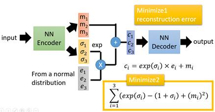

**AI笔记**

复习

9/26

RL基础

DPO

9/26

MLE

normalization

qwen3 qga部分

精度

分布

期望

概率相关

EM

GMM

Vae

elbo

9/30

刑法项目相关复习

刑法项目代码

大模型 tokenizer

position

10/10

视频rag

cs336

**TODO**

GenAI Knowledge Hubhttps://www.genaiknowledge.info/

Ring + flash attentionhttps://zhuanlan.zhihu.com/p/707204903

还差LSS

课程

**[This type of content is unavailable for download at the moment.]**

Block-Sparse FlashAttention

[混合序列并行思考：有卧龙的地方必有凤雏](https://zhuanlan.zhihu.com/p/705835605)

[图解序列并行云台28将（云长单刀赴会）](https://zhuanlan.zhihu.com/p/707435411)

[图解序列并行云台28将（下篇）](https://zhuanlan.zhihu.com/p/707499928)

triton实现https://zhuanlan.zhihu.com/p/694823800

[CUDA编程的基本知识以及CUDA实现add运算编程讲解_哔哩哔哩_bilibili](https://www.bilibili.com/video/BV1ow4m1f79F/?spm_id_from=333.788&vd_source=7edf748383cf2774ace9f08c7aed1476)

consistent model

Xl lighting

sd3

reflow

https://github.com/THUDM/CogVideo

Deep Cache

Dit moe 稀疏模型

数据，什么样的数据可以带来更好的效果：svd

https://www.bilibili.com/video/BV1fRsxetErS/?spm_id_from=333.337.search-card.all.click&vd_source=7edf748383cf2774ace9f08c7aed1476

sd3 https://arxiv.org/abs/2403.12015

Sdxl lightning https://arxiv.org/abs/2402.13929

Hyper sd https://hyper-sd.github.io/

FSDP：https://arxiv.org/pdf/2403.10266

课程：大模型训练https://github.com/mst272/LLM-Dojo

1. **精度**

https://www.bilibili.com/video/BV1mvyLYgEDp/?spm_id_from=333.1007.tianma.7-4-26.click&vd_source=7edf748383cf2774ace9f08c7aed1476

BF是折衷方案。 TF目前已经是torch和tf的默认float type

NVIDIA 定义的 **TF32** 不是一个新的 IEEE 浮点标准，而是 **FP32 截断后的近似表示**。  
它保留：

**1 bit 符号位**（跟 FP32 一样）

**8 bit 指数位**（跟 FP32 一样）

**10 bit 尾数位**（把 FP32 的 23 位 mantissa 截断到 10 位）

也就是说：

TF32 = 1 + 8 + 10 = **19 位有效信息**

剩下的 **23 - 10 = 13 位 mantissa** + **额外 padding** 直接被丢掉或置零

但是 **存储和计算时仍然用 32 位对齐**，因为 GPU 硬件里都是 FP32 通道，只是尾数精度不再完全使用。

常见 FP8 格式

|   |   |   |   |   |   |   |
|---|---|---|---|---|---|---|
|**格式**|**Sign 位**|**Exponent 位**|**Fraction 位（mantissa）**|**偏移量（bias）**|**说明**|例子|
|**E4M3**|1|4|**3**|7|4 位指数，3 位尾数（精度更高，范围较小）|1.000 (十进制 1.0)  1.001 (十进制 1.125)  1.010 (十进制 1.25)  1.011 (十进制 1.375)  1.100 (十进制 1.5)  1.101 (十进制 1.625)  1.110 (十进制 1.75)  1.111 (十进制 1.875)  在 1.0 到 2.0 之间，它只能表示这 8 个数，其他的小数都得四舍五入到最接近的一个。|
|**E5M2**|1|5|**2**|15|5 位指数，2 位尾数（范围更大，精度较低）|1.00 (十进制 1.0)  1.01 (十进制 1.25)  1.10 (十进制 1.5)  1.11 (十进制 1.75)  **意思是：** 在 1.0 到 2.0 之间，它只能表示这 4 个数，精度比 E4M3 还差一倍。|

bf8和int8之间的差异

bf8单纯的牺牲精度

而int 8 则为映射，比如影视fp16的[-65504- 66504]映射到8个bit上

一个端到端的小算例

设输入向量 x_float = [1.511, -0.42]，权重 w_float = [0.31, 0.77]  
选择：

|   |   |
|---|---|
|scale_x = 0.3（表示 **1 个 int8 单位 ≈ 0.3 浮点单位**。）  scale_w = 0.01|  xfloat对于[1.511, -0.42]则为1.511|

x_int = [round(1.511/0.3 = 5.036)=5, round(-0.42/0.3= -1.4)=-1]

w_int = [31, 77]

内核计算（int8→int32累加）：

dot_int = 5*31 + (-1)*77 = 155 - 77 = 78  
反量化（合并缩放）：

y_float ≈ dot_int * (scale_x * scale_w) = 78 * (0.3 * 0.01) = 78 * 0.003 = 0.234

与你直接用浮点点积（1.511*0.31 + (-0.42)*0.77 ≈ 0.468 + (-0.3234) ≈ **0.1446**）相比，会有误差，这就来自量化逼近、四舍五入与刻度限制。通过**更好的 per-channel scale、校准、bias 在高精度里加**等方式，误差一般能控制到可接受范围。

2. **常见loss**

https://zhuanlan.zhihu.com/p/668862356  
实现的代码也有

2.1 **Max-Margin Contrastive Loss**

2.2 **Triplet Loss**

2.3 **N对多分类损失（N-Pair Multi-Class Loss）**

2.4 **InfoNCE损失**

2.5 **Facol loss**

首先是cross entropy

Facol loss

\lambda是一个超参数，当模型对一个y=1的分类特别自信时，我们降低他的loss，如果不自信的话，我们增加（1-p）倍的loss。

3. **激活函数**

3.1 **Relu**

3.2 **SwiGLU**

|   |
|---|
|Plain Text   import torch   import torch.nn as nn      class SwiGLU(nn.Module):   def __init__(self, input_dim, hidden_dim):   super(SwiGLU, self).__init__()   # Linear layers to split input into two parts   self.fc1 = nn.Linear(input_dim, hidden_dim)   self.fc2 = nn.Linear(input_dim, hidden_dim)      def forward(self, x):   # Apply the linear layers to split input   x1 = self.fc1(x)   x2 = self.fc2(x)      # SiLU (Swish) activation on x1 and gate with x2   return torch.nn.functional.silu(x1) * x2      # Example usage   input_tensor = torch.randn(16, 128) # Batch size 16, input dim 128   swiglu_layer = SwiGLU(128, 256) # Example: input 128, hidden size 256   output_tensor = swiglu_layer(input_tensor)   print(output_tensor.shape)|

3.3 **SiLU**

SiLU(x) = sigmold(x) * x = 1/(1+e^(-x)) * x

4. **范数 norm**

5. **均值，方差，归一化**

归一化均值0，方差1

6. **Normalization + standardization**

6.1 **标准化 Standardization**

1. **Standardization (Z-score 标准化)**

**目标**：把数据调整为均值 = 0，标准差 = 1。

**结果**：分布被重新拉伸/平移，但**向量长度（L2 范数）不会固定**。

**作用范围**：通常在数据预处理阶段（整份数据集）。

✅ 关键词：**只管分布，不管长度**。

但并不是正态分布。

6.2 **l2 Normalization**

**不是保证范数=1**，而是保证：

**均值** ≈ 0

**方差** ≈ 1

和layernorm等不同

**L2 Normalization (向量归一化)**

**目标**：把一个向量缩放到范数 = 1（unit vector）。

**结果**：只改“长度”，不改“分布形状”（均值、方差随便）。

**作用范围**：embedding 相似度（CLIP、检索）。

✅ 关键词：**只管长度，不管分布**。

Minmax **Normalization** ：

如何使用？

一般用于Embedding（比如 CLIP 的图像/文本向量、word2vec、句子向量）主要用来 **计算相似度**。

相似度通常是 **余弦相似度 (cosine similarity)**

如果 embedding 不做归一化，不同向量的**长度**会干扰相似度。

**L2 Normalization** 把每个 embedding 拉到单位长度（norm=1），这样余弦相似度就只看 **方向**，不受向量大小影响。

**Standardization (均值0, 方差1)** 并不能保证“长度一致”，所以用它来算相似度会不稳定。

👉 所以：

**embedding → L2 normalization** ✅（适合比较相似度）

**embedding → standardization** ❌（没解决向量长度问题）

例子：

6.3 **normalization和standardization的差距**

**Click the image to view the sheet.**

🔹 为什么名字容易混？

“Normalization” 在 **机器学习传统语境** = 把向量长度缩放（L1/L2 Norm）。

“Normalization” 在 **深度学习层语境**（BatchNorm/LayerNorm） = 做分布标准化。

也就是说：

**数据预处理**里，normalization 可能指 **Min-Max** 或 **L2 norm**；

**网络层**里，normalization 几乎等同于 **standardization（均值0方差1）**。

他们有什么区别？

**Click the image to view the sheet.**

6.4 **BatchNorm / LayerNorm**

这类“Normalization”其实不是在说 L2 Norm，而是指 **分布标准化**。

**BatchNorm**：对一个 mini-batch 的每个特征维度做均值=0、方差=1 的缩放。

**LayerNorm**：对单个样本的所有维度做均值=0、方差=1 的缩放。

两者都属于 **standardization 的变体**，但加了可学习的 γ,β\gamma, \betaγ,β，所以分布能“伸缩”。

✅ 关键词：**改分布（均值0，方差1），不是改长度**。

6.5 **BatchNorm**

**图像分类、目标检测、语义分割**等任务中，Batch Normalization 非常常用。

在 CNN 中，特征通常是**二维卷积特征图**（例如 (batch_size, channels, height, width)），BN 对**每个通道**的特征进行归一化，计算每个通道在整个批次中的均值和方差。

这些任务通常使用大批次进行训练，BN 可以很好地利用每个批次的统计信息来平衡每个通道的特征值分布，保持均值和方差稳定，从而使得模型收敛更快。

6.6 **Layernorm**

注意在nlp和image的情况下，normalize的维度是不一样的

处理句子时：**Layer Normalization** 在这里**只会在 embedding_dim（即特征维度）上做归一化**，与其他单词（即序列中的不同时间步）之间是没有关系的。

|   |
|---|
|SQL   >>> # NLP Example   >>> batch, sentence_length, embedding_dim = 20, 5, 10   >>> embedding = torch.randn(batch, sentence_length, embedding_dim)   >>> layer_norm = nn.LayerNorm(embedding_dim)   >>> # Activate module   >>> layer_norm(embedding)   >>>   >>> # Image Example   >>> N, C, H, W = 20, 5, 10, 10   >>> input = torch.randn(N, C, H, W)   >>> # Normalize over the last three dimensions (i.e. the channel and spatial dimensions)   >>> # as shown in the image below   >>> layer_norm = nn.LayerNorm([C, H, W])   >>> output = layer_norm(input)|

6.7 **GroupNorm**

一般只会在图像中使用，当group为1时，和layernorm在image中的表现是一样的

每一个组内的所有点计算均值和方差。或者说不同channel中的点全部加一起计算

|   |
|---|
|Python   import torch   import torch.nn as nn      # GroupNorm with G groups (e.g., G=32), input has C channels   # Example: 32 groups for 128 channels   group_norm = nn.GroupNorm(num_groups=32, num_channels=128)      # Input tensor with shape (N, C, H, W), e.g., (16, 128, 32, 32)   x = torch.randn(16, 128, 32, 32)      # Apply Group Normalization   output = group_norm(x)   print(output.shape)|

**关于通道维度的位置**

nn.GroupNorm 不能直接指定通道所在的维度，它默认认为**通道数位于输入张量的第二个维度**（即形状为 (batch_size, num_channels, height, width) 中的 num_channels）。

6.8 **residual**

6.9 **问题**

6.9.1 **为什么transformer用layernorm 不用batchnorm？**

batchnorm主要用于CNN等视觉任务中。主要是用于每一批数据在每一个channel层面，对整个HW的点值计算normalization，会加速收敛。减轻内部协变量偏移（Internal Covariate Shift）。Batch Normalization 通过对每一层的输入进行归一化，使得每层的输入保持相对稳定的分布（即均值和方差不变）。这样可以减少层与层之间输入分布的变化，从而使得训练过程更加稳定。（隐藏层 2 的输入就是隐藏层 1 的输出。如果隐藏层 1 的输出分布不断变化，隐藏层 2 的输入分布也会不断变化。这样，隐藏层 2 在每次训练时，都要重新适应新的输入分布，导致它的学习变得更加困难。）  
Batch Normalization 可以有效地控制梯度的范围，防止梯度消失或爆炸现象。因为每一层的输入是经过归一化处理的，其分布保持稳定，所以在进行反向传播时，梯度的波动也会被控制在一定范围内。

batchnorm不适合处理长序列任务，或者每次token长度都会变化的情况。在 Transformer 的 Decoder 部分中，模型要逐步生成输出，这意味着在每一个生成步骤，输入序列长度会变化。Batch Normalization 无法很好地处理这种动态变化的序列长度。

注意力中，我们计算的是这一个序列之中的相关性，如果计算了batchnorm，不同的sentence可能会对当前的attention造成影响

为什么unet使用groupnorm

在 U-Net 中，选择 **Group Normalization** 而不是 **Batch Normalization** 的主要原因有：

**小批次训练的适应性**：Group Normalization 不依赖批次大小，因此适用于小批次甚至单样本训练的场景，而 Batch Normalization 依赖于较大的批次来计算均值和方差。

**生成任务对稳定性的要求**：Group Normalization 提供了对每个样本独立的归一化，有助于生成过程的稳定性和一致性。

**灵活性和适应性**：Group Normalization 能够通过调整组数，灵活适应不同层的特征分布。

6.9.2 **prenorm和postnorm**

随着 Transformer 模型的加深（例如 **BERT**、**GPT-3** 等大规模预训练模型，层数可能达到几十甚至上百），研究者们发现 PostNorm 的设计在非常深的网络中存在梯度消失或梯度爆炸的问题，使得训练过程变得更加不稳定。**PreNorm** 的设计则在深度网络中表现得更稳定，因为它将 Layer Normalization 移到变换模块之前，确保了每一层的输入具有更好的标准化特性，有利于梯度的流动。

因此，在现代大规模 Transformer 模型中，**PreNorm** 逐渐成为主流选择。例如，在 BERT 和 GPT 等模型中，Layer Normalization 通常会放在每个注意力模块或前馈网络的输入之前，而不是之后。

以下是原始 Transformer 中子层的计算步骤：

在 **PostNorm** 架构中，每层的计算步骤是：

首先，输入经过主变换模块：F(x)

然后，变换结果与输入相加（残差连接）：x+F(x)

最后，进行 Layer Normalization：LN(x+F(x))

在 **PreNorm** 架构中，每层的计算步骤是：

首先，输入先经过 Layer Normalization：LN(x)

然后经过主变换模块：F(LN(x))

最后，进行残差连接：x+F(LN(x))

可以发现在反向传播的时候，如果是postnorm，可能一开始的梯度会很大，但是越往前，梯度可能更低。但是如下图，prenorm不管如何都会有一个1的梯度。

Prelayer norm Pros

No more exploding or vanishing gradients

No need for warm up stage

Fewer hyper parameter

Cons:

Representation collapse which lead to pool performance compare to post layernorm

6.9.3 **为什么要normalization？**

原因是如果x1和x2的差距过大，那么对于θ1和θ2的loss也是不一样的，所以会导致模型下降的震荡

包括knn等算法也是一样

7. **reshape**

8. **Convolution**

Group convolution

[group convolution](https://zhida.zhihu.com/search?content_id=566203637&content_type=Answer&match_order=1&q=group+convolution&zhida_source=entity)，将feature map的通道进行分组，每个filter对各个分组进行操作即可，像上图这样分成两组，每个filter的参数减少为传统方式的二分之一（乘法操作也减少）。该种卷积应用于ShuffleNet。

depthwise convolution

depthwise convolution，是组卷积的极端情况，每一个组只有一个通道，这样filters参数量进一步下降。

9. **优化器**

https://zhuanlan.zhihu.com/p/208178763

9.1 **SGD 和 mini SGD**

9.2 **SGDM**

9.3 **Adagrad**

与SGD的区别在于，学习率除以 前t-1 迭代的梯度的[平方和](https://zhida.zhihu.com/search?content_id=134396393&content_type=Article&match_order=1&q=%E5%B9%B3%E6%96%B9%E5%92%8C&zhida_source=entity)。故称为自适应梯度下降。

Adagrad有个致命问题，就是没有考虑迭代衰减。极端情况，如果刚开始的梯度特别大，而后面的比较小，则学习率基本不会变化了，也就谈不上自适应学习率了。这个问题在RMSProp中得到了修正

9.4 **RMSProp**

加入了衰减v

9.5 **Adam**

m：平滑的梯度方向，确保参数更新沿着合适的梯度方向。

v：平滑的梯度幅度，动态调整学习率，确保在梯度较大时步伐较小，梯度较小时步伐较大。

10. **生成模型基础**

https://www.bilibili.com/video/BV1aE411o7qd/?p=162&vd_source=7edf748383cf2774ace9f08c7aed1476

右边前六个属于固定的结构化的生成模型。比如GMM，他不能增加新的层等等，并且只能处理特定问题

后面的采用的是分部表示，并且使用深度学习多一些。

10.1 **bayes**

10.1.1 **理解**

随机试验（random experiment）：在相同条件下，对某[随机现象](https://zhida.zhihu.com/search?q=%E9%9A%8F%E6%9C%BA%E7%8E%B0%E8%B1%A1&zhida_source=entity&is_preview=1)进行的大量重复观测。例如抛骰子，观察其点数；抛硬币，看其哪一面向上。

现在有长度为n且按照时间分布的序列，x1,x2,...,xt−1,xt,...,xn

假如有一个动物园有很多动物，我要找马x，提前得知了马的数量比较多，并且我认为棕色z的动物为马的概率最高

[先验概率](https://zhida.zhihu.com/search?q=%E5%85%88%E9%AA%8C%E6%A6%82%E7%8E%87&zhida_source=entity&is_preview=1)（p(z)根据以往经验和分析得到的概率）：

我认为p(z)为70%，意味着棕色为马的概率是70%

diffusion中q(xt|xt−1)，给定前一时刻的xt−1预测当前时刻xt的概率

似然函数p(x|z)

我们找了一些棕色的动物，实际查看马的数量，然后算一个总体的概率

边缘概率p(x)

在所有动物园里面，马占了50%

[后验概率](https://zhida.zhihu.com/search?q=%E5%90%8E%E9%AA%8C%E6%A6%82%E7%8E%87&zhida_source=entity&is_preview=1)（p(z|x) 指在得到结果的信息后重新修正的概率）：

知道动物是棕色的情况下，这只动物是马的概率

diffusion中 p(xt−1|xt)，给定当前时刻的xt预测当前时刻xt−1的概率

10.1.2 **变换**

|  |   所以A里面发生B和B里面发生A的概率是一模一样的  P(A\|B)P(B) = P(B\|A)P(A) |
| ------------------------------------------------ | ----------------------------------------------------------------------------------------------------------------- |
|                                                  |                                                                                                                   |

如果多一个C

10.1.3 **边缘化marginal likelihood/evidence：**

|   |   |
|---|---|
|为什么要边缘化？  边缘化的目的是为了简化问题，或者说，只关注那些我们感兴趣的变量。例如，在一些复杂的概率模型中，我们可能不关心所有变量的联合分布，而只需要知道某个特定变量的分布，这时我们就可以通过边缘化其他变量来简化问题。|  |

例子2

假如我们有一堆joint probability p(x,z)，假如

https://www.youtube.com/watch?v=qJeaCHQ1k2w

我们如果相求p(z=5)的概率的话，如下图所示，就是全部的p(x,5)的概率值相加，如果是连续的话，就是求积分

10.1.4 **p(x)如何求？**

一个就是使用marginal likelihood求，但是一般无解，所以我们使用引入一个**变分分布/变分推断** **q(z|x)**，来逼近真实后验 **p(z|x)**

所以我们从求p(x)变成了求后面这一大串

10.1.5 **实际解决方案/例子**

10.1.5.1 **Grid search**

10.1.5.1.1 **不训练更新**

问题定义

参数向量：θ=(θ1,θ2，。。。)=(kv_cache_block,max_batch_token)

性能指标：吞吐量 t，我们观测到的值带噪声。

模型假设：

p(θ∣t)∝p(t∣θ)p(θ)

也就是求最大化p(θ∣t)，可以用argmax MAP来求

map定义

map如何更新

f(θ)如何选择

直接线性回归简单算一下

循环

当我们优化结束后，可以得到当前最优θ，然后再用这个θ跑一边推理，看看最新的throughput，然后在丢到模型里面算一遍得到θ+1

10.1.5.1.2 **一边训练一边更新**

10.1.6 **问题**

有没有可能我直接用一个q(x)来直接逼近p(x)不用elbo+kl呢？

**可以**：如果你愿意，可以直接学 q(x)来近似 p(x)，这就变成“直接生成模型”，比如 PixelCNN、GPT。

**但 VAE 不这样做**：因为 VAE 想要**潜变量表示 + 高效采样**，并且 decoder 的建模更简单。

所以 ELBO+KL 不是数学上的必需，而是为了解决“带潜变量的边际似然不好算”。

什么时候关注p(x) 边际似然?

训练/评估 **VAE**、**变分推断**、**生成模型**时：  
我们必须以 log⁡p(x)为核心（即最大化似然，或它的下界 ELBO）。

做 **模型比较**：选哪个潜变量模型更好，需要比较谁的边际似然大。

做 **理论推导**：研究收敛性、KL 收敛、变分分布和真后验的差距。

10.2 **概率密度函数pdf**

10.3 **期望**

10.3.1.1 **定义**

比如q可以是高斯概率密度函数，当u=0的时候，那么E[x] = 0。我们从q中取z的概率，得到q(z)，由于总体概率为1，所以我们要计算的就是在不同z的情况下，z出现的概率 * f (z)的值

q(z1) = 1/6， q(z2) = 1/6

q(z1) = 0.3， q(z2) = 0.7

10.3.1.2 **如何判断f(x)**

10.3.1.3 **应用到vae**

10.3.1.4 **方差**

10.3.1.5 **行列式**

可以用于判断当前矩阵A乘其他矩阵B，会平均放大到|A|倍。可以理解成全局的平均放大即可

那么总体就是放大2 * 2 - 0*0 = 4 倍

10.3.1.6 **协方差**

如果Cov大于 0：一起涨 → 正相关

小于 0：一个涨一个跌 → 负相关

等于 0：不相关

10.3.1.6.1 **用途**

用于表示不同维度之间的相关性。不过在vae中假设不同z的维度之间相互独立

10.3.1.6.2 **d维高斯的相关性**

想象二维高斯：一堆点围绕中心 μ。

如果 Σ = 单位矩阵 → 圆形

如果 Σ = 对角矩阵（不同方差） → 椭圆（但轴对齐）

如果 Σ 有协方差 → 椭圆被旋转

10.3.1.7

10.4 **分布**

**Click the image to view the sheet.**

p(θ)的含义

**p(x∣θ)**：描述在参数为 θ时，观测到数据 xxx 的概率（由似然函数决定，比如高斯、伯努利等）。

**p(θ)**：描述我们对参数 θ 本身的先验信念（即「θ会取哪些值，以及它们的可能性」）。

和隐变量 z 的区别

**z**：是数据的隐变量（例如 VAE 里的 latent code）。

**θ**：是模型的参数，通常固定在训练中学到的值，但在贝叶斯学习中，我们给它一个分布（先验 + 后验）。

高斯先验 vs Beta 先验

**高斯先验**（常见于连续参数）  
例如：

→ 表示我们认为「θ的平均值在 0.2 左右，但可能在 [−9,9]范围内波动」，概率由正态分布决定。

**Beta 先验**（专门用于概率参数 θ∈[0,1]）  
例如：

→ 表示「我们认为抛硬币正面的概率更可能接近 3/(3+8)=0.27，但也允许它在 [0,1]区间变化」。

如何使用

如果 θ 是「概率（0–1 区间）比如只有两类」 → 用 **Beta**

如果 θ 是「类别概率向量」 → 用 **Dirichlet**

如果 θ 是「连续实数」 → 用 **高斯分布**

10.4.1.1 **Bernoulli 分布**

定义

伯努利分布描述 **一次只有两种结果的随机实验**（0 或 1）。

其中：

P(X=1)=θ

P(X=0)=1−θ

参数：θ（成功的概率）。

👉 举例：

抛硬币：正面 = 1，反面 = 0

打疫苗：成功 = 1，失败 = 0

开关：开 = 1，关 = 0

概率质量函数 (PMF)

如果 x=1：结果是“正面”，概率 = θ

如果 x=0：结果是“反面”，概率 = 1−θ

参数和期望

参数：θ（成功的概率）。

期望：E[X]=θ

方差：Var(X)=θ(1−θ)

👉 直观：平均值就是“成功的概率”。

和 Beta 的关系

**伯努利分布**：描述观测结果 x（0 或 1）。

**Beta 分布**：描述参数 θ（成功的概率）的不确定性。

在贝叶斯框架里：

先验：θ∼Beta(α,β)

数据：x∼Bernoulli(θ)

后验：θ∣x∼Beta(α+x,β+1−x)

👉 这就是「Beta 是 Bernoulli 的共轭先验」。

直观比喻

伯努利：一次试验的结果（0 或 1）。

Beta：我们对「0/1 发生概率」的信念分布。

10.4.1.2 **beta分布**

Beta 分布的直观含义

**Beta(α, β)** 可以看成：在看到真实数据之前，我们“假想”已经看过了：

α−1次正面

β−1次反面

👉 所以它像是 **“虚拟样本”**，表达我们对硬币概率的先验信念。

举例说明

**Beta(1,1)**：相当于“我没看到过任何硬币结果”。完全均匀，不偏不倚。

**Beta(2,1)**：相当于“我假装之前看过 1 次正面，0 次反面”，所以更偏向正面。

**Beta(8,4)**：相当于“我假装之前看过 7 次正面，3 次反面”，所以更相信正面概率 ≈ 0.7。

**Beta(1,1)** → 蓝色直线，均匀分布（完全不知道 θ，所有值等可能）。「我对 θ 没有任何偏好」。

**Beta(2,2)** → 橙色弧线，中间（0.5）概率大，代表“更相信硬币接近公平”。「我认为 θ 接近 0.5 更可能，但 0.2、0.8 也不是不可能」。

**Beta(1,2)** → 绿色直线，往 0 偏，说明“更相信 θ 小”，也就是更可能反面。「我认为 θ 更可能在 0.2-0.3 区间」。

应用到_Bayes_

当我们继续抛了几次硬币得到了3次正面，2次下面，那么就是p（θ）为beta(3,2)

10.5 **极大似然估计 MLE**

[(系列二) 数学基础-概率-高斯分布1-极大似然估计_哔哩哔哩_bilibili](https://www.bilibili.com/video/BV1aE411o7qd/?p=3&vd_source=7edf748383cf2774ace9f08c7aed1476)

这个**μ**和**Σ就是我们需要求的参数，**我们找到一个u和σ，然后在这个mean和standardized deviation基础上，p(x)出现的概率最大。但是这里的σ是有偏估计，需要修正（暂时不懂，也不需要花时间弄懂其实）

**什么是无偏估计量？**

无偏估计量是指估计值在很多次重复抽样中的平均值（即期望值）等于总体的真实值。换句话说，无偏估计量在长期来看不会系统性地高估或低估总体参数。

**简单例子：**

假设我们要估计一个班级中所有学生的平均身高（真实的总体均值是 μ）。

我们随机抽取10名学生，测量他们的身高，然后计算样本均值 μ^hat。

如果我们重复多次抽取10名学生，每次都计算样本均值 μ^hat，那么这些样本均值的平均值就应该接近于班级所有学生的真实平均身高 μ\muμ。

这个样本均值 μ^hat 就是一个**无偏估计量**，因为在多次抽样中的平均值等于真实值。

**什么是有偏估计量？**

有偏估计量是指估计值在很多次重复抽样中的平均值不等于总体的真实值。也就是说，有偏估计量会系统性地高估或低估总体参数。

**简单例子：**

假设我们要估计一个班级中所有学生的平均身高，但这次我们使用了一种有偏的抽样方法，比如只选择较高的学生来计算样本均值 μ^biased。

如果我们重复多次抽取较高的学生，每次都计算样本均值，那么这些样本均值的平均值会高于班级所有学生的真实平均身高 μ

这个样本均值 μ^biased就是一个**有偏估计量**，因为在多次抽样中的平均值系统性地高于真实值。

**直观理解：**

**无偏估计量**：在长期来看，估计值不会系统性地偏离总体的真实值。每次抽样都可能高于或低于真实值，但平均来看，它们正好等于真实值。

**有偏估计量**：在长期来看，估计值系统性地偏离总体的真实值。每次抽样的结果可能都倾向于高估或低估真实值，因此它们的平均值与真实值不相等。

1. **求解过程**

2. **极大似然到KL**

并且求导时，常数项为0

3. **KL 从entropy的角度出发**

Entropy, Cross-Entropy, KL-Divergence：https://zhuanlan.zhihu.com/p/148581287

公式

|   |   |
|---|---|
|名称|公式|
|**数据自身的香农熵**||
|**模型词表分布熵**|只是模型“自信度”侧指标； 可能 ↑ 也可能 ↓。它不是被直接优化，只是随参数变化被动改变。|
|**交叉熵 / 负对数似然**|目标函数。 MLE/EM 每一步都在让它 **↓**；等效于在减小 KL 散度。 因为 恒定，所以实际就是让 **KL ↓**。|

解释：

Y就是bit的数量

总结：

entropy越大，平均信息越少，但是总量信息是不变的，有用的信息会随着entropy增大而减小。

KL越接近0，说明两个信息的提供方提供的平均信息量是一样的（就是抛色子，一共六个面，就是softmax后的结果最终维度为6，然后这6个面的每一个面的熵的合 再除以平均值）

10.6 **极大后验估计 MAP**

如果说极大似然估计是估计 argmax p(x|θ)的话。那么极大后验估计就是最大化p(x|θ)p(θ)

10.6.1 **p(X|θ)p(θ)都是高斯分布**

先验p(θ)

似然p(X|θ)

合并并计算

求导

注意这里的u0，τ**^2**为先验 是已知的

10.6.2 **p(θ)都是高斯分布p(X|θ)线性回归**

这里y为观测数据，所以理论上是p(Y|θ,x)p(θ)

似然

先验

和上面一样，如果是高斯的话，就是l2正则。拉普拉斯先验为l1

这个形式就是l2正则

损失

10.7 **概率图VS神经网络**

概率图中的每一个节点都是可以被解释的。深度学习的计算图，单纯是为了计算

10.8 **Stochastic back propagation(SBP)/Reparametrization Trick**

我们使用神经网络来逼近这些概率分布，不管是条件概率还是概率分布都可以逼近。

|   |   |
|---|---|
|我们可以直接逼近y本身。或者逼近一些组成y的基本元素。比如VAE的encoder。我们使用网络求出u，σ，然后再用z加上去得到y，而不用直接一个神经网络逼近y本身||

10.9 **EM算法**

https://github.com/ws13685555932/machine_learning_derivation/blob/master/12%20%E5%8F%98%E5%88%86%E6%8E%A8%E6%96%AD.pdf

这里用GMM举例子，但是EM可以求除了GMM外其他的优化问题。这里只拿GMM举例子，可以看到GMM中需要求解的参数中有[p1,p2,p3,...u1,u2,u3....σ1，σ2，σ3....

训练过程：

如何才能找到以上这些值呢？

首先我们随便初始化p1,p2,p3..这些值。注意：不同的初始化的值，会对模型有着不同的影响，所以初始化的方法很重要

|   |   |
|---|---|
|比如p1 = p（z1） = 0.5 或者0.7等等都可以 然后p2 = 0.2, p3 = 0.1 注意p1+p2+p3 = 1  然后随机初始化u1,u2,u3...  这个时候我们可能会有||

1. **E：Expectation Step，期望步骤**

|   |   |
|---|---|
|这个时候我们根据高斯概率密度函数来求每一个点可能的颜色的概率，根据上图所示，就是计算每一个点属于p1,p2,p3的概率值。比如x1有70%的概率属于p1,20%属于p2,10%属于p3。|  细节一点的公式：    上面计算λ，等价于这一步  |

2. **M：Maximization Step，最大化步骤**

|   |   |
|---|---|
|当我们计算完了每一个点的概率值之后，我们就可以更新这些点对于每一个分布的均值和方差了  u1的计算方式是，  每一个点 * 当前分布的对于这个点的概率值 / 全部的概率总值  γ21表示 第二个x2值在第一个分布的概率|  还有一个p(z)= Π的权重更新，在下图中的c部分  |

|   |   |
|---|---|
|最终直到没有更新为止||

3. **问题的核心：**

假设你的数据集中有三个主要的高斯分布（簇），而你也使用了三个分量来拟合模型。那么理论上，每个分量应该分别“捕捉”一个数据簇，最终使得每个分量的均值和方差能够正确描述对应的数据簇。

然而，如果由于初始化、数据分布的形状或模型的复杂度问题，某些分量在责任度计算时比其他分量更有优势，可能会导致**多个分布去争抢同一个数据簇**，而其他数据簇可能会被忽视或者被多个分量误导。这种情况的后果是：

**分布重叠**：多个高斯分量的均值和方差可能都收敛到同一个数据簇，表现为这些分布在同一区域重叠。

**忽略某些簇**：某些簇可能被多个分量过度拟合，而另外一些簇可能没有分量能够正确描述它们。

**模型崩溃或过拟合**：最终模型的对数似然虽然收敛了，但却并没有正确反映数据的真实分布。

4. **如何避免这个问题？**

**使用更好的初始化**：

**K-means 初始化**：K-means 聚类算法可以有效将数据划分为不同簇，使用 K-means 结果的中心点作为 GMM 的初始均值可以显著减少分量“争抢”同一个簇的现象。

**随机初始化多次运行**：通过多次随机初始化 GMM 模型，可以选择对数似然值最高的模型，避免陷入局部最优解。

**调整分量的数量**：

确保分量的数量与数据的真实簇数量一致。如果数据有 3 个簇，就应该使用 3 个分量。如果分量数目过多，可能导致多个分量去拟合同一个簇。

如果分量数目过少，可能导致某些分量无法捕捉到复杂簇中的变化，多个分量会聚集在一起试图拟合同一个复杂簇。

**修改模型的先验概率**：

在某些应用中，可以对混合权重 P(γj) 施加先验限制，使得每个分量的权重更加均匀，避免多个分量在早期阶段过度拟合同一个簇。但一般而言u和σ影响会更大一些，所以优先想办法让u和sigma分布更加均匀一些。

**增加初始化时方差的差异**：

如果初始化时均值较为接近，可以通过为每个分量设置不同的初始方差，使得分布的覆盖范围有所差异，这样可以帮助每个分量探索不同的区域。

**正则化处理**：

在 M 步中，可以使用正则化项来对分布参数施加约束，防止分布完全重叠。例如，通过约束分量之间的距离，使得每个分量不能过度靠近。

5. **例子**

简单梳理一下E，M的过程。如下

|   |   |
|---|---|
|这里解释一下这个Qi(zi)的含义，zi的取值为1到k一共有k个隐变量。可以看到右图，在计算每一个点的对于不同分布的所属概率时，每一个点的γ说白了都是不一样的。所以这个Qi代表的就是对于每一个x对于不同分布zi的概率。每一个xi都会有这个γi1，γi2，γi3，γi4。Q的i代表xi，z的i代表在那个分布|  细节一点的公式：  |

**zi**：这里的 i 通常是观测数据的索引，表示第 i 个数据点的潜在变量。例如，zi 表示与数据点 xi 相关的潜在变量。

**zj**：当你看到 zj 时，可能指的是不同的潜在维度。例如，如果 z1 表示颜色，z2 表示光照，那么 zj 就是第 j 个维度的潜在变量。

推理

白板推导https://www.bilibili.com/video/BV1qW411k7ao/?spm_id_from=333.999.0.0&vd_source=7edf748383cf2774ace9f08c7aed1476

一个通俗易懂一点的推导https://www.bilibili.com/video/BV19a411N72s/?spm_id_from=333.337.search-card.all.click&vd_source=7edf748383cf2774ace9f08c7aed1476

6. **理论证明**

6.1 **开始推理**

或者看这个公式推导也行：

https://www.youtube.com/watch?v=qMgwKIXTJKI

https://github.com/ws13685555932/machine_learning_derivation/blob/master/10%20EM%E7%AE%97%E6%B3%95.pdf

6.1.1 **收敛性证明**

我们只要证明θt+1 > θt

6.1.2 **ELBO + KL**

我们首先需要去找到一个q(z；Φ)，但是我们一开始是不知道q=p(z|x；θ)的需要推导，并且p本身没有办法求，所以我们只能近似

Q(z)和P(z|x, θt)是kl的q||p，这里我们可以固定一个参数θ，然后计算另外一个最优，所以就有了两部

与θ无关是指优化问题中，常数项一般不用考虑

6.1.3 **ELBO + Jenson**

我们主要需要希望p(xi|θ)最大。但是这个里面的这个参数可能不太好找，我们就利用潜变量z来估计他。然后在对所有的z做x的积分，说白了就是(x,z1) (x,z2)对于所有可能出现x的情况做积分。

我们给上下都加上一个q(zi)，q(zi)代表了每一个zi出现的概率。那么给log p(xi|θ)上下都加一个q(zi)的话，就是1，没啥变化。现在我们的目标就是要求解这个方程而已

这里我们利用Jenson不等式来得到一个下界。说白了就是，原式子是原本我们要求的式子，但是原式不好求，现在变成了我们想让那个下界这个数值越大越好

资料补充，如果上面这个看不懂有点乱的话，可以看左下这个图

|   |   |
|---|---|
|||

总结一下，这个过程就是

但是假如说以下界来看的，他永远小于等于真正的这个p（x，z|θ）那么他什么时候等于呢？是不是就是f(x)变成一个常数的时候

https://zhuanlan.zhihu.com/p/78311644

重点来了，我们目前有了下界J(z, Q)和L(θ)。Q(z)就是一个函数，可以得出给定z的概率（比如在VAE中，就是一个神经网络，而这里不是，这里使用全部的数据基于p(x|z)的这个θ分布，θ为u和variance）。那么EM算法的核心来了。就是固定住θ的参数，也就是全部的z的u和σ，调整Q(z)来优化J(θ, Q)这个下界，使得J(θ, Q)和L（θ）相等。然后固定住Q(z)，通过MLE调整θ来使得J(z, Q)达到最大值。然后得到新的θ，再固定θ，求Q(z)使得J(θ, Q)相等。以此类推

于是我们可以得到

得到了E部：

这里我们得到了一个p(xi,zi|θ)=CQi(zi)的这么一个东西。在积分上面，如果都是对z做积分，并且区域都是一样的话和f(x)=g(x)的话，那么在这个基础上求积分，他们就是相等的。所以我们对p(xi,zi|θ)求积分。最终我们得到了p(zi|xi,θ)这个后验分布。

M部求解：这里我们通过了上个式子得到了q(zi)，并且θ是已知的，然后我们利用q(zi）去计算下面这个M。在M中θ又变回成了参数，重新计算新的θ。

其中p(zi|xi, θ)和p(xi,zi|θ)的计算方式

注意这里的pz其实等于pk，只是为了写出这个公式而已，就是pz属于Pk之中的一个

在这里的M部其实就已经算是结束了。我们需要去优化这个θ，比如在GMM中，θ其中包括了概率pz，u，和Σ。也就是下图中的p（γ）u和方差。

具体的推导如下（这里只推了p的求解方法，使用拉格朗日乘子法，详情请查看GMM部分）

https://www.bilibili.com/video/BV13b411w7Xj?p=4&vd_source=7edf748383cf2774ace9f08c7aed1476

7. **自己手推**

7.1 **解法 ELBO + KL：**

“KL=0”只说明**在当前 θt** 下，下界与 **贴紧**；它**不**意味着 θ**t**已经让 取得全局/局部最大。

7.2 **思想**

E 步：用当前 给每个样本分配**软标签/后验**，让界限**贴紧**当前点；

M 步：在这份“解释”下，调整 θ让**完全数据对数似然logp(x,z)的期望**更大；

变大后，gap 可能又>0，但下一轮再用新的 重新做 E 步把 gap(KL) 拉到 0，如此迭代。

所以，“KL=0 ⇒ 用同一个 θ”这个想法只对 **E 步那一刻** 成立；但 **为了前进**，M 步必须把 θ 当作**新的变量**去优化，否则算法不会更新。

7.3 **问题**

7.3.1 **Q(z)和P_θ怎么解？**

注意 后验Q(z) 和Pθ 是不同的参数，所以是一个二元函数，求解比较难

如何才能把Q（z）化简掉就是问题。所以引入E，M步，E部我们固定θ，优化Q(z)的参数，然后在M固定Q(z)优化θ

7.3.2 **什么时候用EM？**

|   |
|---|
|Markdown   什么时候后验能解？什么时候不能解？   可以：   1. z 是离散有限集合   - 例子：   * 简单例子：z ∈ {1,2,3}，后验就是   p(z=k\|x) = p(x\|z=k)p(z=k) / Σ_j p(x\|z=j)p(z=j)，可直接算   * 高斯混合模型 (GMM)：z 表示簇标签，后验是责任度公式   * 隐马尔可夫模型 (HMM)：z 表示隐藏状态，后验用前向-后向算法算   - 特点：后验是有限求和，可解   - 方法：EM（责任度 / Baum-Welch）      2. z 是连续 + 线性高斯模型   - 例子：   * 因子分析 (FA) / PPCA：z 是潜变量，x\|z 是高斯，线性关系   * 线性高斯状态空间模型 (Kalman)：后验用 Kalman smoother 算   - 特点：先验和似然共轭，后验仍是高斯，可解   - 方法：EM / Kalman      不可以：   3. z 是连续 + 非共轭分布   - 例子：   * 贝叶斯逻辑回归：z 高斯先验，x\|z 是 Bernoulli(sigmoid)，不共轭   * Poisson 回归（log 链接）：z 高斯先验，x\|z 是 Poisson(exp)，不共轭   - 特点：后验没有闭式   - 方法：近似 (Laplace / VI / MCMC)      4. z 是连续 + 非线性生成模型   - 例子：   * VAE：z 高斯先验，x\|z 是高斯/Bernoulli，但均值由神经网络输出   * 深度状态空间模型 (Deep Kalman Filter)：状态转移/观测都是非线性   - 特点：积分无闭式，后验不可解   - 方法：近似 (VAE, Variational EM, IWAE, MCMC)|

7.4 **解法 ELBO + Jenson：**

回顾Jenson不等式

继续推

上面应该是p(z|x;θt)，我们固定一个参数θt然后argmax p(z|x;θt)，至于怎么求解p，可以见GMM，或者神经网络直接求。如果是GMM θ则为z∈{1,…,K}，θ={πk,μk,Σk}，如果是网络，θt为网络的参数（VAE的encoder）

8. **优劣势**

优点：

简单。

缺点

对初始值敏感:需要初始化参数0，直接影响收敛效率以及能否得到全局最优解

非凸分布难以优化，迭代次数多，容易陷入局部最优。

10.10 **KL convergence**

如何使得我们训练出来的这个模型q预测的和数据p的概率分布越相似越好呢？我们可以利用KL convergence

10.11 **Jensen不等式**

白板推导：https://www.bilibili.com/video/BV1qW411k7ao?p=3&vd_source=7edf748383cf2774ace9f08c7aed1476

通俗理解视频：https://www.bilibili.com/video/BV19a411N72s/?spm_id_from=333.337.search-card.all.click&vd_source=7edf748383cf2774ace9f08c7aed1476

凸函数和凹函数都会遵循 Jensen 不等式，只是方向相反。

凹和凸函数的jensen不等式，符合会反转

根据Jensen不等式的等号成立条件，E[f(X)]≥f(E[X])中的随机变量X必须恒等于常数

如何继续化简？

**jenson不等式的GMM推导**

手推：

10.12 **最大化ELBO**

**下界（Lower Bound）是什么？**

下界是对一个难以直接优化的目标函数的近似。通常我们通过构造一个易于优化的目标函数来代替难以直接优化的目标函数。下界给了我们一个保证：通过优化这个下界，我们至少能够确保目标函数不会下降。

在 **EM 算法** 或 **变分推断** 中，我们通常需要最大化观测数据的**对数似然函数** log⁡P(x∣θ)，这通常是一个复杂的积分难以直接求解。于是我们引入一个下界，通过最大化这个下界，间接地优化对数似然。

ELBO (Evidence Lower Bound) 是什么？

10.13 **GMM**

[机器学习-白板推导系列(十一)-高斯混合模型GMM（Gaussian Mixture Model）_哔哩哔哩_bilibili](https://www.bilibili.com/video/BV13b411w7Xj/?spm_id_from=333.999.0.0&vd_source=7edf748383cf2774ace9f08c7aed1476)

对于mle来说，数据是单一分布的，他只能有一个聚类中心，如果数据分的特别开的话，一个mle肯定解决不了问题，所以这里引入GMM。对于GMM来说，我们需要找到多个σ和多个u即可，当然也可能是连续的（GMM只能解决离散的）。假如x有两个比如很多身高，一些为180，一些为160，那么我们用两个z表示，z1为女生，z2为男生。假如x有三个（比如embedding变量），x1是身高，x2是学历，x3为长相，latent可能就是z1年龄z2饮食z3基因等。我们需要找到每一个zi对于x的影响情况，就是当年龄等于39岁的时候，x1,x2,x3的u和σ是多少。这里就引出了p(x|z) 这个就是我们神经网络/EM算法要做的事情了

MLE，就相当于k=1，所以P（x|z）的权重就是1. 当k>1时，也就是说，模型可以去使用除了年龄之外的latent feature了，但是具体年龄这个feature我能使用多少比例来判断x1,x2,x3呢？所以这里引入了Π/权重的概念，公式变成了

当然细心如我可以发现上面那个图中，除了高斯中心的数据很多之外，还有很多零散的点在周围，可能就是latent1聚合了一部分，latent2聚合了一部分。他可以把数据集分的更开了。但是权重的话是不一样的，比如第二个latent2聚合的点非常非常的多，那么权重就会高些

|   |   |
|---|---|
|||

**高斯混合模型中的** KKK **是超参数，也可以自动学习，从而不用设置，变为无线**

在高斯混合模型（GMM）中，KKK 确实是一个超参数，它表示我们假设数据由 KKK 个高斯分布的混合来生成。通常在实际应用中，我们需要预先设置 KKK 的值，然后通过训练来学习每个高斯成分的参数。

**有限 K**：当 K 是一个有限的值时，每个数据点 x 都是由 K 个高斯分布中的某一个生成的。模型通过学习来确定每个成分的均值、方差和混合系数 P(zi)P(z_i)P(zi)。

**无限 K**：在某些高级模型（如无限混合模型或狄利克雷过程混合模型，DPMM）中，可以考虑 K 是无限的。这意味着模型可以自动选择所需的高斯成分数目，而不需要人为指定 K。这些模型通过让 K 无限趋近来实现这一点，但这超出了经典 GMM 的范围。

10.13.1.1 **求解过程 1维**

|   |   |
|---|---|
|假如我的一个模型是由两个高斯模型组成的，那么推导公式是什么样子的？  由于会发现最后我们得到一个1加到N的log（a+b+c+..+...）的形式。这个形式是无法求解的  |      |

理论证明：

https://www.bilibili.com/video/BV13b411w7Xj?p=4&vd_source=7edf748383cf2774ace9f08c7aed1476

E-step

M-step

这里只求了每一个的分布pk应该如何迭代。u和方差没有求

10.14 **变分推断**

这玩意就是一个坐标下降算法。假如说我们的Z有m个维度，记住这里说的是维度。那么z1，z2可以是其中前两个维度。我们把这个记作q，也就是q1代表了z1，z2，q2代表z3，z4

最终我们为了用q拟合p(z|x;θ)的得到的式子如下

我们对于每一个z的维度都求积分，来计算最终的log(Q(Z))，于是便有了q1(z1), q2(z2)的求解方法。每次固定其他维度的q，来求当前维度的q，也就是固定了其他维度的z，来求当前维度的z。这不就是坐标下降法吗？

10.15 **VAE：**

为什么需要VAE？因为普通的encoder-decoder的中间结果code/latent feature可能不具备足够的平滑性，连续性，和覆盖性

笔记：https://www.gwylab.com/note-vae.html

Youtube动画: https://www.youtube.com/watch?v=qJeaCHQ1k2w

公式推导：https://www.bilibili.com/video/BV15E411w7Pz?p=1&vd_source=7edf748383cf2774ace9f08c7aed1476

视频https://www.bilibili.com/video/BV1Gx411E7Ha?p=35&vd_source=7edf748383cf2774ace9f08c7aed1476

chatgpt：在后半段https://chatgpt.com/c/66f52ab2-8930-8002-9d15-fa2f119572ba?model=gpt-4o

1. **Why vae? And m-vae?**

2. **用 VAE 模型的场景：**

要时时刻刻的这么想这个，想象地图和真实地理的映射关系，想象一个平面，然后平面坑坑洼洼的，每一个山峰处就是一个zi。采样的时候在这些山峰处采就可以了。当然山峰处被采样的概率也高一些，毕竟咱们是先从正态分布随机弄一个zi，然后根据地图去查这个zi是在这个平面上的哪一个地方/山峰，然后在这个附近采样就可以了。z1上图中p(z)是概率最大的，所以很有可能z1的p(x|z)的方差就是最大的，因为最具有代表性

z符合正太分布，符合N（0，1）的，是latent vector，假如x1是身高，x2是学历，x3为长相，z可以是人类的年龄，也可以是头发的长度，肚子大小等。这里假如说zi是类似于年龄的latent feature，为什么说是类似呢，因为他完全可以是其他的feature，比如肚子大小等，比较抽象的feature，这里说年龄可以代表z是因为学历和长相都可以隐晦出年龄大小，所以我猜zi是年龄，当然也可以是其他乱七八糟的东西。事实上我们最好不要把他强硬的理解成年龄，它只是模型用来表示某种特征的编码，可能隐含了与年龄和基因等等很多相关的信息，用来表示数据中的“年龄”特征。你可以理解为，z1的值对年龄具有某种关系：例如，绿线z1，可能表示年龄越大，反之则表示年龄较小。但 z1=0 并不代表某个特定的年龄，而只是模型学习到的一种表示。这个东西越大，可能学历越高，身高越高等等，z1也可以是年龄，基因，饮食，宇宙射线的融合体，包含了一切，他在空间上是连续的。当然，这个影响只对x的部分数据影响大，上图可以看到有三类数据，所以其他两类中，可能就是基因影响力会大一些。这个就是p(z) ,只代表概率密度/权重，最终p(x)的大小是由权重和分布情况决定的。因为有些时候可能宇宙射线这种，p(x)比较小，虽然“宇宙射线”的方差可能很大，表示当它出现时数据 x的波动性会很大，但由于它的**概率密度** p(z)很小，它在生成数据时的**实际影响**仍然会很小。也就是说，宇宙射线虽然可能导致数据有较大的波动，但它出现的概率非常低，导致它在总体上并不能主导生成的数据。宽，意味着每一个数据都有，但不意味着影响会大。而年龄这种，在这个场景下，方差小，均值高，且p(z)也高说明对数据影响力很大。可以把**z理解成在整体数据中所占的比重**，即表示某个潜在变量 z 的出现概率或重要性。这是对潜在空间中不同特征或属性对数据生成的贡献度的度量。

这里还需要计算P(x|z)，含义就是我们找到了这个x分布之后，让这些x数据出现的概率最大。这里的绿色线表示年龄在这部分x的数据中，起主导权，也就是说年龄的变化最会影响这里面的数据。目前你可以看到三条线，也就是说主要有三类数据。当然数据类别这种是非常抽象的，也是连续的，比如当我们生成视频的时候，不同的动作，韵味等等都可以是一类，或者是不同的时间t也可能是他的latent feature，z可以有无限种类别当然如果是连续的话，就不是MLE和GMM了，则是VAE，这里就是VAE和GMM的区别，一个是有限p(x|z)一个无线，但是他们都有概率密度p(z)，GMM为权重Π

训练的过程就是我们希望p(x)出现的概率越大越好，也就是积分p(z)p(x|z)dz的面积越大越好，对此我们才有了encoder，decoder来解决这个问题。

推理的过程，我们可以在z这个高斯曲线上面随意来取值了，毕竟是生成模型嘛。所以我们可以给定z，得到

**μ(z)**：表示给定 z 时，生成的 x 的均值。

**Σ(z)**：表示给定 z 时，生成的 x 的方差（可以是一个协方差矩阵，表示多维情况）。

对应的部分就是上图中，紫色的u(zi),σ(zi)，然后我们利用这个u和σ随意取值，就是x，这个就是生成了一个新的x。比如我们生成了m1,m2,m3，mi就是一个Z。所以我们需要取三次样。但是由于我们默认Z符合正态分布，所以我们直接从N(0,1)取就可以了

为什么 VAE 可以在这个场景下有效？

**规则性**：如果在你的数据中，学历、身高、长相这三者之间确实有规律或相关性，例如年龄越大的人学历越高，或者随着年龄变化，人的身高、学历和长相有一定规律，那么 VAE 的假设（潜在空间是连续的正态分布）是合理的。

**M VAE**：如果学历、长相和身高这些特征可以通过年龄（潜在变量）较好地解释和生成出来，并且没有明显的异常情况，比如“婴儿学历是博士”这种不合理的组合，那么 VAE 是合适的选择。因为 VAE 可以通过正态分布对这种有规律的数据进行建模。

但是“婴儿学历是博士”这种情况发生的时候，那么数据集的分布就会有一些变化，你得到的p(z)的高斯函数也会有变化，如下图，z1可能就不是主导地位了，会被换成其他的。但是事实上年龄依旧是影响x最主要的原因，那么这个时候为了满足这种复杂的情况就需要使用m-vae，下图中p(z)不再是正态分布了，而是一个GMM。

**例子**：假设你有一个包含18-30岁年轻人的数据集，大部分人学历适中，长相在一定范围内浮动。VAE 可以通过学习潜在变量 z（年龄）来重构这些数据，并生成新的样本，因为这些数据呈现出单一的模式（没有极端异常的模式）。

**为什么P(z)大部分情况是高斯分布？**

你的身高最大概率是由你的年龄决定的，当然也可能是其他因素决定的，那么类似于年龄zi的占比就会非常高，其他比如学历长相等占比就比较轻。所有的属性权重比弄在一块，他就是一个类似于正太分布的Z，zi为年龄，或者为年龄+学历等等的混合体，因为他不特指为一类特征，他是抽象的，然后zi-1为长相+基因等等，zi+1为学历，然后zi-100比如天气，zi+100000可以是宇宙射线。。最终组成一个latent Z表达的是这些的集合。这么理解对吗？

**用 M-VAE 的场景（多模式或复杂分布的情况）**：

你提到了一种特殊情况：“**长相像婴儿但是学历是博士**”。这其实是一种**异常组合**，是标准 VAE 可能无法很好处理的情况。因为 VAE 假设潜在空间 z 是一个正态分布，但数据本身可能有多种模式，甚至有一些非常极端的组合。这就是 **M-VAE** 可能会更合适的场景。

为什么 M-VAE 在这种场景下更合适？

**多峰分布（多模式）**：如果数据有多种不同的组合模式，并且这些模式在潜在空间上不符合单一正态分布的假设，例如同时存在多种不同的年龄、学历和长相组合，那么使用多个高斯分布来捕捉这些不同的模式可能更合适。

**极端情况的处理**：例如，“婴儿长相+博士学历”这种组合虽然很少见，但它的出现可能属于数据中的一个异常模式。如果这些不同模式的数据分布难以通过一个正态分布来描述，M-VAE 的高斯混合模型（GMM）可以用多个高斯分布来表示不同的模式，每个模式（或成分）分别捕捉不同的数据分布。

**例子**：

**多种学历组合**：比如一部分人学历很高（博士），而另一部分人的学历很低（小学），同时这些人可能都有不同的外貌和身高组合，这时候数据在潜在空间中的分布是多模态的，可能会呈现多个峰值。

**多样化的模式**：例如某些极端情况：有些人是天才儿童（年龄很小但学历很高），或者有些人外貌显得非常年轻但年龄较大。这些情况是标准正态分布无法很好建模的，而 M-VAE 的多个高斯成分能够捕捉这些不同的模式。

**进一步理解：VAE vs M-VAE 适用的场景**

**VAE** 更适合处理**单一模式**或**连续规则分布**的数据。也就是说，VAE 假设数据的变化是平滑的和单峰的，例如“年龄越大，学历越高”这种线性或有规律的分布。如果数据是相对连续和单调的，VAE 通常可以很好地工作。

**M-VAE** 更适合处理**多模态**或**非规则分布**的数据。M-VAE 的高斯混合模型允许潜在空间中有多个高斯成分来捕捉不同的数据模式。因此，如果数据有明显的不同模式，或者存在异常、极端情况，M-VAE 会更合适。

**具体到你的例子：**

**VAE**：假如数据大致有规律，学历、长相、身高随年龄变化呈现出一个较为一致的模式（例如，年龄越大，学历越高，身高趋于稳定），VAE 就能捕捉并生成这些模式。

**M-VAE**：假如你的数据中出现了多种明显不同的模式，比如“婴儿长相+博士学历”这样的极端组合，M-VAE 可以通过多个高斯成分来分别捕捉这些模式。它允许数据在潜在空间中有多个聚类中心，分别对应不同的模式。

**总结：**

当数据表现出多个极端情况（如“婴儿长相+博士学历”），VAE 可能不足以捕捉数据的复杂性，因为它假设潜在空间是单一的正态分布。在这种情况下，M-VAE 可以通过多个高斯成分来更好地建模这些多种模式。

**补充**：并不是说“长相是婴儿但学历是博士”就必须用 M-VAE，而是当数据中有明显的多个模式或极端情况时，M-VAE 才能更有效地处理这些情况。

3. **设计思想**

上面这张图就是VAE的模型架构，我们先粗略地领会一下这个模型的设计思想。

在auto-encoder中，编码器是直接产生一个编码的，但是在VAE中，为了给编码添加合适的噪音，编码器会输出两个编码，一个是原有编码(m1,m2,m3)（注意这里他是被压缩的特征数量，可以为任意指定值，就像是pca压成了维度为2或者3的特征向量一样，每一个维度都somehow控制着一些东西，在图像领域的话，他第一个维度可能控制着颜色，第二个维度控制着动作等等，把信息压缩了），另外一个是控制噪音干扰程度的编码(σ1，σ2，σ3)，第二个编码其实很好理解，就是为随机噪音码(e1，e2，e3)分配权重，然后加上exp(σi)的目的是为了保证这个分配的权重是个正值，最后将原编码与噪音编码相加，就得到了VAE在code层的输出结果(c1,c2,c3)这个就是所谓的latent feature。其它网络架构都与Deep Auto-encoder无异。

4. **生成步骤**

**采样潜在变量 z**

**例如**，如果 z 是多维的，你可能会从每个维度中独立采样一个 z，但在这个例子中我们假设 z 是一维的。

通过解码器计算 p(x∣z)**你将采样的 z=0.6 输入到解码器中**，解码器将输出该 z 值对应的条件分布 p(x∣z)的**均值 μ**和**标准差 σ**

现在你已经知道了在给定 z=0.6的情况下，x 服从 N(5,1)即 p(x∣z=0.6)是均值为 5、标准差为 1 的正态分布。接下来，**你可以从这个正态分布 N(5,1)中采样得到 x**。这意味着生成的 x 是一个数值，它是从这个正态分布中随机采样得到的：**例如**：你可能采到 x=4.8 或 x=5.3，这个 x 值就是生成的样本。

5. **理论**

5.1 **快捷版**

路线 A：只从 p(x)出发（Jensen 下界法）

路线 B：用 Bayes 恒等式拆分（ELBO + 残差 KL）

第三步是把Eq和左边的KL换了个位置后，Eq变负，然后

5.2 **详细版**

其实我们最终还是要求一个P（x），于是我们引出z。所以我们就有了

开始推：

Jensen的应用

于是我们的优化目标变成了优化这个argmax lower bound

继续计算这个ELBO

熵:

5.2.1 **损失函数与ELBO（Evidence Lower Bound）：**

变分自编码器（VAE）中的损失函数实际上是 **ELBO**，即证据下界。它由两部分组成：

Eqϕ(z∣x)[log⁡pθ(x∣z)]

KL[qϕ(z∣x)∣∣p(z)]

5.2.2 **重构误差（Reconstruction Error）**

在 VAE 中，给定潜在变量 z，我们希望解码器能够生成尽可能接近原始输入数据 x_real 的数据 x_gen。因此，重构误差的计算就是**比较原始图像和生成图像之间的差距**。

通常有两种方法来计算这个差距：

**基于概率密度**

|   |   |
|---|---|
|||

我们希望用这个z生成出来的分布，然后传入x原图，终于的概率越大越好

**基于直接差值**，例如通过均方误差（MSE）或交叉熵等。

5.2.3 **KL损失**

这一步其实就是正则项，为了使得我们latent space p（z）更加遵守一个正态分布。理想状态：使 q(z∣x)接近标准正态分布 N(0,1)

**理想情况下**，我们希望编码器网络输出的 z 分布（由 fμ(x)和 fσ(x)控制）与标准正态分布 N(0,1)尽可能接近。

为此，VAE 会通过最小化 KL 散度 KL(q(z∣x)∥p(z))来约束 q(z∣x)使得均值 μ(x)接近 0，方差 σ(x)接近 1, p(z)=N(0,1)。这样，在训练的理想状态下：

**μ(x)** 应该尽可能接近 0。

**σ(x)**应该尽可能接近 1。

我们使用**μ(x)** 和**σ(x)**进行**z**的采样

|   |   |
|---|---|
|||

5.2.4 **reparameterization**

由于当encoder计算出来u和σ之后，这里的采样是不可导的，所以我们利用这种方式来让他可导。u+σ*01噪声

|   |   |
|---|---|
|||

真实损失场景

|   |   |
|---|---|
|||

σ是标准差

损失函数方面，除了必要的重构损失外，VAE还增添了一个损失函数（见上图Minimize2内容），这同样是必要的部分，因为如果不加的话，整个模型就会出现问题：为了保证生成图片的质量越高，编码器肯定希望噪音对自身生成图片的干扰越小，于是分配给噪音的权重/σ/标准差越小。所以如果不做限制的话，只需要将((σ1，σ2，σ3)赋为接近负无穷大的值就好了。蓝色线是第一项，红色为第二项，这里没有紫色。绿色为蓝色减去红色，你发现最低就是0。然后当σ等于0的时候，ci=exp(σ)*e+m中exp(σ)=1，所以这一项不管他怎么这折腾，loss最小的话，他就得是close to 1，因为这里本质上是加了一个噪声上去，模型当然希望噪声越小越好，于是我们用这个第二项来规定他的标准差/权重/σ不能太小，如果标准差为1，那么方差也是1（σ^2）。第三项就是一个regularization，防止mi过大，防止过拟合

5.2.5 **损失函数**

我们的目标

训练目标：

就也是最终：

，就是神经网络的参数

μ_ϕ(x)、σ_ϕ(x)本身是通过一个神经网络算出来的，这个网络有参数 ϕ

KL 损失（Regularization Term）

高斯情形下，KL 有解析式：（b，c为解释部分）

j 就是潜变量 z的维度索引

1维情况，如何变化

矩阵解释

2d高斯

重构损失（Reconstruction Loss）

如果x是图像，常用 **BCE loss**（二元交叉熵）或 **MSE loss**。

如果x是文本，通常就是 **交叉熵**。

6. **训练时的latent space表现**

https://www.youtube.com/watch?v=qJeaCHQ1k2w

训练好后，其特征符合与3d的正态分布

7. **问题**

7.1 **为什么没有Gan的效果好**

VAE 在生成样本时，必须在**重构损失**和**KL 散度**之间进行平衡，这就是为什么 VAE 生成的样本质量通常不如 GAN 高的原因之一。这个现象可以从以下几点来解释：

**（1）重构损失 vs. KL 散度的平衡**

**重构损失**：VAE 希望生成器能够尽可能精确地重构输入数据，这意味着模型需要尽量减小重构损失，生成与输入数据几乎相同的样本。

**KL 散度**：VAE 同时还要最小化 KL 散度，强制生成出来的图片的潜在空间中z 接近标准正态分布。这会限制模型在生成数据时的自由度，因为模型不能仅仅记住特定的输入，而是必须学会生成具有某种随机性的样本。

为了使潜在空间保持标准正态分布的约束，VAE 解码器在生成样本时往往会产生较大的不确定性（随机性），这导致生成的样本不像 GAN 那样锐利，可能显得比较模糊。

**（2）生成器的权衡**

VAE 的解码器在生成新样本时必须处理这两个不同的目标：

一方面，它希望**重构损失尽可能小**，即生成与输入数据非常相似的样本；

另一方面，它受到 KL 散度的约束，迫使潜在空间具有随机性。这种随机性引入了一些模糊性，因为解码器从潜在空间采样时不可能总是准确地生成与输入数据完全相同的样本。

因此，**KL 散度的约束**导致生成器无法像 GAN 那样任意“记住”或“复制”输入数据，而是必须在潜在空间中进行采样，这使得生成的样本带有一定的模糊性和不确定性。

**（3）VAE 的正则化影响生成质量**

VAE 的 KL 散度部分其实起到了**正则化**的作用，它希望编码器输出的潜在表示分布接近标准正态分布。这一约束是为了确保生成器能够从标准正态分布中采样来生成新样本（而不仅仅是记住输入数据）。

然而，这种正则化也限制了 VAE 的生成器不能完全重构精确的样本，特别是在处理复杂高维数据（如图像）时，VAE 会有较大的模糊性。

7.2 **为什么 GAN 生成的数据更清晰？**

相比之下，**GAN** 的生成器通过一个完全不同的机制来生成样本。GAN 的生成器没有像 VAE 那样受到 KL 散度的强制约束，它只关心能否**欺骗判别器**。因此，GAN 生成器只需要优化生成的假样本是否逼真，不需要在潜在空间中引入额外的正则化约束，这使得它可以生成更清晰、更锐利的样本。

具体来说：

GAN 的生成器**直接通过对抗训练**生成尽可能逼真的数据，而不需要考虑 KL 散度这种限制，生成的样本不必遵循某种特定的分布，只要能够欺骗判别器即可。

因此，GAN 的生成器可以在训练过程中自由生成高质量的样本，导致其生成的数据通常比 VAE 的样本更清晰、更接近真实数据。

7.3 **z的维度1和维度0是不是有时候会有关系？这样每一个点都是随机取，会不会有问题？**

尽管理论上我们假设 zzz 的每个维度是独立的，但在实际训练过程中，编码器学到的**后验分布 qϕ(z∣x)** 可能会隐式捕捉到潜在维度之间的关系。

**编码器学习到的分布**

在实际操作中，编码器将输入数据 x 映射到潜在空间 z，生成每个维度的均值 μϕ(x)和方差 σϕ(x)。这意味着，**给定数据 x** 时，潜在空间中的每个维度可能并非完全独立。

编码器学习到的潜在分布 qϕ(z∣x)可能会将数据的某些相关特征编码到不同的维度中。例如，图片的某些特征（如颜色和形状）可能会在潜在空间中有某种耦合。

**相关性示例**

假设我们正在处理手写数字图片。在潜在空间中，某个维度 z0 可能捕捉到数字的粗略形状，而另一个维度 z1 可能捕捉到数字的大小。这两个维度之间可能存在某种隐式的相关性。例如，较大的数字可能会与某种特定形状相关联。然后decoder在根据这个 可能没有完全独立的Z来进行训练。所以他会自己找到相关关系

**总结**

**VAE 生成的样本模糊的原因**在于：VAE 的损失函数由两部分组成：**重构损失**（希望生成的数据尽量与原始数据相似）和 **KL 散度**（希望潜在空间的表示接近标准正态分布）。这种正则化的约束导致解码器在生成样本时无法完全“记住”输入数据，而是必须从潜在空间中采样，这会引入一定的随机性和模糊性。

**GAN 生成的样本更清晰的原因**在于：GAN 的生成器只需要生成能够欺骗判别器的样本，不受像 VAE 那样的正则化约束，因此能够生成高质量的、锐利的样本。

因此，VAE 的生成质量较低通常是因为它必须在生成高质量样本和潜在空间正则化之间进行平衡，而 GAN 可以专注于生成尽量逼真的样本。

10.16 **GAN（Generative Adversarial Network）**

通俗理解GAN（一）：把GAN给你讲得明明白白https://zhuanlan.zhihu.com/p/266677860

[(系列三十一)生成式对抗网络3-全局最优解_哔哩哔哩_bilibili](https://www.bilibili.com/video/BV1aE411o7qd?p=169&vd_source=7edf748383cf2774ace9f08c7aed1476)

Gan是implicit density model隐式密度模型。一般模型会直面这个P(x,θ)，解这个部分，而gan恰恰绕开了这一点。用了一个网络来逼近这个p(x,θ)

**隐式密度模型（Implicit Density Model）是什么意思？**

隐式密度模型的关键在于**我们无法直接显式地获得数据分布的概率密度函数（PDF）**。换句话说，GAN 生成的数据遵循某个数据分布，但我们**没有显示地表达出这个分布的形式**。

**传统生成模型 vs. 隐式密度模型：**

**显式密度模型（Explicit Density Models）**：这些模型直接对数据分布进行建模，通常可以明确地给出数据的概率密度函数（PDF）。例如：

**VAE（Variational Autoencoder）**：通过推断潜在变量的分布 p(z) 和数据条件分布 p(x∣z)，我们可以近似地计算出数据 xxx 的概率分布 p(x)。

**自回归模型（如 PixelCNN）**：直接通过链式法则对 p(x)进行建模，计算每个像素的条件概率 p(xi∣x1:i−1)。

**隐式密度模型（Implicit Density Models）**：这些模型不会直接建模数据的概率密度函数。GAN 就是其中一个典型例子。GAN 中，我们并不明确给出一个 p(x)的表达式，而是通过一个**生成器网络**，从噪声 z 中生成数据样本。虽然这些生成的数据隐含地遵循某个分布，但我们**并不知道这个分布的显式形式**。

这里比较形象：

1. **名词解释**

国宝代表X，原始数据，来自于收藏库。我们用P data来表示这个收藏库

工作室代表encoder，生成x，这里是工艺品，这个x来自于G(z,θ)，这个G就是一个神经网络，随便给一个z，神经网络会帮忙找到给定z，x的分布/图像/结果。

2. **目标函数**

高专家decoder

我们希望来自于源数据集的数据为国宝的概率高，相反来自于encoder的工艺品G(z)的概率低。这里我们用D(x)表示国宝的概率，D(G(z))表示工艺品是国宝的概率，1-D(G(z))表示工艺品不是国宝的概率。所以我们会有如下表示，希望优化这个D，也就是我的分类器，使得这个概率最大

高大师 encoder

我们希望来自于工作室的G(z)的D(G(z)) 工艺品是国宝的概率更高，也就是说1-D(G(z)) 工艺品不是国宝的概率更小。所以有如下

合并在一起

3. **优化**

固定G，优化D

注意 这里的积分代表的是x，全部的x的情况下，对D的θ求导

注意，这里我们是对log(D(x))和log(1- D(G(x)))进行求导。

**log⁡D(x)**是一个凹函数（concave function），因为对数函数在 0<D(x)<1 范围内是凹的。因此，我们知道判别器的目标是最大化 log⁡D(x)

**log⁡(1−D(x))** 也是一个凹函数。因此，当我们对 D(x)求导时，我们在优化判别器的最大化问题。

所以，求导后，我们得到的就是D的最大化，也就是样本（国宝）出现的概率最大，因为1-D(G(x))其实也就是国宝的概率

固定D，求G

我们可以把D*带入 minG V(D,G)这个函数中，也就是求minG V(D*,G)。这里依旧是log函数，所以，求导的话，就是求最大值，然而，对于生成器来说，1-D(G(x))最大，就意味着我们欺骗的好，反之亦然。

为什么这个可以成立呢？

|   |   |
|---|---|
||  我们希望KL越小越好，最好趋近于0|

最终如果完美训练结束的话，那么Pg=Pd，那么D(x) = 1/2，就是说明我们给10个样本，其中5个为真，5个为假，但最终的概率为50%，说明以假乱真。

4. **训练过程**

https://zhuanlan.zhihu.com/p/266677860

5. **和VAE等模型的区别**

**VAE 的特点：**

**显式建模**：VAE 是基于概率图模型的，它明确地建模了数据的概率分布 p(x∣z)和潜在分布 p(z)。

**可解释性好**：由于使用了潜在空间和正态分布，VAE 的生成过程有一定的解释性。

**生成数据质量**：VAE 生成的样本质量通常没有 GAN 那么高，生成的数据可能会模糊，因为解码器在生成时需要平衡重构损失和 KL 散度。

**GAN 的特点：**

**隐式建模**：GAN 并不显式建模数据的概率分布，而是通过生成器生成数据来逼近真实数据分布。所以我们无法使用概率密度函数直接表示这个生成出来的图像

**生成数据质量高**：由于对抗训练的机制，GAN 通常能生成非常逼真的数据，尤其是在图像生成方面。

**训练不稳定**：GAN 的训练过程容易出现不稳定的情况，如**模式崩溃**（生成器只生成少数类型的样本）或梯度消失问题（生成器的梯度更新很小，难以学习）。

10.17 **DDPM**

为什么我们能从一个高斯分布，通过diffusion model 还原出clear image，甚至是segmentation mask，depth等等表达，都是因为我们的源头是一个包含了所有可能分布的总和啊！

一文带你看懂 DDPM原理：https://zhuanlan.zhihu.com/p/650394311

讲解视频看这个，比较清楚：https://www.bilibili.com/video/BV19H4y1G73r/?spm_id_from=333.337.search-card.all.click&vd_source=7edf748383cf2774ace9f08c7aed1476

https://www.bilibili.com/video/BV14c411J7f2?p=3&spm_id_from=pageDriver&vd_source=ff13a721125f5be3d129b3002710344d

paper：https://arxiv.org/pdf/2208.11970

Diffusion Model实战 - 吴恩达课程

课程链接：https://www.deeplearning.ai/short-courses/how-diffusion-models-work/

小白也可以清晰理解diffusion原理: DDPMhttps://zhuanlan.zhihu.com/p/693535104

1. **优化目标**

https://zhuanlan.zhihu.com/p/650394311

|   |   |
|---|---|
|中间有一部是由积分转换成了期望。两个是一样的  积分的含意思：我取一个图片x，Pθ(x)就是我们学习后的分布，这个图片是高斯或者其他分布，x是其中一个取值，它属于那个分布罢了。P data(x)是这个图片出现在**真实分布**的概率（这个一般可以通过一些核密度估计（Kernel Density Estimation, KDE）来计算），这里的真实分布和模型分布是两个分布||

|   |   |
|---|---|
|现在我们发现了x是数据，但是我们是无法获取到足够数量的数据，也就是趋近于无穷的数据的（比如我们要一个分布下的全部图片，那么每一像素点都可以从1，1.1，1.11.。。等等开始组成，所以是无限的），所以，我们没有办法做积分。取而代之，我们把它换成小样本的图片来近似。||

经过这一番转换，我们的优化目标从直觉上的“令模型输出的分布逼近真实图片分布”转变为

，我们也可以把这个新的目标函数通俗理解成“使得模型产生真实图片的概率最大”。如果一上来就直接把式（1.2）作为优化目标，可能会令很多朋友感到困惑。因此在这一步中，我们解释了为什么要用式（1.2）作为优化目标。

最终说白了我们就是要优化log(pθ(x))让每一项xi都最大

2. **前向加噪**

从x0到xT的过程就是前向加噪过程，我们可以看到加噪过程顾名思义就是对原始图片x0进行了一系列操作，使其变得"模糊"起来，而与之相对应的去噪过程就特别像还原过程，使得图片变得清晰。

x0是原始图片，其满足初始分布q(x0)，即x0∼q(x0)

|   |   |
|---|---|
|对于t∈[1,T]时刻，xt和xt−1满足||

|   |   |
|---|---|
|令αt=1−βt，则公式变形为||

其中的βt是固定常数，其随着t的增加而增加，代码形式

|   |
|---|
|Python   self.register_buffer('betas', torch.linspace(beta_1, beta_T, T).double()) # \beta_t   alphas = 1. - self.betas # \alpha|

继续进行推导

|   |
|---|
|Python   alphas_bar = torch.cumprod(alphas, dim=0)   self.register_buffer('sqrt_recip_alphas_bar', torch.sqrt(1. / alphas_bar))   self.register_buffer('sqrt_recipm1_alphas_bar', torch.sqrt(1. / alphas_bar - 1))|

由于βt一直在变大，则αt一直在变小，则当t→T，αT¯→0，则xT→ϵ

所以我们认为在前向加噪的过程，进行非常多的步骤的时候(例如T=1000)，最终产生的图片xT 接近于高斯分布

|   |
|---|
|Python   # 根据时间t来取对应的系数   def extract(v, t, x_shape):   # v[T]   # t[B] x_shape = [B,C,H,W]   out = torch.gather(v, index=t, dim=0).float()   # [B,1,1,1],分别代表batch_size,通道数,长,宽   return out.view([t.shape[0]] + [1] * (len(x_shape) - 1))      # eps代表正态分布噪声,函数目标是计算x_0   def predict_xstart_from_eps(self, x_t, t, eps):   return (extract(self.sqrt_recip_alphas_bar, t, x_t.shape) * x_t -extract(self.sqrt_recipm1_alphas_bar, t, x_t.shape) * eps)|

通过xt=αt¯x0+1−αt¯ϵ和xt=αtxt−1+1−αtϵ比较，我们可以发现最终推导公式是如此简洁，可以由x0一步得到，无需多次迭代的过程，这一点非常令人欣喜。

由于βt一直在变大，则αt一直在变小，则当t→T，αT¯→0，则xT→ϵ

所以我们认为在前向加噪的过程，进行非常多的步骤的时候(例如T=1000)，最终产生的图片xT 接近于高斯分布

这个是一个简单的加噪过程

|   |
|---|
|Python   import torch   from torchvision.utils import make_grid, save_image   from torchvision import transforms   from PIL import Image      betas = torch.linspace(0.02, 0.1, 1000).double()   alphas = 1. - betas   alphas_bar = torch.cumprod(alphas, dim=0)   sqrt_alphas_bar = torch.sqrt(alphas_bar)   sqrt_m1_alphas_bar = torch.sqrt(1 - alphas_bar)      img = Image.open('car.jpeg') # 读取图片   trans = transforms.Compose([   transforms.Resize(224),   transforms.ToTensor() # 转换为tensor   ])   x_0 = trans(img)   img_list = [x_0]   noise = torch.randn_like(x_0)   for i in range(15):   x_t = sqrt_alphas_bar[i] * x_0 + sqrt_m1_alphas_bar[i] * noise   img_list.append(x_t)   all_img = torch.stack(img_list, dim=0)   all_img = make_grid(all_img)   save_image(all_img, 'car_noise.jpeg')|

3. **反向去噪reverse**

高斯分布在u=x，σ^2=y的情况下等于N~（0，1） * y+ x

我们去噪过程最开始的图片xT本身来自高斯分布，写作代码

|   |
|---|
|Python   x_T = torch.randn(sample_size, 3, img_size, img_size)   # sample_size代表测试图片个数   # 3代表通道数,意味着这是一张RGB图片   # img_size代表图片大小|

|   |   |
|---|---|
|在去噪过程中，我们并不知道上一时刻xt−1的值，是需要用xt进行预测，所以我们只能用概率的形式，采用贝叶斯公式去计算后验概率P(xt−1\|xt)||

|   |   |
|---|---|
|进一步在已知原图x0的情况下，进行公式改写||

|   |   |
|---|---|
|等式右边部分都变成先验概率，我们由前向加噪过程即可对公式进行改写  **高斯过程假设**：如果前向过程假设为高斯噪声叠加，那么 P(xt)也通常是高斯分布，可以通过前向过程的参数来直接计算。        ||

|   |   |
|---|---|
|展开的时候注意xt和xt−1的区别，在\|前的变量才是概率密度函数f(x)里的x，∝代表成正比，即我们不关心前面的系数||

|   |   |
|---|---|
|此时由于xt−1是我们关注的变量，所以整理成关于xt−1的形式||

|   |   |
|---|---|
|||

|   |
|---|
|Python   alphas_bar_prev = F.pad(alphas_bar, [1, 0], value=1)[:T] # 在左侧补充1 alpha_0 = 1   self.register_buffer('posterior_mean_coef1', torch.sqrt(alphas_bar_prev) * self.betas / (1. - alphas_bar))   self.register_buffer('posterior_mean_coef2', torch.sqrt(alphas) * (1. - alphas_bar_prev) / (1. - alphas_bar))      # \mu   posterior_mean = (   extract(self.posterior_mean_coef1, t, x_t.shape) * x_0 +   extract(self.posterior_mean_coef2, t, x_t.shape) * x_t   )      # \ln \sigma^2   self.register_buffer('posterior_var', self.betas * (1. - alphas_bar_prev) / (1. - alphas_bar))   self.register_buffer('posterior_log_var_clipped',torch.log(torch.cat([self.posterior_var[1:2], self.posterior_var[1:]])))   posterior_log_var_clipped = extract(self.posterior_log_var_clipped, t, x_t.shape)|

又因为xt=αt¯x0+1−αt¯ϵ，则可以将上式的x0全部换掉

对于上述公式来说，似乎一切都很完美，但是ϵ具体的值我们并不知道，我们只知道其服从正态分布，如何去解决这个问题？采用暴力美学，没法计算出来的，就靠神经网络去解决！

10.18 **Diffusion**

首先是文字的encoder：

FID越高，图片越好

**训练过程：**

训练过程有三部：

x0是原始图片

t为步数

epsilon为噪声

epsilon 塞塔为预测噪声的函数

这个小a是比例，a越小 加的噪声的比例越大。并且这里需要注意的是，比如t=3，这里simple出来一个噪声，然后加到原图上，然后直接预测全部噪声也就是t=3的噪声，而不是预测t=2的噪声

为什么噪声可以简化？因为两个独立高斯分布是可以合并为一个高斯分布的

现在给你xt和x0让你计算xt-1的分布

q是diffusion的过程，p是你的预测模型。红框内+第一个那个log项就是咱们需要去minimize的东西

但是事实上你发现需要去minimize的式子压根就不需要知道xt-1，这也是为什么我们可以直接预测xt的noise的原因详解：[【生成式AI】Diffusion Model 原理剖析 (3/4)_哔哩哔哩_bilibili](https://www.bilibili.com/video/BV14c411J7f2?p=5&vd_source=7edf748383cf2774ace9f08c7aed1476) 21分钟

然后x0又和xt有关系，所以可以进行化简

也就是如下操作:https://learn.deeplearning.ai/courses/diffusion-models/lesson/5/training

|   |
|---|
|Python   # helper function: perturbs an image to a specified noise level   def perturb_input(x, t, noise):   return ab_t.sqrt()[t, None, None, None] * x + (1 - ab_t[t, None, None, None]) * noise|

训练部分：

|   |
|---|
|Python   from typing import Dict, Tuple   from tqdm import tqdm   import torch   import torch.nn as nn   import torch.nn.functional as F   from torch.utils.data import DataLoader   from torchvision import models, transforms   from torchvision.utils import save_image, make_grid   import matplotlib.pyplot as plt   from matplotlib.animation import FuncAnimation, PillowWriter   import numpy as np   from IPython.display import HTML   from diffusion_utilities import *      # hyperparameters      # diffusion hyperparameters   timesteps = 500   beta1 = 1e-4   beta2 = 0.02      # network hyperparameters   device = torch.device("cuda:0" if torch.cuda.is_available() else torch.device('cpu'))   n_feat = 64 # 64 hidden dimension feature   n_cfeat = 5 # context vector is of size 5   height = 16 # 16x16 image   save_dir = './weights/'      # training hyperparameters   batch_size = 100   n_epoch = 32   lrate=1e-3   # construct DDPM noise schedule   b_t = (beta2 - beta1) * torch.linspace(0, 1, timesteps + 1, device=device) + beta1   a_t = 1 - b_t   ab_t = torch.cumsum(a_t.log(), dim=0).exp()   ab_t[0] = 1         # construct model   nn_model = ContextUnet(in_channels=3, n_feat=n_feat, n_cfeat=n_cfeat, height=height).to(device)      # load dataset and construct optimizer   dataset = CustomDataset("./sprites_1788_16x16.npy", "./sprite_labels_nc_1788_16x16.npy", transform, null_context=False)   dataloader = DataLoader(dataset, batch_size=batch_size, shuffle=True, num_workers=1)   optim = torch.optim.Adam(nn_model.parameters(), lr=lrate)      nn_model.train()      for ep in range(n_epoch):   print(f'epoch {ep}')      # linearly decay learning rate   optim.param_groups[0]['lr'] = lrate*(1-ep/n_epoch)      pbar = tqdm(dataloader, mininterval=2 )   for x, _ in pbar: # x: images   optim.zero_grad()   x = x.to(device)      # perturb data   noise = torch.randn_like(x)   t = torch.randint(1, timesteps + 1, (x.shape[0],)).to(device)   x_pert = perturb_input(x, t, noise)      # use network to recover noise   pred_noise = nn_model(x_pert, t / timesteps)      # loss is mean squared error between the predicted and true noise   loss = F.mse_loss(pred_noise, noise)   loss.backward()      optim.step()      # save model periodically   if ep%4==0 or ep == int(n_epoch-1):   if not os.path.exists(save_dir):   os.mkdir(save_dir)   torch.save(nn_model.state_dict(), save_dir + f"model_{ep}.pth")   print('saved model at ' + save_dir + f"model_{ep}.pth")      class ContextUnet(nn.Module):   def __init__(self, in_channels, n_feat=256, n_cfeat=10, height=28): # cfeat - context features   super(ContextUnet, self).__init__()      # number of input channels, number of intermediate feature maps and number of classes   self.in_channels = in_channels   self.n_feat = n_feat   self.n_cfeat = n_cfeat   self.h = height #assume h == w. must be divisible by 4, so 28,24,20,16...      # Initialize the initial convolutional layer   self.init_conv = ResidualConvBlock(in_channels, n_feat, is_res=True)      # Initialize the down-sampling path of the U-Net with two levels   self.down1 = UnetDown(n_feat, n_feat) # down1 #[10, 256, 8, 8]   self.down2 = UnetDown(n_feat, 2 * n_feat) # down2 #[10, 256, 4, 4]      # original: self.to_vec = nn.Sequential(nn.AvgPool2d(7), nn.GELU())   self.to_vec = nn.Sequential(nn.AvgPool2d((4)), nn.GELU())      # Embed the timestep and context labels with a one-layer fully connected neural network   self.timeembed1 = EmbedFC(1, 2*n_feat)   self.timeembed2 = EmbedFC(1, 1*n_feat)   self.contextembed1 = EmbedFC(n_cfeat, 2*n_feat)   self.contextembed2 = EmbedFC(n_cfeat, 1*n_feat)      # Initialize the up-sampling path of the U-Net with three levels   self.up0 = nn.Sequential(   nn.ConvTranspose2d(2 * n_feat, 2 * n_feat, self.h//4, self.h//4), # up-sample   nn.GroupNorm(8, 2 * n_feat), # normalize   nn.ReLU(),   )   self.up1 = UnetUp(4 * n_feat, n_feat)   self.up2 = UnetUp(2 * n_feat, n_feat)      # Initialize the final convolutional layers to map to the same number of channels as the input image   self.out = nn.Sequential(   nn.Conv2d(2 * n_feat, n_feat, 3, 1, 1), # reduce number of feature maps #in_channels, out_channels, kernel_size, stride=1, padding=0   nn.GroupNorm(8, n_feat), # normalize   nn.ReLU(),   nn.Conv2d(n_feat, self.in_channels, 3, 1, 1), # map to same number of channels as input   )      def forward(self, x, t, c=None):   """   x : (batch, n_feat, h, w) : input image   t : (batch, n_cfeat) : time step   c : (batch, n_classes) : context label   """   # x is the input image, c is the context label, t is the timestep, context_mask says which samples to block the context on      # pass the input image through the initial convolutional layer   x = self.init_conv(x)   # pass the result through the down-sampling path   down1 = self.down1(x) #[10, 256, 8, 8]   down2 = self.down2(down1) #[10, 256, 4, 4]      # convert the feature maps to a vector and apply an activation   hiddenvec = self.to_vec(down2)      # mask out context if context_mask == 1   if c is None:   c = torch.zeros(x.shape[0], self.n_cfeat).to(x)      # embed context and timestep   cemb1 = self.contextembed1(c).view(-1, self.n_feat * 2, 1, 1) # (batch, 2*n_feat, 1,1)   temb1 = self.timeembed1(t).view(-1, self.n_feat * 2, 1, 1)   cemb2 = self.contextembed2(c).view(-1, self.n_feat, 1, 1)   temb2 = self.timeembed2(t).view(-1, self.n_feat, 1, 1)   #print(f"uunet forward: cemb1 {cemb1.shape}. temb1 {temb1.shape}, cemb2 {cemb2.shape}. temb2 {temb2.shape}")         up1 = self.up0(hiddenvec)   up2 = self.up1(cemb1*up1 + temb1, down2) # add and multiply embeddings   up3 = self.up2(cemb2*up2 + temb2, down1)   out = self.out(torch.cat((up3, x), 1))   return out|

**推理部分：**

代码：

|   |
|---|
|Python   # helper function; removes the predicted noise (but adds some noise back in to avoid collapse)   def denoise_add_noise(x, t, pred_noise, z=None):   if z is None:   z = torch.randn_like(x)   noise = b_t.sqrt()[t] * z   mean = (x - pred_noise * ((1 - a_t[t]) / (1 - ab_t[t]).sqrt())) / a_t[t].sqrt()   return mean + noise   # sample using standard algorithm   @torch.no_grad()   def sample_ddpm(n_sample, save_rate=20):   # x_T ~ N(0, 1), sample initial noise   samples = torch.randn(n_sample, 3, height, height).to(device)      # array to keep track of generated steps for plotting   intermediate = []   for i in range(timesteps, 0, -1):   print(f'sampling timestep {i:3d}', end='\r')      # reshape time tensor   t = torch.tensor([i / timesteps])[:, None, None, None].to(device)      # sample some random noise to inject back in. For i = 1, don't add back in noise   z = torch.randn_like(samples) if i > 1 else 0      eps = nn_model(samples, t) # predict noise e_(x_t,t)   samples = denoise_add_noise(samples, i, eps, z)   if i % save_rate ==0 or i==timesteps or i<8:   intermediate.append(samples.detach().cpu().numpy())      intermediate = np.stack(intermediate)   return samples, intermediate         # View Epoch 0   # load in model weights and set to eval mode   nn_model.load_state_dict(torch.load(f"{save_dir}/model_0.pth", map_location=device))   nn_model.eval()   print("Loaded in Model")      # visualize samples   plt.clf()   samples, intermediate_ddpm = sample_ddpm(32)   animation_ddpm = plot_sample(intermediate_ddpm,32,4,save_dir, "ani_run", None, save=False)   HTML(animation_ddpm.to_jshtml())         # View Epoch 4   # load in model weights and set to eval mode   nn_model.load_state_dict(torch.load(f"{save_dir}/model_4.pth", map_location=device))   nn_model.eval()   print("Loaded in Model")         # visualize samples   plt.clf()   samples, intermediate_ddpm = sample_ddpm(32)   animation_ddpm = plot_sample(intermediate_ddpm,32,4,save_dir, "ani_run", None, save=False)   HTML(animation_ddpm.to_jshtml())|

训练text encoder

训练docoder

如果中间产物是小图，然后只要把当前图片downsample就可以了，downsample完就是x，然后原本为y

但如果不是小图

那么就要训练一个图片encoder和一个decoder，然后之后只用decoder

Generation model

输入图给encoder，得到压缩的特征

给特征添加噪声

继续添加当前t=1

继续添加当前t=2

。。。

接下来还需要吧text的feature和t给输入到noise predicter 去predict当前的noise，然后和之前给这个图片压缩的noise差距做损失

先拿一张图，然后随机的生成噪声（高斯什么的），然后放到当前这个图上去，然后对于noise predicter来说，这个图就是输入图，然后去预测噪声，然后再拿这个噪声和刚刚生成的噪声进行loss计算，然后更新noise predicter的参数

**VAE**

[【公式推导】还在头疼Diffusion模型公式吗？Diffusion理论公式喂饭式超详细逐步推导来了！_哔哩哔哩_bilibili](https://www.bilibili.com/video/BV1Ax4y1v7CY/?spm_id_from=333.788.recommend_more_video.3&vd_source=7edf748383cf2774ace9f08c7aed1476)

**分布**

https://www.bilibili.com/video/BV19H4y1G73r/?spm_id_from=333.337.search-card.all.click&vd_source=7edf748383cf2774ace9f08c7aed1476

KL divergence越大表示两个分布差距越大

因为分布是independent，所以可以合并成一个分布，最终变成如下

我们主要是需要找到一个P参数让最下面这个式子的最小即可

KL divergent有两个，中间这个由于和参数没关系，所以我们直接忽略。我们先看右边这个

现在mean可以动，但是方差不能动，现在要把P的概率分布的mean 接近q的概率分布

Target mean是左边，模型的mean是这个G（xt）

最终推出来就是这个sampling的公式

推理过程:

**问题**

1. **能否说扩散模型学习的是噪声分布？**

可以部分这么理解，但更准确地说，**扩散模型学习的是从噪声中恢复数据的分布**。它通过学习如何从纯噪声中逐步去噪，从而生成与训练数据相似的图像。因此，它学习的实际上是一个噪声到数据的转化过程。

**GANs** 学习的是从噪声分布直接生成数据分布，它的生成器直接从随机噪声中生成逼真的图像。

**扩散模型** 学习的是如何从噪声中逐步恢复数据分布，它通过逐步去噪的过程生成图像。

2. **这个q和p应该是过程把，而不是分布把？**

可以把q(xt-1|xt)理解为，一堆苹果中（x），还未成熟的苹果(xt-1)的分布

3. **为什么在最后要加一个noise**

首先假设我们已经有了模型，那么在推理过程中我们会使用trained_nn进行推理下一步得出的noise，但是为了增加随性行，防止过拟合，所以会添加额外的noise，且使得xt符合正态分布

|   |
|---|
|Python   # helper function; removes the predicted noise (but adds some noise back in to avoid collapse)   def denoise_add_noise(x, t, pred_noise, z=None):   if z is None:   z = torch.randn_like(x)   noise = b_t.sqrt()[t] * z   mean = (x - pred_noise * ((1 - a_t[t]) / (1 - ab_t[t]).sqrt())) / a_t[t].sqrt()   return mean + noise|

4. **为什么要一步一步的预测噪声？**

一次性预测噪声的效果不好，我们一点一点来的效果可以好一些

10.19 **Stable Diffusion**

1. **SD1.5**

https://www.bilibili.com/video/BV1KStDeSENA/?spm_id_from=333.1007.tianma.1-2-2.click&vd_source=7edf748383cf2774ace9f08c7aed1476

1.1 **Classifier guidance**

也就是说最终得到了一个正常的基于xt的分布（unconditioned）+一个分类器的梯度，去迫使这个xt-1更加偏向于这个分类的结果，因为有了分类的梯度。

训练：

训练分为3步：

训练VAE

训练diffusion unconditional的部分，只用图片，不用y

训练分类器，这里的分类器可以根据不同的分类类型随意插入

推理：

缺点：

Classifier guidance需要单独训练一个分类器模块。

分类器 使用xt（带噪声的）的分类效果不好

1.2 **Classifier free**

**训练：**

我们想办法把y加进去就好了，我们把类别的embedding和时间t的embedding加到一起。

**采样：**

在无分类器引导的采样过程中，**在每个时间步我们需要对模型进行两次前向传递（forward pass）**：一次是有条件的（给定条件 yyy），一次是无条件的（不提供条件）。然后，我们结合这两次预测，得到引导后的结果。因此，尽管训练只需要一次，但在采样时，每个时间步需要两次模型计算。

因为xt-1 需要 u(xt, t)+ γ(u(xt, t, y) - u(xt, t)) + σ*新噪声

1.3 **Text Guidance**

1.4 **训练**

在ddpm中 resblock如下，后面那个attention是self attention

但在sd15中为cross attention

k和v为文本输入，q为图片输入

1.5 **总结**

1.6 **I2I**

我们依旧需要对图像+噪声，但是这个噪声的多少取决于我们想要改变图片它本身多少。比如我们想要prompt 轻微的出现在我们的模型上，那么这个噪声的比例可以加少一些。

**噪声量与时间步 t的关系**：噪声的多少直接由扩散过程中的时间步 t 决定。时间步 t越大，添加的噪声越多，生成图像的变化也越大。相反，较小的 t 值对应较少的噪声添加，生成的图像与原始图像更接近。

1.7 **简单的参数解释**

CFG就是γ，越大，condition的影响越大

Negative prompt

这里是一个positive prompt的情况

就是在计算xt-1的时候减去一个negative prompt的分类器梯度。其实就是移动了向量而已。比如上面这个公式是说我们有了一个AB向量（unconditional），现在需要加上condition。所以是ab+bc = ac最终往正向移动了。

但是如果添加了negative呢？有两个办法

在negative的基础上往positive方向移动

在unconditional的基础上往positive方向移动，同时远离negative

细节和例子如下：

1.8 **VAE**

1.9 **U_net**

2. **SDXL**

入浅出完整解析Stable Diffusion XL（SDXL）核心基础知识https://zhuanlan.zhihu.com/p/643420260

2.1 **参数介绍**

Offset Noise

3. **Inpaint**

输入有原图x，和mask

原图input经过加噪得到x_t，就是左下那个图

For t:0:

x_t 经过unet得到x_t-1_with_mask，x_t-1_with_mask抠出mask的部分=x_t-1_mask_only

input加上x_t-1的噪声得到x_t-1_input，然后更具mask的部分扣掉mask，留下非mask的区域x_t-1_input_no_mask

最终x_t-1_input_no_mask + x_t-1_mask_only = x_t-1

说白了就是每次使用x_t时刻的VAE latent feature作为没有被mask的部分的特征，用这个当作输入就代表每次我都是用的是原图的特征，而不是被diffusion过的特征。因为我们只想inpaint mask的部分

8. **Text Inversion**

这个是chatgpt生成，仅供帮忙理解，如果要真实跑起来，需要使用huggingface API

|   |
|---|
|Python   # 导入必要的库   import os   import torch   from torch import nn, optim   from torchvision import transforms   from PIL import Image   from transformers import CLIPTokenizer, CLIPTextModel   from diffusers import StableDiffusionPipeline   import subprocess      # 假设有一个函数来加载训练用的图像   def load_images(folder_path):   images = []   for filename in os.listdir(folder_path):   if filename.endswith(".png") or filename.endswith(".jpg") or filename.endswith(".jpeg"):   image_path = os.path.join(folder_path, filename)   image = Image.open(image_path).convert("RGB")   images.append(image)   return images      def preprocess_image(image):   preprocess = transforms.Compose([   transforms.Resize((512, 512)), # 调整图像大小   transforms.ToTensor(), # 转换为张量   transforms.Normalize([0.5, 0.5, 0.5], [0.5, 0.5, 0.5]) # 归一化   ])   return preprocess(image)      # 示例：训练一个简单的神经网络并使用 AdamW 优化器   # 定义一个简单的神经网络   class SimpleNN(nn.Module):   def __init__(self):   super(SimpleNN, self).__init__()   self.fc1 = nn.Linear(10, 50)   self.fc2 = nn.Linear(50, 1)      def forward(self, x):   x = torch.relu(self.fc1(x))   x = self.fc2(x)   return x      # 实例化模型和定义损失函数、优化器   model = SimpleNN()   criterion = nn.MSELoss()   optimizer = optim.AdamW(model.parameters(), lr=0.001)      # 模拟一些输入数据和标签   data = torch.randn(100, 10) # 100 个样本，每个有 10 个特征   labels = torch.randn(100, 1) # 100 个标签      # 简单的训练循环   num_epochs = 20   for epoch in range(num_epochs):   for i in range(len(data)):   input_data = data[i].unsqueeze(0)   target = labels[i].unsqueeze(0)      # 前向传播   output = model(input_data)   loss = criterion(output, target)      # 反向传播和优化   optimizer.zero_grad()   loss.backward()   optimizer.step()      print(f"Epoch [{epoch+1}/{num_epochs}], Loss: {loss.item()}")      # 原有的代码部分      # 1. 加载预训练的模型 (CLIP 和 Stable Diffusion)   tokenizer = CLIPTokenizer.from_pretrained("openai/clip-vit-base-patch32")   text_encoder = CLIPTextModel.from_pretrained("openai/clip-vit-base-patch32")   pipeline = StableDiffusionPipeline.from_pretrained("CompVis/stable-diffusion-v1-4").to("cuda")      # 2. 假设有一组图像作为训练集   train_images = load_images("path/to/your/image/folder") # 用户数据的加载      # 3. 定义要训练的新嵌入   new_token = "<*my_dog*>"   tokenizer.add_tokens([new_token]) # 在tokenizer中加入新的词      # 扩展文本编码器的词嵌入矩阵以包含新token   text_encoder.resize_token_embeddings(len(tokenizer))      # 获取新添加的 token 的 ID   new_token_id = tokenizer.convert_tokens_to_ids(new_token)      # 获取嵌入矩阵并初始化新 token 的嵌入   token_embeddings = text_encoder.get_input_embeddings() # 获取CLIP的嵌入层   new_embedding = torch.randn(1, text_encoder.config.hidden_size, requires_grad=True, device="cuda")      # 使用新 token 的 ID 来初始化相应的嵌入位置   with torch.no_grad(): # 使用 no_grad 以避免影响计算图   token_embeddings.weight[new_token_id] = new_embedding.squeeze()      # 4. 训练流程：定义损失函数和优化器   # 将整个 text_encoder 的参数也设置为 requires_grad=True 以启用微调   for param in text_encoder.parameters():   param.requires_grad = True      # 将 text_encoder 的参数和 new_embedding 一起传递给优化器   optimizer = optim.AdamW([{'params': text_encoder.parameters()}, {'params': new_embedding}], lr=5e-5)   criterion = nn.MSELoss() # 或者其他适用于生成模型的损失函数      # 训练步骤   num_epochs = 10 # 设置训练的轮数   for epoch in range(num_epochs):   for img in train_images:   optimizer.zero_grad()      # 文本提示, 比如 "<*my_dog*> on the couch"   input_text = f"{new_token} on the couch"   inputs = tokenizer(input_text, return_tensors="pt").to("cuda")      # 获取文本的嵌入表示   text_embeddings = text_encoder(**inputs).last_hidden_state      # 使用扩散模型生成图像   generated_images = pipeline(   prompt_embeds=text_embeddings,   num_inference_steps=50   ).images      # 计算生成图像和训练图像的差异（损失）   target_image = preprocess_image(img).to("cuda")   # 在训练代码中我们需要处理图像格式的一致性   generated_image_tensor = preprocess_image(generated_images[0]).to("cuda")   loss = criterion(generated_image_tensor, target_image)      # 反向传播并更新嵌入   loss.backward()   optimizer.step()      print(f"Epoch [{epoch+1}/{num_epochs}], Loss: {loss.item()}")      # 5. 生成新图像   # 当训练结束后，输入带有 "<*my_dog*>" 的文本生成图像   prompt = "<*my_dog*> sitting on a beach"   inputs = tokenizer(prompt, return_tensors="pt").to("cuda")   text_embeddings = text_encoder(**inputs).last_hidden_state   generated_image = pipeline(prompt_embeds=text_embeddings, num_inference_steps=50).images[0]      # 显示生成图像   generated_image.show()      # 设置远程分支为git@code.byted.org:eric.huang/acc.git   subprocess.run(["git", "remote", "add", "origin", "git@code.byted.org:eric.huang/acc.git"])|

9. **Controlnet**

https://zhuanlan.zhihu.com/p/673912582

主要思路

1、数据集较小的时候避免过拟合，保持原有大模型的生成能力，锁定原始全部参数称作locked copy，复制副本称作trainable copy。 2、使用零卷积，零卷积为权重和偏置都初始化为0的1∗1卷积层。

零卷积work的原因？常规网络初始化时通常不会全0，因为全部初始化为0会导致梯度无法更新，而此处，零卷积只在最开始和最后一层，因此参数可以正常更新。

ControlNet和Unet输出如何结合？直接相加。

输入输出是什么？训练的时候输入为原图，条件图以及prompt，训练和SD损失函数相同，推理的时候输入为Condition图，可以包含多种形式。

10. **Unet**

可以做到如下事情

特征抽象层次的增加

增加深度的同时，可以让模型学习到更多深度的特征，比如一开始模型对于边缘，角等，轮廓可能比较敏感，如果。只用浅层的网络进行训练，那么同样形状但是不同颜色，或者表达的含义不同的图片，可能识别出来的效果是一样的。而深度越来越深，模块可能会更加关注于颜色，纹理的一些影响，形状的意义等等，

计算量减少

例如，假设我们有一个 100×100100×100 的特征图，经过下采样后变为 50×5050×50，同时通道数从 10 增加到 20。尽管每个卷积操作的通道数增加了，但特征图的总面积减少了 4 倍。因此，即使通道数翻倍，总体计算量也可能减少，因为每个卷积操作作用于更小的特征图上。

计算量（即卷积操作中的乘加操作数量）可以大致通过以下公式估算：

计算量=特征图宽度×特征图高度×卷积核宽度×卷积核高度×输入通道数×输出通道数

增加感受野

下采样可以增加感受野的范围，比如池化层，每一个下采样的特征，可以感受更大的区域，从而关注更多的特征。

增加特征通道允许更多的信息表示：

由于unet在每一层中都会增加特征通道数量，从64再到128，再到256，意味着可以学习更多不同纬度的特征，学习到更多更深层次的特征

代码：

Import

|   |
|---|
|Python   from typing import Dict, Tuple   from tqdm import tqdm   import torch   import torch.nn as nn   import torch.nn.functional as F   from torch.utils.data import DataLoader   from torchvision import models, transforms   from torchvision.datasets import MNIST   from torchvision.utils import save_image, make_grid   import matplotlib.pyplot as plt   from matplotlib.animation import FuncAnimation, PillowWriter   import numpy as np|

EmbedFC

|   |
|---|
|Python   from typing import Dict, Tuple   from tqdm import tqdm   import torch   import torch.nn as nn   import torch.nn.functional as F   from torch.utils.data import DataLoader   from torchvision import models, transforms   from torchvision.datasets import MNIST   from torchvision.utils import save_image, make_grid   import matplotlib.pyplot as plt   from matplotlib.animation import FuncAnimation, PillowWriter   import numpy as np      class EmbedFC(nn.Module):   def __init__(self, input_dim, emb_dim):   super(EmbedFC, self).__init__()   '''   generic one layer FC NN for embedding things   '''   self.input_dim = input_dim   layers = [   nn.Linear(input_dim, emb_dim),   nn.GELU(),   nn.Linear(emb_dim, emb_dim),   ]   self.model = nn.Sequential(*layers)      def forward(self, x):   x = x.view(-1, self.input_dim)   return self.model(x)|

Resnet

|   |
|---|
|Python   class ResidualConvBlock(nn.Module):   def __init__(   self, in_channels: int, out_channels: int, is_res: bool = False   ) -> None:   super().__init__()   '''   standard ResNet style convolutional block   '''   self.same_channels = in_channels==out_channels   self.is_res = is_res   self.conv1 = nn.Sequential(   nn.Conv2d(in_channels, out_channels, 3, 1, 1),   nn.BatchNorm2d(out_channels),   nn.GELU(),   )   self.conv2 = nn.Sequential(   nn.Conv2d(out_channels, out_channels, 3, 1, 1),   nn.BatchNorm2d(out_channels),   nn.GELU(),   )      def forward(self, x: torch.Tensor) -> torch.Tensor:   if self.is_res:   x1 = self.conv1(x)   x2 = self.conv2(x1)   # this adds on correct residual in case channels have increased   if self.same_channels:   out = x + x2   else:   out = x1 + x2   return out / 1.414   else:   x1 = self.conv1(x)   x2 = self.conv2(x1)   return x2|

Unet

|   |
|---|
|Python      class UnetDown(nn.Module):   def __init__(self, in_channels, out_channels):   super(UnetDown, self).__init__()   '''   process and downscale the image feature maps   '''   layers = [ResidualConvBlock(in_channels, out_channels), nn.MaxPool2d(2)]   self.model = nn.Sequential(*layers)      def forward(self, x):   return self.model(x)         class UnetUp(nn.Module):   def __init__(self, in_channels, out_channels):   super(UnetUp, self).__init__()   '''   process and upscale the image feature maps   '''   layers = [   nn.ConvTranspose2d(in_channels, out_channels, 2, 2),   ResidualConvBlock(out_channels, out_channels),   ResidualConvBlock(out_channels, out_channels),   ]   self.model = nn.Sequential(*layers)      def forward(self, x, skip):   x = torch.cat((x, skip), 1)   x = self.model(x)   return x         class Unet(nn.Module):   def __init__(self, in_channels, n_feat = 256, n_classes=10):   super(Unet, self).__init__()      self.in_channels = in_channels   self.n_feat = n_feat   self.n_classes = n_classes      self.init_conv = ResidualConvBlock(in_channels, n_feat, is_res=True)      self.down1 = UnetDown(n_feat, n_feat)   self.down2 = UnetDown(n_feat, 2 * n_feat)      self.to_vec = nn.Sequential(nn.AvgPool2d(7), nn.GELU())      self.timeembed1 = EmbedFC(1, 2*n_feat)   self.timeembed2 = EmbedFC(1, 1*n_feat)      self.up0 = nn.Sequential(   # nn.ConvTranspose2d(6 * n_feat, 2 * n_feat, 7, 7), # when concat temb and cemb end up w 6*n_feat   nn.ConvTranspose2d(2 * n_feat, 2 * n_feat, 7, 7), # otherwise just have 2*n_feat   nn.GroupNorm(8, 2 * n_feat),   nn.ReLU(),   )      self.up1 = UnetUp(4 * n_feat, n_feat)   self.up2 = UnetUp(2 * n_feat, n_feat)   self.out = nn.Sequential(   nn.Conv2d(2 * n_feat, n_feat, 3, 1, 1),   nn.GroupNorm(8, n_feat),   nn.ReLU(),   nn.Conv2d(n_feat, self.in_channels, 3, 1, 1),   )      def forward(self, x,t):         x = self.init_conv(x)   down1 = self.down1(x)   down2 = self.down2(down1)   hiddenvec = self.to_vec(down2)   print(t)   temb1 = self.timeembed1(t).view(-1, self.n_feat * 2, 1, 1)      temb2 = self.timeembed2(t).view(-1, self.n_feat, 1, 1)      up1 = self.up0(hiddenvec)   # up2 = self.up1(up1, down2) # if want to avoid add and multiply embeddings   up2 = self.up1(up1+ temb1, down2) # add and multiply embeddings   up3 = self.up2(up2+ temb2, down1)   out = self.out(torch.cat((up3, x), 1))   return out      if __name__ == "__main__":   x = torch.rand(1,1,28,28)      t = torch.tensor([80/400])   model = Unet(in_channels=1,n_feat=128)   y = model(x,t)   print(y.shape)|

10.1 **Diffusers**

https://www.bilibili.com/video/BV1s1421r7Zg/?spm_id_from=333.788&vd_source=7edf748383cf2774ace9f08c7aed1476

scheduler和models

11. **反卷积，转置卷积**

https://zhuanlan.zhihu.com/p/158933003

我们想要把一个2x2的图像上采样到4x4的图像时，我们需要做一些类似于差值的方式。

最近邻插值(Nearest neighbor interpolation)

双线性插值(Bi-Linear interpolation)

双立方插值(Bi-Cubic interpolation)

但是这样子的话就是不留余地了，效果可能不太好。所以我们可以通过一个全链接层，或者是卷积层进行上采样操作，这样子的效果可能会好一些。

我们可以把一个kernel这么表示（虽然像是kernel矩阵的转置，但其实我们完全可以定义一个维度16x4的矩阵专门做这个“转置”的事情，这样模型也还可以学习如何插值），然后一个2x2的矩阵表示成一个4x1的矩阵，相乘后得到咱们的4x4矩阵

最终整体的操作就类似于：也就是kernel 越大，最终的图像越大

也就是说这个矩阵，会随着kernel size的增大，而变长

12. **Transformer**

12.1.1 **Activation**

一般用的都是SwiGLU作为激活函数。在上面笔记里面有列出

12.1.2 **Attention**

视频动态讲解：https://www.bilibili.com/video/BV1TZ421j7Ke/?spm_id_from=333.788.recommend_more_video.-1&vd_source=7edf748383cf2774ace9f08c7aed1476

换一个角度理解qkvhttps://www.bilibili.com/video/BV1vi421o7Qd/?share_source=copy_web&vd_source=c269dd857400e378105d6f1d915827c2

QKV中的Q和K，类似于把之前的单词，这里为creature和fluffy，从原本的投影空间，换到了另外一个空间上面去。对于Q，就是类似于投到了一个“在我之前的形容词？”的空间上面去。而K则投到了一个“我就是那个形容词”空间上面去，并且如下图，右上，投上去之后的两个向量十分相似。

计算两个词分别在QK空间上的投影的相似度，因为如果不这么做，那么两个一样的词永远最相似

越相似，值越大

在这里你可以看到其实transformer的注意力大小和contextsize成n^2关系，虽然x为词数* embedding，kw的大小可能为imbedding 长度*h，但q*k之后都是等于 词数 * h，然而v也是一样，v的weight为embedding * h，得到词数 * h，最终发现qk * v的矩阵大小取决于句子的长度，也就是词数

所有会有这些优化，scalable的方式

接下来是v向量

在 Transformer 模型中的注意力机制中，计算注意力分数时，QK^T（即查询（Query）和键（Key）之间的点积）的结果除以 dk\sqrt{d_k}dk 的原因是为了防止点积结果在维度很大时变得过大，这种情况下点积结果的分布会变得很宽，具体来说，其方差随着维度 dkd_kdk 的增大而线性增加。

**控制梯度**：

在高维空间中，当向量的维度 dkd_kdk 很大时，向量间的点积 QKTQK^TQKT 的值通常会很大。这种大的值会使得 softmax 函数的输出变得非常尖锐，即大部分的概率质量都集中在具有最大点积值的位置，而其他位置的概率几乎为零。这会导致梯度变得非常小，因为 softmax 函数在极端输入值下的梯度接近于零，从而使得梯度传递（反向传播时）变得困难。

**数值稳定性**：

除以 dk\sqrt{d_k}dk 帮助避免因点积值过大而造成的数值稳定性问题，如浮点数溢出。这种规模调整能够让 softmax 函数的输入范围维持在一个较为合理的区间内。

**保持尺度不变**：

随着维度的增加，向量的点积在数学上会随之线性增大。为了使得学习的过程不受向量维度的影响，通过除以 dk\sqrt{d_k}dk 可以在一定程度上抵消这种维度效应，从而保持模型在不同维度规模下的表现一致。

12.1.3 **Pyramid attention**

为什么Dit so slow？

Model size is small: 720M, 1.3B

但是token太多了。 Token num is much much larger: A video of 10s 720p, token num~ lM

Time for generating a 10s 720p video: 6 min

如何加速？

在中间百分之70%的部分进行加速

Spatial attention 每一帧的attention

Temporal attention每一个像素点在时序t上的attention

cross attnetion 视频内容和文本进行attention？

Within the stable middle segment, the differences varies among attention types:spatial>temporal> cross.

Spatial关注高频信息，人物细节，边缘等，信息变化块

temporal关注移动，移动这种变化一般比较小

cross变化少，文本输入是固定的，模型一开始就可以学习到这些特征

所以得到两点

Attention differences across time steps exhibit a U-shaped pattern, with themiddle 70% of steps are very stable with minor differences.

Within the stable middle segment, the differences varies among attention types.

spatial>temporal> cross.

现在问题是：Problem: how to take advantage of these observations?

那么broadcast什么呢？attention score还是output V？选择V

如果被跳过了，那么也不用进行通信了。

问题

但是尽管这次跳过了，但是下次t还是需要计算当前t的Q,kv的把，难道只用算过的QKV进行下次Q的计算嘛

缺点和改进方向

因为要缓存东西，所以内存需要高一些

速度快的视频，生成速度会慢一些，可以broadcast少一些

Future works:

More fine-grained broadcast strategy 。

比如attentionoutput差距大就broadcast少一些等的策略提高。或者探索除了中间70%外的区域

Explore redundancy for mlp and diffusion steps

看看mlp是否也可以用这个pab。看看attention是否有冗余的attention

Combined with distillation models这个是指

不知道对于这个蒸馏模型是否还有效，比如减少diffusion的step减少一些。

12.1.4 **Sparse attention**

12.1.5

13. **Diffusion Transformer**

https://github.com/owenliang/mnist-dits

DiT模型本质上是diffusion扩散模型，只是将图像部分的unet卷积网络换成了vits网络，而vits网络则基于transformer处理图像。

在diffusion复现模型中，我也已经尝试过使用cross-attention结构引导图像生成的数字，而在DiT模型中我采用adaLN-Zero方式引导图像生成，这是DiT模型与此前3个模型之间的关系。

重要的超参数如下，参数规模必须到达一定量级才能收敛：

embedding采用64位

DiT Block采用3头注意力，堆叠3层

14. **大模型**

14.1 **基本介绍**

课程：https://github.com/mst272/LLM-Dojo

大模型分为两种：

GLM（General Language Model）

GPT（Generative Pre-trained Transformer）

GLM大模型和GPT大模型都是人工智能领域的重要模型，它们在自然语言处理、计算机视觉等领域都有广泛的应用。GLM大模型主要基于生成式对抗网络，具有强大的生成能力；而GPT大模型主要基于变换器，具有强大的语言理解能力。它们在训练方式、应用领域和优缺点等方面存在一定的区别。随着人工智能技术的不断发展，GLM大模型和GPT大模型将会在更多的领域得到应用，为人类社会带来更多的便利和创新。

大模型训练分成三个步骤：

Pretraining。给模型海量的文本进行训练，99%的计算量花费在这个阶段，输出的模型叫做base model，能做的事情就是像成语接龙一样不断的完成一段话。

Supervised Finetuning。人工介入，给出高质量的文本问答例子。经过问答式训练的Model叫做SFT model，就可以正常回答人的问题了。

Reinforcement Learning from Human Feedback。人工先介入，通过对同一个Prompt生成答案的排序来训练一个Reward Model。再用Reward Model去反馈给SFT Model，通过评价生成结果的好坏，让模型更倾向于生成人们喜好的结果。最终生成的Model叫做RLHF model。

14.2 **Tokenizer**

chatgpt使用：https://chatgpt.com/c/68854a00-0dec-8328-8563-6ef10774d82f

|   |
|---|
|Plain Text   tokenizer = AutoTokenizer.from_pretrained(model_name)|

基本字符不会被删除，以确保任何单词都能被成功分词。

14.2.1.1 **Byte-level BPE（Byte Pair Encoding） 分词器**

🔄 完整流程是：

原始文本（Unicode）  
→ UTF-8 字节流（爱 → UTF-8 → e7 88 b1 (三个字节)）  
→ Tokenizer（BPE、Unigram 等）进行分词匹配  
→ 得到 token id 序列  
→ 输入模型（如 GPT、ChatGLM）

|   |
|---|
|⚠️ 所以 **subword token 是作用在字节层（Byte-level）或字符层（Char-level）**，而不是先把文字断词成 “词”。|

**例子**

训练阶段：

数据：I have a banana。。。

词库：256个，目标32000个（“256” 是指：在 Byte-Level BPE 分词器中，初始词表只包含所有 1-byte 可能的值，即 0~255 的 256 个单字节。）

**Click the image to view the sheet.**

一共有255个表示一切可能性，哪怕中文也是一样。因为utf之后的字节码就是多个byte组成的。比如香会被分解成（0x23，0x25, 0x67，反正都是255之中的一个16进制的值）

首先，文本会被编码为 UTF-8 字节串：

"I have a banana"  
↓  
0x49 0x20 0x68 0x61 0x76 0x65 0x20 0x61 0x20 0x62 0x61 0x6e 0x61 0x6e 0x61

对应字符：

**Click the image to view the sheet.**

统计所有相邻pair，还有出现次数，window大小为2，这个过程只做一次。

🔁 然后才会**逐步合并常见的组合**：

在获取到上一步的结果：{相邻对：次数}之后，我们可以得到最多次数的相邻对，然后进行合并

I 3

Ha 4

Av 7

Ve 3

Ba 3

An 56

Na 44

。。。

I have a b(an)ana

He uses the(an)aconda

比如："a"+"n"出现次数最多（注意这里不是a或者n单独的次数）

"a"+"n" → “0x22” + "0x44" -> "an" [0x22, 0x44]

对于每一个an出现的地方，比如I have a b(an)ana。对于ba 需要减1，na需要减1。对于He uses the(an)aconda，ea和na需要减1。最终把an添加到token中，并统计次数

"an"+"a" → "ana"

"banana" → 最终可能作为单个 token 出现（如果频率高）

最终模型看到的可能是：

['I', ' ', 'have', ' ', 'a', ' ', 'banana']

并不断的增加词表，最终达到目标词表数量32000个token。

Note：这里每次迭代都是一对一对的进行，比如数据中次数最多的为h+a或者为a+v，最终组成av或者ha

最终得到了词表  

推理阶段

BPE 使用的是 **“从左到右，最长优先匹配”的贪心策略**：

每次从当前位置开始，

在词表中找出 **最长的匹配 token**（通常借助 Trie 前缀树加速），

当我们对输入 "lower" 进行分词时，词表是：["l", "lo", "low", "er", "w", "e", "r"]

先会找到最长的进行分词，这里为low

然后继续分er，然后从头词表开始找

找到后就将该 token 固定下来，继续往后匹配。

14.2.1.2 **Word piece**

**Click the image to view the sheet.**

我这个词可能会出现再很多语句中，比如我吃，我喝，我去。。这些在word piece不会成词，因为“我”的概率太高了，他是基于“我”，“吃”，“我吃”的概率共同决定合并不合并的。只有当“我吃”的概率大于“我”和“吃”的概率和时，并且还要足够大，才能进行这一轮的合并

**例子**

🔁 是否确定"ed"最终合并？如何计算值？具体流程如下：

**统计语料中所有 token（子词）的出现频率：**

P(e)：子词 "e" 的出现概率，例如 e 出现 100 次，d 出现 50 次，语料里总共 1000 个子词那么p(e)=100/100+50

P(d)：子词 "d" 的出现概率

P(ed)：合并子词 "ed" 的出现概率

**代入公式计算 PMI (Pointwise Mutual Information) （互信息值）：**

**遍历所有的pair，选择 PMI 最大的pair进行合并：**

如果 "ed" 的 PMI 高，说明 "e" 和 "d" 在语料中经常**紧邻**出现，强相关

→ **值得合并成一个新 token "ed"**

**更新 token 表，继续迭代：**

替换所有 "e d" 为 "ed"

重新统计新组合的频率，重复步骤

14.2.1.3 **Unigram**

[HuggingFace Unigram分词算法教程](https://zhuanlan.zhihu.com/p/716907570)

开始有很多字词，然后慢慢剔除。根据损失值选择保留loss低的subword/token，逐步构建最终的词汇表。当我们。**每个子词都是压缩信息的单元**，删除它后必须用**更“啰嗦”的方式**表达原本的信息 ⇒ 造成模型的信息熵上升、Loss 增大。当然也有可能是他本身就是比较啰嗦的表达模式，所以删除原本的信息 ⇒ 造成模型的信息熵降低、Loss 减少。模型的熵和数据熵是不一样的，我们希望模型的熵>=数据熵，最好等于

14.2.1.3.1 **公式解释**

上面的那个公式说白了就是一个mle，我们找到一个p(x)，然后可以让loss最低，p可以是EM，或者直接使用频率计算x的概率，或者是其他优化方法都行，哪怕直接使用一个网络来预测每一个x的概率也行

注意这个公式和上面的公式是等价的。

为什么为等价？

手写

公式汇总

如何简化？

Reference: https://zhuanlan.zhihu.com/p/21062260659

x：{x1,x2,x3} 例如：["p", "u", "g"] = p（p） * p(u) * p(g) = 0.5

x：{x1,x2} 例如：["p", "ug"] = 0.01

x：{x1,x2} 例如：["pu", "g"] = 0.03

然后 0.5 + 0.01 + 0.03就是这个句子/单词的概率。

这个公式的意义是:

我们希望找到一组最优的subword和它们的概率分布。我们选一套 token 概率 p(token)，使得“用这些 token 切分并编码全部数据”所需的 bit 总和最小(模型信息墒)。使得在这个概率分布下,训练语料中所有句子的近似最大似然估计最大，不是边际似然，所以我们不会0.5 + 0.01 + 0.03而是直接选择0.5.那么公式会变成。

通过取对数将乘法转换为加法,便于优化计算

举例说明: 假设句子"Hello"有三种分割方案:

"He"+"llo" (P=0.6)

"Hel"+"lo" (P=0.3)

"H"+"ello" (P=0.1)

则这个句子对应的对数似然值为:

所以最终简化后的公式：

**注意：在最原始公式里（语料层面）**

w∈D 指的是语料里的“词项”（可以是 word，也可以是一整个句子/片段，取决于语料怎么组织）。

在那个公式里写的 **count(w)**，就是“这个词项在语料中出现了几次”。

例如语料是：

|   |
|---|
|"I have banana", "and I banana"  count("I") = 2  count("banana") = 2  count("have") = 1  count("and") = 1|

这里确实是“没有切分之前的原始 token 出现次数”。

👉 但是正如你说的，如果整句 "I have banana" 被当成一个 w，那它的 count 就是 1，没啥用处。所以在实践里，语料通常先经过基本切词/空格切分，保证 w 至少是个粗粒度的单词。

14.2.1.3.2 **信息量角度理解**

|   |   |   |
|---|---|---|
|名称|公式|在 Unigram 训练中的地位|
|**数据自身的香农熵**||**常数**。数据已经写死，优化过程中不动，无法靠删词表去“降低”它。|
|**交叉熵 / 负对数似然**|目标函数。 MLE/EM 每一步都在让它 **↓**；等效于在减小 KL 散度。 因为 恒定，所以实际就是让 **KL ↓**。||
|**模型词表分布熵**|只是模型“自信度”侧指标； 可能 ↑ 也可能 ↓。它不是被直接优化，只是随参数变化被动改变。||

在数据准备好的一瞬间，熵就已经确定了，我们要做的就是让模型的q(x)接近数据p(x)，让loss接近熵。如果 tokenizer 特别大（比如 32k → 100k）更容易直接覆盖长词 → 模型 q(x) 更接近 p(x) → KL 散度减小 → loss 更接近熵。如果 tokenizer 太小（比如 1k），需要更多组合来覆盖真实分布 → KL 散度更大 → loss 明显高于熵。

14.2.1.3.3 **细节过程**

1. **训练阶段：词表压缩迭代**

目标：从初始大词表（如全部字符）开始，**逐步删除 token 直到词表达到目标大小**，同时最小化整个语料的 loss。

**统计 count(单词)**  
对切出来的所有单词统计频率 count(w)

**Word-level（空格切开的 token）**

常见于理论公式或部分论文里。

比如 "I love banana" → {I,love,banana}

那么 count(w)就是 "I" 出现几次，"banana" 出现几次。

之后再对每个 word www 枚举它的 segmentation。

**Sentence-level（SentencePiece 的做法）**

工业界更常见。

把整句 "I love banana" 作为一个 www。

SentencePiece 会把空格编码成特殊符号（▁），所以整个句子变成：▁I ▁love ▁banana。

然后在这个句子级的 www 上做 segmentation。

count(w) 就是「这句话在语料里出现了几次」（通常=1，因为语料每行一条）。

每一轮迭代的流程如下：

**利用当前词表的t对当前w进行分词，得到很多个s(segmentation)**

（硬EM）可以使用 Viterbi（找到概率最大的切法）

|   |   |
|---|---|
|（软EM）得到所有切分的边际概率，取单一路径，而是对**所有**合法切分做前向-后向（forward/backward），得到各切分的后验 P(seg∣w)||

用这个切分里的 token 出现次数来更新 P(t)。p(t)是需要更新的，当然也可以直接用频率代替

如果用频率法：

如果用 EM：再重复几轮。

**评估删掉每个 token 的影响，计算loss**

同理可得

V为词表

对每个 token t，尝试删掉它（从词表移除）

用剩下的词表重新进行切分与概率估计，step c（频率 or EM）

计算新总 loss，与原始 loss 比较，得到 ΔL(w)

**选择 top-k 个代价最小的 token 删除**

通常选择那些：

可以容忍轻微 loss 上升换词表缩小

**进入下一轮（回到第 1 步）**

推理阶段(使用维特比算法进行subword分割):

输入: 一个完整的句子

过程: 使用已经训练好的subtoken集,对新句子进行最优切分

对每个句子独立进行处理

不需要重新计算概率,直接使用训练阶段得到的{subtoken, probilities}，得到概率最高的subtokens，比如

|   |
|---|
|SQL   tokenize("This is the Hugging Face course.", model)   ['▁This', '▁is', '▁the', '▁Hugging', '▁Face', '▁', 'c', 'ou', 'r', 's', 'e', '.']   ["this"] 0.91   ["th" "is"] 0.11   ...所以我们选择this 而不是后者|

初始化分词库和概率

初始的 p(x)（每个子词的概率 X为句子，x为子词）是如何来的？**基于出现频率初始化（最常见 ✅），也可以通过EM来计算出来每一个p(xi)的概率也就是每一个subtoken的概率。这里以频率为例**

**过程：**

从训练语料中抽取所有可能的子词（例如，所有长度 ≤ 10 ）

统计每个子词在整个语料中的**出现次数（count）**

然后用归一化的频率作为初始概率：

|   |
|---|
|Plain Text   ("h", 15) ("u", 36) ("g", 20) ("hu", 15) ("ug", 20) ("p", 5)   ("pu", 17) ("n", 16)("un", 16) ("b", 4) ("bu", 4) ("s", 5)   ("hug", 15) ("gs", 5) ("ugs", 5)|

一共是210

|   |   |   |
|---|---|---|
|**子词**|**count**|**初始 p(xi)**|
|"p"|5|5/210|
|"u"|36|36/210|
|"g"|20|20/210|
|"pu"|5|5/210|

进行frequency计算  
咱们input可能是[”hug pug pun“, "pun bun hugs"]

|   |
|---|
|Plain Text   ("hug", 10), ("pug", 5), ("pun", 12), ("bun", 4), ("hugs", 5)|

计算p(x)

目前我们计算i = 1时，也就是第一个句子的

比如我们这个句子就是”hug“，虽然是一个单词，但也可以是一个句子  
那么可以得到

|   |
|---|
|Plain Text   ["p", "u", "g"] : = 5/210 * 36/210 * 20/210 = 0.000389   ["p", "ug"] : 0.0022676   ["pu", "g"] : 0.0022676|

Viterbi（近似）p(pug)就是0.0022676

Full EM（精确）p(pug)就是 0.000389 + 0.0022676 + 0.0022676

计算loss

我们终于得到了pug的概率，我们计算全部words的高概率

|   |
|---|
|Plain Text   "hug": ["hug"] (得分 0.071428)   "pug": ["pu", "g"] (得分 0.0022676)   "pun": ["pu", "n"] (得分 0.006168)   。。。   "bun": ["bu", "n"] (得分 0.001451)   "hugs": ["hug", "s"] (得分 0.001701)|

所以损失值的计算如下：

|   |
|---|
|Plain Text   175.92 = 10 * (-log(0.071428)) + 5 * (-log(0.0022676)) + 12 * (-log(0.006168)) + 4 * (-log(0.001451)) + 5 * (-log(0.001701))|

我们的目标就是删除一些分词，让loss增加多一些，比如我们删除了hug分词，注意这里是分词，不是word本身，这里只是单纯word和subword名字一样了，那么hug会被分为b ug。

所以这两个部分会有变化（0.001701没变化是因为score最终计算出来"hug" "s"和"hu", "gs"是一样的）

10 * (-log(0.006802)) + 5 * (-log(0.0022676)) + 12 * (-log(0.006168)) + 4 * (-log(0.001451)) + 5 * (-log(0.001701)) = 199.44

这里假如我们计算出来为100.44，我们会发现这一次计算loss 反而变小的，那么我们尝试把hug加回来，并删除”ug“这个分词，然后重新计算loss，最终我们可能会得到一个list(这个数据是我随便举例子的)  
"gs": 178  
"bug": 143

...  
"hu": 96  
我们经过sort 最后的分数，得到最低得分为”hu“，那么我们就应该删除hu。最终我们token的数量就会有所减少。

至此，我们的训练部分结束，并得到了一个token subset。  

2. **推理部分**

我们传入一个句子，比如hug，依旧还是一样，用我现有的subtoken进行切割，需要注意的是，这里我们在训练阶段还有着ug但是已经被我们删除掉了，所以这里我们也许会获得很多结果，我们需要在这里面取概率最大值的结果即可，不用计算后续的loss。比如["hu", "g"] : 0.0022676

["h", "u", "g"] : = 5/210 * 36/210 * 20/210 = 0.000389  
["hu", "g"] : 0.0022676

3. **如何使用EM**

|   |   |
|---|---|
|**步骤**|**公式**|
|数据似然||
|句子边际化（对所有切分求和）||
|切分概率（子词独立乘积）||
|后验（E 步所用权重）||
|Q 函数（期望对数似然）||
|展开对数||
|定义期望计数（注意格式）||
|将 Q 函数按子词聚合||
|损失（最小化负对数似然）||
|M 步更新（带归一化约束）||

例子2

3.1 **代码实现：**

D:\coding\code\tokenizer\unigram.ipynb  
https://zhuanlan.zhihu.com/p/716907570

4. **分词密度**

分词密度 = 单词数量/token数量，比如100个中文能用32个token表示。那么分词密度就是100/32

不断合成，就是在不断提高分词的密度

5. **如何使用**

Seq2Seq ：拼接 **源句 + 目标句**

**任务示例**：中文→英文翻译  
**框架**：用 Causal LM 方式微调（源和目标拼在一条序列里，对目标部分算 loss）

|   |
|---|
|Plain Text   # 原始   源句: 你好，世界！   目标: Hello, world!      # Tokenized（加 special_tokens=True）   <s> 你好 ， 世界 ！ </s> Hello , world ! </s>|

Loss-mask

|   |
|---|
|Plain Text   [-100, …, -100, H, e, l, l, o, …, <EOS>]|

前半段（源句）置 -100，只训练后半段（目标）。

|   |
|---|
|Python   from transformers import AutoTokenizer      tok = AutoTokenizer.from_pretrained("huggingface/llama-7b") # Causal LM      src = "你好，世界！"   tgt = "Hello, world!"      # ① 源句（带 BOS/EOS）   src_ids = tok.encode(src, add_special_tokens=True, truncation=True)   # ② 目标句（去特殊符号）   tgt_ids = tok.encode(tgt, add_special_tokens=False, truncation=True)      # ③ 拼接 + 最后补 EOS   input_ids = src_ids + tgt_ids + [tok.eos_token_id]      # ④ 只对目标部分算损失   labels = [-100] * len(src_ids) + tgt_ids + [tok.eos_token_id]|

多轮对话 SFT（Supervised Fine-Tuning）

**任务示例**：ChatGPT 式助手  
**约定**：<user> / <assistant> 是 role-token；每轮结束插 <eos>；仅对 assistant 侧算 loss

|   |
|---|
|XML   # 原始   (User) 你好，可以帮我写首诗吗？   (Assistant) 当然可以。题材有什么要求？   (User) 写首关于春天的五言绝句。   (Assistant) 春雨润桃李，柳风拂翠堤。燕归花下语，晨露染新畦。      # Tokenized（加 special_tokens=True）   <s> <user> 你好 ， 可以 帮 我 写 首 诗 吗 ？ </eos>   <assistant> 当然 可以 。 题材 有 什么 要求 ？ </eos>   <user> 写 首 关于 春天 的 五言 绝句 。 </eos>   <assistant> 春雨 润 桃李 ， 柳风 拂 翠堤 。 燕归 花下 语 ， 晨露 染 新畦 。 </eos>|

**Loss-mask**

把 <assistant> 段落全部保留 label；

<user> 段落及对应 <eos> 全部 -100。

|   |
|---|
|Python   tok = AutoTokenizer.from_pretrained("qwen/qwen1.5-7b-chat")      dialog = [   ("<user>", "你好，可以帮我写首诗吗？"),   ("<assistant>", "当然可以。题材有什么要求？"),   ("<user>", "写首关于春天的五言绝句。"),   ("<assistant>", "春雨润桃李，柳风拂翠堤。燕归花下语，晨露染新畦。"),   ]      input_ids, labels = [], []   for role, text in dialog:   role_ids = tok.encode(role, add_special_tokens=False)   text_ids = tok.encode(text, add_special_tokens=False)   seg = role_ids + text_ids + [tok.eos_token_id]      # mask user 侧   mask = [-100] * len(seg) if role == "<user>" else seg      input_ids += seg   labels += mask|

多段文档 → 摘要 / 标题

|   |
|---|
|**任务示例**：输入两段正文，生成一行摘要   **策略**：用 </s> 作为段落分隔符；最后再跟一段「摘要」|

|   |
|---|
|Plain Text   # 原始   段落1: 新冠疫情对全球航空业造成了严重冲击。   段落2: 然而，货运业务帮助部分航空公司维持了现金流。   摘要: 货运业务缓解航空业疫情冲击      # Tokenized   <s> 新冠 疫情 对 全球 航空业 造成 了 严重 冲击 。 </s>   货运 业务 帮助 部分 航空 公司 维持 了 现金流 。 </s>   货运 业务 缓解 航空业 疫情 冲击 </s>|

模型学会在每个 </s> 处分段注意；

Loss 只对最后一段（摘要）计算。

|   |
|---|
|Python   tok = AutoTokenizer.from_pretrained("baichuan-inc/Baichuan2-13B")      para1 = "新冠疫情对全球航空业造成了严重冲击。"   para2 = "然而，货运业务帮助部分航空公司维持了现金流。"   summary = "货运业务缓解航空业疫情冲击"      p1 = tok.encode(para1, add_special_tokens=False)   p2 = tok.encode(para2, add_special_tokens=False)   sum_ids = tok.encode(summary, add_special_tokens=False)      input_ids = [tok.bos_token_id] + p1 + [tok.eos_token_id] \   + p2 + [tok.eos_token_id] \   + sum_ids + [tok.eos_token_id]      labels = [-100] * (len(p1) + len(p2) + 2) \   + sum_ids + [tok.eos_token_id]|

T5 / BART “多 EOS” 习惯

|   |
|---|
|**任务示例**：T5 原生翻译指令   **特点**：T5 把 </s> 同时当 BOS 与 EOS，用双 EOS 做「<task>-prefix / 源 / 目标」分段。|

|   |
|---|
|Plain Text   # 原始   “translate Chinese to English: 你好，世界！”      # Tokenized（T5 自带前缀）   </s> translate Chinese to English : </s>   你好 ， 世界 ！ </s>   Hello , world ! </s>|

第 1 个 </s>＝BOS

第 2 个 </s>＝分隔源句

第 3 个 </s>＝目标句终止

训练时依旧只对目标句段落算 loss；推理时遇到 **第 1 个生成的 </s>** 就停止。

|   |
|---|
|Python   from transformers import T5Tokenizer      tok = T5Tokenizer.from_pretrained("t5-base")      prefix = "translate Chinese to English:"   src = "你好，世界！"   tgt = "Hello, world!"      ids = tok.encode(   f"</s> {prefix} </s> {src} </s> {tgt} </s>",   add_special_tokens=False   )      # T5 默认把第一个 </s> 当 BOS，   # 只对最后一段 (tgt) 做 labels：   split = ids.index(tok.eos_token_id, 2) # 找到 src 末尾 EOS   labels = [-100] * (split + 1) + ids[split + 1:]|

6. **问题：**

6.1 **（unigram）比如我训练的场景极度垂直，我是否需要自己训练子词词表 ，分词器**

需要训练：

会生成新的子词

a.完全替换以前的词表（从基础模型开始，整个模型全部重新训练）

b.补充以前的词表（只需要训练新的子词对应的embeding）

只更新 embedding 层

冻结模型其它参数，只训练 embedding 层。

相当于让新 token 的表示对齐到模型现有的语义空间。

通常用在 **少量新 token** 的场景，比如加入行业专有词。

2.不训练词表：

专业词汇 通过模型本身学习（建议：成本低，微调）

继续微调整个模型

在下游任务或语言建模任务上继续训练，embedding 会和其它层一起优化。

更适合 **大量新增 token**，因为它们可能会改变上下文语义的分布。

6.2 **（unigram）每次我们不是要删除 loss 最低的子词吗？但为什么 loss 反而会上升？**

在 Subword Tokenization（特别是 Unigram Language Model，如 SentencePiece）中，每次迭代 **不是** 删除“某个子词的 loss 最低”，而是**尝试删除每个子词中的一个，观察 loss 是否变小，然后选择让整体 loss 增加最少的那个来删除**。

为什么删除一个子词会让 Loss 增加？

这是因为：

每个子词是构造句子概率的一部分，删除后必须用 **其它子词组合**来表示原来句子。

替代组合的概率**通常更小**，因为可能要用更长的子词序列拼出相同内容 → **联合概率更低**。熵增加了

更加通俗的讲法

**每个子词都是压缩信息的单元**，删除它后必须用**更“啰嗦”的方式**表达原本的信息 ⇒ 造成信息熵上升、Loss 增大。当然如果可以删除一个字词，总体熵变小这是最好的

6.3 **为什么有的训练方法只取“概率最大的分词方式”，而不是所有分词方式的加权和？**

这其实取决于 **训练过程使用的是精确边际似然（marginal likelihood）** 还是 **近似最大似然估计（Viterbi approximation）**。

**Click the image to view the sheet.**

6.4 **词表太大会有什么问题**

容易出现罕见的组合（无语义）

每个token出现的平均次数小(更难训练)

推理和训练都会慢

有些公司说他们的词表比较大，说明有钱，有数据有机器

14.3 **Position encoding**

假如没有position encoding的话，最终对于每一个token的attention score都是一样的。但是加了之后才会不一样。

例如

I have a green banana 和 banana have green I a 的每一个字的attention result是一样的。假如hidden_dim = 1  
比如最终对于I的softmax结果是：I = 0.4I + 0.1have + 0.2a + 0.2green + 0.1banana 和 0.1banana + 0.1have + 0.2green + 0.4I + 0.2a。所以结果是一样的  

有两个解决方案：

14.3.1.1 **Attention window**

在attention的时候使用一个window，window进行attention，window外就不管了。只计算window内的attention

14.3.1.2 **使用位置编码**

14.3.1.2.1 **绝对位置编码**

14.3.1.2.1.1 **直接加position i**

问题：

影响x本身，比如x本身就是0.3，0.4小数，现在加了一个position encoding的数字1000，会影响x本身。

比如中国男足是废物 和 大家都知道，中国男足是废物 相比，结果会变化很大，但是我们不希望他变化很大，因为语义几乎一样，我们希望position可以代表的是相对位置，而不是绝对位置

**Click the image to view the sheet.**

**绝对位置**：同一个 token **索引**(3→0) 变了，Q/K/V 向量里包含的 $p_i$ 也完全不同 → 注意力分数、层输出都会显著变化。

**相对位置**：模型关注“我离你 3 格”而不是“我在第 15 格、你在第 12 格”。对模型而言重要的是“男足距离中国 1 个 token，废物距离男足 2 个 token”这类 **距离关系**——插入前缀不会破坏这些距离，于是表示变化更小，语义保持一致。

拓展性不好，比如我现在想要输入一个129k的输入，但是模型只支持128k

可能短文本训练支持的好，长的就不行了，比如x + 1， x+2比较常见，但是x+123211就不常见了

14.3.1.2.1.2 **sinCos position encoding 或者直接学习**

解决了过度影响x本身的问题（x+1, ...x+ 100000），其他在1中直接加position问题依旧存在

这张图解释了直接学习的encoding和sinusoidal方式的区别，直接学习的话，如果position vector的长度是512的话，那么如果513长度的input来了就没有办法处理了

14.3.1.2.2 **相对位置编码**

1. **旋转位置编码 rotary position encoding**

1. **公式**

需要注意的是，如果用q, R(θ_j- θ_i)k的形式表达的话，最终再进行attention计算（单个q和单个k相乘）会把sin消掉

2. **思想**

给单词向量添加角度后，相对位置不变

3. **旋转矩阵**

θ为角度，m为token下标i

和sin cos的position一样，单词的embedding 越长，到了后面的θ越小

**高频 → 波动快 → 在短距离上变化大 → 捕捉短程变化**  
**低频 → 波动慢 → 在长距离上变化明显 → 捕捉长程趋势**

比如我们有512维度，那么前面的[0:10]维度，在不同的单词token之间变化非常剧烈，但是在[300:512]之间的变化就不是那么激烈了，而后面这些变化不激烈的维度，主要是用于远距离token之间的关系

下图为R(θ_m-θ_n)

4. **旋转矩阵的公式优化和代码优化**

我们不直接进行如下第一个矩阵的矩阵运算，因为太sparse了。所以我们进行第二种变化

如图，上面是公式（第一个矩阵），下面是代码跑的公式，他们把基数位置（后面的x没有负号的）放到了前面（第二个矩阵）方便计算，但是为什么x没有换顺序呢？是因为x这些inbedding都是呗训练出来的

5. **距离相关性**

可以发现relative distance越小，两个单词的attention score就会越大，他和t和底数base有关，目前的base显示都是10000，增加他就可以增加周期所需要的token的数量。具体证明可以参考：https://www.bilibili.com/video/BV1iuoYYNEcZ?spm_id_from=333.788.videopod.sections&vd_source=7edf748383cf2774ace9f08c7aed1476

6. **Hidden dimension上面的表现**

可以发现sinusoidal或者rope中的sin和cos会有一个问题，sin(θ)和cos(θ)会在 时变成1或者0，也就是从头开始，会导致之后的一些token的position比如第1000token和第2000token的position值一样。

当然旋转也可能会碰撞，如下图。对于0，1维度（一共512的hidden embedding）每2π个token的前1，2维度就会重复，也就是6.28个token就会重复，但是需要注意的是，这里只是前两维重复了，后面的510维度并没有在6.28个token就重复。并且可以看到后面，随着总体embedding维度增加，t增加，可能几万个或者十几万个才会重复一次。NOTE：为什么这里说2Π个token转一圈是指，sin（6.28/10000^0） = sin（6.28 * m /10000^0）或者用公式表达就是 -> 也就是当我们的i也就是token的index i等于后面这个表达式时，就代表一圈了，就可能会和前重复

7. **和sinusoIdal相比**

也可以写作这个，n是一个token index，m是另外一个token index

8. **拓展性**

8.1 **拓展的问题**

但是长度一长，前面dimension 可能会有重复，为了解决这个问题，所以会有如下解决方案

8.2 **内插法**

除此之外，还可以对m和n进行压缩处理，比如我们的训练数据集大多是1000长度的数据，那么我们推理的时候假如是2000，那么我们可以对i本身进行压缩，比如我们的index一般都为1，2，3，4，5，这时我们变为0.5，1，1.5 。。。

**用 Position Interpolation (PI)** 插值后，虽然位置 4096 被「压回」到 2048 范围内的角度区间，但**频率其实仍然和原训练的不完全一致**，尤其是对**高频维度（即低维 index）影响特别大**！

**高频维度丢信息（比如 token 之间局部顺序、词法信息）**

**长距离依赖建模更好**（因为低频维度影响小，周期长，看下面的绿线，到了60以后的hidden就没什么影响了）

压缩造成的影响

对于每一个token的attention score影响，y是影响力度，x为token hidden dimension

得到结论：

高频会影响很大

低频影响很小

8.3 **外推**

外推的含义总结：

对于「低频维度」，我们**保留原始频率 θi**，不对其缩放，也不插值；

原因是：低频本身可以支持更长的周期、在上下文长度扩展时不容易碰撞、具有天然的泛化能力；

这个过程称为 **“外推”**，也就是将训练时没见过的 context 长度推理出去，而**不修改频率本身**。

8.4 **NTK aware interpolation**

https://app4tvrkyjd6910.xet.citv.cn/p/course/video/v_688b97afe4b0694ca0f2ffb9?product_id=p_649bb2b3e4b0cf39e6dd99f3

如何计算S？

效果

8.5 **NTK-by-parts**

8.5.1 **公式解释**

2pi/θ：周期长度，或者多少个单词转一圈

所以最终的θi=h(θi) 就是把这个角度给缩放了一波

8.5.2 **优点**

✅ 这样做的优点：

**不完全牺牲高频或低频的效果**

**让低频维度保留长距离泛化能力**

**避免高频维度频率过快导致周期重复**

8.5.3 **Yarn（qwen3）**

基础概念回顾：

**RoPE（旋转位置编码）**：通过二维旋转矩阵注入位置信息，但**高频维度容易在长上下文中重复**，导致注意力退化。

**NTK-aware 插值**：在 RoPE 的基础上，重新定义位置的频率，使得模型更能泛化到训练长度之外的上下文。

**NTK-by-parts**：进一步提出「分段函数 γ(r)」，对不同频率维度进行「内插（插值）或外推」，防止低频受损、高频重复。

**YaRN = NTK-aware + NTK-by-parts + 动态温度（Dynamic Temperature）**

9. **问题**

9.1 **公式里面只选转了k就行了，为什么我们在代码中旋转q和k呢？**

9.2 **为什么说 Sinusoidal Position Encoding 不适合外推长序列？**

举个例子：周期重叠问题

假设某一维的周期是 2000，那么：

第 1000 个 token 的该维位置编码是

第 3000 个 token 的该维位置编码也是：

2. **2d rope**

2d rope一般用于图像

比如我有一个图像1000 * 1000 * 3经过了patch之后得到10个100 * 100 * 3的图像。

然后对于每一个patch进行vit的embedding提取得到一个比如10 * 1024维度的向量。每一个代码一个patch的embedding。

添加2drope

对于每一个patch我们都记录着一个（i，j或者x，y）代表当前patch的左边

一共维度为1024的话，那我们就分512给x，512给y，对于1024维度的每1，2，5，6，8，9。。1022维度都注入x信息，3，4，6，7，9，10。。1024都注入y信息。所以可以看到公式为x为0-d/4，y为d/4-d/2

下一个patch 做同样的事情，只不过是x，y会有变化

所以当x=y的时候，就是1d rope

3. **3d rope**

对于3d也是一样。比如视频数据，那么就是1，2代表x，3，4代表y，5，6代表时间轴

对于文字也是一样，如果是混合数据的话，那么文字也同样需要使用3d rope

并且当x=y=t的时候，也就是1d rope

4. **M-RoPE（Multimodal Rotary Position Embedding）**

4.1 **视觉 token (video frame patches)**

每个 patch 不只是有二维坐标 (x,y)(x,y)(x,y)，还多了一个 **时间维 t**。也就是3d rope

所以它的 position id 是 (t,x,y)(t, x, y)(t,x,y)。

图里每一帧（time 轴）是一个 2D 网格，patch 的 position id = (t, row, col)。

4.2 **文本 token**

在视觉 token 后面接上文本序列。

文本 token 的 position id 从 **前面所有视觉 token 的最大 id +1** 开始。

所以你看到文字 “This video features a dog …” 上方也标了 (6,6,6)、(7,7,7)… 这种“统一的序列位置”。

这样视觉和文本 token 可以排到同一个序列里，统一进入 Transformer。

4.3 **视频+文本+图片的输入**

对于视频就是3d rope

对于文字，可以变成x=y=t这种形式， (6,6,6)、(7,7,7)

对于视频可以在前一个最大的

4.4 **对于下一个模块的输入，如何编号？视频end 图片start**

**方式 A：独立轴编码 (常见于文献中的 2D/3D RoPE)**

x 用自己的一套频率

y 用自己的一套频率

t 用自己的一套频率

每个轴上都可以从 0 开始，不必连续编号。  
👉 这种方式只保证在注意力里 RoPE 能区分相对位置，但不同模态之间怎么拼接，需要再额外加个“模态偏移”。

**方式 B：映射成统一的「序列 id」 (Qwen2.5 采用)**

先给每个视觉 patch 一个三元坐标 (t,x,y)。

**再把它映射成一个全局序列位置 index**，比如

global_id=t⋅(H×W)+y⋅W+x

这样就能把所有视觉 patch 排成一个「一维顺序」。

文本 token 就接在这个 global_id 最大值 +1 的位置。

👉 所以 **“上一个模态的最大 ID+1” 实际上是指 global_id（全局一维编号）**，而不是单独对 x/y/t 加 1。

例子：

|   |
|---|
|Python   2 帧视频 + 文本   **视频部分**   帧 0：   (t=0,y=0,x=0) → id=0   (t=0,y=0,x=1) → id=1   (t=0,y=1,x=0) → id=2   (t=0,y=1,x=1) → id=3   帧 1：   (t=1,y=0,x=0) → id=4   (t=1,y=0,x=1) → id=5   (t=1,y=1,x=0) → id=6   (t=1,y=1,x=1) → id=7   **文本部分**（接在视频后，从 8 开始）：   "This" → id=8   "video" → id=9            2 帧视频 + 1 张图像   **视频部分**（同上，id=0~7）   **图像部分**（当作单帧 t=2，H=2,W=2）：   (t=2,y=0,x=0) → id=8   (t=2,y=0,x=1) → id=9   (t=2,y=1,x=0) → id=10   (t=2,y=1,x=1) → id=11         2 帧视频 + 1 张图像 + 文本   **视频部分**：id=0~7   **图像部分**：id=8~11   **文本部分**（接在图像后，从 12 开始）：   "This" → id=12   "image" → id=13   "..."|

4.5 **4d如何处理？**

多出来的第一维 m，可以表示 **模态/段落/批次**，比如：

m=0：视频 token

m=1：图像 token

m=2：另一段视频 token

m=3：后续文本（如果也映射到这个体系里，可以给它专门的 m 值）

那么 global_id 变成：

global_id=m⋅(T×H×W)+t⋅(H×W)+y⋅W+x

关键点

**外层的 m 轴**：只要你切换了模态（比如视频 → 图像 → 文本），m 就会 +1。

**内层 (t,x,y)**：每个模态内部都是从 0 开始重新编号。

这样既能保证 **模态之间不冲突**，又能保证 **模态内部的位置关系正确**。

14.4 **qwen2.5 lm**

文字，图片，视频 用统一的框架进行表述

视频

用3d position encoder + 时序信息 + 图片frames

文字

直接做next token的训练

Vision encoder

分为两块，一个就是vit 用于提取特征，第二块用于转换成文字特征

就是vit的encoder

如何进行原图到patch的分块呢？

固定分辨率分块 比如50*50分块

固定数量分块

减少图片的token的数量

在输入merger的sequential之前，会以四个一组的图像特征进行concatenate，变成了5120。最终映射到了3584的尺寸，也是一种pooling的思想。比如本来是1000*1000 以50 * 50 = 4000个token，但是如果四个合成一个，则是1000个token

3d rope详见position encoding部分

vit

Window attention

可以显著降低计算量

原本是n^2变成了n*m^2

稀疏注意力

window attention有很多变体

比如可以和前两个token 做完全attetnion，之后的可以随机进行attention等

只要我们的attention layer数量够多，其实效果也不差，说明full attention会有很多信息冗余

如何训练

先训练vision encoder，单独训练（不包括patchmerger）

使用clip的模式进行训练

**输入：图文对数据**（image + caption / interleaved text-image）。

**ViT (frozen or partially frozen)** → 输出 1280d 的 patch tokens。

**PatchMerger (trainable MLP)** → 投影到 3584d，和 text tokens 在同一 embedding space。

**送入 LLM**，做下游目标（下一词预测 / captioning / VQA）。

**Loss 反传**，更新 **PatchMerger 参数**，ViT 也可以逐步解冻。

训练decoder

最终一起训练

数据

In-context learning

大语言模型（LLM）能够仅凭 **输入上下文里的示例或说明**，就学习并执行一个新的任务，而不需要额外的参数更新或重新训练。

1 + 1 = 3

2 + 2 = 5

3 + 3 = 7

4 + 4 = ？

模型可以根据之前的例子推测出4+4的答案，这个就是incontext learning的能力

图文交错数据

图文交错数据是多模态模型训练的重点之一，有了图文交错理解的能力，模型就能进行多模态的 in-context learning 了。并且，模型的纯文本能力能更好地保留。然而，目前的开源图文交错数据很多都质量很差，图片和文本之间的关联性不强，对于提升模型的复杂推理和创意生成能力的提升很有限。

清洗pipeline

为了保证图文交错训练数据的质量，Qwen2.5 VL 搭建了一个数据清洗 pipeline，首先进行常规的标准数据清洗（参考 OmniCorpus），然后使用自有的打分模型对图文交错数据从四个维度进行打分：1）文本本身的质量；2）图文相关性；3）图文互补性；4）图文信息密度均衡性。其中后三者是针对图文内容之间的打分标准：

图文相关性：期望图片和文本之间具有较强的相关性，图片应该对文本是有意义地补充、解释或者扩展，而非仅是修饰作用；

图文互补性：期望图片和文本之间有更好的信息互补性，图片和文本应当各自提供一些独特的信息，整体形成一个完整的表述；

信息均衡性：期望来自图片和文本之间的信息密度较为均衡，避免信息全部来自文本或图片的情况。

优势

embedding：在vision encoder之后的输入，不管是文字，视频还是图像的embedding的相似性都是非常高的。所以分开训练

数据：

Video

文字

字幕

视频-》图片s

数据过滤

经过video得到的数据之后，可以直接使用clip进行数据过滤

14.5 **qwen3**

以qwen3为例，模型结构为：

14.5.1.1 **Modules**

14.5.1.2 **GQA attention计算流程**

这里用的是MQA，可以看到图中在计算完QKV之后进行不同数量的head的拆分，q拆成32个，k，v为4个。qwen3是4：1的比例，图里是8：1

14.5.1.3 **采样策略 sampling strategy**

利用top k，然后再抽样

用温度来控制（不改变顺序，只改变差距）

看如下解释

|   |
|---|
|SQL   logits = [2.0, 1.0, 0.1]      # 1. 标准 softmax（T = 1）   softmax_i = exp(logit_i / 1) / sum_j exp(logit_j / 1)      exp(2.0) ≈ 7.39   exp(1.0) ≈ 2.72   exp(0.1) ≈ 1.105   sum ≈ 7.39 + 2.72 + 1.105 = 11.215      softmax ≈ [0.659, 0.242, 0.099]      # 2. 高温度（T = 2.0）——更平坦   softmax_i = exp(logit_i / 2) / sum_j exp(logit_j / 2)      exp(1.0) ≈ 2.72   exp(0.5) ≈ 1.65   exp(0.05) ≈ 1.051   sum ≈ 2.72 + 1.65 + 1.051 = 5.421      softmax ≈ [0.501, 0.304, 0.194]      # 3. 低温度（T = 0.5）——更尖锐   softmax_i = exp(logit_i / 0.5) / sum_j exp(logit_j / 0.5)      exp(4.0) ≈ 54.6   exp(2.0) ≈ 7.39   exp(0.2) ≈ 1.22   sum ≈ 54.6 + 7.39 + 1.22 = 63.21      softmax ≈ [0.864, 0.117, 0.019]|

T越大，越平稳，因为e对小的logit不敏感。T越小，越尖锐，因为logit/T后会变大，然后e对大数字非常敏感。或者说如下图，当T-》无穷的时候，exp(0)为1，那么所有的概率不管logit是多少，最终的softmax完之后都是1/n，概率一样了，所以会平稳

Top p sample

当有类似于20w次的时候，概率如果超过0.1，概率就已经很高了。

拒绝采样

代码例子

可以使用多个，比如先用top k过滤一边结果，然后再用top p

14.5.1.4 **tokenizer**

见position encoding，旋转位置编码部分

14.5.1.5 **Embedding模型**

分类

Encoder only

bert等

任务简单，分类，好训练，容易收敛

无法生成，训练样本不好构建

Decoder only

训练数据容易收集，不用打标

收敛慢，因为需要加mask

效果好，成本高，上限高

Decoder only的qwen3

不管是reranking还是embedding，都是使用最后[b,s,h]中的最后一个s的h作为embedding，那么输出就是[b,h]

|   |
|---|
|Python   # https://huggingface.co/Qwen/Qwen3-Embedding-0.6B   def last_token_pool(last_hidden_states: Tensor, attention_mask: Tensor) -> Tensor:   left_padding = (attention_mask[:, -1].sum() == attention_mask.shape[0])   embedding = None   if left_padding:   embedding = last_hidden_states[:, -1]   else:   sequence_lengths = attention_mask.sum(dim=1) - 1   batch_size = last_hidden_states.shape[0]   embedding = last_hidden_states[torch.arange(batch_size, device=last_hidden_states.device), sequence_lengths]   return torch.nn.functional.normalize(embedding, p=2, dim=1)|

Reranking

需要知道query和doc

{Instruction}：告诉模型它的任务（例如“判断文档与查询是否匹配”）。

{Query}：用户查询（比如“北京天气”）。

{Doc}：候选文档（比如“一周北京天气预报”）。

不能使用于在线场景，因为比如我有一个query但是100个doc的话，那么每一个都得算一遍

效果比two tower的效果好

一次只能输入instruction+ query或者doc的model

可以弄两个做出two tower的model

效果没有reranking的好

快，可以支持线上场景，可以提前算好每一个doc embedding，次次只需要重新计算instruction+query的embedding即可

可以添加提示词的qwen3

维度

向量维度太高

在高维空间，**向量之间的距离/相似度分布会变得很集中**（距离趋于相等），区分度下降。

常用的向量检索库（FAISS、Milvus、Annoy）在维度非常高时，很多近似搜索索引（HNSW、IVF-PQ）效率会下降或索引构建失败，需要降维。

部分 GPU 向量计算内核对超高维（比如 > 8192）的支持不好，速度比预期慢很多。

维度太低

信息太少

faiss库，vector数据库

14.5.2 **Llama3.2**

14.5.3 **Note**

Sql不是客观语言，和数据库高度绑定，几乎没有通用性，所以训练时一般不训练sql

14.6 **实战**

14.6.1 **使用场景**

直接进行sft的部分参数微调，使用场景

数据量打 token量>= 可调参数

算子足够

场景垂直

为什么很少直接微调

一般技术 一般运气

参数多，调参时间过长

参数多，显存不够

参数多，数据需求大

参数多，不容易收敛

14.6.2 **训练手段**

Prompt + 问题

Prefix + 问题

Adapter tuning

lora

14.6.3 **训练技巧**

14.6.3.1 **tokenizer使用两次 分别处理input和output部分**

比如 问：你好吗？ 答：我很好。那么就分开处理你好吗？和我很好，得到两个tokens（input tokens, output tokens）

如果直接整串 tokenize 会怎样？

理论上也行，只要你：

先把原文本拼好（含分隔符 / BOS / EOS）；

记住「问」有多少个 token 以便做 mask；

小心别让截断把「答」剪掉。

效果等价，但代码**更绕**、风险**更高**。大多数开源 SFT/QA 脚本都选“先分开编码再拼接”，就是为了省事又稳妥。

14.6.4 **项目实战：文旅对话大模型实战（非lora，部分参数微调）**

14.6.5 **刑法大模型**

14.6.5.1 **lora微调**

对k，v进行微调，并添加一个分类头

14.6.5.2 **过程**

Finetuning qwen3 model, get classification model to predict accusation

Training data: 154592 + 748203 = 902795， test data：300

Step: 91900

6 hr one 4080

Use rag db to store rag data 748203 FAISS数据库

store each data with context(犯罪过程描述), mete data{accusation罪名（类别），结果（'result': '判决结果：罪名:故意伤害，罚金:0元，罪犯:张1某，刑期：有期徒刑39个月'}）

Use finetuned model to produce a accusation, then get k nearest cases in FAISS, and get top 5

Feed top 5 into qwen3 32b model to produce a guided structure result three times.

|   |
|---|
|JSON   {   "罚金": 0,   "罪名": "故意伤害",   "是否死刑": "否",   "有期徒刑": 39,   "是否无期": "否",   "犯罪嫌疑人": "张1某"   }|

Merge 3 results from step 5

Get the final result.

|   |
|---|
|SQL   判决结果 {'罚金': 0.0, '罪名': '故意伤害', '是否死刑': '否', '有期徒刑': 0, '是否无期': '否', '犯罪嫌疑人': '张1某'}|

14.6.5.3 **经验**

chatgpt：https://chatgpt.com/c/6899bc0c-2d54-8332-bd1c-584854b11092

Module忘记save score（classification head）到lora model中，导致效果差

训练过程中的 test数据集 precision挺高，但是之后我们使用的时候效果就会很差

debug过程（这里还没有想好，后面经验多了再看看）

Position encoding?

attention?

减去了k_proj，加快了拟合的速度。原本qv 900 step到1 loss，qkv 1750 step到1，收敛快了将近一倍，达到同样效果

Padding side到了右边，导致最终结果不对

数据有些长度超过了1000，某些时候炸显存。所以进行了一波数据的清理

Data collator最好传attention_mask，不然transformer会把padding也计算attention。虽然只要base_model.config.pad_token_id = tokenizer.pad_token_id，automodel大部分model就会自动调用prepare_inputs_for_generation 或者get_extended_attention_mask 构建mask

14.6.5.4 **技术点：**

**大模型 Attention 一般用什么精度？**

实际部署/训练大模型时：

**训练阶段**

现代大模型几乎都用 **混合精度**（Mixed Precision Training）

计算：**FP16** 或 **BF16**（取决于硬件和稳定性需求）

权重存储：FP16/BF16

累加器（梯度、部分中间值）：FP32

注意力里的 softmax 前后一般也是 FP16/BF16 计算，但某些框架会在 softmax 前转 FP32 以保证稳定性（叫 **FP32 softmax** 或 **upcast softmax**）

**推理阶段**

常见是 **FP16** / **BF16** / **INT8** / **FP8**（部分新硬件支持）

softmax 有时仍会用更高精度（FP32）防止极端数值下溢

训练qv就行不用训k，为什么大多数 LoRA 任务能只改 Q？

微调后 Q 和 K 的关系

**K** 是“别人怎么介绍自己”的方式，来源是 **K = X · W_K.** 如果你没训练 K，那它的投影矩阵 WK 还是原来预训练的版本. 所以对于 “apple” 这种 token，它的 Key 向量依旧更接近 “水果” 语义区域。但是，如果上下文里有“公司”这个词，它的 Key 向量可能在空间里正好贴近 “科技公司”语义区域

改 Q 的效果，当你训练了 WQ，比如把 Q 从 [0.9, 0.1]（水果方向）调成 [0.2, 0.8]（科技方向）。那么它去跟 K 做点积时，就会对那些语义方向接近“科技公司”的 Key 有更高 score。所以即使 “apple” 的 Key 还停留在“水果”附近，你也可能更多地关注到上下文里 K=“公司”的 token。这样就把“apple”的解释拉向公司含义

例子：

|   |   |   |
|---|---|---|
||||

为什么能工作？

Transformer 的隐状态是上下文相关的

当模型处理 "The water will almost reach the bank because of the rain" 这句话时，bank 可能在第一层的attention确实语义不对，但是之后的层bank 并不是“bank ”词向量的静态副本，而是经过前面所有层的 self-attention、feedforward 之后得到的隐状态。这个隐状态已经融合了 "rain"、"water" 等周围词的信息。

QKV相乘

举个例子q1, k1,k2,k3,k4, v1,v2,v3,v4。我们计算attention的时候，如果q1为bank，v1，v4和水相关。那么bank_vw到v1,v4的值就会大。所以哪怕q1k1, q1k4的值很小，但是v1，v4依旧大啊（或者就是被学习的放大，因为这样才能够让q1和v1更相关），所以最终得到的q1_ * k1 * v1 也就不会太小，然后下一岑的输入也会被下一层qw学习到，让模型整体适应。

什么时候要改 K

如果是**已有概念的多义词**（如 "bank" 在预训练里至少见过部分河岸场景），多层交互足够，微调只调 Q 就能靠上下文分辨。

如果是**完全没学过的新概念**（比如 "quarkcoin" 这种全新词），它的初始 embedding → K 向量可能完全是噪声，没有任何“正确方向”。

这时多层传播也没法无中生有，哪怕能够分辨但是毕竟会给模型带来很多噪声，毕竟是要猜的，所以需要微调 K 来“种下”一个新的语义维度。

这就是为什么 LoRA 在大多数任务（已有概念迁移）只改 Q 就行，但在知识注入任务里往往要改 K 或 embedding。

为什么要在前面进行补齐？

t1,t2,t3,t4,0,0,0,0

如果用后面的0产出的logit会有效果问题，并且也会收到位置编码影响，越远score越低，导致一些问题

所以要向右补齐

一个batch内序列长度不均匀、统一 padding 到最大长度 的问题

问题

模型可能更容易学到“忽略大量无信息 token”的模式，而不是针对真实输入模式优化

浪费计算资源，训练慢

会添加softmax的噪声

|   |
|---|
|Plain Text   scores = Q @ K.T # 点积   scores = scores / math.sqrt(d_k) # 先 scale   scores = scores + mask # 再加 mask（PAD token 是 -1e9）|

这里如果使用精度低，则在把剩余mask之后的score相加后，反而会对最终结果造成不小的影响

解决方向

**Dynamic Padding（动态 padding）**

按 batch 内最长序列 padding，而不是全局 100。

**优点**

大幅减少无效计算（特别是平均长度远小于全局 max_len 时）。

实现简单，几乎所有框架都支持。

**缺点**

不同 batch 的长度差别大时，GPU 利用率波动，吞吐量不稳定。

**Bucketing（分桶）**

按长度分组，短的和短的放一起，长的和长的放一起。

**优点**

进一步减少 pad 比例，比单纯动态 padding 更稳定。

GPU 利用率更高，吞吐量更平稳。

**缺点**

实现略复杂，需要 DataLoader 层面支持。

**Packed sequences（Packing）**

把多个短序列拼成一个长序列训练，减少 pad 比例。

**优点**

理论上 **几乎零 padding**，计算效率最高。

对小样本/短文本任务（例如 RNN/LSTM 时代常见的句子分类）收益特别大

**缺点**

实现复杂，特别是在多 GPU / pipeline 并行时。

框架层面支持不一致（PyTorch 的 RNN 有 pack_padded_sequence，但对 Transformer 要自己写 mask 逻辑）。

为什么用大模型做分类，而不是直接生成？

如果是生成，则是填空题，准确性会很低。

所以先进行分类，得出关键类别后进行rag知识筛选，在进行最终预测

为什么刑期和罚金不用线性回归或者原身大模型直接生成？

直接使用大模型对数字的预测能力，奇差无比

训练样本的问题

版本号的情况下，1.9 < 1.11，但是其实是1.9 > 1.11

所以需要添加历史rag数据提高预测准确性

线性回归的话，得确保数据ok才行，比如这里的数据，很多案例是只有时间没有罚钱。

模型什么时候需要训练

现在基模足够强大

特殊垂直场景需要训练

使用混合精度训练，为什么不用fp8训练？

精度不够，现在都是混合精度训练

在反向传播的时候，最终更新weight的时候，会先将g转成fp32然后在进行 w_new = w_olg - η⋅g，因为比如g 很小（接近 FP16 最小精度）时，学习率又是小数，η⋅g可能直接 underflow → 更新幅度为 0。这会导致权重在很多步中完全不更新（尤其是后期训练，小梯度多）

额外保护：Loss Scaling

即使先转 FP32，也救不了**在 FP16 阶段就已经 underflow 的梯度**（它们已经是 0 了）。  
所以 AMP/混合精度一般会配合 **loss scaling**：

在反传前把 loss 乘一个大数（比如 1024）

让梯度整体变大，避免在 FP16 计算时 underflow

反传结束后再除回来，保证数值正确

大概多少参数？

如果模型大概15亿的参数，lora则为0.15%

12n + 2bsv

fp16的w(2n) + fp16的gradient(2n) + fp32 adam m和v(8n) = 12n

v为activate的数量，也就是x，所以有多少个hidden dimension就有多少个v。为fp16，batch seq activateion(v) = 2bsv

mask什么时候乘和加

**加上去的 mask**

softmax之前，padding的那些需要被加上-1e9

|   |
|---|
|Plain Text   mask = [[0, -1e9],   [0, 0]]   scores += mask   probs = softmax(scores)|

乘上去的mask

**直接屏蔽数值计算**（比如 attention 输出、忽略 PAD 部分的 loss、embedding 填充位置）

Embedding 填充padding的部分

|                                                                                                                                                                                                                                                                  |
| ---------------------------------------------------------------------------------------------------------------------------------------------------------------------------------------------------------------------------------------------------------------- |
| Python   import torch   import torch.nn as nn      x = torch.tensor([[1, 2, 0],   [3, 4, 0]]) # batch=2, seq=3      embed = nn.Embedding(10, 5) # 词表大小=10, 每个词向量=5维   out = embed(x)      print(out.shape) # torch.Size([2, 3, 5]) |

忽略 PAD 部分的 loss

|   |
|---|
|Plain Text   mask = [[1, 0],   [1, 1]]   output = output * mask|

lora_alpha和rank

可以看到我们在计算w的forward和反向传播使用了a/r 这个就是一个学习率

rank 小（容量低） → 可以用稍大 α 让 LoRA 更新有足够影响

rank 大 → 通常需要减小 α，否则更新幅度过大影响稳定性

常见经验：

rank=8，α=16 → α/r = 2.0

rank=64，α=16 → α/r = 0.25（扰动更小）

权重的记录

必须要写道 modules_to_save=["score"]，才会额外保存权重

|   |
|---|
|Plain Text   lora_config = LoraConfig(   r=16,   lora_alpha=16,   target_modules=["q_proj", "v_proj"],   lora_dropout=0.1,   bias="none",   modules_to_save=["score"]   )|

见qwen3的embedding模型

Padding

自定义padding时需要自己添加attention mask

model的pad id一般都是空，需要从tokenzier中提取。可以减少计算量，error不会把padding的部分计算loss

14.6.6 **多模态视频RAG**

14.6.6.1 **场景**

感觉像是问答场景

离线场景

倒排索引

视频文字

在线场景

输入query，分别检索

14.6.6.2 **过程**

	提取audio feature，text feature, key frames feature
	audio feature提取text
	key frames feature 用clip提取feature，方便后续利用query查询
	Text feature (describe video)提取feature
	存储
	利用faiss存储 text和keyframes的feature
	利用whoosh存储video path（id），audio text，video description
	查询
	利用whoosh，tfidf查询query的每一个token和video description的score，并归一化
	利用faiss查询，clip提取query的feature，然后和每一个key frames vector相比得到distance并转换成相似度
	利用faiss，利用qwen3 embedding提取queryfeature和每一个video description feature计算相似度，并转换成相似度
	结果合并
	把上述结果通过map[video path] += score来统计score，并排出前三名
	细节查询
	前三名的数据，利用qwen2.5 vl，输入为audio，query，video文件，并回答query中的问题，得到answer
	利用qwen3 reranker模型进行结果验证，reranker会return score
	给定一个 **查询（query）** 和若干 **候选答案/文档（documents）**，计算每个文档和查询的相关性分数。
	采纳最高分数的answer

14.6.6.3 **qwen2.5 lm decoder**

14.6.6.4 **技术点**

CNN缺点

不能处理文字信息

不能scalling law

Vit

linear projection of flattened patches

这个linear projection of flattened patches实现方式，不同的vit模型的实现方式可能不一样

可以是一个简单的[20*20*3: 128] 也就是说输入可能是[9, 20*20*3 = 1200] * [1200, 128] = [9, 128]的一个向量

或者对9个小图进行特征提取，比如cnn等

位置信息

也用rope

Encoder

因为encode，输入一次性是给全了的，所以可以看到全部的信息

seq[0]，提取的是整个图的信息，transformer的输出，注意这里是encoder

clip模型提取text和img features

提取frame

如何提取视频的关键frame？

取frame这一层和上一层的frame，取像素值的差的和。如果大于阈值就提取当前frame

提取5个frame

